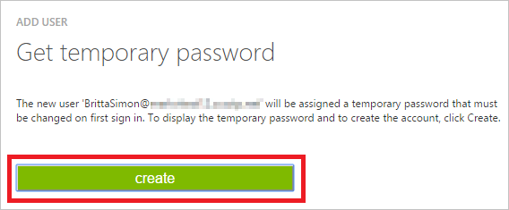

<properties
    pageTitle="Tutorial: Integração com o Active Directory do Azure com Software de RH Cezanne | Microsoft Azure"
    description="Saiba como configurar o logon único entre o Active Directory do Azure e Cezanne HR Software."
    services="active-directory"
    documentationCenter=""
    authors="jeevansd"
    manager="femila"
    editor=""/>

<tags
    ms.service="active-directory"
    ms.workload="identity"
    ms.tgt_pltfrm="na"
    ms.devlang="na"
    ms.topic="article"
    ms.date="10/26/2016"
    ms.author="jeedes"/>

# Tutorial: Integração com o Active Directory do Azure com Software de HR Cezanne

O objetivo deste tutorial é mostram como integrar Cezanne HR Software com o Azure Active Directory (AD Azure).

Integrar o Software de RH de Cezanne a Azure AD fornece os seguintes benefícios:

- Você pode controlar no Azure AD quem tem acesso ao Software de HR Cezanne
- Você pode habilitar os usuários para automaticamente obter assinado no Software de HR Cezanne (Single Sign-On) com suas contas do Azure AD
- Você pode gerenciar suas contas em um local central - clássico portal do Azure

Se você quiser saber mais detalhes sobre a integração de aplicativo de SaaS com Azure AD, consulte [o que é o acesso de aplicativo e logon único com o Active Directory do Azure](active-directory-appssoaccess-whatis.md).

## Pré-requisitos

Para configurar a integração do Azure AD com Cezanne HR Software, você precisa dos seguintes itens:

- Uma assinatura do Azure AD
- Um logon único Cezanne HR Software na assinatura habilitada

> [AZURE.NOTE] Para testar as etapas deste tutorial, não recomendamos usar um ambiente de produção.

Para testar as etapas deste tutorial, você deverá seguir essas recomendações:

- Você não deve usar o seu ambiente de produção, a menos que isso é necessário.
- Se você não tiver um ambiente de avaliação do Azure AD, você pode obter um um mês avaliação [aqui](https://azure.microsoft.com/pricing/free-trial/).

## Descrição do cenário
O objetivo deste tutorial é para que você possa testar logon único Azure AD em um ambiente de teste.

O cenário descrito neste tutorial consiste em dois blocos de construção principais:

1. Adicionando Cezanne HR Software da Galeria
2. Configurando e testando Azure AD logon único

## Adicionando Cezanne HR Software da Galeria
Para configurar a integração do Software de RH Cezanne no Azure AD, você precisa adicionar Cezanne HR Software da galeria à sua lista de aplicativos de SaaS gerenciados.

**Para adicionar o Software de RH Cezanne da galeria, execute as seguintes etapas:**

1. No **Portal do Azure clássico**, no painel de navegação esquerdo, clique em **Active Directory**. 

    ![Do Active Directory][1]

2. Na lista de **diretório** , selecione o diretório para o qual você deseja habilitar a integração de diretório.

3. Para abrir o modo de exibição de aplicativos, no modo de exibição de diretório, clique em **aplicativos** no menu superior.
    
    ![Aplicativos][2]

4. Clique em **Adicionar** na parte inferior da página.
    
    ![Aplicativos][3]

5. Na caixa de diálogo **o que você deseja fazer** , clique em **Adicionar um aplicativo da Galeria**.

    ![Aplicativos][4]

6. Na caixa de pesquisa, digite **Cezanne HR Software**.

    

7. No painel de resultados, selecione **Cezanne HR Software**e, em seguida, clique em **concluído** para adicionar o aplicativo.

    

##  Configurando e testando Azure AD logon único
O objetivo desta seção é mostrar como configurar e testar logon único Azure AD com Software de RH Cezanne com base em um usuário de teste chamado "Simon Britta".

Para logon único trabalhar, Azure AD precisa saber qual é o usuário correspondente no Software de RH Cezanne a um usuário no Azure AD. Em outras palavras, uma relação de vínculo entre um usuário do Azure AD e o usuário relacionado no Software de HR Cezanne precisa ser estabelecida.

Essa relação de link é estabelecida atribuindo o valor do **nome de usuário** no Azure AD como o valor de **nome de usuário** no Cezanne HR Software.

Para configurar e testar o Azure AD logon único com Cezanne HR Software, você precisa concluir os blocos de construção a seguir:

1. **[Configurando Azure AD Single Sign-On](#configuring-azure-ad-single-single-sign-on)** - para permitir que seus usuários usar este recurso.
2. **[Criando um anúncio Azure testar usuário](#creating-an-azure-ad-test-user)** - testar Azure AD logon único com Britta Simon.
3. **[Criando um Software de RH Cezanne testar usuário](#creating-a-cezanne-hr-software-test-user)** - ter um representante de Britta Simon em Cezanne HR Software que esteja vinculado à representação Azure AD dela.
4. **[Atribuindo o Azure AD testar usuário](#assigning-the-azure-ad-test-user)** - habilitar Britta Simon usar logon único Azure AD.
5. **[Teste Single Sign-On](#testing-single-sign-on)** - para verificar se a configuração funciona.

### Configurando o logon único Azure AD

Nesta seção, você habilitar Azure AD logon único no portal do clássico e configurar o logon único em seu aplicativo de Software de RH Cezanne.

**Para configurar o logon único Azure AD com Cezanne HR Software, execute as seguintes etapas:**

1. No portal do clássico, na página de integração do aplicativo **Cezanne HR Software** , clique **logon único configurar** para abrir a caixa de diálogo **Configurar Single Sign-On** .
     
    ![Configurar o logon único][6] 

2. Na página **como você gostaria que os usuários para assinar Cezanne HR Software** , selecione **Azure AD Single Sign-On**e, em seguida, clique em **Avançar**.
    
    

3. Na página de diálogo **Definir configurações de aplicativo** , execute as seguintes etapas e clique em **Avançar**:

    

    a. Na caixa de texto de **Entrada na URL** , digite uma URL usando o seguinte padrão: `https://w3.cezanneondemand.com/cezannehr/-/<tenant id>`.

    b. Na caixa de texto **URL de resposta** , digite uma URL usando o seguinte padrão: `https://w3.cezanneondemand.com:443/CezanneOnDemand/-/<tenant id>/Saml/samlp`.

    c. Clique em **Avançar**

    > [AZURE.NOTE] Observe que você precisa atualizar esses valores com o sinal real na URL e a URL de resposta. Para acessar esses valores, entre em contato com a equipe de suporte Cezanne HR Software por meio de <mailto:info@cezannehr.com>.

4. Na página **Configurar logon único na Cezanne HR Software** , execute as seguintes etapas e clique em **Avançar**:

    

    a. Clique em **baixar o certificado**e, em seguida, salve o arquivo em seu computador.

    b. Clique em **Avançar**.

5. Em uma janela de navegador da web diferente, logon em seu locatário Cezanne HR Software como um administrador.

6. No painel de navegação esquerdo, clique em **Configuração do sistema**. Vá para **configurações de segurança**. Navegue até a **Configuração de logon único**.

    

7. Em **Permitir que usuários faça logon usando o seguinte serviço Single Sign-On (SSO)** painel marque a caixa de **SAML 2.0** e selecione a opção de **Configuração avançada** ao lado dela.

    

8. Clique em **Adicionar novo** botão.

    

9. Execute as seguintes etapas na seção de **Provedores de identidade SAML 2.0** .

    

    a. Insira o nome do seu provedor de identidade como o **Nome de exibição**.

    b. No **Identificador de entidade** de caixa de texto coloca o valor da **Identificação de entidade** do Assistente de configuração de aplicativo do Azure AD.

    c. Altere a **vinculação de SAML** 'POST'.

    d. No **Ponto de extremidade de serviço de Token segurança** a caixa de texto coloca o valor de **Single Sign-on URL do serviço** do Assistente de configuração de aplicativo do Azure AD.

    e. Digite 'http://schemas.xmlsoap.org/ws/2005/05/identity/claims/name' no **nome do atributo ID de usuário**.

    f. Clique ícone **carregar** para carregar o certificado baixado do Azure AD.

    g. Clique no botão **Okey** . 

10. Clique em botão **Salvar** .

    

11. No portal do clássico, selecione a confirmação de configuração de logon único e clique em **Avançar**.
    
    ![Azure AD Single Sign-On][10]

12. Na página **confirmação de logon única** , clique em **Concluir**.  
    
    ![Azure AD Single Sign-On][11]

### Criação de um usuário de teste do Azure AD
O objetivo desta seção é criar um usuário de teste no portal do clássico chamado Britta Simon.

![Criar usuário do Azure AD][20]

**Para criar um usuário de teste no Azure AD, execute as seguintes etapas:**

1. No **Portal do Azure clássico**, no painel de navegação esquerdo, clique em **Active Directory**.

    

2. Na lista de **diretório** , selecione o diretório para o qual você deseja habilitar a integração de diretório.

3. Para exibir a lista de usuários, no menu na parte superior, clique em **usuários**.
    
    

4. Para abrir a caixa de diálogo **Adicionar usuário** , na barra de ferramentas na parte inferior, clique em **Adicionar usuário**.

    

5. Na página de diálogo **Conte-nos sobre este usuário** , execute as seguintes etapas:

    

    a. Como tipo de usuário, selecione novo usuário na sua organização.

    b. Na **caixa de texto**o nome de usuário, digite **BrittaSimon**.

    c. Clique em **Avançar**.

6.  Na página de diálogo de **Perfil de usuário** , execute as seguintes etapas:
    
    

    a. Na caixa de texto **nome** , digite **Britta**.  

    b. Na caixa de texto **Sobrenome** , digite **Simon**.

    c. Na caixa de texto **Nome para exibição** , digite **Britta Simon**.

    d. Na lista de **função** , selecione o **usuário**.

    e. Clique em **Avançar**.

7. Na página de diálogo **obter senha temporária** , clique em **criar**.
    
    

8. Na página de diálogo **obter senha temporária** , execute as seguintes etapas:
    
    

    a. Anote o valor da **Nova senha**.

    b. Clique em **Concluir**.   

### Criar um usuário de teste de Software de HR Cezanne

Para permitir que usuários do Azure AD efetuar login no Software de RH Cezanne, ele devem ser provisionados no Software de RH Cezanne. No caso de Cezanne HR Software, provisionamento é uma tarefa manual.

####Para configurar uma conta de usuário, execute as seguintes etapas:

1.  Faça logon em seu site de empresa Cezanne HR Software como administrador.

2.  No painel de navegação esquerdo, clique em **Configuração do sistema**. Vá para **Gerenciar usuários**. Navegue até **Adicionar novo usuário**.

    ![Novo usuário] (./media/active-directory-saas-cezannehrsoftware-tutorial/tutorial_cezannehrsoftware_005.png "Novo usuário")

3.  Na seção de **Detalhes da pessoa** , execute etapas abaixo:

    ![Novo usuário] (./media/active-directory-saas-cezannehrsoftware-tutorial/tutorial_cezannehrsoftware_006.png "Novo usuário")

    a. Definir **usuário interno** como desativado.

    b. Na caixa de texto **nome** , digite **Britta**.  

    c. Na caixa de texto **Sobrenome** , digite **Simon**.

    d. Na caixa de texto **email** , digite o endereço de email da conta de Britta Simon.

4.  Na seção **Informações de conta** , execute etapas abaixo:

    ![Novo usuário] (./media/active-directory-saas-cezannehrsoftware-tutorial/tutorial_cezannehrsoftware_007.png "Novo usuário")

    a. Na caixa de texto **nome de usuário** , digite o endereço de email do Britta Simon.

    b. Na caixa de texto **senha** , digite a senha da conta de Britta Simon.

    c. Selecione **HR Professional** como a **função de segurança**.

    d. Clique em **Okey**.

5. Navegue até a guia **Logon único** e selecione **Adicionar novo** na área **SAML 2.0 identificadores** .

    ![Usuário] (./media/active-directory-saas-cezannehrsoftware-tutorial/tutorial_cezannehrsoftware_008.png "Usuário")

6. Escolha seu provedor de identidade para o **Provedor de identidade** e, na caixa de texto do **Identificador de usuário**, insira o endereço de email da conta de Britta Simon.

    ![Usuário] (./media/active-directory-saas-cezannehrsoftware-tutorial/tutorial_cezannehrsoftware_009.png "Usuário")
    
7. Clique em botão **Salvar** .

    ![Usuário] (./media/active-directory-saas-cezannehrsoftware-tutorial/tutorial_cezannehrsoftware_010.png "Usuário")

### Atribuindo o usuário de teste do Azure AD

O objetivo desta seção é ativando Britta Simon usar logon único Azure concedendo o acesso ao Software de HR Cezanne.
    
![Atribuir usuário][200]

**Para atribuir Britta Simon Cezanne HR software, execute as seguintes etapas:**

1. No portal de clássico, para abrir o modo de exibição de aplicativos, no modo de exibição de diretório, clique em **aplicativos** no menu superior.
    
    ![Atribuir usuário][201]

2. Na lista de aplicativos, selecione **Cezanne HR Software**.
    
    

3. No menu na parte superior, clique em **usuários**.
    
    ![Atribuir usuário][203]

4. Na lista de usuários, selecione **Britta Simon**.

5. Na barra de ferramentas na parte inferior, clique em **atribuir**.
    
    ![Atribuir usuário][205]

### Teste de logon único

O objetivo desta seção é testar a Azure AD único logon configuração usando o painel de acesso.
 
Quando você clica no bloco do Software de RH Cezanne no painel de acesso, que deve receber automaticamente conectado no seu aplicativo de Software de RH Cezanne.

## Recursos adicionais

* [Lista de tutoriais sobre como integrar SaaS aplicativos com o Active Directory do Azure](active-directory-saas-tutorial-list.md)
* [O que é o acesso de aplicativo e logon único com o Azure Active Directory?](active-directory-appssoaccess-whatis.md)

<!--Image references-->

[1]: ./media/active-directory-saas-cezannehrsoftware-tutorial/tutorial_general_01.png
[2]: ./media/active-directory-saas-cezannehrsoftware-tutorial/tutorial_general_02.png
[3]: ./media/active-directory-saas-cezannehrsoftware-tutorial/tutorial_general_03.png
[4]: ./media/active-directory-saas-cezannehrsoftware-tutorial/tutorial_general_04.png

[6]: ./media/active-directory-saas-cezannehrsoftware-tutorial/tutorial_general_05.png
[10]: ./media/active-directory-saas-cezannehrsoftware-tutorial/tutorial_general_06.png
[11]: ./media/active-directory-saas-cezannehrsoftware-tutorial/tutorial_general_07.png
[20]: ./media/active-directory-saas-cezannehrsoftware-tutorial/tutorial_general_100.png

[200]: ./media/active-directory-saas-cezannehrsoftware-tutorial/tutorial_general_200.png
[201]: ./media/active-directory-saas-cezannehrsoftware-tutorial/tutorial_general_201.png
[203]: ./media/active-directory-saas-cezannehrsoftware-tutorial/tutorial_general_203.png
[204]: ./media/active-directory-saas-cezannehrsoftware-tutorial/tutorial_general_204.png
[205]: ./media/active-directory-saas-cezannehrsoftware-tutorial/tutorial_general_205.png
