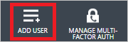

<properties
    pageTitle="Tutorial: Integração com o Active Directory do Azure com Novatus | Microsoft Azure"
    description="Saiba como configurar o logon único entre o Active Directory do Azure e LearnUpon."
    services="active-directory"
    documentationCenter=""
    authors="jeevansd"
    manager="femila"
    editor=""/>

<tags
    ms.service="active-directory"
    ms.workload="identity"
    ms.tgt_pltfrm="na"
    ms.devlang="na"
    ms.topic="article"
    ms.date="08/15/2016"
    ms.author="jeedes"/>

# Tutorial: Integração com o Active Directory do Azure com LearnUpon

O objetivo deste tutorial é mostram como integrar LearnUpon com o Azure Active Directory (AD Azure).  
Integração LearnUpon com o Azure AD fornece os seguintes benefícios:

- Você pode controlar no Azure AD quem tem acesso ao LearnUpon
- Você pode habilitar os usuários para automaticamente obter assinado no LearnUpon (Single Sign-On) com suas contas do Azure AD
- Você pode gerenciar suas contas em um local central - Azure Active Directory clássico 

Se você quiser saber mais detalhes sobre a integração de aplicativo de SaaS com Azure AD, consulte [o que é o acesso de aplicativo e logon único com o Active Directory do Azure](active-directory-appssoaccess-whatis.md).

## Pré-requisitos

Para configurar a integração do Azure AD com LearnUpon, você precisa dos seguintes itens:

- Uma assinatura do Azure AD
- Um logon único LearnUpon na assinatura habilitada

> [AZURE.NOTE] Para testar as etapas deste tutorial, não recomendamos usar um ambiente de produção.

Para testar as etapas deste tutorial, você deverá seguir essas recomendações:

- Você não deve usar o seu ambiente de produção, a menos que isso é necessário.
- Se você não tiver um ambiente de avaliação do Azure AD, você pode obter um um mês avaliação [aqui](https://azure.microsoft.com/pricing/free-trial/).

## Descrição do cenário
O objetivo deste tutorial é para que você possa testar logon único Azure AD em um ambiente de teste.  
O cenário descrito neste tutorial consiste em dois blocos de construção principais:

1. Adicionando LearnUpon da Galeria
2. Configurando e testando Azure AD logon único

## Adicionando LearnUpon da Galeria
Para configurar a integração do LearnUpon no Azure AD, você precisa adicionar LearnUpon da galeria à sua lista de aplicativos de SaaS gerenciados.

**Para adicionar LearnUpon da galeria, execute as seguintes etapas:**

1. No **portal do Azure clássico**, no painel de navegação esquerdo, clique em **Active Directory**. 

    ![Do Active Directory][1]

2. Na lista de **diretório** , selecione o diretório para o qual você deseja habilitar a integração de diretório.

3. Para abrir o modo de exibição de aplicativos, no modo de exibição de diretório, clique em **aplicativos** no menu superior.

    ![Aplicativos][2]

4. Clique em **Adicionar** na parte inferior da página.

    ![Aplicativos][3]

5. Na caixa de diálogo **o que você deseja fazer** , clique em **Adicionar um aplicativo da Galeria**.

    ![Aplicativos][4]

6. Na caixa de pesquisa, digite **LearnUpon**.

    

7. No painel de resultados, selecione **LearnUpon**e clique em **concluído** para adicionar o aplicativo.

    

##  Configurando e testando Azure AD logon único
O objetivo desta seção é mostrar como configurar e testar logon único Azure AD com LearnUpon com base em um usuário de teste chamado "Simon Britta".

Para logon único trabalhar, Azure AD precisa saber qual é o usuário correspondente no LearnUpon para um usuário no Azure AD. Em outras palavras, uma relação de vínculo entre um usuário do Azure AD e o usuário relacionado em LearnUpon precisa ser estabelecida.  
Essa relação de link é estabelecida atribuindo o valor do **nome de usuário** no Azure AD como o valor de **nome de usuário** no LearnUpon.

Para configurar e testar o Azure AD logon único com LearnUpon, você precisa concluir os blocos de construção a seguir:

1. **[Configurando Azure AD Single Sign-On](#configuring-azure-ad-single-single-sign-on)** - para permitir que seus usuários usar este recurso.
2. **[Criando um anúncio Azure testar usuário](#creating-an-azure-ad-test-user)** - testar Azure AD logon único com Britta Simon.
4. **[Criando um LearnUpon testar usuário](#creating-a-learnupon-test-user)** - ter um representante de Britta Simon em LearnUpon que esteja vinculado à representação Azure AD dela.
5. **[Atribuindo o Azure AD testar usuário](#assigning-the-azure-ad-test-user)** - habilitar Britta Simon usar logon único Azure AD.
5. **[Teste Single Sign-On](#testing-single-sign-on)** - para verificar se a configuração funciona.

### Configurando Azure AD Single Sign-On

O objetivo desta seção é habilitar Azure AD logon único no portal de clássico do Azure e configurar o logon único em seu aplicativo de LearnUpon.

**Para configurar o logon único Azure AD com LearnUpon, execute as seguintes etapas:**

1. No portal do clássico Azure, na página de integração do aplicativo **LearnUpon** , clique **logon único configurar** para abrir a caixa de diálogo **Configurar Single Sign-On** .

    ![Configurar o logon único][6] 

2. Na página **como você gostaria que os usuários para assinar LearnUpon** , selecione **Azure AD Single Sign-On**e, em seguida, clique em **Avançar**.

     

3. Na página de diálogo **Definir configurações de aplicativo** , execute as seguintes etapas:.

     

    a. Na caixa de texto **URL de resposta** , digite a URL do serviço de consumidor declaração usando o seguinte padrão:`https://\<companyname\>.learnupon.com/saml/consumer`

    b. Clique em **Avançar**. 

4. Na página **Configurar logon único em LearnUpon** , execute as seguintes etapas:

     

    a. Clique em **baixar o certificado**e, em seguida, salve o arquivo em seu computador. Precisaremos este certificado e URLs de metadados (ID de entidade, SSO URL de entrada e sinal de Check-Out URL) para configurar o SSO do lado LearnUpon.

    b. Clique em **Avançar**.

1. Abra outra instância do navegador e faça logon em LearnUpon com uma conta de administrador. 

1. Clique na guia **configurações** .

     

1. Clique em **Logon único - SAML**e, em seguida, clique em **Configurações gerais** para definir as configurações de SAML.

     

5. Na seção **Configurações gerais** , execute as seguintes etapas:

     

    a. Selecione **ativada**.

    b. Como **versão**, selecione **2.0**.

    c. Como **condições de ignorar**, selecione **não**.

    d. Na caixa de texto **nome do parâmetro de postagem de Token SAML** , digite o nome do parâmetro de postagem de solicitação para a URL de consumidor SAML indicado acima que contém a declaração SAML ser verificadas e autenticado - por exemplo **SAMLResponse**.

    e. Na caixa de texto **Formato do identificador de nome** , digite o valor que indica onde em sua declaração SAML o identificador de usuários (endereço de Email) reside - por exemplo **urn: oasis: nomes: tc: SAML:1.1:nameid-formato: emailAddress**.

    f. Na caixa de texto **Identificar provedor local** , digite o valor que indica onde os usuários são enviados se eles clicam no ícone do carregados da sua tela de entrada do portal clássico Azure.

    g.in portal clássico do Azure, copie a **URL do serviço Sign-Out único**e, em seguida, cole a textbos **Sair URL** .

    h. Clique em **Gerenciar dedo impressões**e carregue a impressão digital do seu certificado baixado. 

1. Clique em **Configurações de usuário**e, em seguida, execute as seguintes etapas:

     

    a. Na caixa de texto **Nome identificador de formato** , digite o valor que informa onde em sua declaração SAML o nome de usuários reside - por exemplo: **http://schemas.xmlsoap.org/ws/2005/05/identity/claims/ givenname**.

    b. Na caixa de texto do **Último formato de identificador de nome** , digite o valor que informa onde em sua declaração SAML o lastname usuários reside - por exemplo: **http://schemas.xmlsoap.org/ws/2005/05/identity/claims/ sobrenome**.

6. No portal do Azure clássico, selecione a confirmação de configuração de logon único e clique em **Avançar**.

    ![Azure AD Single Sign-On][10]

7. Na página **confirmação de logon única** , clique em **Concluir**.  

    ![Azure AD Single Sign-On][11]

### Criação de um usuário de teste do Azure AD
O objetivo desta seção é criar um usuário de teste no portal do clássico Azure chamado Britta Simon.

![Criar usuário do Azure AD][20]

**Para criar um usuário de teste no Azure AD, execute as seguintes etapas:**

1. No **portal do Azure clássico**, no painel de navegação esquerdo, clique em **Active Directory**.

     

2. Na lista de **diretório** , selecione o diretório para o qual você deseja habilitar a integração de diretório.

3. Para exibir a lista de usuários, no menu na parte superior, clique em **usuários**.

     

4. Para abrir a caixa de diálogo **Adicionar usuário** , na barra de ferramentas na parte inferior, clique em **Adicionar usuário**.

     

5. Na página de diálogo **Conte-nos sobre este usuário** , execute as seguintes etapas:

     

    a. Como tipo de usuário, selecione novo usuário na sua organização.

    b. Na **caixa de texto**o nome de usuário, digite **BrittaSimon**.

    c. Clique em **Avançar**.

6.  Na página de diálogo de **Perfil de usuário** , execute as seguintes etapas:

     

    a. Na caixa de texto **nome** , digite **Britta**.  

    b. Na caixa **Sobrenome** de texto, tipo, **Simon**.

    c. Na caixa de texto **Nome para exibição** , digite **Britta Simon**.

    d. Na lista de **função** , selecione o **usuário**.

    e. Clique em **Avançar**.

7. Na página de diálogo **obter senha temporária** , clique em **criar**.

     

8. Na página de diálogo **obter senha temporária** , execute as seguintes etapas:

     

    a. Anote o valor da **Nova senha**.

    b. Clique em **Concluir**.   

### Criar um usuário de teste LearnUpon

O objetivo desta seção é criar um usuário chamado Britta Simon no LearnUpon. LearnUpon suporta em vez de provisionamento, que é por padrão ativado.

Não há nenhum item de ação para você nesta seção. Um novo usuário será criado durante uma tentativa de acessar LearnUpon se ele ainda não existe. [Configurando Azure AD Single Sign-On](#configuring-azure-ad-single-single-sign-on).

> [AZURE.NOTE] Se você precisar criar um usuário manualmente, você precise contatar a equipe de suporte de LearnUpon.

### Atribuindo o usuário de teste do Azure AD

O objetivo desta seção é ativando Britta Simon usar logon único Azure concedendo o acesso aos LearnUpon.

![Atribuir usuário][200] 

**Para atribuir Britta Simon a LearnUpon, execute as seguintes etapas:**

1. No portal do Azure clássico, para abrir o modo de exibição de aplicativos, no modo de exibição de diretório, clique em **aplicativos** no menu superior.

    ![Atribuir usuário][201] 

2. Na lista de aplicativos, selecione **LearnUpon**.

     

1. No menu na parte superior, clique em **usuários**.

    ![Atribuir usuário][203] 

1. Na lista de usuários, selecione **Britta Simon**.

2. Na barra de ferramentas na parte inferior, clique em **atribuir**.

    ![Atribuir usuário][205]

### Teste de logon único

O objetivo desta seção é testar a Azure AD único logon configuração usando o painel de acesso.  
Quando você clica no bloco de LearnUpon no painel de acesso, que deve receber automaticamente conectado no seu aplicativo de LearnUpon.

## Recursos adicionais

* [Lista de tutoriais sobre como integrar SaaS aplicativos com o Active Directory do Azure](active-directory-saas-tutorial-list.md)
* [O que é o acesso de aplicativo e logon único com o Azure Active Directory?](active-directory-appssoaccess-whatis.md)

<!--Image references-->

[1]: ./media/active-directory-saas-learnupon-tutorial/tutorial_general_01.png
[2]: ./media/active-directory-saas-learnupon-tutorial/tutorial_general_02.png
[3]: ./media/active-directory-saas-learnupon-tutorial/tutorial_general_03.png
[4]: ./media/active-directory-saas-learnupon-tutorial/tutorial_general_04.png

[6]: ./media/active-directory-saas-learnupon-tutorial/tutorial_general_05.png
[10]: ./media/active-directory-saas-learnupon-tutorial/tutorial_general_06.png
[11]: ./media/active-directory-saas-learnupon-tutorial/tutorial_general_07.png
[20]: ./media/active-directory-saas-learnupon-tutorial/tutorial_general_100.png

[200]: ./media/active-directory-saas-learnupon-tutorial/tutorial_general_200.png
[201]: ./media/active-directory-saas-learnupon-tutorial/tutorial_general_201.png
[203]: ./media/active-directory-saas-learnupon-tutorial/tutorial_general_203.png
[204]: ./media/active-directory-saas-learnupon-tutorial/tutorial_general_204.png
[205]: ./media/active-directory-saas-learnupon-tutorial/tutorial_general_205.png
