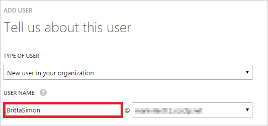

<properties
    pageTitle="Tutorial: Integração com o Active Directory do Azure com Tableau Online | Microsoft Azure"
    description="Saiba como configurar o logon único entre o Active Directory do Azure e Tableau Online."
    services="active-directory"
    documentationCenter=""
    authors="jeevansd"
    manager="femila"
    editor=""/>

<tags
    ms.service="active-directory"
    ms.workload="identity"
    ms.tgt_pltfrm="na"
    ms.devlang="na"
    ms.topic="article"
    ms.date="10/18/2016"
    ms.author="jeedes"/>

# Tutorial: Integração com o Active Directory do Azure com Tableau Online

Neste tutorial, você aprenderá a integrar Tableau Online com o Azure Active Directory (AD Azure).

Integração Tableau Online com o Azure AD fornece os seguintes benefícios:

- Você pode controlar no Azure AD quem tem acesso ao Tableau Online
- Você pode habilitar os usuários para automaticamente obter assinados-on Tableau online (Single Sign-On) com suas contas do Azure AD
- Você pode gerenciar suas contas em um local central - clássico portal do Azure

Se você quiser saber mais detalhes sobre a integração de aplicativo de SaaS com Azure AD, consulte [o que é o acesso de aplicativo e logon único com o Active Directory do Azure](active-directory-appssoaccess-whatis.md).

## Pré-requisitos

Para configurar a integração do Azure AD com Tableau Online, você precisa dos seguintes itens:

- Uma assinatura do Azure AD
- Um logon único **Tableau Online** na assinatura habilitada

> [AZURE.NOTE] Para testar as etapas deste tutorial, não recomendamos usar um ambiente de produção.

Para testar as etapas deste tutorial, você deverá seguir essas recomendações:

- Você não deve usar o seu ambiente de produção, a menos que isso é necessário.
- Se você não tiver um ambiente de avaliação do Azure AD, você pode obter um um mês avaliação [aqui](https://azure.microsoft.com/pricing/free-trial/).

## Descrição do cenário
Neste tutorial, você testar Azure AD logon único em um ambiente de teste. O cenário descrito neste tutorial consiste em dois blocos de construção principais:

1. Adicionando Tableau on-line da Galeria
2. Configurando e testando Azure AD logon único

## Adicionando Tableau on-line da Galeria
Para configurar a integração do Tableau Online no Azure AD, você precisa adicionar Tableau Online da galeria à sua lista de aplicativos de SaaS gerenciados.

**Para adicionar Tableau on-line da galeria, execute as seguintes etapas:**

1. No **portal do Azure clássico**, no painel de navegação esquerdo, clique em **Active Directory**. 

    ![Do Active Directory][1]

2. Na lista de **diretório** , selecione o diretório para o qual você deseja habilitar a integração de diretório.

3. Para abrir o modo de exibição de aplicativos, no modo de exibição de diretório, clique em **aplicativos** no menu superior.

    ![Aplicativos][2]

4. Clique em **Adicionar** na parte inferior da página.

    ![Aplicativos][3]

5. Na caixa de diálogo **o que você deseja fazer** , clique em **Adicionar um aplicativo da Galeria**.

    ![Aplicativos][4]

6. Na caixa de pesquisa, digite **Tableau Online**.

    

7. No painel de resultados, selecione **Tableau Online**e, em seguida, clique em **concluído** para adicionar o aplicativo.

    

##  Configurando e testando Azure AD logon único
Nesta seção, configurar e testar logon único Azure AD com Tableau Online com base em um usuário de teste chamado "Simon Britta".

Para logon único trabalhar, Azure AD precisa saber qual é o usuário correspondente no Tableau Online a um usuário no Azure AD. Em outras palavras, uma relação de vínculo entre um usuário do Azure AD e o usuário relacionado no Tableau Online precisa ser estabelecida.
Essa relação de link é estabelecida atribuindo o valor do **nome de usuário** no Azure AD como o valor de **nome de usuário** no Tableau Online.

Para configurar e testar o Azure AD logon único com Tableau Online, você precisa concluir os blocos de construção a seguir:

1. **[Configurando Azure AD Single Sign-On](#configuring-azure-ad-single-single-sign-on)** - para permitir que seus usuários usar este recurso.
2. **[Criando um anúncio Azure testar usuário](#creating-an-azure-ad-test-user)** - testar Azure AD logon único com Britta Simon.
4. **[Criando um Tableau Online testar usuário](#creating-a-Tableau-Online-test-user)** - ter um representante de Britta Simon em Tableau Online que está vinculado à representação Azure AD dela.
5. **[Atribuindo o Azure AD testar usuário](#assigning-the-azure-ad-test-user)** - habilitar Britta Simon usar logon único Azure AD.
5. **[Teste Single Sign-On](#testing-single-sign-on)** - para verificar se a configuração funciona.

### Configurando o logon único Azure AD

O objetivo desta seção é habilitar Azure AD logon único no portal de clássico do Azure e configurar o logon único em seu aplicativo Tableau Online.

**Para configurar o logon único Azure AD com Tableau Online, execute as seguintes etapas:**

1. No menu na parte superior, clique em **Início rápido**.

    ![Configurar o logon único][6]
2. No portal do clássico, na página de integração com o aplicativo **Tableau Online** , clique **logon único configurar** para abrir a caixa de diálogo **Configurar Single Sign-On** .

    ![Configurar o logon único][7] 

3. Na página **como você gostaria que os usuários entrar Tableau Online** , selecione **Azure AD Single Sign-On**e, em seguida, clique em **Avançar**.
    
    

4. Na página de diálogo **Definir configurações de aplicativo** , execute as seguintes etapas: 

    

    a. Na caixa de texto de entrada na URL, digite uma URL usando o seguinte padrão:`https://sso.online.tableau.com`

    c. Clique em **Avançar**.

5. Na página **Configurar logon único no Tableau Online** , clique em **baixar metadados**e, em seguida, salve o arquivo em seu computador.

    

6. Selecione a confirmação de configuração de logon único e clique em **Avançar**.
    
    ![Azure AD Single Sign-On][10]

7. Na página **confirmação de logon única** , clique em **Concluir**.  
    
    ![Azure AD Single Sign-On][11]
8. Em uma janela de navegador diferente, logon para seu aplicativo Tableau Online. Vá para **configurações** e, em seguida, a **autenticação**

    

9. Na seção **Tipos de autenticação** . Marque a caixa de **logon único com SAML** seleção para habilitar SAML.

    

10. Role para baixo até a seção **Importar arquivo de metadados para Tableau Online** .  Clique em Procurar e importar o arquivo de metadados que você baixou do Azure AD. Em seguida, clique em **Aplicar**.

    

11. Na seção de **declarações de correspondência** , insira o nome de declaração do provedor de identidade correspondente para o endereço de email, nome e sobrenome. Para obter essas informações do Azure AD:

    a. Volte ao Azure AD. No portal do clássico Azure, na página de integração com o aplicativo **Tableau Online** , no menu na parte superior, clique em **atributos**. Copie o nome para os valores: userprincipalname, givenname e sobrenome.
     
    

    b. Alterne para o aplicativo Tableau Online e, em seguida, defina a seção **Atributos Online Tableau** os seguintes:
    
    -  Email: **email** ou **userprincipalname**
    -  Nome: **givenname**
    -  Sobrenome: **Sobrenome**

    

### Criação de um usuário de teste do Azure AD
Nesta seção, você criar um usuário de teste no portal do clássico chamado Britta Simon.

![Criar usuário do Azure AD][20]

**Para criar um usuário de teste no Azure AD, execute as seguintes etapas:**

1. No **portal do Azure clássico**, no painel de navegação esquerdo, clique em **Active Directory**.
    
     

2. Na lista de **diretório** , selecione o diretório para o qual você deseja habilitar a integração de diretório.

3. Para exibir a lista de usuários, no menu na parte superior, clique em **usuários**.
    
     

4. Para abrir a caixa de diálogo **Adicionar usuário** , na barra de ferramentas na parte inferior, clique em **Adicionar usuário**.

     

5. Na página de diálogo **Conte-nos sobre este usuário** , execute as seguintes etapas:
 
     

    a. Como tipo de usuário, selecione novo usuário na sua organização.

    b. Na **caixa de texto**o nome de usuário, digite **BrittaSimon**.

    c. Clique em **Avançar**.

6.  Na página de diálogo de **Perfil de usuário** , execute as seguintes etapas:

     

    a. Na caixa de texto **nome** , digite **Britta**.  

    b. Na caixa **Sobrenome** de texto, tipo, **Simon**.

    c. Na caixa de texto **Nome para exibição** , digite **Britta Simon**.

    d. Na lista de **função** , selecione o **usuário**.

    e. Clique em **Avançar**.

7. Na página de diálogo **obter senha temporária** , clique em **criar**.

     

8. Na página de diálogo **obter senha temporária** , execute as seguintes etapas:

     

    a. Anote o valor da **Nova senha**.

    b. Clique em **Concluir**.   

### Criar um usuário de teste Tableau Online

Nesta seção, você criar um usuário chamado Britta Simon no Tableau Online.

1. No **Tableau Online**, clique em **configurações** e, em seguida, a seção de **autenticação** . Role para baixo até a seção de **Selecionar usuários** . Clique em **Adicionar usuários** e, em seguida, **Insira os endereços de Email**.

    
2. Selecione **Adicionar usuários para único autenticação sign-on (SSO)**. Na caixa **Digite os endereços de Email** de texto adicionarbritta.simon@contoso.com

    

3.  Clique em **criar**.

### Atribuindo o usuário de teste do Azure AD

Nesta seção, você habilitar Britta Simon usar logon único Azure concedendo o acesso ao Tableau Online.

![Atribuir usuário][200] 

**Para atribuir Britta Simon Tableau online, execute as seguintes etapas:**

1. No portal de clássico, para abrir o modo de exibição de aplicativos, no modo de exibição de diretório, clique em **aplicativos** no menu superior.

    ![Atribuir usuário][201] 

3. Na lista de aplicativos, selecione **Tableau Online**.

     

4. No menu na parte superior, clique em **usuários**.

    ![Atribuir usuário][203] 

5. Na lista de todos os usuários, selecione **Britta Simon**.

6. Na barra de ferramentas na parte inferior, clique em **atribuir**.

    ![Atribuir usuário][205]

### Teste de logon único

O objetivo desta seção é testar a Azure AD único logon configuração usando o painel de acesso.

Quando você clica no bloco Tableau Online no painel de acesso, que deve receber automaticamente conectado no seu aplicativo Tableau Online.

## Recursos adicionais

* [Lista de tutoriais sobre como integrar SaaS aplicativos com o Active Directory do Azure](active-directory-saas-tutorial-list.md)
* [O que é o acesso de aplicativo e logon único com o Azure Active Directory?](active-directory-appssoaccess-whatis.md)

<!--Image references-->

[1]: ./media/active-directory-saas-tableauonline-tutorial/tutorial_general_01.png
[2]: ./media/active-directory-saas-tableauonline-tutorial/tutorial_general_02.png
[3]: ./media/active-directory-saas-tableauonline-tutorial/tutorial_general_03.png
[4]: ./media/active-directory-saas-tableauonline-tutorial/tutorial_general_04.png

[5]: ./media/active-directory-saas-tableauonline-tutorial/tutorial_general_05.png
[6]: ./media/active-directory-saas-tableauonline-tutorial/tutorial_general_06.png
[7]:  ./media/active-directory-saas-tableauonline-tutorial/tutorial_general_050.png
[10]: ./media/active-directory-saas-tableauonline-tutorial/tutorial_general_060.png
[11]: ./media/active-directory-saas-tableauonline-tutorial/tutorial_general_070.png
[20]: ./media/active-directory-saas-tableauonline-tutorial/tutorial_general_100.png

[200]: ./media/active-directory-saas-tableauonline-tutorial/tutorial_general_200.png
[201]: ./media/active-directory-saas-tableauonline-tutorial/tutorial_general_201.png
[203]: ./media/active-directory-saas-tableauonline-tutorial/tutorial_general_203.png
[204]: ./media/active-directory-saas-tableauonline-tutorial/tutorial_general_204.png
[205]: ./media/active-directory-saas-tableauonline-tutorial/tutorial_general_205.png
