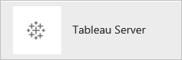
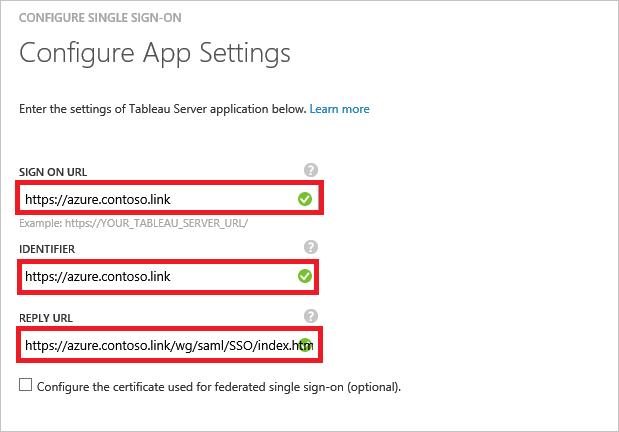

<properties
    pageTitle="Tutorial: Integração com o Active Directory do Azure com o servidor de Tableau | Microsoft Azure"
    description="Saiba como configurar o logon único entre Azure Active Directory e de servidor de Tableau."
    services="active-directory"
    documentationCenter=""
    authors="jeevansd"
    manager="femila"
    editor=""/>

<tags
    ms.service="active-directory"
    ms.workload="identity"
    ms.tgt_pltfrm="na"
    ms.devlang="na"
    ms.topic="article"
    ms.date="09/29/2016"
    ms.author="jeedes"/>

# Tutorial: Integração com o Active Directory do Azure com Tableau Server

O objetivo deste tutorial é mostram como integrar Tableau Server com o Azure Active Directory (AD Azure).

Integrar Tableau Server Azure AD fornece os seguintes benefícios:

- Você pode controlar no Azure AD quem tem acesso ao servidor de Tableau
- Você pode habilitar os usuários para automaticamente obter entrou no servidor Tableau (Single Sign-On) com suas contas do Azure AD
- Você pode gerenciar suas contas em um local central - clássico portal do Azure

Se você quiser saber mais detalhes sobre a integração de aplicativo de SaaS com Azure AD, consulte [o que é o acesso de aplicativo e logon único com o Active Directory do Azure](active-directory-appssoaccess-whatis.md).

## Pré-requisitos

Para configurar a integração do Azure AD com Tableau Server, você precisa dos seguintes itens:

- Uma assinatura do Azure AD
- Um logon único Tableau Server na assinatura habilitada

> [AZURE.NOTE] Para testar as etapas deste tutorial, não recomendamos usar um ambiente de produção.

Para testar as etapas deste tutorial, você deverá seguir essas recomendações:

- Você não deve usar o seu ambiente de produção, a menos que isso é necessário.
- Se você não tiver um ambiente de avaliação do Azure AD, você pode obter um um mês avaliação [aqui](https://azure.microsoft.com/pricing/free-trial/).

## Descrição do cenário
O objetivo deste tutorial é para que você possa testar logon único Azure AD em um ambiente de teste. 

O cenário descrito neste tutorial consiste em dois blocos de construção principais:

1. Adicionando o servidor de Tableau da Galeria
2. Configurando e testando Azure AD logon único

## Adicionando o servidor de Tableau da Galeria
Para configurar a integração do servidor de Tableau no Azure AD, você precisa adicionar Tableau servidor da galeria à sua lista de aplicativos de SaaS gerenciados.

**Para adicionar o servidor de Tableau da galeria, execute as seguintes etapas:**

1. No **portal do Azure clássico**, no painel de navegação esquerdo, clique em **Active Directory**. 
 
    ![Do Active Directory][1]

2. Na lista de **diretório** , selecione o diretório para o qual você deseja habilitar a integração de diretório.

3. Para abrir o modo de exibição de aplicativos, no modo de exibição de diretório, clique em **aplicativos** no menu superior.

    ![Aplicativos][2]

4. Clique em **Adicionar** na parte inferior da página.

    ![Aplicativos][3]

5. Na caixa de diálogo **o que você deseja fazer** , clique em **Adicionar um aplicativo da Galeria**.

    ![Aplicativos][4]

6. Na caixa de pesquisa, digite **Tableau Server**.

    

7. No painel de resultados, selecione **Tableau Server**e, em seguida, clique em **concluído** para adicionar o aplicativo.

    

##  Configurando e testando Azure AD logon único
O objetivo desta seção é mostrar como configurar e testar logon único Azure AD com Tableau Server com base em um usuário de teste chamado "Simon Britta".

Para logon único trabalhar, Azure AD precisa saber qual é o usuário correspondente no Tableau Server para um usuário no Azure AD. Em outras palavras, uma relação de vínculo entre um usuário do Azure AD e o usuário relacionado no servidor Tableau precisa ser estabelecida.

Essa relação de link é estabelecida atribuindo o valor do **nome de usuário** no Azure AD como o valor de **nome de usuário** no servidor de Tableau.

Para configurar e testar o Azure AD logon único com Tableau Server, você precisa concluir os blocos de construção a seguir:

1. **[Configurando Azure AD Single Sign-On](#configuring-azure-ad-single-single-sign-on)** - para permitir que seus usuários usar este recurso.
2. **[Criando um anúncio Azure testar usuário](#creating-an-azure-ad-test-user)** - testar Azure AD logon único com Britta Simon.
4. **[Criando um servidor de Tableau testar usuário](#creating-a-tableauserver-test-user)** - ter um representante de Britta Simon em servidor de Tableau que esteja vinculado à representação Azure AD dela.
5. **[Atribuindo o Azure AD testar usuário](#assigning-the-azure-ad-test-user)** - habilitar Britta Simon usar logon único Azure AD.
5. **[Teste Single Sign-On](#testing-single-sign-on)** - para verificar se a configuração funciona.

### Configurando Azure AD Single Sign-On

O objetivo desta seção é habilitar Azure AD logon único no portal de clássico do Azure e configurar o logon único em seu aplicativo de servidor de Tableau.

Aplicativo de servidor de tableau espera as declarações SAML em um formato específico. A captura de tela a seguir mostra um exemplo para isso. 

 

**Para configurar o logon único Azure AD com Tableau Server, execute as seguintes etapas:**

1. No portal do clássico Azure, na página de integração de aplicativo **Tableau Server** , no menu na parte superior, clique em **atributos**.

     

1. Na caixa de diálogo **atributos de token SAML** , execute as seguintes etapas:

    

    a. Clique em **Adicionar atributo de usuário** para abrir a caixa de diálogo **Adicionar Attribure de usuário** .

     

    b. Na caixa de texto **Nome de Attrubute** , digite o **nome de usuário**.

    c. Na lista de **Valor do atributo** , selsect **user.displayname**.

    d. Clique em **Concluir**.  
    

1. No menu na parte superior, clique em **Início rápido**.

      

1. Clique **logon único configurar** para abrir a caixa de diálogo **Configurar Single Sign-On** .

    ![Configurar o logon único][6] 

2. Na página **como você gostaria que usuários para entrar servidor Tableau** , selecione **Azure AD Single Sign-On**e, em seguida, clique em **Avançar**.

     

3. Na página de diálogo **Definir configurações de aplicativo** , execute as seguintes etapas e clique em **Avançar**:

     

    a. Na caixa de texto **URL de entrada** , digite a URL do seu servidor de Tableau. 

    b. No identificador de caixa Copiar o 

    c. Clique em **Avançar**

4. Na página **Configurar logon único no servidor Tableau** , execute as seguintes etapas e clique em **Avançar**:

     

    a. Clique em **baixar metadados**e salve o arquivo em seu computador.

    b. Clique em **Avançar**.

6. Para obter o SSO configurado para o seu aplicativo, você precisa logon em seu locatário Tableau Server como um administrador.

    a. Na configuração do servidor de Tableau, clique na guia **SAML** .

     

    b. Selecione a caixa de seleção de **SAML de uso para logon único**.

    c. Localize o arquivo de metadados de Federação baixado do Azure portal clássico e carregue-o no **arquivo de metadados de SAML Idp**.

    d. Servidor de tableau retornar URL — a URL que os usuários Tableau Server acessarão, como http://tableau_server. Não é recomendável usar http://localhost. Usando uma URL com uma barra invertida (por exemplo, http://tableau_server/) não é suportado. Copie a **URL de retorno do servidor de Tableau** e colá-lo Azure AD **URL de entrada na** caixa de texto conforme mostrado na etapa 3

    e. ID de entidade SAML — a ID de entidade identifica exclusivamente sua instalação do servidor de Tableau em IdP. Você pode inserir a URL do servidor de Tableau novamente aqui, se desejar, mas ele não precisa ser a URL do servidor de Tableau. Copie **SAML entidade ID** e colá-lo à caixa de texto do Azure AD **identificador** , conforme mostrado na etapa 3.

    f. Clique no **Arquivo de exportação de metadados** e abra-o no aplicativo de editor de texto. Localize a URL do serviço de consumidor de declaração com Http Post e indexar 0 e copie a URL. Agora colá-lo à caixa de texto do Azure AD **URL de resposta** conforme mostrado na etapa 3. 

    g. Clique em botão de **Okey** na página Tableau servidor Configiuration.

    > [AZURE.NOTE] Se precisar de ajuda para configurar SAML no servidor Tableau, consulte este artigo [Configurar SAML](http://onlinehelp.tableau.com/current/server/en-us/config_saml.htm) 

6. No portal do Azure clássico, selecione a confirmação de configuração de logon único e clique em **Avançar**.

    ![Azure AD Single Sign-On][10]

7. Na página **confirmação de logon única** , clique em **Concluir**. 
 
    ![Azure AD Single Sign-On][11]

### Criação de um usuário de teste do Azure AD
O objetivo desta seção é criar um usuário de teste no portal do clássico Azure chamado Britta Simon.

Na lista de usuários, selecione **Britta Simon**.

![Criar usuário do Azure AD][20]

**Para criar um usuário de teste no Azure AD, execute as seguintes etapas:**

1. No **portal do Azure clássico**, no painel de navegação esquerdo, clique em **Active Directory**.

     

2. Na lista de **diretório** , selecione o diretório para o qual você deseja habilitar a integração de diretório.

3. Para exibir a lista de usuários, no menu na parte superior, clique em **usuários**.
 
     

4. Para abrir a caixa de diálogo **Adicionar usuário** , na barra de ferramentas na parte inferior, clique em **Adicionar usuário**.

    

5. Na página de diálogo **Conte-nos sobre este usuário** , execute as seguintes etapas:

     

    a. Como **Tipo de usuário**, selecione **novo usuário na sua organização**.

    b. Na caixa de texto **Nome de usuário** , digite **BrittaSimon**.

    c. Clique em **Avançar**.

6.  Na página de diálogo de **Perfil de usuário** , execute as seguintes etapas:

     

    a. Na caixa de texto **nome** , digite **Britta**.  

    b. Na caixa **Sobrenome** de texto, tipo, **Simon**.

    c. Na caixa de texto **Nome para exibição** , digite **Britta Simon**.

    d. Na lista de **função** , selecione o **usuário**.

    e. Clique em **Avançar**.

7. Na página de diálogo **obter senha temporária** , clique em **criar**.

     

8. Na página de diálogo **obter senha temporária** , execute as seguintes etapas:
 
     

    a. Anote o valor da **Nova senha**.

    b. Clique em **Concluir**.   

### Criar um usuário de teste do servidor de Tableau

O objetivo desta seção é criar um usuário chamado Britta Simon no servidor Tableau. Você precisará provisionar todos os usuários no servidor Tableau. Observe também que nome de usuário do usuário deve corresponder ao valor que você configurou no atributo personalizado Azure AD do **nome de usuário**. Com o mapeamento correto a integração deve funcionar [Configurando Azure AD Single Sign-On](#configuring-azure-ad-single-single-sign-on).

> [AZURE.NOTE] Se você precisar criar um usuário manualmente, é necessário contatar o administrador do servidor de Tableau em sua organização.

### Atribuindo o usuário de teste do Azure AD

O objetivo desta seção é ativando Britta Simon usar logon único Azure concedendo o acesso ao servidor de Tableau.

![Atribuir usuário][200] 

**Para atribuir Britta Simon Tableau servidor, execute as seguintes etapas:**

1. No portal do Azure clássico, para abrir o modo de exibição de aplicativos, no modo de exibição de diretório, clique em **aplicativos** no menu superior.
 
    ![Atribuir usuário][201] 

2. Na lista de aplicativos, selecione o **Servidor de Tableau**.

     

1. No menu na parte superior, clique em **usuários**.

    ![Atribuir usuário][203]

1. Na lista de usuários, selecione **Britta Simon**.

2. Na barra de ferramentas na parte inferior, clique em **atribuir**.

![Atribuir usuário][205]

### Teste de logon único

O objetivo desta seção é testar a Azure AD único logon configuração usando o painel de acesso.

Quando você clica no bloco do servidor de Tableau no painel de acesso, que deve receber automaticamente conectado no seu aplicativo de servidor de Tableau.

## Recursos adicionais

* [Lista de tutoriais sobre como integrar SaaS aplicativos com o Active Directory do Azure](active-directory-saas-tutorial-list.md)
* [O que é o acesso de aplicativo e logon único com o Azure Active Directory?](active-directory-appssoaccess-whatis.md)

<!--Image references-->

[1]: ./media/active-directory-saas-tableauserver-tutorial/tutorial_general_01.png
[2]: ./media/active-directory-saas-tableauserver-tutorial/tutorial_general_02.png
[3]: ./media/active-directory-saas-tableauserver-tutorial/tutorial_general_03.png
[4]: ./media/active-directory-saas-tableauserver-tutorial/tutorial_general_04.png

[6]: ./media/active-directory-saas-tableauserver-tutorial/tutorial_general_05.png
[10]: ./media/active-directory-saas-tableauserver-tutorial/tutorial_general_06.png
[11]: ./media/active-directory-saas-tableauserver-tutorial/tutorial_general_07.png
[20]: ./media/active-directory-saas-tableauserver-tutorial/tutorial_general_100.png

[200]: ./media/active-directory-saas-tableauserver-tutorial/tutorial_general_200.png
[201]: ./media/active-directory-saas-tableauserver-tutorial/tutorial_general_201.png
[203]: ./media/active-directory-saas-tableauserver-tutorial/tutorial_general_203.png
[204]: ./media/active-directory-saas-tableauserver-tutorial/tutorial_general_204.png
[205]: ./media/active-directory-saas-tableauserver-tutorial/tutorial_general_205.png
