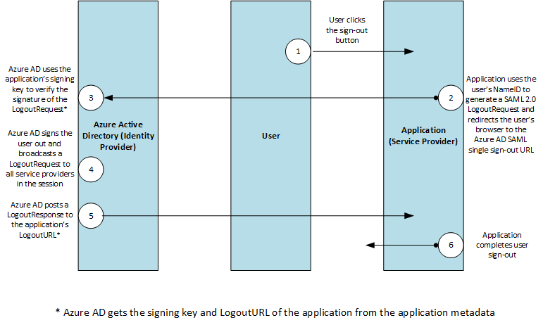

<properties
    pageTitle="Azure único sair SAML protocolo | Microsoft Azure"
    description="Este artigo descreve o protocolo de SAML Sign-Out único no Active Directory do Azure"
    services="active-directory"
    documentationCenter=".net"
    authors="priyamohanram"
    manager="mbaldwin"
    editor=""/>

<tags
    ms.service="active-directory"
    ms.workload="identity"
    ms.tgt_pltfrm="na"
    ms.devlang="na"
    ms.topic="article"
    ms.date="10/03/2016"
    ms.author="priyamo"/>


# <a name="single-sign-out-saml-protocol"></a>Protocolo único SAML de saída

Suporta a Azure Active Directory (AD Azure) o SAML 2.0 web único perfil de saída de navegador. De um único saído funcione corretamente, Azure AD deve registrar seu URL de metadados durante o registro do aplicativo. Azure AD obtém a URL de logout e a chave de assinatura do serviço de nuvem dos metadados. Azure AD usa a chave de assinatura para verificar a assinatura a entrada LogoutRequest e usa o LogoutURL para redirecionar usuários depois que eles estão desconectados.

Se o serviço de nuvem não oferece suporte a um ponto de extremidade de metadados, depois que o aplicativo é registrado, o desenvolvedor deve contatar o suporte da Microsoft para fornecer a URL de logout e a chave de assinatura.

Este diagrama mostra o fluxo de trabalho do processo de saída único do Azure AD.



## <a name="logoutrequest"></a>LogoutRequest

O envia de serviço de nuvem uma `LogoutRequest` mensagem ao Azure AD para indicar que uma sessão foi encerrada. O trecho a seguir mostra um exemplo `LogoutRequest` elemento.

```
<samlp:LogoutRequest xmlns="urn:oasis:names:tc:SAML:2.0:metadata" ID="idaa6ebe6839094fe4abc4ebd5281ec780" Version="2.0" IssueInstant="2013-03-28T07:10:49.6004822Z" xmlns:samlp="urn:oasis:names:tc:SAML:2.0:protocol">
  <Issuer xmlns="urn:oasis:names:tc:SAML:2.0:assertion">https://www.workaad.com</Issuer>
  <NameID xmlns="urn:oasis:names:tc:SAML:2.0:assertion"> Uz2Pqz1X7pxe4XLWxV9KJQ+n59d573SepSAkuYKSde8=</NameID>
</samlp:LogoutRequest>
```

### <a name="logoutrequest"></a>LogoutRequest

O `LogoutRequest` elemento enviado ao Azure AD requer os seguintes atributos:

- `ID`: Isso identifica a solicitação de saída. O valor de `ID` não devem começar com um número. A prática típica é acrescentar **id** para a representação de cadeia de caracteres de um GUID.

- `Version`: Defina o valor desse elemento **2.0**. Esse valor é necessário.

- `IssueInstant`: Este é um `DateTime` de cadeia de caracteres com um valor de tempo Universal coordenar (UTC) e o [formato de ida e volta ("o")](https://msdn.microsoft.com/library/az4se3k1.aspx). Azure AD espera um valor desse tipo, mas não a aplicarão.

- O `Consent`, `Destination`, `NotOnOrAfter` e `Reason` atributos são ignorados se eles forem incluídos em um `LogoutRequest` elemento.

### <a name="issuer"></a>Emissor

O `Issuer` elemento de um `LogoutRequest` deve corresponder exatamente a uma da **ServicePrincipalNames** no serviço de nuvem no Azure AD. Normalmente, isso é definido para o **URI de ID de aplicativo** especificado durante o registro do aplicativo.

### <a name="nameid"></a>NameID

O valor da `NameID` elemento deve corresponder exatamente a `NameID` do usuário que está sendo assinado check-out.
## <a name="logoutresponse"></a>LogoutResponse

Azure AD envia uma `LogoutResponse` em resposta a uma `LogoutRequest` elemento. O trecho a seguir mostra um exemplo `LogoutResponse`.

```
<samlp:LogoutResponse ID="_f0961a83-d071-4be5-a18c-9ae7b22987a4" Version="2.0" IssueInstant="2013-03-18T08:49:24.405Z" InResponseTo="iddce91f96e56747b5ace6d2e2aa9d4f8c" xmlns:samlp="urn:oasis:names:tc:SAML:2.0:protocol">
  <Issuer xmlns="urn:oasis:names:tc:SAML:2.0:assertion">https://sts.windows.net/82869000-6ad1-48f0-8171-272ed18796e9/</Issuer>
  <samlp:Status>
    <samlp:StatusCode Value="urn:oasis:names:tc:SAML:2.0:status:Success" />
  </samlp:Status>
</samlp:LogoutResponse>
```

### <a name="logoutresponse"></a>LogoutResponse

Azure AD define o `ID`, `Version` e `IssueInstant` valores na `LogoutResponse` elemento. Ele também define o `InResponseTo` elemento para o valor da `ID` atributo do `LogoutRequest` que elicited a resposta.

### <a name="issuer"></a>Emissor

Azure AD define esse valor como `https://login.microsoftonline.com/<TenantIdGUID>/` onde <TenantIdGUID> é a ID de locatário do locatário Azure AD.

Para avaliar o valor da `Issuer` elemento, use o valor do **URI de ID de aplicativo** fornecido durante o registro do aplicativo.

### <a name="status"></a>Status

Azure AD usa o `StatusCode` elemento no `Status` elemento para indicar o sucesso ou falha de saída. Quando a tentativa de saída falhar, o `StatusCode` elemento também pode conter mensagens de erro personalizadas.
