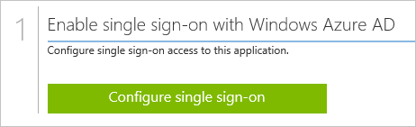
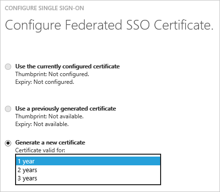

<properties
    pageTitle="Como gerenciar certificados de federação no Azure AD | Microsoft Azure"
    description="Saiba como personalizar a data de expiração para os certificados de Federação e como renovar certificados que expirarão em breve."
    services="active-directory"
    documentationCenter=""
    authors="asmalser-msft"
    manager="femila"
    editor=""/>

<tags
    ms.service="active-directory"
    ms.workload="identity"
    ms.tgt_pltfrm="na"
    ms.devlang="na"
    ms.topic="article"
    ms.date="02/09/2016"
    ms.author="asmalser-msft"/>

#Gerenciando certificados para federados Single Sign-On no Active Directory do Azure

Este artigo aborda dúvidas comuns relacionadas aos certificados que o Active Directory do Azure cria para estabelecer federado logon único (SSO) aos seus aplicativos SaaS.

Este artigo só é relevante para aplicativos que estão configurados para usar **Azure AD Single Sign-On**, conforme mostrado no exemplo abaixo:

##Como personalizar a data de expiração para o seu certificado de Federação

Por padrão, os certificados são definidos para expirar após dois anos. Você pode escolher uma data de expiração diferente para seu certificado seguindo as etapas abaixo. As capturas de tela incluídas usam Salesforce no exemplo, mas estas etapas podem se aplicam a qualquer aplicativo SaaS federado.

1. No Active Directory do Azure, na página de início rápido para o aplicativo, clique no **logon único configurar**.

    

2. Selecione **Azure AD Single Sign-On**e clique em **Avançar**.

3. Digite a **URL de logon** do seu aplicativo e marque a caixa de seleção para **Configurar o certificado usado para logon único federado**. Clique em **Avançar**.

    

4. Na próxima página, selecione **gerar um novo certificado**e selecione por quanto tempo você gostaria que o certificado seja válido para. Clique em **Avançar**.

    

5. Em seguida, clique em **baixar o certificado**. Para saber como carregar o certificado para o seu aplicativo de SaaS específico, clique em **instruções de configuração do modo de exibição**.

    

6. O certificado não será habilitado até selecionar a caixa de seleção de confirmação na parte inferior da caixa de diálogo e pressione em enviar.

##Como renovar um certificado que irá expirar em breve

As etapas de renovação mostradas abaixo ideal devem resultar em nenhum tempo de inatividade significativo para seus usuários. As capturas de tela usadas nesse recurso seção Salesforce como um exemplo, mas estas etapas podem aplicar qualquer aplicativo SaaS federados.

1. No Active Directory do Azure, na página de início rápido para o aplicativo, clique no **Configurar Single Sign-On**.

    

2. Na primeira página da caixa de diálogo, **Azure AD Single Sign-On** já deve estar selecionada, então clique em **Avançar**.

3. Na segunda página, selecione a caixa de seleção para **Configurar o certificado usado para logon único federado**. Clique em **Avançar**.

    

4. Na próxima página, selecione **gerar um novo certificado**e selecione por quanto tempo você gostaria que o novo certificado válido para. Clique em **Avançar**.

    

5. Clique em **baixar o certificado**. Para rewnew com êxito seu certificado, você deve executar as duas etapas a seguintes:

    - Carregue o novo certificado a tela de configuração de logon único do aplicativo SaaS. Para saber como fazer isso para seu aplicativo de SaaS específico, clique em **instruções de configuração do modo de exibição**.

    - No Azure AD, selecione a caixa de seleção de confirmação na parte inferior da caixa de diálogo para habilitar o novo certificado e clique em **Avançar** para enviar.

    > [AZURE.IMPORTANT] Logon único aplicativo será desabilitado no momento qualquer uma destas duas etapas for concluído, mas ele será ativado novamente depois que a segunda etapa é concluída. Portanto, para minimizar o tempo de inatividade, prepare realizar as duas etapas em um curto período de tempo entre si.

    

## Artigos relacionados

- [Índice de artigo de gerenciamento de aplicativos no Active Directory do Azure](active-directory-apps-index.md)
- [Acesso de aplicativo e logon único com o Active Directory do Azure](active-directory-appssoaccess-whatis.md)
- [Solução de problemas baseada em SAML Single Sign-On](active-directory-saml-debugging.md)
