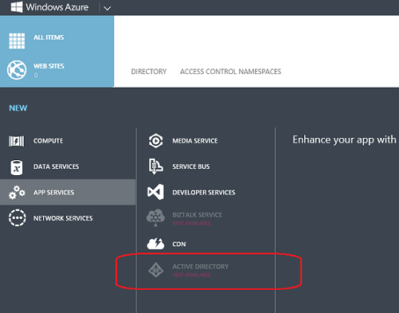

<properties
   pageTitle="Solução de problemas: Item 'Active Directory' está ausente ou não disponível | Microsoft Azure "
   description="O que fazer quando o item de menu do Active Directory não aparece no Portal de gerenciamento do Azure."
   services="active-directory"
   documentationCenter="na"
   authors="bryanla"
   manager="mbaldwin"
   editor=""/>

<tags
   ms.service="active-directory"
   ms.devlang="na"
   ms.topic="article"
   ms.tgt_pltfrm="na"
   ms.workload="identity"
   ms.date="09/16/2016"
   ms.author="mbaldwin"/>

# Solução de problemas: Item 'Active Directory' está ausente ou não disponível

Muitas das instruções para o uso de serviços e recursos do Active Directory do Azure começam com "Acesse o Portal de gerenciamento do Azure e clique em **Active Directory**." Mas o que fazer se o item de menu ou extensão do Active Directory não aparecer ou se ele estiver marcado como **Não disponível**? Este tópico foi criado para ajudar. Ele descreve as condições em qual **Active Directory** não aparecer ou não está disponível e explica como proceder.

## O Active Directory está ausente

Normalmente, um **Active Directory** item aparece no menu de navegação à esquerda. As instruções em procedimentos do Active Directory do Azure presumem que este item está no modo de exibição.

O item Active Directory aparece no menu de navegação à esquerda quando qualquer uma das seguintes condições for verdadeira. Caso contrário, o item não aparecerá.

* O usuário atual conectado com uma conta da Microsoft (conhecida anteriormente como Windows Live ID).

    OU

* O locatário Azure tem um diretório e a conta atual é um administrador de diretório.

    OU

* O locatário Azure tem pelo menos um namespace de controle de acesso do Azure AD (ACS). Para obter mais informações, consulte [Namespace de controle de acesso](https://msdn.microsoft.com/library/azure/gg185908.aspx).

    OU

* O locatário Azure tem pelo menos um provedor de autenticação multifator de Azure. Para obter mais informações, consulte [Administrando provedores de autenticação multifator do Azure](../multi-factor-authentication/multi-factor-authentication-get-started-cloud.md).

Para criar um provedor de autenticação multifator ou um namespace de controle de acesso, clique em **+ nova** > **Os serviços de aplicativo** > **Do Active Directory**.

Para obter direitos administrativos em um diretório, que o administrador atribuir uma função de administrador à sua conta. Para obter detalhes, consulte [Atribuindo funções de administrador](active-directory-assign-admin-roles.md).

## Active Directory não está disponível

Quando você clica em **+ nova** > **Os serviços de aplicativo**, um item do **Active Directory** é exibido. Especificamente, o item do Active Directory aparecerá quando qualquer um dos recursos do Active Directory, como o diretório, controle de acesso ou provedor de autenticação multifator, estão disponível para o usuário atual.

No entanto, enquanto o carregamento da página, o item está esmaecido e marcado **Não está disponível**. Este é um estado temporário. Se você esperar alguns segundos, o item se torna disponível. Se o atraso for prolongado, atualizar a página da web geralmente resolve o problema.

