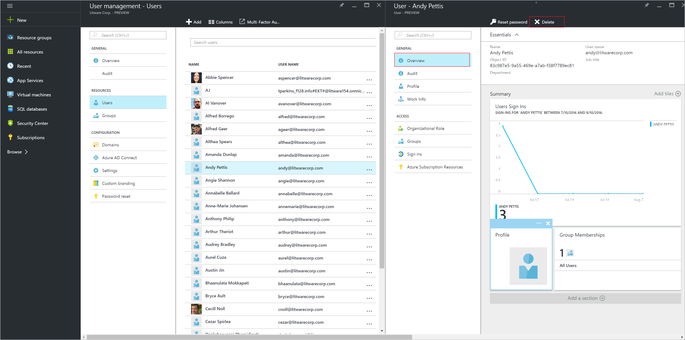

<properties
    pageTitle="Excluir um usuário de um diretório na visualização do Active Directory do Azure | Microsoft Azure"
    description="Explica como excluir um usuário e todas as suas informações do Active Directory do Azure"
    services="active-directory"
    documentationCenter=""
    authors="curtand"
    manager="femila"
    editor=""/>

<tags
    ms.service="active-directory"
    ms.workload="identity"
    ms.tgt_pltfrm="na"
    ms.devlang="na"
    ms.topic="article"
    ms.date="09/12/2016"
    ms.author="curtand"/>

# Excluir um usuário de um diretório na visualização do Active Directory do Azure

Este artigo explica como excluir um usuário de um diretório na visualização do Azure Active Directory (AD Azure). [O que é no preview?](active-directory-preview-explainer.md) Para obter informações sobre como adicionar novos usuários em sua organização, consulte [Adicionar novos usuários ao Azure Active Directory](active-directory-users-create-azure-portal.md).

## Excluir um usuário

1.  Entrar no [portal do Azure](https://portal.azure.com) com uma conta que seja um administrador global do diretório.

2.  Selecione **mais serviços**, insira os **usuários e grupos** na caixa de texto e, em seguida, pressione **Enter**.

    

3.  Na lâmina **usuários e grupos** , selecione **usuários**.

    

4. Na lâmina **usuários e grupos - usuários** , selecione um usuário na lista.

5. Na lâmina para o usuário selecionado, selecione **Visão geral**e, em seguida, na barra de comando, selecione **Excluir**.

    

## Qual é a próxima

- [Adicionar um usuário](active-directory-users-create-azure-portal.md)
- [Redefinir a senha de um usuário no novo portal do Azure](active-directory-users-reset-password-azure-portal.md)
- [Atribuir um usuário a uma função no seu Azure AD](active-directory-users-assign-role-azure-portal.md)
- [Alterar as informações de trabalho de um usuário](active-directory-users-work-info-azure-portal.md)
- [Gerenciar perfis de usuário](active-directory-users-profile-azure-portal.md)
