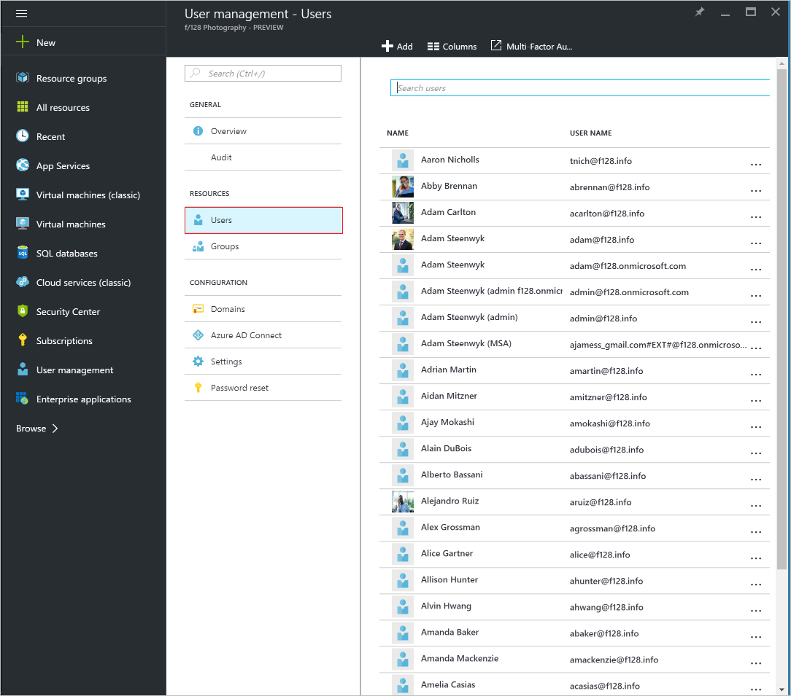

<properties
    pageTitle="Adicionar ou alterar informações de trabalho para um usuário na visualização do Active Directory do Azure | Microsoft Azure"
    description="Explica como adicionar números de telefone, nomes de departamento e outras informações de trabalho para um usuário no Active Directory do Azure"
    services="active-directory"
    documentationCenter=""
    authors="curtand"
    manager="femila"
    editor=""/>

<tags
    ms.service="active-directory"
    ms.workload="identity"
    ms.tgt_pltfrm="na"
    ms.devlang="na"
    ms.topic="article"
    ms.date="09/12/2016"
    ms.author="curtand"/>

# Adicionar ou alterar informações de trabalho para um usuário na visualização do Active Directory do Azure

Este artigo explica como adicionar ou alterar informações de trabalho como números de telefone ou um nome de departamento para um usuário na visualização do Azure Active Directory (AD Azure). [O que é no preview?](active-directory-preview-explainer.md) Para obter informações sobre como adicionar novos usuários em sua organização, consulte [Adicionar novos usuários ao Azure Active Directory](active-directory-users-create-external-azure-portal.md).

## Como alterar as informações de trabalho

1.  Entrar no [portal do Azure](https://portal.azure.com) com uma conta que seja um administrador global do diretório.

2.  Selecione **mais serviços**, insira os **usuários e grupos** na caixa de texto e, em seguida, pressione **Enter**.

    

3.  Na lâmina **usuários e grupos** , selecione **usuários**.

    

4. Na lâmina **usuários e grupos - usuários** , selecione um usuário na lista.

5. Na lâmina para o usuário selecionado, selecione **Informações de trabalho**.

    

6. Adicionar ou alterar as informações de trabalho e, em seguida, na barra de comandos, selecione **Salvar**.

## Qual é a próxima

- [Adicionar um usuário](active-directory-users-create-azure-portal.md)
- [Redefinir a senha de um usuário no novo portal do Azure](active-directory-users-reset-password-azure-portal.md)
- [Atribuir um usuário a uma função no seu Azure AD](active-directory-users-assign-role-azure-portal.md)
- [Gerenciar perfis de usuário](active-directory-users-profile-azure-portal.md)
- [Excluir um usuário no seu Azure AD](active-directory-users-delete-user-azure-portal.md)
