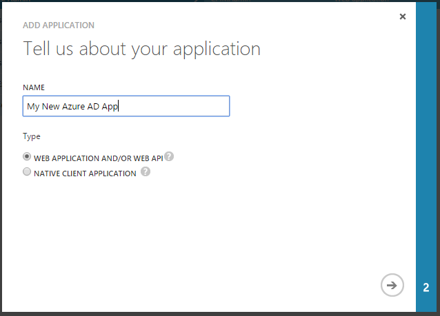

<properties
    pageTitle="O ponto de extremidade do Azure AD v 2.0 | Microsoft Azure"
    description="Uma comparação entre o Azure AD original e os pontos de extremidade de v 2.0."
    services="active-directory"
    documentationCenter=""
    authors="dstrockis"
    manager="mbaldwin"
    editor=""/>

<tags
    ms.service="active-directory"
    ms.workload="identity"
    ms.tgt_pltfrm="na"
    ms.devlang="na"
    ms.topic="article"
    ms.date="09/16/2016"
    ms.author="dastrock"/>

# <a name="whats-different-about-the-v20-endpoint"></a>O que é diferente sobre o ponto de extremidade de v 2.0?

Se você estiver familiarizado com o Azure Active Directory ou ter integra aplicativos Azure AD no passado, pode haver algumas diferenças na extremidade do v 2.0 não esperado.  Este documento destaca as diferenças para sua compreensão.

> [AZURE.NOTE]
    Nem todos os cenários do Active Directory do Azure e recursos são compatíveis com o ponto de extremidade de v 2.0.  Para determinar se você deve usar o ponto de extremidade de v 2.0, leia sobre as [limitações da versão 2.0](active-directory-v2-limitations.md).


## <a name="microsoft-accounts-and-azure-ad-accounts"></a>Contas da Microsoft e Azure AD
o ponto de extremidade de v 2.0 permitem que os desenvolvedores criem aplicativos que aceitam entrar de contas tanto Accounts do Microsoft Azure AD, usando um ponto de extremidade de auth único.  Isso lhe dá a capacidade de escrever seu aplicativo completamente independente de conta; ele pode ser ignoram do tipo de conta que o usuário entra em com.  Claro, você *pode* fazer seu aplicativo ciente do tipo de conta sendo usada em uma determinada sessão, mas não é necessário.

Por exemplo, se seu aplicativo chama o [Microsoft Graph](https://graph.microsoft.io), alguns dados e funcionalidade adicional estará disponíveis para usuários da empresa, como seus sites do SharePoint ou dados de diretório.  Mas, para várias ações, como [ler email de um usuário](https://graph.microsoft.io/docs/api-reference/v1.0/resources/message), o código pode ser escrito exatamente o mesmo para as Accounts do Microsoft Azure AD contas e.  

Integrar seu aplicativo Microsoft Accounts e Azure AD agora é um processo simple.  Você pode usar um único conjunto de pontos de extremidade, uma única biblioteca e o registro de um único aplicativo para obter acesso ao mundo do consumidor e empresa.  Para saber mais sobre o ponto de extremidade de v 2.0, confira [a visão geral](active-directory-appmodel-v2-overview.md).


## <a name="new-app-registration-portal"></a>Novo portal de registro de aplicativo
o ponto de extremidade de v 2.0 só pode ser registrado em um novo local: [apps.dev.microsoft.com](https://apps.dev.microsoft.com/?referrer=https://azure.microsoft.com/documentation/articles&deeplink=/appList).  Este é o portal onde você pode obter uma identificação de aplicativo, personalizar a aparência da página de entrada do seu aplicativo e muito mais.  Tudo o que você precisa para acessar o portal é uma conta da Microsoft da plataforma - conta pessoal ou corporativa/de estudante.  

Podemos vão continuar a adicionar mais funcionalidade a este Portal de registro de aplicativo ao longo do tempo.  O objetivo é que este portal será o novo local onde você pode ir para gerenciar tudo ter que fazer com os aplicativos da Microsoft.


## <a name="one-app-id-for-all-platforms"></a>Uma Id de aplicativo para todas as plataformas
No serviço do Active Directory do Azure original, você pode ter registrado várias diferentes aplicativos para um único projeto.  Você foi forçado para usar registros de aplicativo separado para seus clientes nativos e aplicativos web:



Por exemplo, se você tiver criado um site e um aplicativo iOS, você tinha que registrar-os separadamente, usando duas Ids de aplicativo diferente.  Se você tiver um site e um back-end api da web, você pode ter registrado cada um deles como um aplicativo separado no Azure AD.  Se você tiver um aplicativo iOS e um aplicativo do Android, você também pode ter registrado dois aplicativos diferentes.  

<!-- You may have even registered different apps for each of your build environments - one for dev, one for test, and one for production. -->

Agora, tudo o que você precisa é um registro único aplicativo e uma Id de aplicativo único para cada um dos seus projetos.  Você pode adicionar vários "plataformas" para cada projeto e forneça os dados apropriados para cada plataforma que você adicionar.  Claro, você pode criar quantos aplicativos conforme desejar dependendo das suas necessidades, mas para a maioria dos casos, somente uma Id de aplicativo devem ser necessário.

<!-- You can also label a particular platform as "production-ready" when it is ready to be published to the outside world, and use that same Application Id safely in your development environments. -->

Nosso objetivo é que isso levar a uma experiência de desenvolvimento e gerenciamento de aplicativo mais simplificado e criar uma exibição consolidada mais de um único projeto que você pode estar trabalhando em.


## <a name="scopes-not-resources"></a>Escopos, não recursos
No serviço do Azure AD original, um aplicativo pode se comportar como um **recurso**ou um destinatário de tokens.  Um recurso pode definir um número de **escopos** ou **oAuth2Permissions** que ele entende, permitindo que o cliente aplicativos solicitar tokens para esse recurso para um determinado conjunto de escopos.  Considere a API do Azure AD gráfico como um exemplo de um recurso:

- Identificador de recurso, ou `AppID URI`:`https://graph.windows.net/`
- Escopos, ou `OAuth2Permissions`: `Directory.Read`, `Directory.Write`, etc.  

Tudo isso seja verdadeira para o ponto de extremidade v 2.0.  Um aplicativo ainda pode se comportar como recurso, definir escopos e ser identificado por um URI.  Aplicativos cliente ainda podem solicitar acesso a esses escopos.  No entanto, a maneira em que um cliente solicita essas permissões foi alterado.  No passado, um 2.0 OAuth autorizar solicitação para Azure AD talvez procurou como:

```
GET https://login.microsoftonline.com/common/oauth2/authorize?
client_id=2d4d11a2-f814-46a7-890a-274a72a7309e
&resource=https%3A%2F%2Fgraph.windows.net%2F
...
```

onde o parâmetro **recurso** indicado o recurso que o aplicativo cliente está solicitando a autorização para.  Azure AD computado as permissões exigidas pelo aplicativo com base na configuração estática no Portal do Azure e tokens emitidos adequadamente.  Agora, o mesmo 2.0 OAuth autorizar solicitação parece:

```
GET https://login.microsoftonline.com/common/oauth2/v2.0/authorize?
client_id=2d4d11a2-f814-46a7-890a-274a72a7309e
&scope=https%3A%2F%2Fgraph.windows.net%2Fdirectory.read%20https%3A%2F%2Fgraph.windows.net%2Fdirectory.write
...
```

onde o parâmetro de **escopo** indica qual recurso e permissões o aplicativo está solicitando a autorização para. O recurso desejado ainda é muito presente na solicitação - -simplesmente contido em cada um dos valores de parâmetro de escopo.  Usando o parâmetro de escopo dessa maneira permite o ponto de extremidade de v 2.0 ser mais compatível com a especificação 2.0 OAuth e alinha mais detalhadamente com práticas comuns do setor.  Ele também permite que aplicativos realizem [consentimento incremental](#incremental-and-dynamic-consent), que é descrito na próxima seção.

## <a name="incremental-and-dynamic-consent"></a>Consentimento incremental e dinâmico
Aplicativos registrado no Azure AD disponibilizado necessário para especificar suas permissões OAuth 2.0 necessários no Portal do Azure, no momento da criação de aplicativo de serviço:


As permissões que um aplicativo necessário foram configurados **estática**.  Embora a configuração do aplicativo existir no Portal do Azure permitidos e mantidas o código simples e interessante, ele apresenta alguns problemas para os desenvolvedores:

- Um aplicativo tinha que saber todas as permissões que ele precisaria no momento de criação do aplicativo.  Adicionando permissões ao longo do tempo, foi um processo difícil.
- Um aplicativo tinha Conheça todos os recursos que ele nunca seria acessar antecedência.  Era difícil criar aplicativos que podem acessar um número aleatório de recursos.
- Um aplicativo tinha solicitar todas as permissões que ele precisaria após entrar primeiro do usuário.  Em alguns casos, isso resultou em uma lista muito longa de permissões, que não recomendado usuários finais de aprovar o acesso do aplicativo ao entrar inicial.

Com o ponto de extremidade de v 2.0, você pode especificar as permissões seu aplicativo precisa **dinamicamente**, durante a execução, durante o uso regular do aplicativo.  Para fazer isso, você pode especificar os escopos de seu aplicativo precisa em qualquer ponto no tempo, incluindo eles no `scope` parâmetro de uma solicitação de autorização:

```
GET https://login.microsoftonline.com/common/oauth2/v2.0/authorize?
client_id=2d4d11a2-f814-46a7-890a-274a72a7309e
&scope=https%3A%2F%2Fgraph.windows.net%2Fdirectory.read%20https%3A%2F%2Fgraph.windows.net%2Fdirectory.write
...
```

A permissão de solicitações acima para o aplicativo ler dados de diretório de um usuário Azure AD, bem como gravar dados em seu diretório.  Se o usuário aceitou essas permissões no passado para este aplicativo específico, eles simplesmente irá inserir suas credenciais e estar conectados no aplicativo.  Se o usuário não aceitou a qualquer uma dessas permissões, o ponto de extremidade de v 2.0 perguntará o usuário seu consentimento para essas permissões.  Para saber mais, você pode ler sobre [permissões, consentimento e escopos](active-directory-v2-scopes.md).

Permitir que um aplicativo para solicitar permissões dinamicamente via o `scope` parâmetro dá controle completo sobre a experiência do usuário.  Se desejar, você pode optar por frontload seu consentimento experiência e solicite todas as permissões em uma solicitação de autorização inicial.  Ou, se seu aplicativo requer um grande número de permissões, você pode optar por obter essas permissões do usuário forma incremental, que tentam usar determinados recursos do seu aplicativo ao longo do tempo.

## <a name="well-known-scopes"></a>Escopos conhecidos

#### <a name="offline-access"></a>Acesso offline
o ponto de extremidade de v 2.0 pode exigir o uso de uma nova permissão conhecido para aplicativos - o `offline_access` escopo.  Todos os aplicativos precisará solicitar esta permissão se precisarem acessar recursos em nome de um usuário para um período de tempo, mesmo quando o usuário pode não estar ativamente usando o aplicativo.  O `offline_access` escopo aparecerá para o usuário nas caixas de diálogo de consentimento como "Acesso a seus dados offline", que o usuário deve concordar com.  Solicitando o `offline_access` permissão permitirá que seu aplicativo web receber refresh_tokens 2.0 OAuth do ponto de extremidade v 2.0.  Refresh_tokens são de vida longa e podem ser trocados para novos OAuth 2.0 access_tokens por longos períodos de acesso.  

Se seu aplicativo não solicitar a `offline_access` escopo, não receberá refresh_tokens.  Isso significa que quando você resgatar um authorization_code no [fluxo de código de autorização OAuth 2.0](active-directory-v2-protocols.md#oauth2-authorization-code-flow), você receberá apenas novamente um access_token do `/token` ponto de extremidade.  Esse access_token permanecerá válida por um curto período de tempo (geralmente uma hora), mas expirarão eventualmente.  No momento, seu aplicativo precisará redirecionar o usuário de volta para o `/authorize` ponto de extremidade para recuperar uma nova authorization_code.  Durante esse redirecionamento, o usuário pode ou não precise inserir suas credenciais novamente ou novamente consentimento para permissões, dependendo do tipo de aplicativo.

Para saber mais sobre 2.0 OAuth, refresh_tokens e access_tokens, consulte a [referência de protocolo v 2.0](active-directory-v2-protocols.md).

#### <a name="openid-profile--email"></a>OpenID, perfil e email

No serviço do Active Directory do Azure original, o OpenID conectar entrar fluxo mais básico podem fornecer uma grande variedade de informações sobre o usuário na id_token resultante.  As declarações em um id_token podem incluir do usuário nome, preferencial de nome de usuário, endereço de email, ID do objeto e muito mais.

Agora podemos são restringir as informações que o `openid` escopo concedem o acesso de aplicativo para.  O escopo de 'openid' somente será permitir que o seu aplicativo entre o usuário na e recebe um identificador de aplicativo específico do usuário.  Se desejar obter informações de identificação pessoal (IIP) sobre o usuário em seu aplicativo, seu aplicativo precisará solicitar permissões adicionais do usuário.  Estamos apresentando dois novos escopos – o `email` e `profile` escopos – que permitem fazer isso.

O `email` escopo é bastante simples – ele permite o acesso de aplicativo ao endereço de email principal do usuário por meio do `email` reivindicar na id_token.  O `profile` escopo concedem o acesso do aplicativo para todas as outras informações básicas sobre o usuário – seu nome, nome de usuário preferencial, a ID de objeto e assim por diante.

Isso permite que você o código de seu aplicativo de maneira mínimo divulgação – você pode solicitar que somente o usuário para o conjunto de informações que o seu aplicativo precisa para fazer seu trabalho.  Para obter mais informações sobre esses escopos, consulte [a referência de escopo v 2.0](active-directory-v2-scopes.md). 

## <a name="token-claims"></a>Declarações do token

As declarações em tokens emitidos pelo ponto de extremidade v 2.0 não será idênticas ao tokens emitidos por disponibilidade geral pontos de extremidade do Azure AD - aplicativos migrando para o novo serviço não pense uma declaração específica continuará a existir em id_tokens ou access_tokens.   Tokens emitidos pelo ponto de extremidade v 2.0 são compatíveis com as especificações OAuth 2.0 e OpenID conectar, mas pode seguir semântica diferente que geralmente disponíveis serviço Azure AD.

Para saber mais sobre as declarações específicas emitidas em tokens de v 2.0, consulte a [referência de token de v 2.0](active-directory-v2-tokens.md).

## <a name="limitations"></a>Limitações
Há algumas restrições a serem consideradas ao usar o ponto de v 2.0.  Consulte o [documento de limitações v 2.0](active-directory-v2-limitations.md) para ver se qualquer essas restrições se aplicam ao seu cenário em particular.
