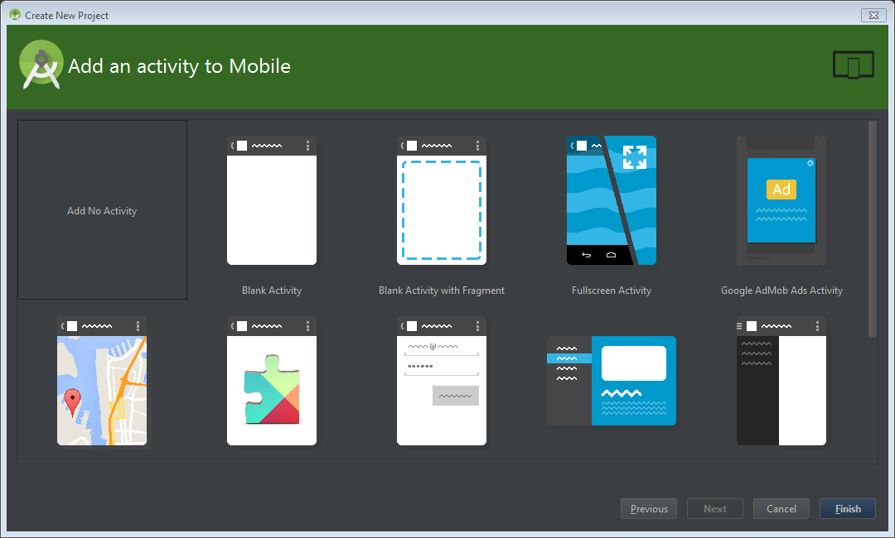
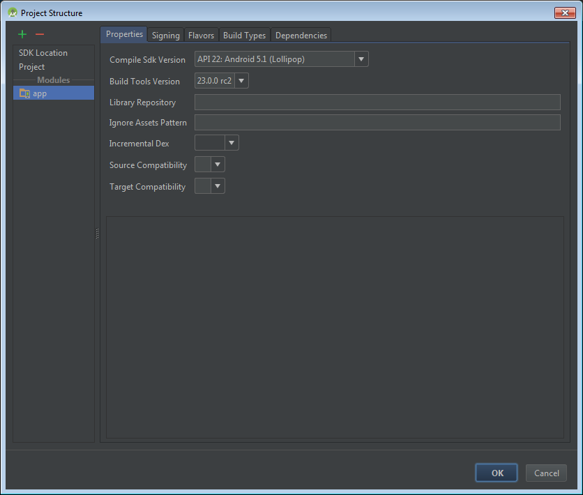

<properties
    pageTitle="Aplicativo do Active Directory do Azure v 2.0 Android | Microsoft Azure"
    description="Como criar um aplicativo do Android que sinais em usuários com pessoal conta da Microsoft e trabalho ou escola contas e chamadas API Graph usando bibliotecas de terceiros."
    services="active-directory"
    documentationCenter=""
    authors="brandwe"
    manager="mbaldwin"
    editor=""/>

<tags
    ms.service="active-directory"
    ms.workload="identity"
    ms.tgt_pltfrm="na"
    ms.devlang="na"
    ms.topic="article"
    ms.date="09/16/2016"
    ms.author="brandwe"/>

#  <a name="add-sign-in-to-an-android-app-using-a-third-party-library-with-graph-api-using-the-v20-endpoint"></a>Adicionar entrada a um aplicativo do Android usando uma biblioteca de terceiros com a API de gráfico usando o ponto de extremidade de v 2.0

A plataforma de identidade do Microsoft usa padrões abertos como OAuth2 e OpenID se conectar. Os desenvolvedores podem usar qualquer biblioteca que desejam integrar com nossos serviços. Para ajudar os desenvolvedores usar nossa plataforma com outras bibliotecas, podemos escreveu algumas orientações como essa para demonstrar como configurar bibliotecas de terceiros para conectar-se para a plataforma de identidade da Microsoft. A maioria das bibliotecas que implementar [a especificação de RFC6749 OAuth2](https://tools.ietf.org/html/rfc6749) pode se conectar para a plataforma de identidade da Microsoft.

Com o aplicativo que cria este passo a passo, os usuários podem entrar em sua organização e pesquise por si em sua organização usando a API do gráfico.

Se você for novo OAuth2 ou OpenID conectar, muito dessa configuração de amostra não faz sentido para você. Recomendamos que você leia [2.0 protocolos - OAuth 2.0 autorização código fluxo](active-directory-v2-protocols-oauth-code.md) como plano de fundo.

> [AZURE.NOTE] Alguns recursos de nossa plataforma que têm uma expressão nos padrões OAuth2 ou OpenID conectar, como acesso condicional e gerenciamento de políticas de Intune, exigem que você use nossa Abrir origem bibliotecas de identidade do Microsoft Azure.

O ponto de extremidade de v 2.0 não oferece suporte a todos os cenários do Active Directory do Azure e recursos.

> [AZURE.NOTE] Para determinar se você deve usar o ponto de extremidade de v 2.0, leia sobre as [limitações da versão 2.0](active-directory-v2-limitations.md).


## <a name="download-the-code-from-github"></a>Baixe o código do GitHub
O código para este tutorial é mantido [no GitHub](https://github.com/Azure-Samples/active-directory-android-native-oidcandroidlib-v2).  Para acompanhar, você pode [Baixar esqueleto do aplicativo como um. zip](https://github.com/Azure-Samples/active-directory-android-native-oidcandroidlib-v2/archive/skeleton.zip) ou clonar a estrutura:

```
git clone --branch skeleton git@github.com:Azure-Samples/active-directory-android-native-oidcandroidlib-v2.git
```

Você também pode fazer o download de amostra e começar agora mesmo:

```
git@github.com:Azure-Samples/active-directory-android-native-oidcandroidlib-v2.git
```

## <a name="register-an-app"></a>Registrar um aplicativo
Criar um novo aplicativo no [portal de registro do aplicativo](https://apps.dev.microsoft.com/?referrer=https://azure.microsoft.com/documentation/articles&deeplink=/appList)ou siga as etapas detalhadas da [como registrar um aplicativo com o ponto de extremidade de v 2.0](active-directory-v2-app-registration.md).  Certifique-se de:

- Copie a **Id do aplicativo** que é atribuído a seu aplicativo, pois você precisará delas em breve.
- Adicione **a plataforma para o aplicativo** .

> Observação: O portal de registro de aplicativo fornece um valor de **URI de redirecionamento** . Entretanto, neste exemplo, você deve usar o valor padrão de `https://login.microsoftonline.com/common/oauth2/nativeclient`.


## <a name="download-the-nxoauth2-third-party-library-and-create-a-workspace"></a>Baixar a biblioteca de terceiros NXOAuth2 e criar um espaço de trabalho

Para este passo a passo, você usará o OIDCAndroidLib do GitHub, que é uma biblioteca de OAuth2 com base no código OpenID conectar do Google. Ele implementa o perfil do aplicativo nativo e aceita o ponto de extremidade de autorização do usuário. Estas são todas as coisas que você precisará fazer a integração com a plataforma de identidade da Microsoft.

Clone o repo OIDCAndroidLib com seu computador.

```
git@github.com:kalemontes/OIDCAndroidLib.git
```


## <a name="set-up-your-android-studio-environment"></a>Configurar seu ambiente Studio Android

1. Criar um novo projeto de Studio Android e aceite os padrões do assistente.

    

    

    

2. Para configurar seus módulos do projeto, mova o repo clonado para o local do projeto. Você pode também criar o projeto e depois cloná-lo diretamente para o local do projeto.

    

3. Abra as configurações de módulos do projeto usando o menu de contexto ou usando o atalho Ctrl + Alt + lin + S.

    

4. Remova o módulo padrão do aplicativo porque você quer apenas as configurações de contêiner do projeto.

    

5. Importar módulos do repo clonado ao projeto atual.

    
    

6. Repita essas etapas para a `oidlib-sample` módulo.

7. Verificar as dependências de oidclib a `oidlib-sample` módulo.

    

8. Clique em **Okey** e aguarde a sincronização de gradle.

    Seu settings.gradle deve aparência:

    

9. Criar o aplicativo de amostra para garantir que a amostra sendo executado corretamente.

    Você não conseguirá usá-la com o Active Directory do Azure ainda. Podemos precisará configurar alguns pontos de extremidade primeiro. Isso é para garantir que você não tiver um problemas de Studio Android antes de começar Personalizando o aplicativo de amostra.

10. Criar e executar `oidlib-sample` como o destino no Studio Android.

    

11. Excluir o `app ` diretório que foi deixado quando removido o módulo do projeto porque Android Studio não exclui-lo para segurança.

    

12. Abra o menu **Editar configurações** para remover a configuração de execução que também foi deixada quando removido o módulo do projeto.

    
    

## <a name="configure-the-endpoints-of-the-sample"></a>Configurar os pontos de extremidade da amostra

Agora que você tem o `oidlib-sample` executando com êxito, vamos editar alguns pontos de extremidade para obter isso funcionar com o Active Directory do Azure.

### <a name="configure-your-client-by-editing-the-oidcclientconfxml-file"></a>Configure seu cliente editando o arquivo de oidc_clientconf.xml

1. Porque você está usando fluxos de OAuth2 apenas para obter um token e chamar a API de gráfico, defina o cliente OAuth2 somente. OIDC se torne um exemplo posterior.

    ```xml
        <bool name="oidc_oauth2only">true</bool>
    ```

2. Configure sua ID do cliente que você tenha recebido a partir do portal de registro.

    ```xml
        <string name="oidc_clientId">86172f9d-a1ae-4348-aafa-7b3e5d1b36f5</string>
        <string name="oidc_clientSecret"></string>
    ```

3. Configure o redirecionamento URI com aquele abaixo.

    ```xml
        <string name="oidc_redirectUrl">https://login.microsoftonline.com/common/oauth2/nativeclient</string>
    ```

4. Configure escopos que você precisa para acessar a API do gráfico.

    ```xml
        <string-array name="oidc_scopes">
            <item>openid</item>
            <item>https://graph.microsoft.com/User.Read</item>
            <item>offline_access</item>
        </string-array>
    ```

O `User.Read` valor em `oidc_scopes` permite que você leia o perfil básico a assinado do usuário.
Você pode saber mais sobre todos os escopos disponíveis em [escopos de permissão do Microsoft Graph](https://graph.microsoft.io/docs/authorization/permission_scopes).

Se você quiser explicações sobre `openid` ou `offline_access` como escopos OpenID se conectar, consulte [2.0 protocolos - OAuth 2.0 autorização código fluxo](active-directory-v2-protocols-oauth-code.md).

### <a name="configure-your-client-endpoints-by-editing-the-oidcendpointsxml-file"></a>Configurar seus pontos de extremidade do cliente, editando o arquivo de oidc_endpoints.xml

- Abrir o `oidc_endpoints.xml` arquivo e fazer as seguintes alterações:

    ```xml
    <!-- Stores OpenID Connect provider endpoints. -->
    <resources>
        <string name="op_authorizationEnpoint">https://login.microsoftonline.com/common/oauth2/v2.0/authorize</string>
        <string name="op_tokenEndpoint">https://login.microsoftonline.com/common/oauth2/v2.0/token</string>
        <string name="op_userInfoEndpoint">https://www.example.com/oauth2/userinfo</string>
        <string name="op_revocationEndpoint">https://www.example.com/oauth2/revoketoken</string>
    </resources>
    ```

Esses pontos de extremidade nunca devem alterar se você estiver usando OAuth2 como seu protocolo.

> [AZURE.NOTE]
Os pontos de extremidade `userInfoEndpoint` e `revocationEndpoint` atualmente não são suportados pelo Active Directory do Azure. Se você deixar essas com o valor de example.com padrão, você será lembrado que eles não estão disponíveis na amostra :-)


## <a name="configure-a-graph-api-call"></a>Configurar uma chamada de API de gráfico

- Abrir o `HomeActivity.java` arquivo e fazer as seguintes alterações:

    ```Java
       //TODO: set your protected resource url
        private static final String protectedResUrl = "https://graph.microsoft.com/v1.0/me/";
    ```

Veja uma chamada de API de gráfico simples retorna nossas informações.

Esses são todas as alterações que você precisa fazer. Executar o `oidlib-sample` aplicativo e clique em **entrar**.

Depois que você tiver autenticado com êxito, selecione o botão **Solicitar recursos protegidos por** testar sua chamada para a API do gráfico.

## <a name="get-security-updates-for-our-product"></a>Obter atualizações de segurança do nosso produto

Recomendamos que você obtenha notificações sobre ocorrências de segurança visitando o [TechCenter de segurança](https://technet.microsoft.com/security/dd252948) e assinar alertas de segurança comunicado.
