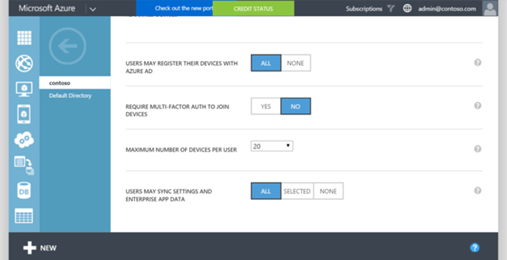

<properties
    pageTitle="Ativar o estado da empresa Roaming no Active Directory do Azure | Microsoft Azure"
    description="Perguntas frequentes sobre as configurações de Roaming do Enterprise estado em dispositivos Windows. Enterprise estado Roaming fornece aos usuários uma experiência unificada em seus dispositivos Windows e reduz o tempo necessário para configurar um novo dispositivo."
    services="active-directory"
    keywords="estado do Enterprise móveis, nuvem do windows, como habilitar roaming de estado de empresa"
    documentationCenter=""
    authors="femila"
    manager="swadhwa"
    editor="curtand"/>

<tags
    ms.service="active-directory"  
    ms.workload="identity"
    ms.tgt_pltfrm="na"
    ms.devlang="na"
    ms.topic="article"
    ms.date="09/27/2016"
    ms.author="femila"/>

# Ativar o estado da empresa Roaming no Active Directory do Azure

Enterprise estado Roaming está disponível em qualquer organização com uma assinatura Premium Azure Active Directory (AD Azure). Para obter mais detalhes sobre como obter uma assinatura do Azure AD, consulte a [página de produto do Azure AD](https://azure.microsoft.com/services/active-directory).

Quando você habilita Roaming de estado de empresa, sua organização será automaticamente concedida licenças para uma assinatura gratuita, uso limitado ao gerenciamento de direitos do Azure. Esta assinatura gratuita está limitada aos criptografar e descriptografar configurações da empresa e dados de aplicativo sincronizados pelo serviço de Roaming do Enterprise estado; Você deve ter uma assinatura paga para usar todos os recursos do gerenciamento de direitos do Azure.

Depois de obter uma assinatura Premium Azure AD, siga estas etapas para habilitar Roaming de estado de empresa:

1. Faça logon no portal de clássico Azure.
2. À esquerda, selecione **ACTIVE DIRECTORY**e selecione o diretório para o qual você deseja habilitar Roaming de estado de empresa.

3. Vá para a guia **Configurar** na parte superior.

4.  Rolar a página para baixo e selecione **os usuários podem sincronizar configurações e dados de aplicativo empresarial**e clique em **Salvar**.

Para um dispositivo Windows 10 transitar configurações com o serviço de Roaming do Enterprise estado, o dispositivo deve autenticar usando uma identidade do Azure AD. Para dispositivos que fazem parte de Azure AD, principal logon o usuário é a identidade do Azure AD, portanto, nenhuma configuração adicional é necessária. Para dispositivos que usam um Active Directory local tradicional, o administrador de TI deve [Conecte os dispositivos de domínio para o Azure AD para Windows 10 experiências](active-directory-azureadjoin-devices-group-policy.md).

## Armazenamento de dados de sincronização
Dados corporativos estado Roaming estiver hospedados em um ou mais [regiões Azure](https://azure.microsoft.com/regions/ ) que melhor se alinha com o valor de país/região definido na instância do Active Directory do Azure. Dados corporativos estado Roaming são particionados com base em três regiões geográficas principais: América do Norte, EMEA e APAC. Dados corporativos estado Roaming do locatário está localizados localmente com região geográfica e não são duplicados entre regiões.  Por exemplo, clientes que tenham seu valor de país/região definido como um dos países da EMEA, como "França" ou "Zâmbia" terão seus dados hospedados em um ou das regiões Azure dentro Europa.  Clientes que definir seus valores de país/região no Azure AD para um dos países da América do Norte, como "EUA" ou "Canadá" terão seus dados hospedados em um ou mais das regiões Azure dentro dos EUA.  Clientes que definir seus valores de país/região no Azure AD para um dos países APAC como "Austrália" ou "Nova Zelândia" terá seus dados hospedados em um ou mais das regiões Azure dentro da Ásia.  Países da América do Sul e dados de Antártica serão hospedados em um ou mais regiões Azure dentro dos EUA.  O valor de país/região é definido como parte do processo de criação de diretório do Azure AD e não pode ser modificado posteriormente. 

Se precisar de mais detalhes no local de armazenamento de dados, registre uma permissão com o [suporte do Azure](https://azure.microsoft.com/support/options/).

## Gerenciar o estado de Enterprise Roaming
Administradores globais do Azure AD podem ativar e desativar o serviço de Roaming do Enterprise estado de mensagens no portal de clássico do Azure.

Os administradores globais podem limitar a sincronização de configurações para grupos de segurança específicos.

Os administradores globais também podem exibir um relatório de status de sincronização de dispositivo por usuário selecionando um usuário específico na lista de **usuários** de instância do Active Directory e clicando na guia **dispositivos** e selecionando **dispositivos sincronizando dados de aplicativo empresarial e as configurações**de exibição.

##Retenção de dados
Dados sincronizados com o Azure via Enterprise estado Roaming serão mantidos indefinidamente, a menos que uma operação de exclusão manual é executada ou os dados em questão são determinados sejam obsoletos. 

**Exclusão explícita:** Os dados são excluídos quando um administrador do Azure exclui um usuário ou uma pasta ou um administrador solicita explicitamente que dados sejam a ser excluída.

- **Exclusão do usuário**: quando um usuário é excluído no Azure AD, a conta de usuário dados móveis será marcada para exclusão e será excluída entre 90 a 180 dias. 
- **Exclusão de diretórios**: a exclusão de um diretório inteiro no Azure AD é uma operação imediata. Todos os dados de configurações associadas com que o diretório será marcado para exclusão e será excluído entre 90 a 180 dias. 
- **Na exclusão de solicitação**: se o administrador do Azure AD quiser excluir manualmente os dados ou dados de configurações de um usuário específico, o administrador pode enviar uma permissão com o [Azure oferece suporte](https://azure.microsoft.com/support/). 

**Exclusão de dados obsoletos**: dados que não foram acessados para um ano ("o período de retenção") será tratado como desatualizados e pode ser excluído do Azure. O período de retenção está sujeita a alterações, mas não serão menos de 90 dias. Os dados obsoletos podem ser um conjunto específico de configurações de aplicativo do Windows ou todas as configurações de um usuário. Por exemplo:
 
- Se nenhum dispositivo acessar um conjunto de configurações específicas (por exemplo, um aplicativo é removido do dispositivo, ou um grupo de configurações como "Theme" está desabilitado para todos os dispositivos de um usuário), então esse conjunto se tornarão obsoleto após o período de retenção e podem ser excluído. 
- Se um usuário tenha desativado a sincronização de configurações em todos os seus dispositivos, em seguida, nenhum dos dados configurações serem acessados e todos os dados de configurações para esse usuário se tornarão obsoletos e podem ser excluídos após o período de retenção. 
- Se o administrador de diretório do Azure AD desativa Roaming de estado de empresa para o diretório inteiro, em seguida, todos os usuários nesse diretório serão mais sincronizados configurações, e todos os dados de configurações para todos os usuários se tornarão obsoletos e podem ser excluídos após o período de retenção. 

**Recuperação de dados excluídos**: A política de retenção de dados não é configurável. Depois que os dados foi excluídos permanentemente, não será recuperável. No entanto, é importante observar que os dados de configurações só serão excluídos do Azure, não o dispositivo do usuário final. Se qualquer dispositivo mais tarde se reconecta ao serviço de Roaming do Enterprise estado, as configurações novamente serão sincronizadas e armazenadas no Azure.

## Tópicos relacionados
- [Visão geral de Roaming do Enterprise estado](active-directory-windows-enterprise-state-roaming-overview.md)
- [Configurações e dados roaming perguntas Frequentes](active-directory-windows-enterprise-state-roaming-faqs.md)
- [Configurações de política e o MDM para sincronização de configurações de grupo](active-directory-windows-enterprise-state-roaming-group-policy-settings.md)
- [Referência de configurações móvel do Windows 10](active-directory-windows-enterprise-state-roaming-windows-settings-reference.md)
