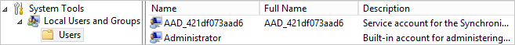

<properties
   pageTitle="Azure AD Connect: Contas e permissões | Microsoft Azure"
   description="Este tópico descreve as contas usado e criado e as permissões necessárias."
   services="active-directory"
   documentationCenter=""
   authors="billmath"
   manager="femila"
   editor=""/>

<tags
   ms.service="active-directory"  
   ms.workload="identity"
   ms.tgt_pltfrm="na"
   ms.devlang="na"
   ms.topic="article"
   ms.date="10/04/2016"
   ms.author="billmath"/>

# Azure AD Connect: Contas e permissões
O Assistente de instalação do Azure AD Connect oferece dois caminhos diferentes:

- Em configurações expressas, o assistente requer mais privilégios para que ele pode configurar sua configuração facilmente, sem precisar criar usuários ou configurar permissões separadamente.

- Em configurações personalizadas, o assistente oferece mais opções de, mas há algumas situações nas quais você precisa garantir que você tem as permissões corretas por conta própria.

## Documentação relacionada
Se você não leu a documentação sobre a [integração de identidades seu local com o Azure Active Directory](../active-directory-aadconnect.md), a tabela a seguir fornece links para tópicos relacionados.

Tópico |  
--------- | ---------
Instalar usando configurações Express | [Instalação expressa do Azure AD Connect](active-directory-aadconnect-get-started-express.md)
Instalar usando configurações personalizadas | [Instalação personalizada do Azure AD Connect](active-directory-aadconnect-get-started-custom.md)
Atualização de DirSync | [Atualização da ferramenta de sincronização do Azure AD (DirSync)](active-directory-aadconnect-dirsync-upgrade-get-started.md)

## Configurações de instalação expressa
Em configurações de Express, o Assistente de instalação solicita credenciais de administrador de empresa do AD DS para que seu local Active Directory pode ser configurado com as permissões necessárias para Azure AD Connect. Se você estiver atualizando de DirSync, as credenciais de administradores de empresa do AD DS são usadas para redefinir a senha para a conta usada pelo DirSync. Você também precisa de credenciais de Administrador Global do Azure AD.

Página do Assistente  | Credenciais coletadas | Permissões necessárias| Usado para
------------- | ------------- |------------- |-------------
N/D|Usuário que está executando o Assistente de instalação| Administrador do servidor local| <li>Cria a conta local que é usada como a [conta de serviço do mecanismo de sincronização](#azure-ad-connect-sync-service-account).
Conectar ao Azure AD| Credenciais de directory do Azure AD | Função de administrador global no Azure AD | <li>Habilitando sincronização no diretório Azure AD.</li>  <li>Criação da [conta do Azure AD](#azure-ad-service-account) que é usado para operações de sincronização em andamento no Azure AD.</li>
Conectar-se ao AD DS | Credenciais do Active Directory local | Membro do grupo Administradores de empresa (EA) no Active Directory| <li>Cria uma [conta](#active-directory-account) no Active Directory e concede permissões a ele. Isso criou conta é usado para ler e gravar informações de diretório durante a sincronização.</li>

### Credenciais de administrador da empresa
Essas credenciais são usadas apenas durante a instalação e são usadas após a conclusão da instalação. É administrador da empresa e não Admin de domínio, para garantir que as permissões do Active Directory podem ser definidas em todos os domínios.

### Credenciais de administrador globais
Essas credenciais são usadas apenas durante a instalação e não são usadas após a conclusão da instalação. Ele é usado para criar a [conta do Azure AD](#azure-ad-service-account) usada para sincronizar as alterações ao Azure AD. A conta também permite sincronizar como um recurso no Azure AD.

### Permissões para o AD DS criado conta para configurações express
A [conta](#active-directory-account) criada para leitura e escrita para o AD DS ter as seguintes permissões quando criado por configurações express:

Permissão | Usado para
---- | ----
<li>Replicar alterações de diretório</li><li>Diretório replicar todas as alterações | Sincronização de senha
Leitura/gravação todas as propriedades de usuário | Importar e Exchange híbrido
Leitura/gravação todas as propriedades iNetOrgPerson | Importar e Exchange híbrido
Grupo de todas as propriedades de leitura/gravação | Importar e Exchange híbrido
Entre em contato com todas as propriedades de leitura/gravação | Importar e Exchange híbrido
Redefinir senha | Preparação para habilitar write-back de senha

## Instalação de configurações personalizadas
Ao usar configurações personalizadas, a conta usada para conectar-se ao Active Directory deve ser criada antes da instalação. As permissões que você deve conceder a essa conta podem ser encontradas na [criar a conta do AD DS](#create-the-ad-ds-account).

Página do Assistente  | Credenciais coletadas | Permissões necessárias| Usado para
------------- | ------------- |------------- |-------------
N/D | Usuário que está executando o Assistente de instalação|<li>Administrador do servidor local</li><li>Se usando um servidor SQL completo, o usuário deve ser administrador do sistema (SA) no SQL</li>| Por padrão, cria a conta local que é usada como a [conta de serviço do mecanismo de sincronização](#azure-ad-connect-sync-service-account). A conta só é criada quando o administrador não especificar uma determinada conta.
Instale os serviços de sincronização, opção de conta de serviço | AD ou credenciais de conta de usuário local | Usuário, as permissões são concedidas pelo Assistente de instalação | Se o administrador especifica uma conta, essa conta é usada como a conta de serviço para o serviço de sincronização.
Conectar ao Azure AD | Credenciais de directory do Azure AD| Função de administrador global no Azure AD| <li>Habilitando sincronização no diretório Azure AD.</li>  <li>Criação da [conta do Azure AD](#azure-ad-service-account) que é usado para operações de sincronização em andamento no Azure AD.</li>
Conecte seu diretórios | Credenciais do Active Directory para cada floresta que está conectado ao Azure AD local | As permissões dependem de quais recursos você habilita e pode ser encontradas na [conta de criar o AD DS](#create-the-ad-ds-account) |Essa conta é usada para ler e gravar informações de diretório durante a sincronização.
Servidores do AD FS | Para cada servidor na lista, o assistente coleta credenciais quando as credenciais de logon do usuário executando o assistente não são suficientes para conectar-se | Administrador de domínio | Instalação e configuração da função de servidor do AD FS.
Servidores de proxy de aplicativo da Web |Para cada servidor na lista, o assistente coleta credenciais quando as credenciais de logon do usuário executando o assistente não são suficientes para conectar-se | Administrador local na máquina de destino | Instalação e configuração da função de servidor WAP.
Credenciais de confiança de proxy |Credenciais de confiança de serviço de Federação (as credenciais do proxy utiliza para registrar um certificado de confiança do FS |Conta de domínio que é um administrador local do servidor do AD FS | Inscrição inicial do certificado de confiança FS-WAP.
Página de conta de serviço de TI do AD, "Usar uma opção de conta de usuário do domínio" | Credenciais de conta de usuário do AD | Usuário do domínio | A conta de usuário do AD cujas credenciais são fornecidas é usada como a conta de logon do serviço do AD FS.

### Criar a conta do AD DS
Quando você instala o Azure AD Connect, a conta especificada na página **conectar seus diretórios** devem estar presente no Active Directory e ter necessários permissões. O Assistente de instalação não verificar que as permissões e quaisquer problemas são encontrados somente durante a sincronização.

Quais permissões você exige depende os recursos opcionais que você habilite. Se você tiver vários domínios, devem receber as permissões para todos os domínios na floresta. Se você não ativar esses recursos, as permissões de **Usuário de domínio** padrão são suficientes.

Recurso | Permissões
------ | ------
Sincronização de senha | <li>Replicar alterações de diretório</li>  <li>Diretório replicar todas as alterações
Implantação híbrida do Exchange | Permissões de gravação para os atributos documentados no [Write-back híbrida do Exchange](../active-directory-aadconnectsync-attributes-synchronized.md#exchange-hybrid-writeback) para os usuários, grupos e contatos.
Write-back de senha | Permissões de gravação para os atributos documentados em [Introdução ao gerenciamento de senha](../active-directory-passwords-getting-started.md#step-4-set-up-the-appropriate-active-directory-permissions) para os usuários.
Write-back do dispositivo | Permissões concedidas com um script do PowerShell, conforme descrito em [Write-back do dispositivo](../active-directory-aadconnect-feature-device-writeback.md).
Write-back de grupo | Ler, criar, atualizar e excluir objetos de grupo da unidade organizacional onde os grupos de distribuição devem ser localizados.

## Atualizar
Quando você atualiza de uma versão do Azure AD Connect para uma nova versão, você precisa das seguintes permissões:

Principal | Permissões necessárias | Usado para
---- | ---- | ----
Usuário que está executando o Assistente de instalação | Administrador do servidor local | Atualize binários.
Usuário que está executando o Assistente de instalação | Membro do ADSyncAdmins | Fazer alterações em regras de sincronização e outras configurações.
Usuário que está executando o Assistente de instalação | Se você usar um servidor SQL completo: DBO (ou semelhante) do banco de dados de mecanismo de sincronização | Fazer alterações no nível de banco de dados, como a atualização de tabelas com novas colunas.

## Mais informações sobre as contas criadas

### Conta do Active Directory
Se você usar configurações expressas, uma conta é criada no Active Directory que é usado para sincronização. A conta criada está localizada no domínio raiz da floresta no recipiente Usuários e tem seu nome com o prefixo **MSOL_**. A conta for criada com uma senha longa complexa que não expire. Se você tiver uma diretiva de senha em seu domínio, verifique sabe longo e senhas complexas permitidas para essa conta.

### Contas de serviço de sincronização do Azure AD Connect
Uma conta de serviço local é criada pelo Assistente de instalação (a menos que você especificar a conta para usar em configurações personalizadas). A conta é prefixo **AAD_** e usado para o serviço de sincronização real para executar como. Se você instalar o Azure AD Connect em um controlador de domínio, a conta é criada no domínio. Se você usar um servidor remoto executando o SQL server ou se você usar um proxy que requer autenticação, a conta de serviço **AAD_** deve estar localizada no domínio.

A conta for criada com uma senha longa complexa que não expire.

Essa conta é usada para armazenar as senhas para as outras contas de maneira segura. Estas outras senhas de contas são armazenadas criptografados no banco de dados. Chaves particulares para as chaves de criptografia são protegidas com a criptografia de chave secreta de serviços de criptografia usando a API de proteção de dados do Windows (DPAPI). Você não deve redefinir a senha da conta de serviço como o Windows, em seguida, será destroy as chaves de criptografia por razões de segurança.

Se você usar um servidor SQL completo, a conta de serviço é o DBO do banco de dados criado para o mecanismo de sincronização. O serviço não funcionará como previsto com qualquer outra permissão. O logon SQL também é criado.

A conta também recebe permissões para arquivos, chaves do registro e outros objetos relacionados ao mecanismo de sincronização.

### Conta de serviço do Azure AD
Uma conta no Azure AD é criada para uso do serviço de sincronização. Essa conta pode ser identificada por seu nome de exibição.

O nome do servidor que a conta é usada em pode ser identificado na segunda parte do nome do usuário. Na imagem, o nome do servidor é FABRIKAMCON. Se você tiver servidores de teste, cada servidor tem sua própria conta. Há um limite de 10 contas de serviço de sincronização do Azure AD.

A conta de serviço é criada com uma senha longa complexa que não expire. Ele é concedido um papel especial **Contas de sincronização de diretório** com permissões somente para realizar tarefas de sincronização de diretório. Esta função interna especial não pode ser concedida fora do Assistente do Azure AD Connect e o portal do Azure mostra essa conta com a função de **usuário**.

## Próximas etapas

Saiba mais sobre como [integrar suas identidades do local com o Active Directory do Azure](../active-directory-aadconnect.md).
