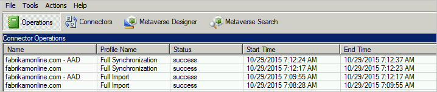

<properties
   pageTitle="Azure AD Connect: Atualizar do DirSync | Microsoft Azure"
   description="Saiba como atualizar do DirSync para Azure AD Connect. Este artigo descreve as etapas para a atualização de DirSync para Azure AD Connect."
   services="active-directory"
   documentationCenter=""
   authors="andkjell"
   manager="femila"
   editor=""/>

<tags
   ms.service="active-directory"
   ms.workload="identity"
   ms.tgt_pltfrm="na"
   ms.devlang="na"
   ms.topic="get-started-article"
   ms.date="08/19/2016"
   ms.author="shoatman;billmath"/>

# Azure AD Connect: Atualização de DirSync
Azure AD Connect é a sucessora DirSync. Localize as maneiras que você pode atualizar do DirSync neste tópico. Essas etapas não funcionam para a atualização de outra versão do Azure AD Connect ou de sincronização do Azure AD.

Antes de iniciar a instalação do Azure AD Connect, verifique se a [baixar o Azure AD Connect](http://go.microsoft.com/fwlink/?LinkId=615771) e preencha o pré-requisito etapas no [Azure AD Connect: Hardware e pré-requisitos](../active-directory-aadconnect-prerequisites.md). Em particular, que você deseja ler sobre procedimentos, como estas áreas são diferentes de DirSync:

- A versão necessária do .net e PowerShell. Versões mais recentes são necessários para estar no servidor do qual DirSync necessário.
- A configuração do servidor proxy. Se você usar um servidor proxy para acessar a internet, essa configuração deve ser configurada antes de atualizar. DirSync sempre usado o servidor de proxy configurado para o usuário instalá-lo, mas as configurações da máquina Azure AD Connect usa em vez disso.
- As URLs necessária para ser aberto no servidor proxy. Para cenários básicos, aqueles também suportadas pelo DirSync, os requisitos são os mesmos. Se você quiser usar qualquer um dos novos recursos incluídos com o Azure AD Connect, algumas novas URLs devem ser abertos.

Se você não estiver atualizando de DirSync, consulte a [documentação relacionada](#related-documentation) para outros cenários.

## Atualização de DirSync
Dependendo de sua implantação DirSync atual, há diferentes opções para a atualização. Se o tempo de atualização esperado é menos de três horas, a recomendação é fazer uma atualização in-loco. Se o tempo de atualização esperado é mais de três horas, a recomendação é fazer uma implantação paralela em outro servidor. Estima-se que se você tiver mais de 50.000 objetos demora mais de três horas para fazer a atualização.

Cenário |  
---- | ----
[Atualização in-loco](#in-place-upgrade)  | Opção preferida se a atualização é esperada para levar menos de 3 horas.
[Implantação paralela](#parallel-deployment) | Opção preferida se a atualização é esperada para levar mais de 3 horas.

>[AZURE.NOTE] Quando você planejar a atualização de DirSync para Azure AD Connect, não desinstale DirSync por conta própria antes da atualização. Azure AD Connect lerá e migrar a configuração de DirSync e desinstalar após inspecionar o servidor.

**Atualização in-loco**  
O tempo esperado para concluir a atualização é exibido pelo assistente. Essa estimativa baseia-se na suposição de que leva três horas para concluir uma atualização para um banco de dados com 50.000 objetos (usuários, contatos e grupos). Se o número de objetos do banco de dados for menor do que 50.000, o Azure AD Connect recomenda uma atualização in-loco. Se você decidir continuar, suas configurações atuais são aplicadas automaticamente durante a atualização e seu servidor de sincronização do active continuará automaticamente.

Se você quiser fazer uma migração de configuração e faça uma implantação paralela, você pode substituir a recomendação de atualização in-loco. Por exemplo, você pode levar a oportunidade de atualizar o hardware e o sistema operacional. Consulte a seção de [implantação paralela](#parallel-deployment) para obter mais informações.

**Implantação paralela**  
Se você tiver mais de 50.000 objetos, é recomendável uma implantação paralela. Isso evita atrasos operacionais experientes pelos usuários. A instalação do Azure AD Connect tenta estimar o tempo de inatividade para a atualização, mas se você atualizou DirSync no passado, sua própria experiência é provavelmente será o guia recomendadas.

### Configurações de DirSync suportadas para ser atualizado
A seguinte configuração alterações são compatíveis com o DirSync são atualizadas:

- Domínio e filtragem de unidade Organizacional
- ID alternativa (UPN)
- Sincronização de senha e configurações de implantação híbrida do Exchange
- Seu domínio/floresta e configurações do Azure AD
- Filtragem baseada em atributos de usuário

A seguinte alteração não pode ser atualizada. Se você tiver essa configuração, a atualização está bloqueada:

- Por exemplo, as alterações de DirSync sem suporte, removidos atributos e usando uma extensão personalizada DLL

Nesses casos, a recomendação é instalar um novo servidor do Azure AD Connect no [modo de teste](../active-directory-aadconnectsync-operations.md#staging-mode) e verifique se o DirSync antiga e nova configuração do Azure AD Connect. Reaplicar alterações usando configuração personalizada, conforme descrito na [configuração personalizada de sincronização de conectar-se do Azure AD](../active-directory-aadconnectsync-whatis.md).

As senhas usadas por DirSync para as contas de serviço não podem ser recuperadas e não são migradas. Essas senhas são redefinidas durante a atualização.

### Etapas de alto nível para atualização do DirSync para Azure AD Connect

1. Bem-vindo ao Azure AD conectar
2. Análise de configuração de DirSync atual
3. Obter a senha de administrador global do Azure AD
4. Coletar as credenciais para uma conta de administrador da empresa (somente usado durante a instalação do Azure AD Connect)
5. Conectar-se de instalação do Azure AD
    * Desinstalar o DirSync (ou desabilitá-lo temporariamente)
    * Conectar-se de instalar Azure AD
    * Opcionalmente, iniciar a sincronização

Etapas adicionais são necessárias quando:

* Você está usando atualmente completo do SQL Server - local ou remoto
* Você tem mais de 50.000 objetos no escopo de sincronização

## Atualização in-loco

1. Inicie o instalador do Azure AD Connect (MSI).
2. Analise e concordar com os termos de licença e aviso de privacidade.

3. Clique em Avançar para começar a análise da instalação DirSync existente.

4. Quando a análise estiver concluída, você ver as recomendações para prosseguir.  
    - Se você usa SQL Server Express e tiver menos de 50.000 objetos, a tela a seguir é mostrada: 
    - Se você usar um servidor SQL completo para DirSync, você vê esta página:   
As informações sobre o servidor de banco de dados existente do SQL Server sendo usado pelo DirSync são exibidas. Faça os ajustes apropriados, se necessário. Clique em **Avançar** para continuar a instalação.
    - Se você tiver mais de 50.000 objetos, você vê esta tela:   
Para continuar com uma atualização in-loco, clique na caixa de seleção ao lado desta mensagem: **continuar atualizando DirSync neste computador.**
Para fazer uma [implantação paralela](#parallel-deployment) em vez disso, você exportar as definições de configuração de DirSync e mova a configuração para o novo servidor.
5. Fornece a senha da conta que você utiliza atualmente para se conectar ao Azure AD. Isso deve ser a conta usada no momento pelo DirSync.
  
Se você recebe um erro e tiver problemas de conectividade, consulte [Solucionar problemas de conectividade](../active-directory-aadconnect-troubleshoot-connectivity.md).
6. Forneça uma conta de administrador da empresa do Active Directory.

7. Agora você está pronto para configurar. Quando você clicar em **Atualizar**, DirSync é desinstalado e Azure AD Connect está configurado e começa a sincronizar.

8. Após a conclusão da instalação, sair e entrar novamente para Windows antes de usar o Gerenciador de serviço de sincronização, Editor de regra de sincronização, ou tentar fazer outras alterações de configuração.

## Implantação paralela

### Exportar a configuração de DirSync
**Implantação paralela com mais de 50.000 objetos**

Se você tiver mais de 50.000 objetos, a instalação do Azure AD Connect recomenda uma implantação paralela.

Uma tela semelhante à seguinte é exibida:

Se desejar continuar com implantação paralela, você precisa executar as seguintes etapas:

- Clique no botão **Exportar configurações** . Quando você instala o Azure AD Connect em um servidor separado, essas configurações são migradas do seu DirSync atual à nova instalação Azure AD Connect.

Depois que as configurações foram exportadas com êxito, você pode sair do Assistente do Azure AD Connect no servidor DirSync. Continue com a próxima etapa para [instalar o Azure AD Connect em um servidor separado](#installation-of-azure-ad-connect-on-separate-server)

**Implantação paralela com menos de 50.000 objetos**

Se você tiver menos de 50.000 objetos, mas ainda quiser fazer uma implantação paralela, em seguida, faça o seguinte:

1. Execute o instalador do Azure AD Connect (MSI).
2. Quando você vir a tela **Bem-vindo ao Azure AD Connect** , saia do Assistente de instalação clicando no "X" no canto superior direito da janela.
3. Abra um prompt de comando.
4. Do local de instalação do Azure AD Connect (padrão: C:\Program Files\Microsoft Azure Active Directory Connect) execute o seguinte comando:  `AzureADConnect.exe /ForceExport`.
5. Clique no botão **Exportar configurações** .  Quando você instala o Azure AD Connect em um servidor separado, essas configurações são migradas do seu DirSync atual à nova instalação Azure AD Connect.

Depois que as configurações foram exportadas com êxito, você pode sair do Assistente do Azure AD Connect no servidor DirSync. Continue com a próxima etapa para [instalar o Azure AD Connect em um servidor separado](#installation-of-azure-ad-connect-on-separate-server)

### Instalar o Azure AD Connect no servidor separado

Quando você instala o Azure AD Connect em um novo servidor, pressupõe-se que você deseja executar uma instalação limpa do Azure AD Connect. Como você deseja usar a configuração de DirSync, existem algumas etapas adicionais:

1. Execute o instalador do Azure AD Connect (MSI).
2. Quando você vir a tela **Bem-vindo ao Azure AD Connect** , saia do Assistente de instalação clicando no "X" no canto superior direito da janela.
3. Abra um prompt de comando.
4. Do local de instalação do Azure AD Connect (padrão: C:\Program Files\Microsoft Azure Active Directory Connect) execute o seguinte comando:  `AzureADConnect.exe /migrate`.
    O Assistente de instalação do Azure AD Connect inicia e apresenta a tela a seguir: 
5. Selecione o arquivo de configurações que exportado da instalação DirSync.
6. Configure opções avançadas incluindo:
    - Um local de instalação personalizada para Azure AD Connect.
    - Uma instância existente do SQL Server (padrão: Azure AD Connect instala o SQL Server 2012 Express). Não use a mesma instância do banco de dados como o seu servidor DirSync.
    - Uma conta de serviço usada para conectar ao SQL Server (se o banco de dados do SQL Server remoto essa conta deve ser uma conta de serviço de domínio).
Essas opções podem ser vistas na tela: 
7. Clique em **Avançar**.
8. Na página **pronto para configurar** , deixe a **Iniciar o processo de sincronização assim que a configuração conclui** marcada. O servidor está no [modo de teste](../active-directory-aadconnectsync-operations.md#staging-mode) para que as alterações não são exportadas para o Azure AD.
9. Clique em **instalar**.
10. Após a conclusão da instalação, sair e entrar novamente para Windows antes de usar o Gerenciador de serviço de sincronização, Editor de regra de sincronização, ou tentar fazer outras alterações de configuração.

>[AZURE.NOTE] Início da sincronização entre o Active Directory do Windows Server e o Active Directory do Azure, mas nenhuma alteração é exportadas para o Azure AD. Apenas uma ferramenta de sincronização pode ser ativamente exportação de alterações por vez. Este estado é chamado [modo de teste](../active-directory-aadconnectsync-operations.md#staging-mode).

### Verifique se está pronto para começar a sincronização Azure AD Connect

Para verificar se o Azure AD Connect está pronta para assumir de DirSync, você precisa abrir o **Gerenciador de serviços de sincronização** no grupo **Azure AD Connect** no menu Iniciar.

No aplicativo, vá para a guia de **operações** . Nesta guia, confirme que concluiu as seguintes operações:

- Importar o conector AD
- Importar no conector do Azure AD
- Sincronização completa no conector do AD
- Sincronização completa no conector do Azure AD

Examine o resultado dessas operações e certifique-se de que não existem erros.

Se você quiser ver e inspecionar as alterações que estão sobre a ser exportado para Azure AD, leia como verificar a configuração em [modo de teste](../active-directory-aadconnectsync-operations.md#staging-mode). Faça alterações de configuração necessárias até você não vir algo inesperado.

Você está pronto para alternar do DirSync para Azure AD quando você concluir essas etapas e estiver satisfeito com o resultado.

### Desinstalar o DirSync (servidor antigo)

- Em **programas e recursos** localizar **ferramenta de sincronização do Active Directory do Windows Azure**
- Desinstalar a **ferramenta de sincronização do Active Directory do Windows Azure**
- A desinstalação pode levar até 15 minutos para ser concluída.

Se você preferir desinstalar DirSync mais tarde, você pode também temporariamente desligar o servidor ou desabilitar o serviço. Se algo der errado, este método permite que você ative-a novamente. No entanto, não é esperado que a próxima etapa falhará para que isso não deve ser necessário.

Com o DirSync desinstalado ou desativado, não há nenhum servidor active exportando para Azure AD. A próxima etapa para habilitar o Azure AD Connect deve ser concluída antes que as alterações no seu local Active Directory continuará a ser sincronizados com o Azure AD.

### Habilitar o Azure AD Connect (novo servidor)
Após a instalação, reabrir Azure AD conectar será permitem que você faça alterações de configuração adicionais. Inicie o **Azure AD Connect** no menu Iniciar ou de um atalho na área de trabalho. Certifique-se de que você não tente executar novamente a instalação MSI.

Você verá o seguinte:

- Selecione **Configurar o modo de teste**.
- Desative transferência desmarcando a caixa de seleção do **modo de preparação de ativado** .

- Clique no botão **Avançar**
- Na página confirmação, clique no botão **instalar** .

Azure AD Connect agora é seu servidor ativo.

## Próximas etapas
Agora que você tem Azure AD Connect instalado, você pode [Verificar a instalação e atribuir licenças](../active-directory-aadconnect-whats-next.md).

Saiba mais sobre esses novos recursos, que foram habilitados com a instalação: [Azure AD conectar integridade](../active-directory-aadconnect-health-sync.md), [acidental impedir exclusões](../active-directory-aadconnectsync-feature-prevent-accidental-deletes.md)e [atualização automática](../active-directory-aadconnect-feature-automatic-upgrade.md).

Saiba mais sobre esses tópicos comuns: [Agendador e como disparar sincronização](../active-directory-aadconnectsync-feature-scheduler.md).

Saiba mais sobre como [integrar suas identidades do local com o Active Directory do Azure](../active-directory-aadconnect.md).

## Documentação relacionada

Tópico |  
--------- | ---------
Visão geral do Azure AD Connect | [Integração suas identidades do local com o Active Directory do Azure](../active-directory-aadconnect.md)
Atualização de uma versão anterior do Connect | [Atualizar de uma versão anterior do Connect](../active-directory-aadconnect-upgrade-previous-version.md)
Instalar usando configurações Express | [Instalação expressa do Azure AD Connect](active-directory-aadconnect-get-started-express.md)
Instalar usando configurações personalizadas | [Instalação personalizada do Azure AD Connect](active-directory-aadconnect-get-started-custom.md)
Contas usadas para a instalação | [Mais informações sobre permissões e contas do Azure AD Connect](active-directory-aadconnect-accounts-permissions.md)
