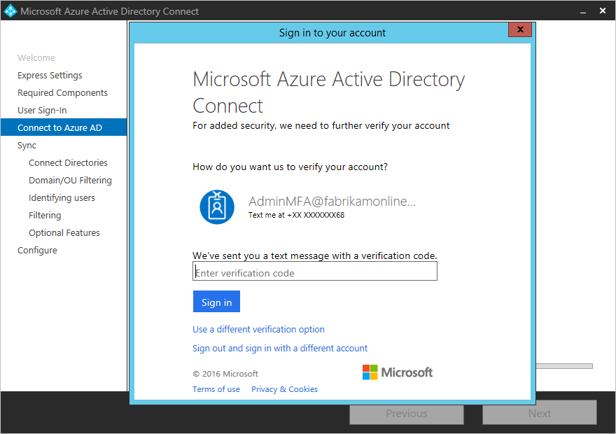
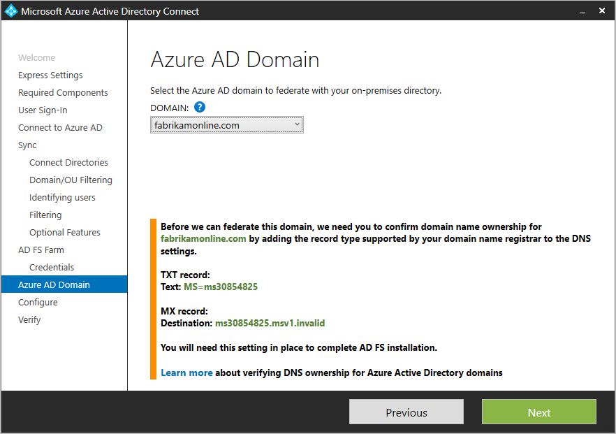

<properties
    pageTitle="Azure AD Connect: Instalação personalizada | Microsoft Azure"
    description="Este documento detalha as opções de instalação personalizada para Azure AD Connect. Use essas instruções para instalar o Active Directory por meio do Azure AD Connect."
    services="active-directory"
    keywords="o que é Azure AD Connect, instale o Active Directory, componentes necessários para Azure AD"
    documentationCenter=""
    authors="andkjell"
    manager="femila"
    editor="curtand"/>

<tags
    ms.service="active-directory"  
    ms.workload="identity"
    ms.tgt_pltfrm="na"
    ms.devlang="na"
    ms.topic="get-started-article"
    ms.date="09/13/2016"
    ms.author="billmath"/>

# Instalação personalizada do Azure AD Connect
Conectar-se de Azure AD **configurações personalizadas** é usada quando você desejar mais opções para a instalação. Ele é usado se você tiver várias florestas ou se você quiser configurar recursos opcionais não cobertos na instalação do express. Ele é usado em todos os casos em que a opção de [**instalação expressa**](active-directory-aadconnect-get-started-express.md) não satisfaz sua implantação ou topologia.

Antes de iniciar a instalação do Azure AD Connect, verifique se a [baixar o Azure AD Connect](http://go.microsoft.com/fwlink/?LinkId=615771) e preencha o pré-requisito etapas no [Azure AD Connect: Hardware e pré-requisitos](../active-directory-aadconnect-prerequisites.md). Verifique também se que você tiver obrigatório contas disponíveis conforme descrito em [permissões e contas do Azure AD Connect](active-directory-aadconnect-accounts-permissions.md).

Se as configurações personalizadas não corresponder a topologia, por exemplo atualizar o DirSync, consulte [relacionados documentação](#related-documentation) para outros cenários.

## Instalação de configurações personalizadas do Azure AD Connect

### Configurações expressas
Nesta página, clique em **Personalizar** para iniciar uma instalação de configurações personalizadas.

### Instalar componentes necessários
Quando você instala os serviços de sincronização, você pode deixar a seção configuração opcional desmarcada e Azure AD Connect configura tudo automaticamente. Define uma instância do SQL Server 2012 Express LocalDB, criar grupos apropriados e atribuir permissões. Se você quiser alterar os padrões, você pode usar a tabela a seguir para entender as opções de configuração opcionais que estão disponíveis.

Configuração opcional  | Descrição
------------- | -------------
Use um SQL Server existente | Permite que você especifique o nome do SQL Server e o nome da instância. Escolha esta opção se você já tiver um servidor de banco de dados que você gostaria de usar. Insira o nome da instância seguido por um vírgula e número da porta no **Nome da instância** se o SQL Server não tiver habilitado de navegação.
Usar uma conta de serviço existente | Por padrão o Azure AD Connect cria uma conta de serviço local para os serviços de sincronização usar. A senha é gerado automaticamente e desconhecido para a pessoa instalando Azure AD Connect. Se você usa um servidor SQL remoto ou usa um proxy que requer autenticação, você precisa de um serviço de conta no domínio e souber a senha. Nesses casos, insira a conta de serviço para usar. Verifique se o usuário executando a instalação é uma SA no SQL para que um logon para a conta de serviço pode ser criado. Consulte [permissões e contas do Azure AD Connect](active-directory-aadconnect-accounts-permissions.md#custom-settings-installation)
Especifique os grupos de sincronização personalizadas | Por padrão Azure AD Connect cria quatro grupos local para o servidor quando os serviços de sincronização estão instalados. Esses grupos são: grupo Administradores, grupo Operadores, grupo de procurar e o grupo de redefinição de senha. Você pode especificar seus próprios grupos aqui. Os grupos devem ser locais no servidor e não podem ser localizados no domínio.

### Acesso do usuário
Depois de instalar os componentes necessários, você será solicitado para selecionar seu usuários logon método único. A tabela a seguir fornece uma breve descrição das opções disponíveis. Para obter uma descrição completa dos métodos entrar, consulte [acesso do usuário](../active-directory-aadconnect-user-signin.md).

Opção de logon único | Descrição
------------- | -------------
Sincronização de senha | Os usuários conseguem entrar para serviços de nuvem da Microsoft, como o Office 365, usando a mesma senha que usam na sua rede local. As senhas de usuários são sincronizadas ao Azure AD como um hash de senha e a autenticação ocorre na nuvem. Consulte a [sincronização de senha](../active-directory-aadconnectsync-implement-password-synchronization.md) para obter mais informações.
Federação com o AD FS | Os usuários conseguem entrar para serviços de nuvem da Microsoft, como o Office 365, usando a mesma senha que usam na sua rede local.  Os usuários são redirecionados para o local do AD FS instância para entrar e autenticação ocorre no local.
Não configurar | Nem o recurso é instalado e configurado. Escolha esta opção se você já tiver um servidor de federação de festa 3º ou outra solução existente no lugar.

### Conectar ao Azure AD
Em conectar à tela do Azure AD, digite uma senha e conta de administrador global. Se você selecionou **a federação com o AD FS** na página anterior, não entre com uma conta em um domínio que você planeja habilitar para federação. Uma recomendação é usar uma conta no domínio **onmicrosoft.com** padrão, que vem com o diretório do Azure AD.

Essa conta é usada apenas para criar uma conta de serviço no Azure AD e não é usada após a conclusão do assistente.  

Se sua conta de administrador global tem MFA habilitado, em seguida, é necessário fornecer a senha novamente no popup entrar e conclua o desafio MFA. O desafio poderia ser uma fornecendo um código de verificação ou uma chamada telefônica.  

A conta de administrador global também pode ter o [Gerenciamento de identidades privilegiados](../active-directory-privileged-identity-management-getting-started.md) habilitado.

Se você recebe um erro e tiver problemas de conectividade, consulte [Solucionar problemas de conectividade](../active-directory-aadconnect-troubleshoot-connectivity.md).

## Páginas sob a seção de sincronização

### Conecte seu diretórios
Para se conectar ao seu serviço de domínio Active Directory, o Azure AD Connect necessidades as credenciais de uma conta com permissões suficientes. Você pode inserir a parte do domínio no formato NetBios ou FQDN, ou seja, FABRIKAM\syncuser ou fabrikam.com\syncuser. Essa conta pode ser uma conta de usuário regular pois precisa apenas as permissões de leitura padrão. No entanto, dependendo do cenário, talvez seja necessário mais permissões. Para obter mais informações, consulte [Azure AD conectar contas e permissões](../active-directory-aadconnect-accounts-permissions.md#create-the-ad-ds-account)

### Azure AD entrar configuração
Esta página permite que você examine os domínios UPN presentes no local AD DS e que foram verificados no Azure AD. Esta página também permite que você configure o atributo para usar para o userPrincipalName.

  
Examine cada domínio marcado **Não adicionado** e **Não verificado**. Certificar-se de que esses domínios que você use foram verificados no Azure AD. Clique no símbolo de atualização quando você verificou seus domínios. Para obter mais informações, consulte [Adicionar e verificar o domínio](../active-directory-add-domain.md)

**UserPrincipalName** - o atributo userPrincipalName é os usuários de atributo usam quando eles entrarem no Azure AD e o Office 365. Os domínios usados, também conhecido como o-sufixo UPN, devem ser verificados no Azure AD antes que os usuários são sincronizados. Recomendamos manter o padrão atributo userPrincipalName. Se esse atributo está não roteáveis e não pode ser verificado, é possível selecionar outro atributo. Por exemplo você pode selecionar email como o atributo mantendo o ID de entrada. Usar outro atributo userPrincipalName é conhecido como **ID alternativa**. O valor do atributo ID alternativa deve acompanhar o padrão de RFC822. Uma ID alternativa pode ser usada com sincronização de senha e federação.

>[AZURE.WARNING]
Usar uma ID alternativa não é compatível com todas as cargas de trabalho do Office 365. Para obter mais informações, consulte [Configurar ID de logon alternativo](https://technet.microsoft.com/library/dn659436.aspx).

### Domínio e filtragem de unidade Organizacional
Por padrão, todos os domínios e unidades organizacionais são sincronizados. Se houver alguns domínios ou unidades organizacionais que você não deseja sincronizar com o Azure AD, você pode desmarcar esses domínios e unidades organizacionais.  
 esta página do assistente está configurando a filtragem baseada em domínio. Para obter mais informações, consulte [filtragem baseada em domínio](../active-directory-aadconnectsync-configure-filtering.md#domain-based-filtering).

Também é possível que alguns domínios não estão acessíveis devido a restrições de firewall. Esses domínios são desmarcados por padrão e tem um aviso.  
  
Se você vir este aviso, certifique-se de que esses domínios são realmente inacessíveis e o aviso é esperado.

### Identifica exclusivamente seus usuários
A correspondência entre o recurso de florestas permite que você defina como os usuários de sua florestas do AD DS são representados no Azure AD. Um usuário ou pode ser representado apenas uma vez em todas as florestas ou ter uma combinação de contas habilitadas e desabilitadas. O usuário também pode ser representado como um contato no algumas florestas.

Configuração | Descrição
------------- | -------------
[Os usuários são representados apenas uma vez todas as florestas](../active-directory-aadconnect-topologies.md#multiple-forests-separate-topologies) | Todos os usuários são criados como objetos individuais no Azure AD. Os objetos não são ingressou no metaverso.
[Atributo de email](../active-directory-aadconnect-topologies.md#multiple-forests-full-mesh-with-optional-galsync) | Esta opção une usuários e contatos, se o atributo de email tem o mesmo valor em diferentes florestas. Use esta opção quando seus contatos foram criados usando GALSync.
[ObjectSID e msExchangeMasterAccountSID / msRTCSIP-OriginatorSid](../active-directory-aadconnect-topologies.md#multiple-forests-account-resource-forest) | Esta opção une um usuário habilitado em uma floresta de conta com um usuário desabilitado em uma floresta do recurso. No Exchange, essa configuração é conhecida como uma caixa de correio vinculada. Esta opção também pode ser usada se você usar somente o Lync e Exchange não está presente na floresta de recursos.
sAMAccountName e MailNickName | Esta opção une em atributos onde ele é esperado que a ID de entrada do usuário pode ser encontrada.
Um atributo específico | Essa opção permite que você selecione seu próprio atributo. **Limitação:** Certifique-se de escolher um atributo que já pode ser encontrado no metaverso. Se você escolher um atributo personalizado (não no metaverso), não é possível concluir o assistente.

**Ancoragem de origem** - sourceAnchor o atributo é um atributo que é imutável durante o ciclo de vida de um objeto de usuário. É a chave primária vinculando o usuário local com o usuário no Azure AD. Como o atributo não pode ser alterado, você deve planejar um bom atributo usar. Uma boa candidata é objectGUID. Esse atributo não é alterado, a menos que a conta de usuário é movida entre florestas/domínios. Em um ambiente de vários floresta onde você move contas entre florestas, outro atributo deve ser usado, como um atributo com employeeID. Evite atributos que seriam alteradas quando combina a uma pessoa ou alterar atribuições. Não é possível usar atributos com um @-sign, para que o email e userPrincipalName não podem ser usados. O atributo também diferencia maiusculas de minúsculas portanto quando você move um objeto entre florestas, certifique-se de preservar maiusculas/minúsculas. Atributos binários são codificado na Base 64, mas outros tipos de atributo permanecem no estado decodificar. Em cenários de Federação e algumas interfaces Azure AD, esse atributo também é conhecido como immutableID. Mais informações sobre a âncora de origem podem ser encontradas nos [conceitos de design](../active-directory-aadconnect-design-concepts.md#sourceAnchor).

### Filtragem de sincronização baseada em grupos
A filtragem em recurso grupos permite que você sincronizar apenas um pequeno subconjunto de objetos para um piloto. Para usar esse recurso, crie um grupo para essa finalidade no seu Active Directory local. Adicione usuários e grupos que devem ser sincronizados ao Azure AD como membros diretos. Posteriormente, você pode adicionar e remover usuários a esse grupo para manter a lista de objetos que devem estar presentes no Azure AD. Todos os objetos que você deseja sincronizar devem ser um membro do grupo direto. Usuários, grupos, contatos e computadores/dispositivos devem ser membro direto. Associação de grupo aninhado não for resolvida. Quando você adicionar um grupo como um membro, somente o grupo em si é adicionado e não por seus membros.

>[AZURE.WARNING]
Este recurso destina-se somente para dar suporte a uma implantação piloto. Não usá-lo em uma implantação de produção completo.

Em uma implantação de produção completo, ele será difícil de manter um único grupo com todos os objetos para sincronizar. Em vez disso, você deve usar um dos métodos na [filtragem de configurar](../active-directory-aadconnectsync-configure-filtering.md).

### Recursos opcionais
Esta tela permite que você selecione os recursos opcionais para seus cenários específicos.

>[AZURE.WARNING]
Se você tiver atualmente DirSync ou Azure AD Sync ativo, não ative os recursos de write-back na Azure AD Connect.

Recursos opcionais | Descrição
------------------- | -------------
Implantação híbrida do Exchange | O recurso de implantação híbrida do Exchange permite a coexistência de caixas de correio do Exchange ambos os locais e no Office 365. Azure AD Connect está sincronizando um conjunto específico de [atributos](../active-directory-aadconnectsync-attributes-synchronized.md#exchange-hybrid-writeback) do Azure AD novamente no seu diretório local.
Aplicativo do Azure AD e filtragem de atributo | Ativando o aplicativo do Azure AD e filtragem de atributo, o conjunto de atributos sincronizados pode ser adaptado. Esta opção adiciona duas páginas de configuração mais com o assistente. Para obter mais informações, consulte [aplicativos do Azure AD e filtragem de atributo](#azure-ad-app-and-attribute-filtering).
Sincronização de senha | Se você selecionou federação como a solução de entrada, você pode habilitar essa opção. Sincronização de senha, em seguida, pode ser usada como uma opção de backup. Para obter informações adicionais, consulte [a sincronização de senha](../active-directory-aadconnectsync-implement-password-synchronization.md).
Write-back de senha | Habilitando write-back de senha, alterações de senha que se originam no Azure AD é gravada seu diretório local. Para obter mais informações, consulte [Introdução ao gerenciamento de senha](../active-directory-passwords-getting-started.md).
Write-back de grupo | Se você usar o recurso de **Grupos do Office 365** , você pode ter esses grupos representados no seu Active Directory local. Essa opção só estará disponível se você tiver o Exchange presente no seu Active Directory local. Para obter mais informações, consulte [Write-back do grupo](../active-directory-aadconnect-feature-preview.md#group-writeback).
Write-back do dispositivo | Permite que você objetos de dispositivo de write-back no Azure AD para seu local Active Directory para cenários de acesso condicional. Para obter mais informações, consulte [Habilitando write-back de dispositivo no Azure AD Connect](../active-directory-aadconnect-feature-device-writeback.md).
Sincronização de atributo de extensão do diretório | Habilitando a sincronização de atributo de extensões do diretório, atributos especificados estão sincronizados com o Azure AD. Para obter mais informações, consulte [extensões de diretório](../active-directory-aadconnectsync-feature-directory-extensions.md).

### Aplicativo do Azure AD e filtragem de atributo
Se você quiser limitar quais atributos para sincronizar com o Azure AD, então comece selecionando os serviços que você está usando. Se você fizer alterações de configuração nesta página, um novo serviço deve ser selecionado explicitamente executando novamente o Assistente de instalação.

Com base em serviços selecionados na etapa anterior, esta página mostra todos os atributos que são sincronizados. Esta lista é uma combinação de todos os tipos de objeto que está sendo sincronizada. Se existem alguns atributos específicos que você precisa não sincronizar, você pode desmarcar esses atributos.

>[AZURE.WARNING]
Removendo atributos pode afetar a funcionalidade. Para obter melhores práticas e recomendações, consulte [os atributos sincronizados](../active-directory-aadconnectsync-attributes-synchronized.md#attributes-to-synchronize).

### Sincronização de atributo de extensão do diretório
Você pode estender o esquema no Azure AD com atributos personalizados adicionados por sua organização ou outros atributos do Active Directory. Para usar esse recurso, selecione **sincronizar de atributo de extensão do diretório** na página **Recursos opcionais** . Você pode selecionar mais atributos sincronizar nesta página.

Para obter mais informações, consulte [extensões de diretório](../active-directory-aadconnectsync-feature-directory-extensions.md).

## Configurar a federação com o AD FS
Configurando o AD FS com o Azure AD Connect é simple com apenas alguns cliques. É necessário o seguinte antes da configuração.

- Um servidor do Windows Server 2012 R2 para o servidor de federação com gerenciamento remoto habilitado
- Um servidor do Windows Server 2012 R2 para o servidor de Proxy de aplicativo Web com gerenciamento remoto habilitado
- Um certificado SSL para o nome do serviço de federação que você pretende usar (por exemplo, sts.contoso.com)

### Pré-requisitos do AD FS configuração
Para configurar seu farm do AD FS usando Azure AD Connect, certifique-se de que WinRM está habilitado nos servidores remotos. Além disso, percorra o requisito de portas listado na [tabela 3 - Azure AD Connect e servidores de Federação/WAP](../active-directory-aadconnect-ports.md#table-3---azure-ad-connect-and-federation-serverswap).

### Criar um novo farm do AD FS ou use um farm existente do AD FS
Você pode usar um farm existente do AD FS ou você pode optar por criar um novo farm do AD FS. Se você optar por criar um novo registro, são necessárias para fornecer o certificado SSL. Se o certificado SSL estiver protegido por senha, você será solicitado a senha.

Se você optar por usar um farm existente do AD FS, você será levado diretamente à relação de confiança entre tela AD FS e Azure AD configurando.

### Especificar os servidores do AD FS
Insira os servidores que você deseja instalar o AD FS no. Você pode adicionar um ou mais servidores com base em sua necessidades de planejamento de capacidade. Ingresse em todos os servidores ao Active Directory antes de realizar essa configuração. A Microsoft recomenda instalando um servidor do AD FS único para implantações de teste e piloto. Em seguida, adicionar e implantar mais servidores para atender às suas necessidades de dimensionamento executando Azure AD Connect novamente após a configuração inicial.

>[AZURE.NOTE]
Certifique-se de que todos os servidores fazem parte de um domínio AD antes de fazer essa configuração.

### Especificar os servidores Proxy de aplicativo Web
Insira os servidores que você deseja definir como seus servidores de proxy de aplicativo Web. O servidor de proxy de aplicativo da web é implantado em sua DMZ (voltado para a extranet) e dá suporte a solicitações de autenticação de extranet. Você pode adicionar um ou mais servidores com base em sua necessidades de planejamento de capacidade. A Microsoft recomenda instalando um servidor de proxy de aplicativo Web único para implantações de teste e piloto. Em seguida, adicionar e implantar mais servidores para atender às suas necessidades de dimensionamento executando Azure AD Connect novamente após a configuração inicial. Recomendamos que você está tendo um número equivalente de servidores proxy para atender a autenticação da intranet.

>[AZURE.NOTE]
<li> Se a conta usada não for um administrador local nos servidores do AD FS, você será solicitado para credenciais de administrador.</li>
<li> Certifique-se de que não há conectividade HTTP/HTTPS entre o servidor do Azure AD Connect e o servidor de Proxy de aplicativo Web antes de executar esta etapa.</li>
<li> Certifique-se de que não há conectividade HTTP/HTTPS entre o servidor de aplicativo da Web e o servidor do AD FS para permitir solicitações de autenticação para fluem.</li>

Você será solicitado a inserir as credenciais para que o servidor de aplicativo da web pode estabelecer uma conexão segura para o servidor do AD FS. Essas credenciais precisam ser um administrador local no servidor do AD FS.

### Especificar a conta de serviço do serviço do AD FS
O serviço do AD FS requer uma conta de serviço de domínio para autenticar usuários e informações de usuário de pesquisa no Active Directory. Ele pode oferecer suporte a dois tipos de contas de serviço:

- **Conta de serviço do grupo gerenciado** - introduzido nos serviços de domínio Active Directory com o Windows Server 2012. Esse tipo de conta fornece serviços, como o AD FS, uma única conta sem precisar atualizar a senha da conta regularmente. Use esta opção se você já tiver controladores de domínio do Windows Server 2012 no domínio de que seus servidores do AD FS pertencem.
- **Conta de usuário de domínio** - este tipo de conta requer que você forneça uma senha e regularmente atualizar a senha quando a senha for alterada ou expira. Use essa opção somente quando você não tem controladores de domínio do Windows Server 2012 no domínio de que seus servidores do AD FS pertencem.

Se você selecionou a conta de serviço gerenciada grupo e esse recurso nunca tenha sido usado no Active Directory, você será solicitado para credenciais de administrador da empresa. Essas credenciais são usadas para iniciar o armazenamento de chaves e habilitar o recurso do Active Directory.

### Selecione o domínio do Azure AD que você deseja agrupar
Esta configuração é usada para configurar a relação de federação entre AD FS e Azure AD. Ele configura o AD FS tokens de segurança de problema ao Azure AD e configura Azure AD para confiar os tokens dessa instância específica do AD FS. Esta página permite somente configurar um domínio único na instalação inicial. Você pode configurar mais domínios posterior executando Azure AD Connect novamente.

### Verificar o domínio do Azure AD selecionado para a federação
Quando você seleciona o domínio seja federado, Azure AD Connect oferece informações necessárias para verificar um domínio não verificado. Consulte [Adicionar e verificar o domínio](../active-directory-add-domain.md) de como usar essas informações.

>[AZURE.NOTE]
AD Connect tenta verificar o domínio durante o estágio de configurar. Se você continuar a configurar sem adicionar os registros DNS necessários, o assistente não é capaz de concluir a configuração.

## Configurar e verificar páginas
A configuração acontece nesta página.

>[AZURE.NOTE]
Antes de continuar instalação e se você configurou federação, certifique-se de que você tenha configurado a [resolução de nomes de servidores de Federação](../active-directory-aadconnect-prerequisites.md#name-resolution-for-federation-servers).

### Modo de teste
É possível configurar um novo servidor de sincronização em paralelo com o modo de teste. Só há suporte para ter um servidor de sincronização exportando para um diretório na nuvem. Mas se você quiser mover de outro servidor, por exemplo um DirSync de em execução, em seguida, você pode habilitar Azure AD Connect no modo de teste. Quando habilitada, o mecanismo de sincronização importar e sincronizar dados como normal, mas ele não exporta nada no Azure anúncio ou. O recursos senha sincronização e senha write-back estão desabilitados enquanto estiver no modo de teste.

No modo de teste, é possível fazer as alterações necessárias para o mecanismo de sincronização e revise o que está prestes a ser exportado. Quando a configuração gostar, execute o Assistente de instalação novamente e desativar o modo de teste. Agora, os dados são exportados para o Azure AD deste servidor. Certifique-se desabilitar o outro servidor ao mesmo tempo somente um servidor ativamente está exportando.

Para obter mais informações, consulte [modo de teste](../active-directory-aadconnectsync-operations.md#staging-mode).

### Verificar sua configuração de Federação
Azure AD Connect verifica as configurações de DNS para você quando você clica no botão Verificar.

Além disso, execute as etapas de verificação a seguir:

- Validar que você pode entrar usando um navegador de uma máquina unidas de domínio na intranet: conectar ao https://myapps.microsoft.com e verifique se a entrar com sua conta de login. A conta de administrador interna do AD DS não está sincronizada e não pode ser usada para verificação.
- Valide que você pode entrar em um dispositivo de extranet. Em um computador doméstico ou um dispositivo móvel, conectar-se a https://myapps.microsoft.com e forneça suas credenciais.
- Valide entrada no cliente avançado. Conectar-se a https://testconnectivity.microsoft.com, escolha a guia do **Office 365** e escolher o **Office 365 Single Sign-On teste**.

## Próximas etapas
Após a conclusão da instalação, sair e entrar novamente para Windows antes de usar o Gerenciador de serviço de sincronização ou Editor de regras de sincronização.

Agora que você tem Azure AD Connect instalado, você pode [Verificar a instalação e atribuir licenças](../active-directory-aadconnect-whats-next.md).

Saiba mais sobre esses recursos, que foram habilitados com a instalação: [acidental impedir exclusões](../active-directory-aadconnectsync-feature-prevent-accidental-deletes.md) e [Azure AD conectar integridade](../active-directory-aadconnect-health-sync.md).

Saiba mais sobre esses tópicos comuns: [Agendador e como disparar sincronização](../active-directory-aadconnectsync-feature-scheduler.md).

Saiba mais sobre como [integrar suas identidades do local com o Active Directory do Azure](../active-directory-aadconnect.md).

## Documentação relacionada

Tópico |  
--------- | ---------
Visão geral do Azure AD Connect | [Integração suas identidades do local com o Active Directory do Azure](../active-directory-aadconnect.md)
Instalar usando configurações Express | [Instalação expressa do Azure AD Connect](active-directory-aadconnect-get-started-express.md)
Atualização de DirSync | [Atualização da ferramenta de sincronização do Azure AD (DirSync)](active-directory-aadconnect-dirsync-upgrade-get-started.md)
Contas usadas para a instalação | [Mais informações sobre permissões e contas do Azure AD Connect](active-directory-aadconnect-accounts-permissions.md)
