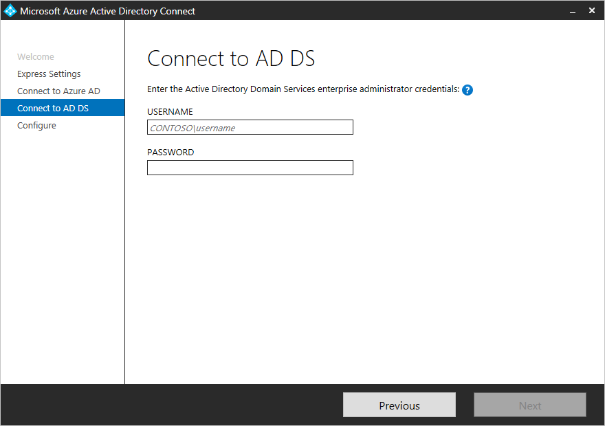

<properties
    pageTitle="Azure AD Connect: Introdução usando configurações expressas | Microsoft Azure"
    description="Saiba como baixar, instalar e executar o Assistente de configuração do Azure AD Connect."
    services="active-directory"
    documentationCenter=""
    authors="andkjell"
    manager="femila"
    editor="curtand"/>

<tags
    ms.service="active-directory"
    ms.workload="identity"
    ms.tgt_pltfrm="na"
    ms.devlang="na"
    ms.topic="get-started-article"
    ms.date="09/13/2016"
    ms.author="billmath"/>

# Introdução ao Azure AD Connect usando configurações express
Conectar-se de Azure AD **Configurações expressas** é usada quando você tem uma topologia de floresta e a [sincronização de senha](../active-directory-aadconnectsync-implement-password-synchronization.md) para autenticação. **Configurações expressas** é a opção padrão e é usado para o cenário mais implantado. Você está apenas alguns cliques curtos ausente para estender seu diretório local para a nuvem.

Antes de iniciar a instalação do Azure AD Connect, verifique se a [baixar o Azure AD Connect](http://go.microsoft.com/fwlink/?LinkId=615771) e preencha o pré-requisito etapas no [Azure AD Connect: Hardware e pré-requisitos](../active-directory-aadconnect-prerequisites.md).

Se configurações expressas não corresponder a topologia, consulte a [documentação relacionada](#related-documentation) para outros cenários.

## Instalação expressa do Azure AD Connect
Você pode ver estas etapas em ação na seção [vídeos](#videos) .

1. Entrar como um administrador local no servidor que você deseja instalar o Azure AD Connect em. Você deve fazer isso no servidor que você deseja ser o servidor de sincronização.
2. Navegue até e clique duas vezes em **AzureADConnect.msi**.
3. Na tela de boas-vindas, marque a caixa concordar com os termos de licenciamento e clique em **continuar**.  
4. Na tela de configurações do Express, clique em **usar configurações express**.  

5. Em conectar à tela do Azure AD, insira o nome de usuário e senha de administrador global para seu Azure AD. Clique em **Avançar**.  
 se você recebe um erro e tiver problemas de conectividade, consulte [Solucionar problemas de conectividade](../active-directory-aadconnect-troubleshoot-connectivity.md).
6. Em conectar à tela de AD DS, insira o nome de usuário e senha para uma conta de administrador da empresa. Você pode inserir a parte do domínio no formato NetBios ou FQDN, ou seja, FABRIKAM\administrator ou fabrikam.com\administrator. Clique em **Avançar**.  

7. A página de [**configuração de entrada do Azure AD**](../active-directory-aadconnect-user-signin.md#azure-ad-sign-in-configuration) mostra somente se você não tiver concluído a [verificar seus domínios](../active-directory-add-domain.md) nos [pré-requisitos](../active-directory-aadconnect-prerequisites.md).
  
Se você vir esta página, em seguida, examine cada domínio marcado **Não adicionado** e **Não verificado**. Certificar-se de que esses domínios que você use foram verificados no Azure AD. Clique no símbolo de atualização quando você verificou seus domínios.
8. Em pronto para configurar a tela, clique em **instalar**.
    - Opcionalmente, na pronto para Configurar página, você pode desmarcar a caixa de seleção **Iniciar o processo de sincronização assim que conclui de configuração** . Você deve desmarcar esta caixa de seleção se quiser fazer configurações adicionais, como [filtragem](../active-directory-aadconnectsync-configure-filtering.md). Se você desmarcar esta opção, o assistente configura sincronização, mas deixa o Agendador desabilitado. Ele não é executado até você ativá-la manualmente executando [novamente o Assistente de instalação](../active-directory-aadconnectsync-installation-wizard.md).
    - Se você tiver o Exchange no seu Active Directory local, em seguida, você também tem uma opção para habilitar a [**implantação híbrida do Exchange**](https://technet.microsoft.com/library/jj200581.aspx). Habilite essa opção se você planeja ter caixas de correio do Exchange tanto na nuvem e local ao mesmo tempo.

9. Ao concluir a instalação, clique em **Sair**.
10. Após a conclusão da instalação, aprovar e entre novamente antes de usar o Gerenciador de serviço de sincronização ou Editor de regras de sincronização.

## Vídeos

Para obter um vídeo sobre como usar a instalação expressa, consulte:

>[AZURE.VIDEO azure-active-directory-connect-express-settings]

## Próximas etapas
Agora que você tem Azure AD Connect instalado, você pode [Verificar a instalação e atribuir licenças](../active-directory-aadconnect-whats-next.md).

Saiba mais sobre esses recursos, que foram habilitados com a instalação: [Azure AD conectar integridade](../active-directory-aadconnect-health-sync.md), [acidental impedir exclusões](../active-directory-aadconnectsync-feature-prevent-accidental-deletes.md)e [atualização automática](../active-directory-aadconnect-feature-automatic-upgrade.md).

Saiba mais sobre esses tópicos comuns: [Agendador e como disparar sincronização](../active-directory-aadconnectsync-feature-scheduler.md).

Saiba mais sobre como [integrar suas identidades do local com o Active Directory do Azure](../active-directory-aadconnect.md).

## Documentação relacionada

Tópico |  
--------- | ---------
Visão geral do Azure AD Connect | [Integração suas identidades do local com o Active Directory do Azure](../active-directory-aadconnect.md)
Instalar usando configurações personalizadas | [Instalação personalizada do Azure AD Connect](active-directory-aadconnect-get-started-custom.md)
Atualização de DirSync | [Atualização da ferramenta de sincronização do Azure AD (DirSync)](active-directory-aadconnect-dirsync-upgrade-get-started.md)
Contas usadas para a instalação | [Mais informações sobre permissões e contas do Azure AD Connect](active-directory-aadconnect-accounts-permissions.md)
