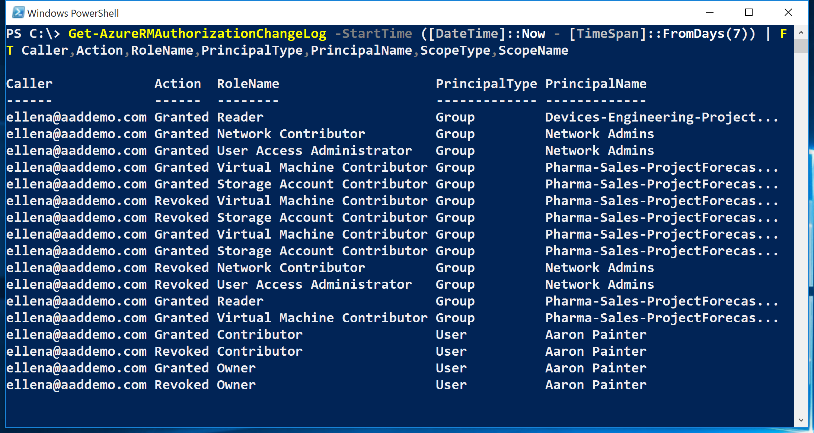

<properties
    pageTitle="Criar um relatório de histórico de alteração do access | Microsoft Azure"
    description="Gere um relatório que lista todas as alterações no acesso a suas assinaturas Azure com controle de acesso baseado em função nos últimos 90 dias."
    services="active-directory"
    documentationCenter=""
    authors="kgremban"
    manager="femila"
    editor=""/>

<tags
    ms.service="active-directory"
    ms.devlang="na"
    ms.topic="article"
    ms.tgt_pltfrm="na"
    ms.workload="identity"
    ms.date="08/03/2016"
    ms.author="kgremban"/>

# <a name="create-an-access-change-history-report"></a>Criar um relatório de histórico de alteração do access

Sempre que alguém concede ou revoga acesso dentro de suas assinaturas, as alterações obtém conectadas eventos Azure. Você pode criar relatórios de histórico de alteração do access para ver todas as alterações de últimos 90 dias.

## <a name="create-a-report-with-azure-powershell"></a>Criar um relatório com o PowerShell do Azure
Para criar um relatório de histórico de alteração do access no PowerShell, use o `Get-AzureRMAuthorizationChangeLog` comando. Mais detalhes sobre esse cmdlet estão disponíveis na [Galeria do PowerShell](https://www.powershellgallery.com/packages/AzureRM.Storage/1.0.6/Content/ResourceManagerStartup.ps1).

Quando você chamar esse comando, você pode especificar qual propriedade das atribuições desejado na lista, incluindo o seguinte:

| Propriedade | Descrição |
| -------- | ----------- |
| **Ação** | Se o acesso foi concedido ou revogado |
| **Chamador** | O proprietário responsável para que a alteração de acesso |
| **Data** | A data e a hora em que o access foi alterado |
| **DirectoryName** | O diretório do Active Directory do Azure |
| **PrincipalName** | O nome do usuário, grupo ou aplicativo |
| **PrincipalType** | Se a atribuição foi para um usuário, grupo ou aplicativo |
| **RoleId** | GUID da função que foi concedida ou revogada |
| **Nome de função** | A função que foi concedida ou revogada |
| **Nome_do_escopo** | O nome da assinatura, grupo de recursos ou recurso |
| **ScopeType** | Se a atribuição foi na assinatura, o grupo de recursos ou o escopo do recurso |
| **SubscriptionId** | GUID da assinatura do Azure |
| **Nome de inscrição** | O nome da assinatura do Azure |

Este exemplo de comando lista todas as alterações de acesso na assinatura para últimos sete dias:

```
Get-AzureRMAuthorizationChangeLog -StartTime ([DateTime]::Now - [TimeSpan]::FromDays(7)) | FT Caller,Action,RoleName,PrincipalType,PrincipalName,ScopeType,ScopeName
```



## <a name="create-a-report-with-azure-cli"></a>Criar um relatório com CLI do Azure
Para criar um relatório de histórico de alteração do access na interface do Azure de linha de comando (CLI), use o `azure role assignment changelog list` comando.

## <a name="export-to-a-spreadsheet"></a>Exportar para uma planilha
Para salvar o relatório ou manipular os dados, exporte as alterações de acesso em um arquivo. csv. Você pode exibir o relatório em uma planilha para revisão.


## <a name="see-also"></a>Consulte também
- Introdução ao [Controle de acesso de Azure Role-Based](role-based-access-control-configure.md)
- Trabalhar com [funções personalizadas no Azure RBAC](role-based-access-control-custom-roles.md)
