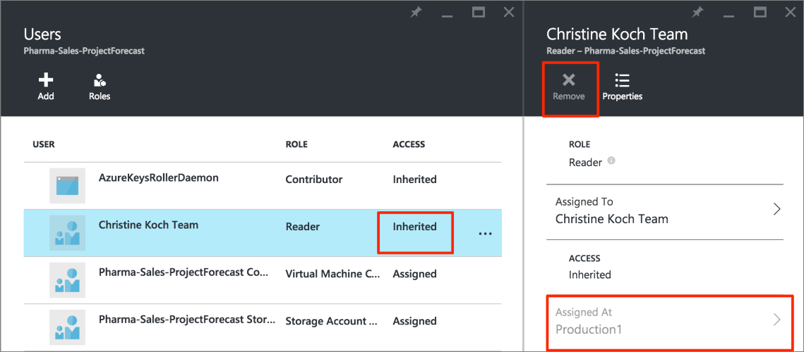

<properties
    pageTitle="Use o controle de acesso baseado em função no portal do Azure | Microsoft Azure"
    description="Introdução no gerenciamento de acesso ao controle de acesso baseado em função no Portal do Azure. Use atribuições de função para atribuir permissões a seus recursos."
    services="active-directory"
    documentationCenter=""
    authors="kgremban"
    manager="femila"
    editor=""/>

<tags
    ms.service="active-directory"
    ms.devlang="na"
    ms.topic="get-started-article"
    ms.tgt_pltfrm="na"
    ms.workload="identity"
    ms.date="10/10/2016"
    ms.author="kgremban"/>

# Use atribuições de função para gerenciar o acesso aos recursos da sua assinatura do Azure

> [AZURE.SELECTOR]
- [Gerenciar o acesso por usuário ou grupo](role-based-access-control-manage-assignments.md)
- [Gerenciar o acesso por recurso](role-based-access-control-configure.md)

Azure controle de acesso baseado em função (RBAC) permite o gerenciamento de acesso refinados para Azure. Usando RBAC, você pode conceder somente a quantidade de acesso que os usuários precisam para realizar seus trabalhos. Este artigo ajuda você a começar a trabalhar com RBAC no portal do Azure. Se desejar mais detalhes sobre como o RBAC ajuda você a gerenciar o acesso, consulte [o que é o controle de acesso baseado em função](role-based-access-control-what-is.md).

## Acesso de modo de exibição
Você pode ver quem tem acesso a um recurso, grupo de recursos ou assinatura da sua lâmina principal no [portal do Azure](https://portal.azure.com). Por exemplo, queremos ver quem tem acesso a um dos nossos grupos de recursos:

1. Selecione **grupos de recursos** na barra de navegação à esquerda.  
    
2. Selecione o nome do grupo de recursos da lâmina **grupos de recursos** .
3. Selecione o **controle de acesso (IAM)** no menu à esquerda.  
4. A lâmina de controle de acesso lista todos os usuários, grupos e aplicativos que possui acesso ao grupo de recursos.  

    

Observe que alguns usuários foram **atribuídas** acessar enquanto outros **herdadas** -lo. Acesso seja atribuído especificamente para o grupo de recursos ou herdado de uma atribuição à assinatura pai.

> [AZURE.NOTE] Administradores de assinatura clássico e administradores de co são considerados proprietários da assinatura no novo modelo de RBAC.

## Adicionar acesso
Conceder acesso a partir de dentro do recurso, grupo de recursos ou assinatura que é o escopo da atribuição de função.

1. Selecione **Adicionar** a lâmina de controle de acesso.  
2. Selecione a função que você deseja atribuir da lâmina **Selecione uma função** .
3. Selecione o usuário, o grupo ou o aplicativo no diretório que você deseja conceder acesso a. Você pode pesquisar o diretório com os identificadores de objeto, endereços de email e nomes para exibição.  

    

4. Selecione **Okey** para criar a atribuição. Pop-up do **usuário adicionando** rastreia o progresso.  
    

Depois de adicionar com êxito uma atribuição de função, ele aparecerá na lâmina **usuários** .

## Remover acesso

1. Selecione a atribuição de função na lâmina de controle de acesso.
2. Selecione **Remover** a lâmina de detalhes da atribuição.  
3. Selecione **Sim** para confirmar a remoção.  
    

Atribuições herdadas não podem ser removidas. Na imagem abaixo, observe que o botão Remover estiver desabilitado. Em vez disso, examine os detalhes **Atribuídos em** . Vá para o recurso listado lá para remover a atribuição de função.

## Outras ferramentas para gerenciar o acesso
Você pode atribuir funções e gerenciar o acesso com comandos do Azure RBAC nas ferramentas diferente de portal do Azure.  Siga os links para saber mais sobre os pré-requisitos e começar a usar os comandos de RBAC do Azure.

- [PowerShell Azure](role-based-access-control-manage-access-powershell.md)
- [Interface de linha de comando Azure](role-based-access-control-manage-access-azure-cli.md)
- [API REST](role-based-access-control-manage-access-rest.md)

## Próximas etapas
- [Criar um relatório de histórico de alteração do access](role-based-access-control-access-change-history-report.md)
- Ver as [funções internas RBAC](role-based-access-built-in-roles.md)
- Definir suas próprias [funções personalizadas no Azure RBAC](role-based-access-control-custom-roles.md)
