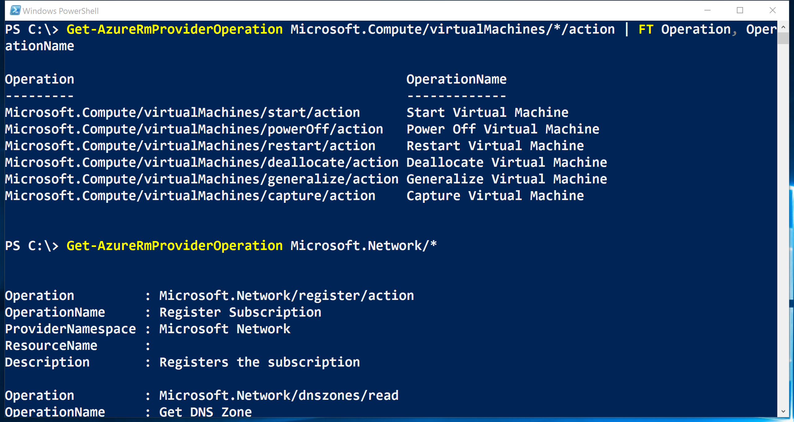
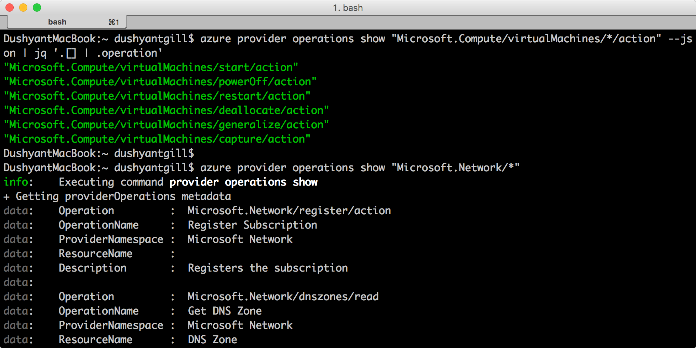

<properties
    pageTitle="Funções personalizadas RBAC Azure | Microsoft Azure"
    description="Aprenda a definir funções personalizadas com controle de acesso de Azure Role-Based para gerenciamento de identidades mais preciso em sua assinatura do Azure."
    services="active-directory"
    documentationCenter=""
    authors="kgremban"
    manager="kgremban"
    editor=""/>

<tags
    ms.service="active-directory"
    ms.devlang="na"
    ms.topic="article"
    ms.tgt_pltfrm="na"
    ms.workload="identity"
    ms.date="07/25/2016"
    ms.author="kgremban"/>


# <a name="custom-roles-in-azure-rbac"></a>Funções personalizadas RBAC Azure


Crie uma função personalizada no controle de acesso de Azure Role-Based (RBAC) se nenhuma das funções internas atender suas necessidades de acesso específico. Funções personalizadas podem ser criadas usando o [PowerShell do Azure](role-based-access-control-manage-access-powershell.md), de [Interface de linha de comando do Azure](role-based-access-control-manage-access-azure-cli.md) () e a [API REST](role-based-access-control-manage-access-rest.md). Assim como funções internas, funções personalizadas podem ser atribuídas a usuários, grupos e aplicativos de assinatura, de grupo de recursos e escopos do recurso. Funções personalizadas são armazenadas em um locatário do Azure AD e podem ser compartilhadas entre todas as assinaturas que usam locatário como o diretório do Azure AD para o subsciption.

Este é um exemplo de uma função personalizada para monitoramento e reinicialização máquinas virtuais:

```
{
  "Name": "Virtual Machine Operator",
  "Id": "cadb4a5a-4e7a-47be-84db-05cad13b6769",
  "IsCustom": true,
  "Description": "Can monitor and restart virtual machines.",
  "Actions": [
    "Microsoft.Storage/*/read",
    "Microsoft.Network/*/read",
    "Microsoft.Compute/*/read",
    "Microsoft.Compute/virtualMachines/start/action",
    "Microsoft.Compute/virtualMachines/restart/action",
    "Microsoft.Authorization/*/read",
    "Microsoft.Resources/subscriptions/resourceGroups/read",
    "Microsoft.Insights/alertRules/*",
    "Microsoft.Insights/diagnosticSettings/*",
    "Microsoft.Support/*"
  ],
  "NotActions": [

  ],
  "AssignableScopes": [
    "/subscriptions/c276fc76-9cd4-44c9-99a7-4fd71546436e",
    "/subscriptions/e91d47c4-76f3-4271-a796-21b4ecfe3624",
    "/subscriptions/34370e90-ac4a-4bf9-821f-85eeedeae1a2"
  ]
}
```
## <a name="actions"></a>Ações
A propriedade de **ações** de uma função personalizada especifica as operações Azure ao qual a função concede acesso. É uma coleção de cadeias de caracteres de operação que identificam as operações de protegíveis dos provedores de recursos Azure. Cadeias de caracteres de operação que contêm caracteres curinga (\*) conceder acesso a todas as operações que correspondem a cadeia de caracteres de operação. Por exemplo:

-   `*/read`concede acesso a operações para todos os tipos de recursos de todos os provedores de recurso Azure de leitura.
-   `Microsoft.Network/*/read`concede acesso a leitura operações para todos os tipos de recursos no provedor de recursos de Microsoft.Network do Azure.
-   `Microsoft.Compute/virtualMachines/*`concede acesso a todas as operações de máquinas virtuais e seu filho tipos de recursos.
-   `Microsoft.Web/sites/restart/Action`concede acesso a sites de reiniciar.

Use `Get-AzureRmProviderOperation` (no PowerShell) ou `azure provider operations show` (no Azure CLI) para operações de lista de provedores de recursos Azure. Você também pode usar esses comandos para verificar se uma cadeia de caracteres de operação é válida e para expandir cadeias de caracteres curinga operação.

```
Get-AzureRMProviderOperation Microsoft.Compute/virtualMachines/*/action | FT Operation, OperationName

Get-AzureRMProviderOperation Microsoft.Network/*
```



```
azure provider operations show "Microsoft.Compute/virtualMachines/*/action" --js on | jq '.[] | .operation'

azure provider operations show "Microsoft.Network/*"
```



## <a name="notactions"></a>NotActions
Use a propriedade **NotActions** se o conjunto de operações que você deseja permitir com mais facilidade definido pelo excluindo operações restritas. O acesso concedido por uma função personalizada é calculado subtraindo as operações de **NotActions** entre as operações de **ações** .

> [AZURE.NOTE] Se um usuário é atribuído a uma função que exclui uma operação de **NotActions**e é atribuída a uma segunda função que concede acesso à mesma operação, o usuário terá permissão para executar essa operação. **NotActions** não é uma regra de negar – é simplesmente uma maneira conveniente de criar um conjunto de operações permitidas quando operações específicas precisam ser excluídas.

## <a name="assignablescopes"></a>AssignableScopes
A propriedade **AssignableScopes** da função personalizada especifica os escopos (assinaturas, grupos de recursos ou recursos) no qual a função personalizada está disponível para atribuição. Você pode fazer com que a função personalizada disponíveis para atribuição no apenas as assinaturas ou grupos de recursos que exigem e não bagunçar experiência do usuário para o restante das assinaturas ou grupos de recursos.

Exemplos de escopos transferível válidos incluem:

-   "/ assinaturas/c276fc76-9cd4-44c9-99a7-4fd71546436e", "/ assinaturas/e91d47c4-76f3-4271-a796-21b4ecfe3624" - torna a função disponíveis para atribuição nas duas assinaturas.
-   "/ assinaturas/c276fc76-9cd4-44c9-99a7-4fd71546436e" - torna a função disponíveis para atribuição em uma única assinatura.
-  "/ assinaturas/c276fc76-9cd4-44c9-99a7-4fd71546436e/resourceGroups/rede" - faz com que a função disponíveis para atribuição somente no grupo de recursos de rede.

> [AZURE.NOTE] Você deve usar pelo menos uma assinatura, grupo de recursos ou identificação do recurso.

## <a name="custom-roles-access-control"></a>Controle de acesso de funções personalizadas
A propriedade **AssignableScopes** da função personalizada também controla quem pode exibir, modificar e excluir a função.

- Quem pode criar uma função personalizada?
    Proprietários (e administradores de acesso do usuário) das assinaturas, grupos de recursos e recursos podem criar funções personalizadas para uso nesses escopos.
    O usuário que está criando a função precisa ser capaz de executar `Microsoft.Authorization/roleDefinition/write` operação em todos os **AssignableScopes** da função.

- Quem pode modificar uma função personalizada?
    Proprietários (e administradores de acesso do usuário) das assinaturas, grupos de recursos e recursos podem modificar funções personalizadas nesses escopos. Os usuários precisam ser capazes de executar o `Microsoft.Authorization/roleDefinition/write` operação em todos os **AssignableScopes** de uma função personalizada.

- Quem pode exibir funções personalizadas?
    Todas as funções internas no Azure RBAC permitem a visualização de funções que estão disponíveis para atribuição. Os usuários que podem realizar a `Microsoft.Authorization/roleDefinition/read` operação em um escopo pode exibir as funções RBAC que estão disponíveis para atribuição no escopo.

## <a name="see-also"></a>Consulte também
- [Controle de acesso com base em função](role-based-access-control-configure.md): Introdução ao RBAC no portal do Azure.
- Saiba como gerenciar o acesso com:
    - [PowerShell](role-based-access-control-manage-access-powershell.md)
    - [CLI Azure](role-based-access-control-manage-access-azure-cli.md)
    - [API REST](role-based-access-control-manage-access-rest.md)
- [Funções internas](role-based-access-built-in-roles.md): obter detalhes sobre as funções que vêm padrão na RBAC.
