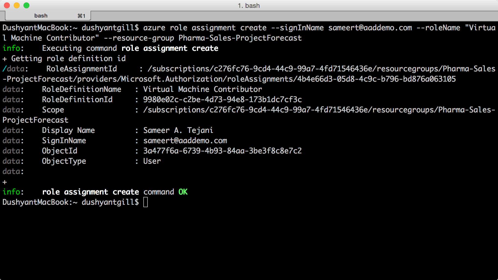
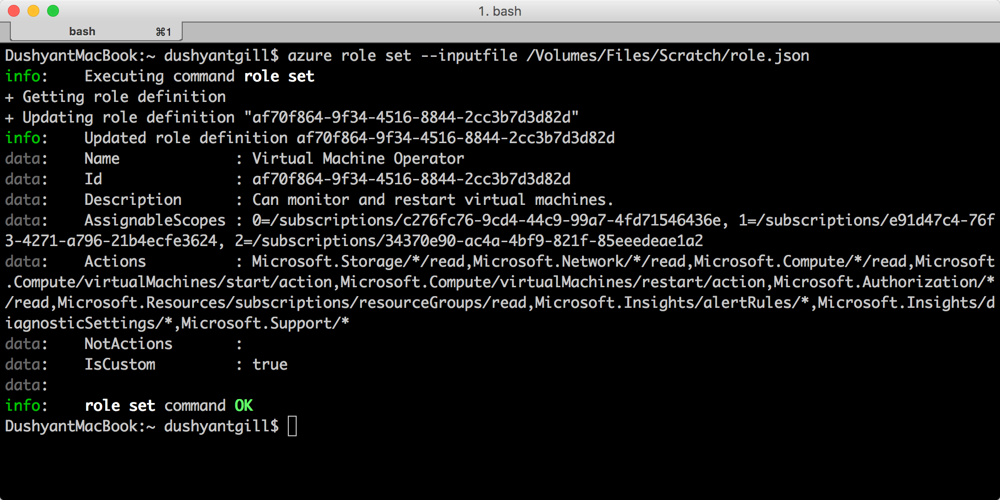

<properties
    pageTitle="Gerenciar o controle de acesso baseado em função (RBAC) com CLI Azure | Microsoft Azure"
    description="Saiba como gerenciar baseado em função RBAC (Access Control) com a interface de linha Azure listando funções e ações de função e atribuindo funções aos escopos de assinatura e aplicativo."
    services="active-directory"
    documentationCenter=""
    authors="kgremban"
    manager="femila"
    editor=""/>

<tags
    ms.service="active-directory"
    ms.devlang="na"
    ms.topic="article"
    ms.tgt_pltfrm="na"
    ms.workload="identity"
    ms.date="07/22/2016"
    ms.author="kgremban"/>

# <a name="manage-role-based-access-control-with-the-azure-command-line-interface"></a>Gerenciar o controle de acesso baseado em função com a interface de linha de comando do Azure

> [AZURE.SELECTOR]
- [PowerShell](role-based-access-control-manage-access-powershell.md)
- [CLI Azure](role-based-access-control-manage-access-azure-cli.md)
- [API REST](role-based-access-control-manage-access-rest.md)

Você pode usar o controle de acesso baseado em função (RBAC) no portal do Azure e API de Gerenciador de recursos do Azure para gerenciar o acesso à sua assinatura e recursos em um nível refinado. Com esse recurso, você pode conceder acesso para usuários, grupos ou objetos de serviço do Active Directory atribuindo algumas funções-los em um escopo específico.

Antes de poder usar a interface de linha Azure (comando) para gerenciar RBAC, você deve ter o seguinte:

- Azure CLI versão 0.8.8 ou posterior. Para instalar a versão mais recente e associá-lo a sua assinatura do Azure, consulte [instalar e configurar o CLI do Azure](../xplat-cli-install.md).
- Gerenciador de recursos do Azure em CLI Azure. Acesse [utilizando a CLI Azure com o Gerenciador de recursos](../xplat-cli-azure-resource-manager.md) para obter mais detalhes.

## <a name="list-roles"></a>Funções de lista

### <a name="list-all-available-roles"></a>Lista todas as funções disponíveis
Para listar todas as funções disponíveis, use:

        azure role list

O exemplo a seguir mostra a lista de *todas as funções disponíveis*.

```
azure role list --json | jq '.[] | {"roleName":.properties.roleName, "description":.properties.description}'
```


### <a name="list-actions-of-a-role"></a>Ações de lista de uma função
Para listar as ações de uma função, use:

    azure role show "<role name>"

O exemplo a seguir mostra as ações das funções de *colaboradores* e *Colaboradores de máquina Virtual* .

```
azure role show "contributor" --json | jq '.[] | {"Actions":.properties.permissions[0].actions,"NotActions":properties.permissions[0].notActions}'

azure role show "virtual machine contributor" --json | jq '.[] | .properties.permissions[0].actions'
```


##  <a name="list-access"></a>Acesso de lista
### <a name="list-role-assignments-effective-on-a-resource-group"></a>Atribuições de função de lista eficaz em um grupo de recursos
Para listar as atribuições de funções que existe em um grupo de recursos, use:

    azure role assignment list --resource-group <resource group name>

O exemplo a seguir mostra as atribuições de função no grupo *pharma-vendas-projecforcast* .

```
azure role assignment list --resource-group pharma-sales-projecforcast --json | jq '.[] | {"DisplayName":.properties.aADObject.displayName,"RoleDefinitionName":.properties.roleName,"Scope":.properties.scope}'
```


### <a name="list-role-assignments-for-a-user"></a>Lista de atribuições de função de um usuário
Para listar as atribuições de funções para um usuário específico e as atribuições que são atribuídas a grupos de um usuário, use:

    azure role assignment list --signInName <user email>

Você também pode ver atribuições de função que são herdadas de grupos modificando o comando:

    azure role assignment list --expandPrincipalGroups --signInName <user email>

O exemplo a seguir mostra as atribuições de funções concedidas ao *sameert@aaddemo.com* usuário. Isso inclui funções que estejam atribuídas diretamente para o usuário e funções que são herdadas de grupos.

```
azure role assignment list --signInName sameert@aaddemo.com --json | jq '.[] | {"DisplayName":.properties.aADObject.DisplayName,"RoleDefinitionName":.properties.roleName,"Scope":.properties.scope}'

azure role assignment list --expandPrincipalGroups --signInName sameert@aaddemo.com --json | jq '.[] | {"DisplayName":.properties.aADObject.DisplayName,"RoleDefinitionName":.properties.roleName,"Scope":.properties.scope}'
```


##  <a name="grant-access"></a>Conceder acesso
Para conceder acesso depois de ter identificado a função que você deseja atribuir, use:

    azure role assignment create

### <a name="assign-a-role-to-group-at-the-subscription-scope"></a>Atribuir uma função a grupo no escopo assinatura
Para atribuir uma função a um grupo no escopo assinatura, use:

    azure role assignment create --objectId  <group object id> --roleName <name of role> --subscription <subscription> --scope <subscription/subscription id>

O exemplo a seguir atribui a função de *leitor* a *equipe de Christine Koch* o escopo de *assinatura* .


### <a name="assign-a-role-to-an-application-at-the-subscription-scope"></a>Atribuir uma função a um aplicativo no escopo de assinatura
Para atribuir uma função a um aplicativo no escopo de assinatura, use:

    azure role assignment create --objectId  <applications object id> --roleName <name of role> --subscription <subscription> --scope <subscription/subscription id>

O exemplo a seguir concede a função *Colaborador* para um aplicativo do *Azure AD* na assinatura selecionada.

 

### <a name="assign-a-role-to-a-user-at-the-resource-group-scope"></a>Atribuir uma função a um usuário no escopo do grupo de recursos
Para atribuir uma função a um usuário no escopo do grupo de recursos, use:

    azure role assignment create --signInName  <user email address> --roleName "<name of role>" --resourceGroup <resource group name>

O exemplo a seguir concede a função *Colaborador de máquina Virtual* *samert@aaddemo.com* usuário ao escopo do grupo de recursos *Pharma-vendas-ProjectForcast* .



### <a name="assign-a-role-to-a-group-at-the-resource-scope"></a>Atribuir uma função a um grupo no escopo do recurso
Para atribuir uma função a um grupo no escopo de recurso, use:

    azure role assignment create --objectId <group id> --role "<name of role>" --resource-name <resource group name> --resource-type <resource group type> --parent <resource group parent> --resource-group <resource group>

O exemplo a seguir concede a função *Colaborador de máquina Virtual* a um grupo do *Azure AD* em uma *sub-rede*.


##  <a name="remove-access"></a>Remover acesso
Para remover uma atribuição de função, use:

    azure role assignment delete --objectId <object id to from which to remove role> --roleName "<role name>"

O exemplo a seguir remove a atribuição de função de *Colaborador de máquina Virtual* do *sammert@aaddemo.com* usuário no grupo de recursos *Pharma-vendas-ProjectForcast* .
O exemplo, em seguida, remove a atribuição de função de um grupo com assinaturas.


## <a name="create-a-custom-role"></a>Crie uma função personalizada
Para criar uma função personalizada, use:

    azure role create --inputfile <file path>

O exemplo a seguir cria uma função personalizada denominada *Operadora de máquina Virtual*. A função personalizada concede acesso a todas as operações de leitura de provedores de recursos *Microsoft.Compute*, *Microsoft.Storage*e *Microsoft.Network* e concede acesso ao iniciar, reinicie e monitorar máquinas virtuais. A função personalizada pode ser usada nas duas assinaturas. Este exemplo usa um arquivo JSON como entrada.


## <a name="modify-a-custom-role"></a>Modificar uma função personalizada

Para modificar uma função personalizada, primeiro use o `azure role show` comando para recuperar a definição de função. Segundo, faça as alterações desejadas no arquivo de definição de função. Por fim, use `azure role set` para salvar a definição de função modificada.

    azure role set --inputfile <file path>

O exemplo a seguir adiciona a operação de *Microsoft.Insights/diagnosticSettings/* as **ações**e uma assinatura do Azure para o **AssignableScopes** da função personalizada operador de máquina Virtual.




## <a name="delete-a-custom-role"></a>Excluir uma função personalizada

Para excluir uma função personalizada, primeiro use o `azure role show` comando para determinar a **ID** da função. Em seguida, use o `azure role delete` comando para excluir a função, especificando a **ID**.

O exemplo a seguir remove a função personalizada de *Operador de máquina Virtual* .


## <a name="list-custom-roles"></a>Funções personalizadas de lista

Para listar as funções disponíveis para atribuição em um escopo, use o `azure role list` comando.

O exemplo a seguir lista todas as funções disponíveis para atribuição na assinatura selecionada.

```
azure role list --json | jq '.[] | {"name":.properties.roleName, type:.properties.type}'
```


No exemplo a seguir, a função personalizada de *Operador de máquina Virtual* não está disponível na assinatura *Production4* porque essa assinatura não estiver na **AssignableScopes** da função.

```
azure role list --json | jq '.[] | if .properties.type == "CustomRole" then .properties.roleName else empty end'
```


## <a name="rbac-topics"></a>Tópicos RBAC
[AZURE.INCLUDE [role-based-access-control-toc.md](../../includes/role-based-access-control-toc.md)]
