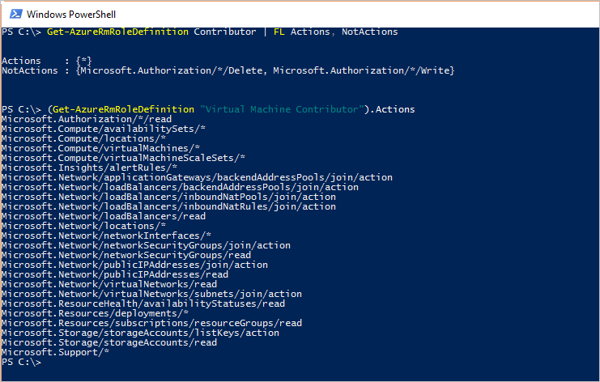
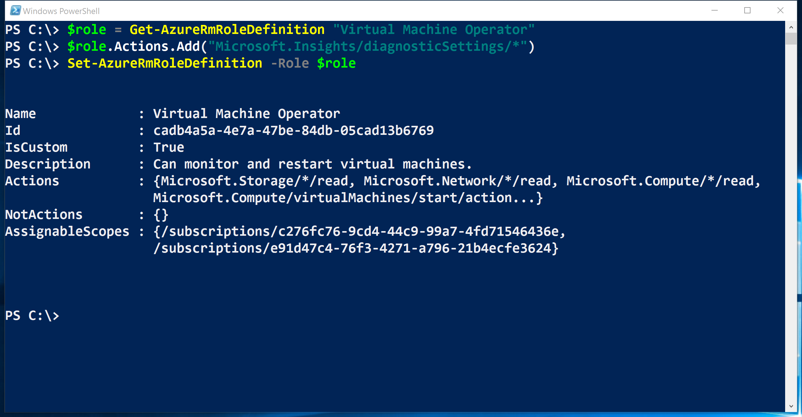
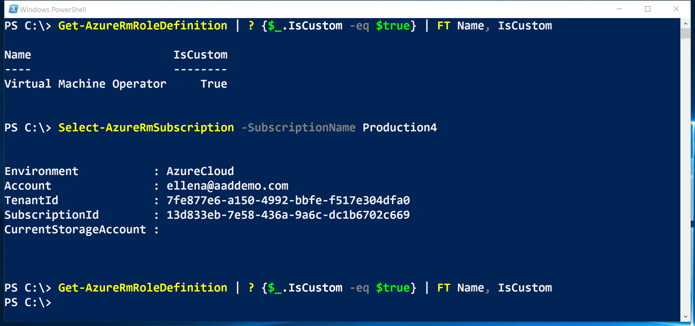

<properties
    pageTitle="Gerenciar o controle de acesso baseado em função (RBAC) com o PowerShell Azure | Microsoft Azure"
    description="Como gerenciar RBAC com PowerShell do Azure, incluindo a listagem de funções, atribuir funções e excluindo atribuições de função."
    services="active-directory"
    documentationCenter=""
    authors="kgremban"
    manager="femila"
    editor=""/>

<tags
    ms.service="active-directory"
    ms.devlang="na"
    ms.topic="article"
    ms.tgt_pltfrm="na"
    ms.workload="identity"
    ms.date="07/22/2016"
    ms.author="kgremban"/>

# <a name="manage-role-based-access-control-with-azure-powershell"></a>Gerenciar o controle de acesso baseado em função com o Azure PowerShell

> [AZURE.SELECTOR]
- [PowerShell](role-based-access-control-manage-access-powershell.md)
- [CLI Azure](role-based-access-control-manage-access-azure-cli.md)
- [API REST](role-based-access-control-manage-access-rest.md)


Você pode usar o controle de acesso baseado em função (RBAC) no portal do Azure e API de gerenciamento de recursos do Azure para gerenciar o acesso à sua assinatura em um nível refinada. Com esse recurso, você pode conceder acesso para usuários, grupos ou objetos de serviço do Active Directory atribuindo algumas funções-los em um escopo específico.

Antes de poder usar o PowerShell para gerenciar RBAC, você deve ter o seguinte:

- Azure PowerShell versão 0.8.8 ou posterior. Para instalar a versão mais recente e associá-lo a sua assinatura do Azure, veja [como instalar e configurar o Azure PowerShell](../powershell-install-configure.md).

- Azure cmdlets do Gerenciador de recursos. Instale os [cmdlets do Gerenciador de recursos do Azure](https://msdn.microsoft.com/library/mt125356.aspx) no PowerShell.

## <a name="list-roles"></a>Funções de lista

### <a name="list-all-available-roles"></a>Lista todas as funções disponíveis
Funções de RBAC de lista que estão disponíveis para atribuição e inspecionar as operações à qual eles conceder acesso, use `Get-AzureRmRoleDefinition`.

```
Get-AzureRmRoleDefinition | FT Name, Description
```


### <a name="list-actions-of-a-role"></a>Ações de lista de uma função
Para listar as ações para uma função específica, use `Get-AzureRmRoleDefinition <role name>`.

```
Get-AzureRmRoleDefinition Contributor | FL Actions, NotActions

(Get-AzureRmRoleDefinition "Virtual Machine Contributor").Actions
```



## <a name="see-who-has-access"></a>Consultar quem tem acesso
Para listar atribuições do access RBAC, use `Get-AzureRmRoleAssignment`.

### <a name="list-role-assignments-at-a-specific-scope"></a>Lista de atribuições de função em um escopo específico
Você pode ver todas as atribuições de acesso para uma assinatura especificada, grupo de recursos ou recurso. Por exemplo, para ver as todas as active atribuições para um grupo de recursos, use `Get-AzureRmRoleAssignment -ResourceGroupName <resource group name>`.

```
Get-AzureRmRoleAssignment -ResourceGroupName Pharma-Sales-ProjectForcast | FL DisplayName, RoleDefinitionName, Scope
```


### <a name="list-roles-assigned-to-a-user"></a>Listar funções atribuídas a um usuário
Para listar todas as funções atribuídas a um usuário específico e as funções que estejam atribuídas aos grupos aos quais o usuário pertence, use `Get-AzureRmRoleAssignment -SignInName <User email> -ExpandPrincipalGroups`.

```
Get-AzureRmRoleAssignment -SignInName sameert@aaddemo.com | FL DisplayName, RoleDefinitionName, Scope

Get-AzureRmRoleAssignment -SignInName sameert@aaddemo.com -ExpandPrincipalGroups | FL DisplayName, RoleDefinitionName, Scope
```


### <a name="list-classic-service-administrator-and-coadmin-role-assignments"></a>Administrador de serviço clássico de lista e atribuições de função coadmin
Para atribuições de acesso de lista para o administrador de assinatura clássico e coadministrators, use:

    Get-AzureRmRoleAssignment -IncludeClassicAdministrators

## <a name="grant-access"></a>Conceder acesso
### <a name="search-for-object-ids"></a>Pesquisar IDs de objeto
Para atribuir uma função, você precisa identificar o objeto (usuário, grupo ou aplicativo) e o escopo.

Se você não souber a ID da assinatura, você pode encontrá-lo na lâmina **assinaturas** no portal do Azure. Para saber como consultar a ID da assinatura, consulte [Get-AzureSubscription](https://msdn.microsoft.com/library/dn495302.aspx) no MSDN.

Para obter a identificação do objeto para um grupo do Azure AD, use:

    Get-AzureRmADGroup -SearchString <group name in quotes>

Para obter a identificação do objeto para um aplicativo ou entidade de serviço do Azure AD, use:

    Get-AzureRmADServicePrincipal -SearchString <service name in quotes>

### <a name="assign-a-role-to-an-application-at-the-subscription-scope"></a>Atribuir uma função a um aplicativo no escopo de assinatura
Para conceder acesso a um aplicativo no escopo de assinatura, use:

    New-AzureRmRoleAssignment -ObjectId <application id> -RoleDefinitionName <role name> -Scope <subscription id>


### <a name="assign-a-role-to-a-user-at-the-resource-group-scope"></a>Atribuir uma função a um usuário no escopo do grupo de recursos
Para conceder acesso a um usuário no escopo do grupo de recursos, use:

    New-AzureRmRoleAssignment -SignInName <email of user> -RoleDefinitionName <role name in quotes> -ResourceGroupName <resource group name>


### <a name="assign-a-role-to-a-group-at-the-resource-scope"></a>Atribuir uma função a um grupo no escopo do recurso
Para conceder acesso a um grupo no escopo do recurso, use:

    New-AzureRmRoleAssignment -ObjectId <object id> -RoleDefinitionName <role name in quotes> -ResourceName <resource name> -ResourceType <resource type> -ParentResource <parent resource> -ResourceGroupName <resource group name>


## <a name="remove-access"></a>Remover acesso
Para remover o acesso de usuários, grupos e aplicativos, usam:

    Remove-AzureRmRoleAssignment -ObjectId <object id> -RoleDefinitionName <role name> -Scope <scope such as subscription id>


## <a name="create-a-custom-role"></a>Crie uma função personalizada
Para criar uma função personalizada, use o `New-AzureRmRoleDefinition` comando.

Quando você cria uma função personalizada usando o PowerShell, você precisa começar com uma das [funções internas](role-based-access-built-in-roles.md). Edite os atributos para adicionar as *ações*, *notActions*ou *escopos* desejadas e salve as alterações como uma nova função.

O exemplo a seguir começa com a função *Colaborador de máquina Virtual* e usa para criar uma função personalizada denominada *Operadora de máquina Virtual*. A nova função concede acesso a todas as operações de leitura de provedores de recursos *Microsoft.Compute*, *Microsoft.Storage*e *Microsoft.Network* e concede acesso ao iniciar, reinicie e monitorar máquinas virtuais. A função personalizada pode ser usada nas duas assinaturas.

```
$role = Get-AzureRmRoleDefinition "Virtual Machine Contributor"
$role.Id = $null
$role.Name = "Virtual Machine Operator"
$role.Description = "Can monitor and restart virtual machines."
$role.Actions.Clear()
$role.Actions.Add("Microsoft.Storage/*/read")
$role.Actions.Add("Microsoft.Network/*/read")
$role.Actions.Add("Microsoft.Compute/*/read")
$role.Actions.Add("Microsoft.Compute/virtualMachines/start/action")
$role.Actions.Add("Microsoft.Compute/virtualMachines/restart/action")
$role.Actions.Add("Microsoft.Authorization/*/read")
$role.Actions.Add("Microsoft.Resources/subscriptions/resourceGroups/read")
$role.Actions.Add("Microsoft.Insights/alertRules/*")
$role.Actions.Add("Microsoft.Support/*")
$role.AssignableScopes.Clear()
$role.AssignableScopes.Add("/subscriptions/c276fc76-9cd4-44c9-99a7-4fd71546436e")
$role.AssignableScopes.Add("/subscriptions/e91d47c4-76f3-4271-a796-21b4ecfe3624")
New-AzureRmRoleDefinition -Role $role
```


## <a name="modify-a-custom-role"></a>Modificar uma função personalizada
Para modificar uma função personalizada, primeiro, use o `Get-AzureRmRoleDefinition` comando para recuperar a definição de função. Segundo, faça as alterações desejadas na definição de função. Por fim, use o `Set-AzureRmRoleDefinition` comando para salvar a definição de função modificada.

O exemplo a seguir adiciona o `Microsoft.Insights/diagnosticSettings/*` operação para a função personalizada de *Operador de máquina Virtual* .

```
$role = Get-AzureRmRoleDefinition "Virtual Machine Operator"
$role.Actions.Add("Microsoft.Insights/diagnosticSettings/*")
Set-AzureRmRoleDefinition -Role $role
```



O exemplo a seguir adiciona uma assinatura do Azure aos escopos transferível da função personalizada *Operador de máquina Virtual* .

```
Get-AzureRmSubscription - SubscriptionName Production3

$role = Get-AzureRmRoleDefinition "Virtual Machine Operator"
$role.AssignableScopes.Add("/subscriptions/34370e90-ac4a-4bf9-821f-85eeedead1a2"
Set-AzureRmRoleDefinition -Role $role)
```


## <a name="delete-a-custom-role"></a>Excluir uma função personalizada

Para excluir uma função personalizada, use o `Remove-AzureRmRoleDefinition` comando.

O exemplo a seguir remove a função personalizada de *Operador de máquina Virtual* .

```
Get-AzureRmRoleDefinition "Virtual Machine Operator"

Get-AzureRmRoleDefinition "Virtual Machine Operator" | Remove-AzureRmRoleDefinition
```


## <a name="list-custom-roles"></a>Funções personalizadas de lista
Para listar as funções disponíveis para atribuição em um escopo, use o `Get-AzureRmRoleDefinition` comando.

O exemplo a seguir lista todas as funções disponíveis para atribuição na assinatura selecionada.

```
Get-AzureRmRoleDefinition | FT Name, IsCustom
```


No exemplo a seguir, a função personalizada de *Operador de máquina Virtual* não está disponível na assinatura *Production4* porque essa assinatura não estiver na **AssignableScopes** da função.



## <a name="see-also"></a>Consulte também
- [Usando o PowerShell Azure com o Azure Resource Manager](../powershell-azure-resource-manager.md)
[AZURE.INCLUDE [role-based-access-control-toc.md](../../includes/role-based-access-control-toc.md)]
