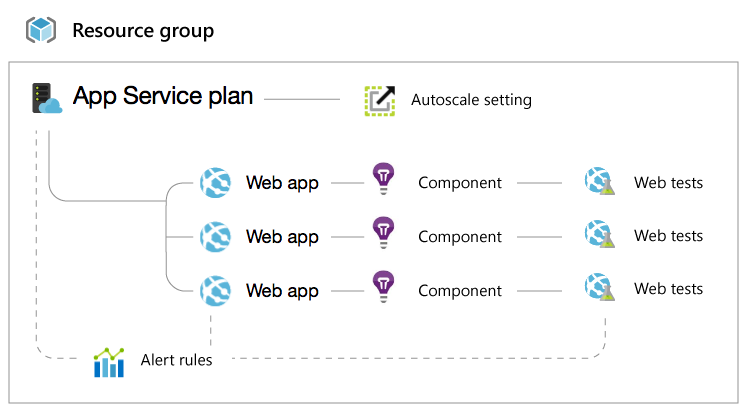

<properties
    pageTitle="Solução de problemas de controle de acesso baseado em função | Microsoft Azure"
    description="Obter ajuda com problemas ou perguntas sobre os recursos de controle de acesso com base em função."
    services="azure-portal"
    documentationCenter="na"
    authors="kgremban"
    manager="femila"
    editor=""/>

<tags
    ms.service="active-directory"
    ms.workload="identity"
    ms.tgt_pltfrm="na"
    ms.devlang="na"
    ms.topic="article"
    ms.date="07/12/2016"
    ms.author="kgremban"/>

# Solução de controle de acesso baseado em função

## Introdução

[Controle de acesso baseado em função](role-based-access-control-configure.md) é um poderoso recurso que permite delegar refinado acesso aos recursos do Azure. Isso significa que você pode se sentir confiante concedendo o direito de usar exatamente o que eles precisam de uma pessoa específica e não mais. Entretanto, às vezes, o modelo de recursos para recursos Azure pode ser complicado e pode ser difícil entender exatamente o que você está concedendo permissões para.

Este documento permitirá que você a saber o que esperar ao usar algumas das funções no portal do Azure. Estas três funções cobrir todos os tipos de recursos:

- Proprietário  
- Colaborador  
- Leitor  

Proprietários e colaboradores têm acesso completo a experiência de gerenciamento de, mas um colaborador pode dar acesso a outros usuários ou grupos. As coisas são um pouco mais interessantes com a função de leitor, portanto, que é onde vamos gastar algum tempo. Consulte o [artigo de Introdução para obter do controle de acesso baseado em função](role-based-access-control-configure.md) para obter detalhes sobre como conceder acesso.

## Cargas de trabalho de serviço de aplicativo

### Recursos de acesso de gravação

Se você conceder a um usuário de acesso somente leitura a um aplicativo web única, alguns recursos estão desabilitados que não se espera. Os seguintes recursos de gerenciamento precisam de acesso de **gravação** para um aplicativo web (colaborador ou proprietário) e não estarão disponíveis em qualquer cenário de somente leitura.

- Comandos (por exemplo, iniciar, parar, etc.)
- Alterar as configurações, como configuração geral, configurações de escala, configurações de backup e configurações de monitoramento
- Acessando credenciais de publicação e outros segredos como configurações de aplicativo e cadeias de caracteres de conexão
- Logs de streaming
- Configuração de logs de diagnóstico
- Console (prompt de comando)
- Implantações de ativas e recentes (para implantação contínuo gito local)
- Estimada passam
- Testes da Web
- Rede virtual (visível somente para um leitor se uma rede virtual foi configurada anteriormente por um usuário com acesso de gravação).

Se você não pode acessar qualquer uma dessas peças, você precisará peça ao seu administrador para acessar Colaborador do web app.

### Lidando com recursos relacionados

Aplicativos Web são complicados pela presença de alguns recursos diferentes que interação. Aqui está um grupo de recursos típicos com alguns sites:

Como resultado, se você conceder a alguém acesso apenas a web App, muitas das funcionalidades na lâmina site no portal do Azure será desabilitado.

Esses itens precisam de acesso de **gravação** para o **plano de serviço de aplicativo** que corresponde ao seu site:  

- Exibir o aplicativo web do preço nível (livre ou padrão)  
- Configuração de escala (número de instâncias, tamanho de máquina virtual, as configurações de escala automática)  
- Cotas (armazenamento, largura de banda, CPU)  

Esses itens requerem **escrever** acesso a todo o **grupo de recursos** que contém seu site:  

- Certificados SSL e ligações (Isso ocorre porque certificados SSL podem ser compartilhados entre sites no mesmo grupo de recursos e localização geográfica)  
- Regras de alerta  
- Configurações de escala automática  
- Componentes de obtenção de informações do aplicativo  
- Testes da Web  

## Cargas de trabalho de máquina virtual

Muito semelhante com web apps, alguns recursos na máquina virtual lâmina exigem acesso de gravação na máquina virtual, ou para outros recursos no grupo de recursos.

Máquinas virtuais estão relacionadas a nomes de domínio, redes virtuais, contas de armazenamento e regras de alerta.

Esses itens precisam de acesso de **gravação** na **Máquina Virtual**:

- Pontos de extremidade  
- Endereços IP  
- Discos  
- Extensões  

Esses exigem acesso de **escrever** a **Máquina Virtual**e o **grupo de recursos** (juntamente com o nome de domínio) que ele se encontra em:  

- Conjunto de disponibilidade  
- Carregar conjunto equilibrado  
- Regras de alerta  

Se você não pode acessar qualquer uma dessas peças, você precisará peça ao seu administrador para obter acesso Colaborador ao grupo de recursos.

## Ver mais
- [Controle de acesso com base em função](role-based-access-control-configure.md): Introdução ao RBAC no portal do Azure.
- [Funções internas](role-based-access-built-in-roles.md): obter detalhes sobre as funções que vêm padrão na RBAC.
- [Funções personalizadas no Azure RBAC](role-based-access-control-custom-roles.md): Aprenda a criar funções personalizadas para atender às suas necessidades de acesso.
- [Criar um acesso alterar relatório de histórico](role-based-access-control-access-change-history-report.md): controlar as atribuições de função mudanças no RBAC.
