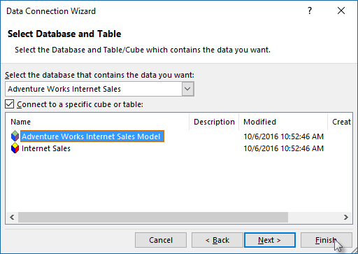

<properties
   pageTitle="Obter dados do Azure Analysis Services | Microsoft Azure"
   description="Saiba como se conectar aos e obter dados de um servidor do Analysis Services no Azure."
   services="analysis-services"
   documentationCenter=""
   authors="minewiskan"
   manager="erikre"
   editor=""
   tags=""/>
<tags
   ms.service="analysis-services"
   ms.devlang="NA"
   ms.topic="article"
   ms.tgt_pltfrm="NA"
   ms.workload="na"
   ms.date="10/24/2016"
   ms.author="owend"/>

# <a name="get-data-from-azure-analysis-services"></a>Obter dados do Azure Analysis Services
Depois que você tiver criado um servidor do Azure e implantado um modelo tabular, usuários de sua organização estão prontos para se conectar e começar a explorar os dados.

Azure Analysis Services oferece suporte a conexões de cliente usando a [atualização de modelos de objeto](#client-libraries); TOM, AMO, Adomd.Net ou MSOLAP, conectem via xmla no servidor. Por exemplo, Power BI, Power BI Desktop, Excel ou qualquer aplicativo cliente de terceiros que suporta os modelos de objeto.

## <a name="server-name"></a>Nome do servidor
Quando você cria um servidor do Analysis Services no Azure, especifique um nome exclusivo e a região onde o servidor está a ser criado. Ao especificar o nome do servidor em uma conexão, é o esquema de nomes de servidor:
```
<protocol>://<region>/<servername>
```
 Onde protocolo é de cadeia de caracteres **asazure**, a região é o Uri da região onde o servidor foi criado (por exemplo, para Oeste EUA, westus.asazure.windows.net) e nomedoservidor é o nome do seu servidor exclusivo dentro da região.

## <a name="get-the-server-name"></a>Obter o nome do servidor
Antes de conectar, você precisa obter o nome do servidor. No **portal Azure** > servidor > **Visão geral** > **o nome do servidor**, copie o nome do servidor inteiro. Se outros usuários na sua organização estiver se conectando a este servidor muito, você vai querer compartilhar este nome de servidor com elas. Ao especificar um nome de servidor, o caminho completo deve ser usado.


## <a name="connect-in-power-bi-desktop"></a>Conectar-se na área de trabalho do Power BI

> [AZURE.NOTE] Este recurso está Preview.

1. No [Power BI Desktop](https://powerbi.microsoft.com/desktop/), clique em **Obter dados** > **bancos de dados** > **Azure Analysis Services**.

2. No **servidor**, cole o nome do servidor da área de transferência.

3. No **banco de dados**, se você souber o nome do banco de dados de modelo tabular ou perspectiva que você deseja se conectar, colá-lo aqui. Caso contrário, você pode deixar este campo em branco. Você pode selecionar um banco de dados ou uma perspectiva na próxima tela.

4. Deixe a opção de **conectar-se ao vivo** padrão selecionado e pressione **Conectar**. Se você for solicitado a inserir uma conta, insira sua conta organizacional.

5. No **navegador**, expanda o servidor, e em seguida, selecione o modelo ou perspectiva que você deseja se conectar e clique em **Conectar**. Um único clique em um modelo ou perspectiva mostra todos os objetos de exibição.


## <a name="connect-in-power-bi"></a>Conectar-se no Power BI
1. Crie um arquivo de Power BI Desktop que tem uma conexão ao vivo ao seu modelo no seu servidor.

2. No [Power BI](https://powerbi.microsoft.com), clique em **Obter dados** > **arquivos**. Localize e selecione o arquivo.


## <a name="connect-in-excel"></a>Conectar-se no Excel
Há suporte para se conectar ao servidor do Azure Analysis Services no Excel usando obter dados no Excel 2016 ou Power Query em versões anteriores. [Provedor de MSOLAP.7](https://aka.ms/msolap) é necessária. Não há suporte para se conectar usando o Assistente de importação de tabela no PowerPivot.

1. No Excel 2016, na faixa de **dados** , clique em **Obter dados externos** > **De outras fontes** > **Do Analysis Services**.

2. No Assistente de Conexão de dados, em **nome do servidor**, cole o nome do servidor da área de transferência. Em seguida, **credenciais de Logon**, selecione **usar o seguinte nome de usuário e senha**e digite o nome de usuário organizacional, por exemplo nancy@adventureworks.com, e a senha.

    

4. Em **Selecionar banco de dados e tabela**, selecione o banco de dados e o modelo ou a perspectiva e clique em **Concluir**.

    

## <a name="connection-string"></a>Cadeia de Conexão
Conectar ao Azure Analysis Services usando o modelo de objeto Tabular, use os seguintes formatos de cadeia de conexão:

###### <a name="integrated-azure-active-directory-authentication"></a>Autenticação integrada do Active Directory do Azure
```
"Provider=MSOLAP;Data Source=<Azure AS instance name>;"
```
Autenticação integrada selecionará o cache de credencial do Active Directory do Azure se disponível. Caso contrário, a janela de login Azure é mostrada.

###### <a name="azure-active-directory-authentication-with-username-and-password"></a>Autenticação do Active Directory Azure com nome de usuário e senha
```
"Provider=MSOLAP;Data Source=<Azure AS instance name>;User ID=<user name>;Password=<password>;Persist Security Info=True; Impersonation Level=Impersonate;";
```

## <a name="client-libraries"></a>Bibliotecas de cliente
Ao conectar-se a serviços de análise do Azure do Excel ou outras interfaces como TOM, AsCmd, ADOMD.NET, talvez seja necessário instalar as bibliotecas de cliente mais recentes do provedor. Obtenha as últimas:  

[MSOLAP (amd64)](https://go.microsoft.com/fwlink/?linkid=829576)</br>
[MSOLAP (x86)](https://go.microsoft.com/fwlink/?linkid=829575)</br>
[AMO](https://go.microsoft.com/fwlink/?linkid=829578)</br>
[ADOMD](https://go.microsoft.com/fwlink/?linkid=829577)</br>


## <a name="next-steps"></a>Próximas etapas
[Gerenciar seu servidor](analysis-services-manage.md)
