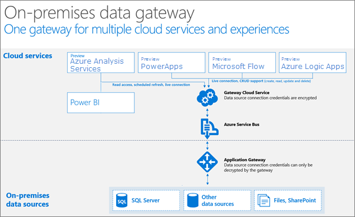

<properties
   pageTitle="Gateway de dados locais | Microsoft Azure"
   description="Um gateway diante local é necessário se seu servidor do Analysis Services no Azure se conectar a fontes de dados local."
   services="analysis-services"
   documentationCenter=""
   authors="minewiskan"
   manager="erikre"
   editor=""
   tags=""/>
<tags
   ms.service="analysis-services"
   ms.devlang="NA"
   ms.topic="article"
   ms.tgt_pltfrm="NA"
   ms.workload="na"
   ms.date="10/24/2016"
   ms.author="owend"/>

# <a name="on-premises-data-gateway"></a>Gateway de dados local

O gateway de dados locais atua como uma ponte, fornecendo transferência de dados segura entre fontes de dados locais e seu servidor do Azure Analysis Services na nuvem.

Um gateway é instalado em um computador na sua rede. Um gateway deve ser instalado para cada servidor de serviços de análise do Azure que você tem em sua assinatura do Azure. Por exemplo, se você tiver dois servidores na sua assinatura do Azure que se conectar a fontes de dados local, um gateway deve ser instalado em dois computadores separadas na sua rede.

## <a name="requirements"></a>Requisitos

**Requisitos mínimos:**

- 4,5 do .NET framework
- versão de 64 bits do Windows 7 / Windows Server 2008 R2 (ou posterior)

**Recomendado:**

- CPU core 8
- 8 GB de memória
- versão de 64 bits do Windows 2012 R2 (ou posterior)

**Considerações importantes:**

- O gateway não pode ser instalado em um controlador de domínio.

- Apenas um gateway pode ser instalado em um único computador.

- Instale o gateway em um computador que permanece na e não vai para a suspensão. Se o computador não estiver em, seu servidor do Azure Analysis Services não pode conectar suas fontes de dados locais para atualizar dados.

- Não instale o gateway em um computador sem fio conectado à sua rede. Desempenho pode ser diminuído.

- Para alterar o nome do servidor para um gateway que já foi configurado, você precisa reinstalar e configurar um novo gateway.

- Em alguns casos, modelos tabulares conectar fontes de dados usando provedores nativos como o SQL Server Native Client (SQLNCLI11) podem retornar um erro. Para saber mais, consulte [conexões de fonte de dados](analysis-services-datasource.md).

## <a name="supported-on-premises-data-sources"></a>Fontes de dados com suporte no local
Para visualização, o gateway oferece suporte a conexões entre seu servidor do Azure Analysis Services e as seguintes fontes de dados locais:

- SQL Server
- Depósito de dados do SQL
- PONTOS DE ACESSO
- Oracle
- Teradata


## <a name="download"></a>Baixar
 [Baixar o gateway](https://aka.ms/azureasgateway)


## <a name="install-and-configure"></a>Instalar e configurar

1. Execute a instalação.

2. Escolha um local de instalação e aceite os termos de licença.

3. Entrar no Azure.

4. Especifique o nome do servidor de análise do Azure. Você só pode especificar um servidor por gateway. Clique em **Configurar** e você estará pronto.

    


## <a name="how-it-works"></a>Como ele funciona
O gateway é executado como um serviço do Windows, **o gateway de dados local**, em um computador na rede da sua organização. O gateway que instalar para usar com serviços de análise do Azure baseia-se no mesmo gateway usado para outros serviços como o Power BI, mas com algumas diferenças em como ela está configurada.



Trabalho de fluxo de dados e consultas assim:

1.  Uma consulta é criada pelo serviço de nuvem com as credenciais criptografadas para a fonte de dados local. Em seguida, ela é enviada para uma fila do gateway processar.

2.  O serviço de nuvem do gateway analisa a consulta e envia a solicitação para o [Barramento de serviço do Azure](https://azure.microsoft.com/documentation/services/service-bus/).

3.  O gateway de dados locais controla o barramento de serviço do Azure para solicitações pendentes.

4.  O gateway obtém a consulta, descriptografa as credenciais e conecta-se às fontes de dados com essas credenciais.

5.  O gateway envia a consulta à fonte de dados para execução.

6.  Os resultados são enviados da fonte de dados, volte para o gateway e então em serviço de nuvem.

## <a name="windows-service-account"></a>Conta de serviço do Windows

O gateway de dados local está configurado para usar *SERVICE\PBIEgwService NT* para a credencial de logon de serviço do Windows. Por padrão, ela tem o direito de Logon como um serviço; no contexto da máquina que você está instalando o gateway em. Essa credencial não é a mesma conta usada para se conectar a fontes de dados locais ou sua conta do Azure.  

Se você encontrar problemas com o servidor de proxy devido a autenticação, talvez você queira alterar a conta de serviço do Windows para um usuário de domínio ou conta de serviço gerenciado.

## <a name="ports"></a>Portas

O gateway cria uma conexão de saída para barramento de serviço do Azure. Ele se comunica com portas de saída: TCP 443 (padrão), 5671, 5672, 9350 por meio de 9354.  O gateway não exige portas de entrada.

Recomenda você branca os endereços IP para sua região de dados em seu firewall. Você pode baixar a [lista de IP do Microsoft Azure data center](https://www.microsoft.com/download/details.aspx?id=41653). Esta lista é atualizada semanalmente.

> [AZURE.NOTE]  Os endereços IP listados na lista de IP do data center Azure estão em notação CIDR. Por exemplo, 10.0.0.0/24 não significa 10.0.0.0 por meio de 10.0.0.24. Saiba mais sobre a [notação CIDR](http://whatismyipaddress.com/cidr).

Estes são os nomes de domínio totalmente qualificado usados pelo gateway.

|Nomes de domínio|Portas de saída|Descrição|
|---|---|---|
|*. powerbi.com|80|HTTP usado para baixar o instalador.|
|*. powerbi.com|443|HTTPS|
|*. analysis.windows.net|443|HTTPS|
|*. login.windows.net|443|HTTPS|
|*. servicebus.windows.net|5671-5672|Enfileiramento avançado de protocolo (AMQP)|
|*. servicebus.windows.net|443, 9350-9354|Escutas no serviço de retransmissão de barramento sobre TCP (requer 443 para aquisição de token de controle de acesso)|
|*. frontend.clouddatahub.net|443|HTTPS|
|*. core.windows.net|443|HTTPS|
|login.microsoftonline.com|443|HTTPS|
|*. msftncsi.com|443|Usado para testar a conectividade com a internet se o gateway está inacessível pelo serviço Power BI.|
|*.microsoftonline-p.com|443|Usado para autenticação, dependendo da configuração.|


### <a name="forcing-https-communication-with-azure-service-bus"></a>Forçando comunicação HTTPS com barramento de serviço do Azure

Você também pode forçar o gateway para se comunicar com barramento de serviço do Azure usando HTTPS em vez de TCP direto; No entanto, isso pode reduzir significativamente o desempenho. Você precisa modificar o arquivo *Microsoft.PowerBI.DataMovement.Pipeline.GatewayCore.dll.config* . Altere o valor de `AutoDetect` para `Https`. Este arquivo está localizado, por padrão, o gateway de *dados locais C:\Program Files\On*.

```
<setting name="ServiceBusSystemConnectivityModeString" serializeAs="String">
    <value>Https</value>
</setting>
```


## <a name="troubleshooting"></a>Solução de problemas
Nos bastidores, o gateway de dados local usado para conexão Azure Analysis Services com suas fontes de dados local é o mesmo gateway usado com o Power BI.

Se você estiver tendo problemas ao instalar e configurar um gateway, certifique-se de consulte [solução de problemas do Gateway do Power BI](https://powerbi.microsoft.com/documentation/powerbi-gateway-onprem-tshoot/). Se você achar que você está tendo um problema com o seu firewall, consulte as seções de proxy ou firewall.

Se você acha que você está enfrentando problemas de proxy, com o gateway, consulte [Definindo as configurações de proxy dos Gateways Power BI](https://powerbi.microsoft.com/documentation/powerbi-gateway-proxy.md).

## <a name="next-steps"></a>Próximas etapas
- [Gerenciar serviços de análise](analysis-services-manage.md)
- [Obter dados do Azure Analysis Services](analysis-services-connect.md)
