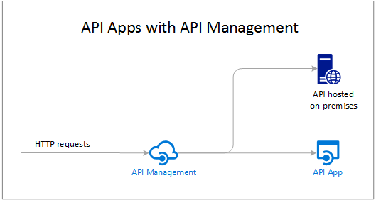

<properties 
    pageTitle="Introdução de aplicativos de API | Microsoft Azure" 
    description="Saiba como o serviço de aplicativo do Azure ajuda você a desenvolver, host e consumir APIs RESTful." 
    services="app-service\api" 
    documentationCenter=".net" 
    authors="tdykstra" 
    manager="wpickett" 
    editor=""/>

<tags 
    ms.service="app-service-api" 
    ms.workload="web" 
    ms.tgt_pltfrm="na" 
    ms.devlang="na" 
    ms.topic="get-started-article" 
    ms.date="08/23/2016" 
    ms.author="rachelap"/>

# Visão geral de aplicativos de API

Aplicativos de API do serviço de aplicativo do Azure oferecem recursos que tornam mais fácil desenvolver, host e consumir APIs na nuvem e locais. Com aplicativos de API você obtém segurança de nível de empresa, controle de acesso simples, conectividade híbridos, geração automática de SDK e integração perfeita com [Aplicativos de lógica](../app-service-logic/app-service-logic-what-are-logic-apps.md).

[Serviço de aplicativo do Azure](../app-service/app-service-value-prop-what-is.md) é uma plataforma totalmente gerenciada para web, móvel e cenários de integração. Aplicativos de API é um dos quatro tipos de aplicativo oferecidos pelo [Serviço de aplicativo do Azure](../app-service/app-service-value-prop-what-is.md).

## Por que usar aplicativos de API?

Aqui estão alguns dos principais recursos dos aplicativos da API:

- **Trazer seu API existente como-é** -não é necessário alterar qualquer código no seu APIs existentes para tirar proveito dos aplicativos de API--implantar apenas seu código em um aplicativo de API. Sua API pode usar qualquer linguagem ou framework suportada pelo serviço de aplicativo, incluindo ASP.NET e c#, Java, PHP, node e Python.

- **Consumo de fácil** - suporte integrado para [metadados de API Swagger](http://swagger.io/) faz com que seu APIs facilmente utilizado por uma variedade de clientes.  Gere automaticamente o código do cliente para seu APIs em uma variedade de linguagens incluindo c#, Java e Javascript. Configure facilmente [CORS](app-service-api-cors-consume-javascript.md) sem alterar seu código. Para obter mais informações, consulte [Consume um aplicativo de API do JavaScript usando CORS](app-service-api-cors-consume-javascript.md)e [metadados de API do serviço de aplicativo aplicativos para geração de descoberta e o código de API](app-service-api-metadata.md) . 

- **Controle de acesso simples** - proteger um aplicativo de API de acesso não autenticado sem alterações para seu código. Serviços de autenticação internos seguro APIs para obter acesso por outros serviços ou por clientes que representa os usuários. Provedores de identidade com suporte incluem o Active Directory do Azure, Facebook, Twitter, Google e Account da Microsoft. Clientes podem usar a biblioteca de autenticação do Active Directory (ADAL) ou o SDK de aplicativos móveis. Para obter mais informações, consulte [autenticação e a autorização para os aplicativos da API do serviço de aplicativo do Azure](app-service-api-authentication.md).

- **Integração do visual Studio** - dedicadas ferramentas no Visual Studio simplificar o trabalho da criação, implantando, consumindo, depuração e gerenciando aplicativos de API. Para obter mais informações, consulte [anunciando o SDK do Azure 2.8.1 para .NET](/blog/announcing-azure-sdk-2-8-1-for-net/).

- **Integração com aplicativos de lógica** - API aplicativos que você cria pode ser consumida por [Aplicativos de lógica de serviço do aplicativo](../app-service-logic/app-service-logic-what-are-logic-apps.md).  Para obter mais informações, consulte [usando sua API personalizado hospedado no serviço de aplicativo com aplicativos de lógica](../app-service-logic/app-service-logic-custom-hosted-api.md) e [novo esquema versão 2015-08-01-preview](../app-service-logic/app-service-logic-schema-2015-08-01.md).

Além disso, um aplicativo de API pode tirar proveito dos recursos oferecidos pelo [Web Apps](../app-service-web/app-service-web-overview.md) e [Aplicativos Mobile](../app-service-mobile/app-service-mobile-value-prop.md). O inverso também é verdadeiro: se você usar um aplicativo web ou aplicativo móvel para hospedar uma API, pode levar proveito dos recursos de aplicativos de API como Swagger metadados para cliente CORS e geração de código de acesso a navegador entre domínios. A única diferença entre os tipos de três aplicativo (API, web, móvel) é o nome e o ícone usado para eles no portal do Azure.

## Qual é a diferença entre os aplicativos de API e gerenciamento de API do Azure?

[Gerenciamento de API do Azure](../api-management/api-management-key-concepts.md) e aplicativos de API são serviços complementares:

* Gerenciamento de API é sobre o gerenciamento de APIs. Você coloca um front-end do gerenciamento de API em uma API de uso de monitor e aceleração, manipular a entrada e saída, consolida várias APIs em um ponto de extremidade e assim por diante. As APIs sendo gerenciadas podem ser hospedadas em qualquer lugar.
* Aplicativos de API é sobre APIs de hospedagem. O serviço inclui recursos que facilitam o desenvolvimento e consumindo APIs, mas ele não verifica os tipos de monitoramento, a otimização, manipular ou consolidar que gerenciamento de API faz. Se não precisar de recursos de gerenciamento de API, você pode hospedar APIs nos aplicativos de API sem usar o gerenciamento de API.

Eis um diagrama que ilustra o gerenciamento de API usado para APIs hospedado nos aplicativos de API e em outro lugar.

Alguns recursos de gerenciamento de API e aplicativos de API tem funções semelhantes.  Por exemplo, ambas podem automatizar CORS suporte. Quando você usa os dois serviços juntos, você usaria gerenciamento de API para CORS desde que ele funciona como front-end seus aplicativos de API. 

## Guia de Introdução

Para começar com aplicativos de API Implantando o código de amostra para uma, consulte o tutorial para qualquer framework preferir:

* [ASP.NET](app-service-api-dotnet-get-started.md) 
* [Node](app-service-api-nodejs-api-app.md) 
* [Java](app-service-api-java-api-app.md) 

Para fazer perguntas sobre os aplicativos de API, inicie um segmento no [Fórum de aplicativos de API](https://social.msdn.microsoft.com/Forums/en-US/home?forum=AzureAPIApps). 
