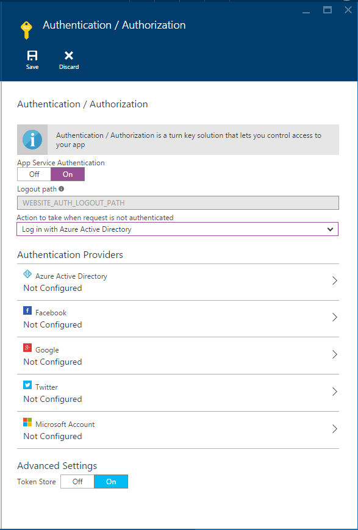

<properties
    pageTitle="Autenticação e autorização para aplicativos de API do serviço de aplicativo do Azure | Microsoft Azure"
    description="Saiba mais sobre os serviços de autenticação e a autorização que fornece o serviço de aplicativo do Azure para aplicativos de API."
    services="app-service\api"
    documentationCenter=".net"
    authors="tdykstra"
    manager="wpickett"
    editor=""/>

<tags
    ms.service="app-service-api"
    ms.workload="na"
    ms.tgt_pltfrm="na"
    ms.devlang="na"
    ms.topic="article"
    ms.date="05/23/2016"
    ms.author="rachelap"/>

# Autenticação e autorização para aplicativos de API do serviço de aplicativo do Azure

## Visão geral 

> [AZURE.NOTE] Este tópico será migrado para um consolidado [autenticação de serviço do aplicativo / autorização](../app-service/app-service-authentication-overview.md) tópico, que abrange Web, celular e aplicativos de API.

Serviço de aplicativo Azure oferece serviços de autenticação e a autorização internos que implementam [OAuth 2.0](#oauth) e [OpenID se conectar](#oauth). Este artigo descreve as opções disponíveis para aplicativos de API do serviço de aplicativo do Azure e serviços.

O diagrama a seguir ilustra algumas características principais de autenticação do serviço de aplicativo:

* Ele pré-processa solicitações de entrada de API, significando que ele funciona com qualquer linguagem ou framework suportada pelo serviço de aplicativo.
* Ele oferece várias opções para quanto a autenticação funciona você deseja fazer no seu próprio código.
* Ele funciona para usuário final e autenticação de conta de serviço. 
* Ele dá suporte a cinco provedores de identidade: Active Directory do Azure, Facebook, Twitter, Google e Account da Microsoft.
* Ele funciona da mesma para aplicativos de API, aplicativos Web e aplicativos Mobile.

## Independente de idioma

Processamento de autenticação do serviço de aplicativo acontece antes de solicitações atingir seu aplicativo de API, o que significa que os recursos de autenticação funcionam para os aplicativos de API escritos em qualquer linguagem ou estrutura.  Sua API pode ser baseada em ASP.NET, Java, Node ou qualquer framework que suporta o serviço de aplicativo.

Serviço de aplicativo passa o token de web JSON (JWT) no cabeçalho da autorização de uma solicitação HTTP e o código escrito em qualquer linguagem ou estrutura pode obter as informações necessárias do token. Além disso, o serviço de aplicativo fornece fácil acesso às declarações mais comumente usadas definindo alguns cabeçalhos especiais, como o seguinte:

* X-MS-CLIENTE-CAPITAL-NAME
* X-MS-CLIENTE-CAPITAL-ID
* X-MS-TOKEN-FACEBOOK-ACCESS-TOKEN
* X-MS-TOKEN-FACEBOOK-EXPIRES-ON
 
Em uma API do .NET, você pode usar o `Authorize` atributo e para autorização refinada, você pode facilmente escrever código com base em declarações porque informações de declarações são preenchidas em classes .NET.

## Várias opções de proteção

Serviço de aplicativo pode impedir solicitações HTTP anônimas contatem seu aplicativo de API, ele pode passar em todas as solicitações e validar tokens para solicitações de incluem-los ou ele poderá deixar por meio de todas as solicitações sem realizar nenhuma ação-las:

1. Permitir que somente solicitações autenticadas alcançar seu aplicativo de API.

    Se uma solicitação anônima for recebida de um navegador, serviço de aplicativo redirecionará para uma página de logon para o provedor de autenticação (Twitter do Azure AD, Google, etc.) que você escolher. 

    Com essa opção, você não precisa escrever qualquer código de autenticação em todos os em seu aplicativo e código de autorização é simplificado porque as declarações mais importantes são fornecidas nos cabeçalhos HTTP.

2. Permitir que todas as solicitações atingir seu aplicativo de API, mas validar solicitações autenticadas e passar informações de autenticação nos cabeçalhos HTTP.

    Esta opção oferece mais flexibilidade para lidar com solicitações de anônimas, mas você precisa escrever código se você deseja impedir que usuários anônimos usando sua API. Como as declarações mais populares são passadas nos cabeçalhos das solicitações HTTP, código de autorização é relativamente simple.
    
3. Permitir que todas as solicitações para acessar sua API, não tomar nenhuma ação nas informações de autenticação nas solicitações.

    Esta opção deixa as tarefas de autenticação e autorização inteiramente até o código do seu aplicativo.

No [portal do Azure](https://portal.azure.com/), você selecionar a opção desejada na **autenticação / autorização** blade.

Para opções de 1 e 2, ative a **Autenticação do serviço de aplicativo**e na lista suspensa **fazer quando solicitação não é autenticada** , escolha **efetuar login** ou **Permitir solicitação (nenhuma ação)**.  Se você escolher **login**, você precisa escolher um provedor de autenticação e configurar o provedor.

Para obter informações detalhadas sobre como configurar a autenticação, consulte [como configurar seu aplicativo de serviço de aplicativo para usar o logon do Active Directory do Azure](../app-service-mobile/app-service-mobile-how-to-configure-active-directory-authentication.md). O artigo se aplica à API aplicativos bem como aplicativos móveis, e ele links para outros artigos para os outros provedores de autenticação.
 
## Autenticação de conta de serviço

Autenticação do serviço de aplicativo funciona para cenários internos, como de chamada de um aplicativo de API para outro aplicativo de API. Neste cenário você obtenha um token usando credenciais para uma conta de serviço em vez de credenciais de usuário final. Uma conta de serviço também é conhecido como um *serviço principal* no Active Directory do Azure e autenticação uso dessa conta também é conhecido como um cenário ao serviço. 

Cenários de ao serviço, proteger o aplicativo de API chamado usando o Active Directory do Azure e forneça um símbolo de autorização principal do serviço AAD quando você chamar o aplicativo de API. Obter um token, fornecendo o cliente ID e cliente secreta do aplicativo AAD. Nenhum código especial somente Azure é necessário, como costumava ser verdadeiro para lidar com o token de Zumo de serviços de celular. Um exemplo desse cenário usando aplicativos da API do ASP.NET é coberto pelo tutorial [autenticação principal para os aplicativos da API do serviço](app-service-api-dotnet-service-principal-auth.md).

Se você deseja lidar com um cenário de serviço para sem usar a autenticação do serviço de aplicativo, você pode usar certificados de cliente ou autenticação básica. Para obter informações sobre os certificados de cliente no Azure, consulte [Como para configurar TLS comum autenticação para aplicativos Web.](../app-service-web/app-service-web-configure-tls-mutual-auth.md) Para obter informações sobre autenticação básica no ASP.NET, consulte [Filtros de autenticação do ASP.NET Web API 2](http://www.asp.net/web-api/overview/security/authentication-filters).

Autenticação de conta de serviço de um aplicativo de lógica do serviço de aplicativo para um aplicativo de API é um caso especial que é explicado em [usando sua API personalizado hospedado no serviço de aplicativo com aplicativos de lógica](../app-service-logic/app-service-logic-custom-hosted-api.md).

## Autenticação de cliente móvel

Para obter informações sobre como lidar com a autenticação de clientes móveis, consulte a [documentação de autenticação para aplicativos móveis](../app-service-mobile/app-service-mobile-ios-get-started-users.md). Autenticação do serviço de aplicativo funciona da mesma maneira para aplicativos móveis e aplicativos de API.
  
## Mais informações

Para obter mais informações sobre autenticação e autorização no serviço de aplicativo do Azure, consulte os seguintes recursos:

* [Autenticação do serviço de aplicativo de expansão / autorização](/blog/announcing-app-service-authentication-authorization/)
* [Como configurar seu aplicativo de serviço de aplicativo para usar o logon do Active Directory do Azure](../app-service-mobile/app-service-mobile-how-to-configure-active-directory-authentication.md) (Inclui links para outros provedores de autenticação na parte superior da página). 

Para obter mais informações sobre OAuth 2.0, OpenID conectar e JSON Web Tokens (JWT), consulte os seguintes recursos.

* [Introdução ao OAuth 2.0] (http://shop.oreilly.com/product/0636920021810.do "Introdução ao OAuth 2.0") 
* [Introdução ao OAuth2, OpenID se conectar e JSON Web Tokens (JWT) - curso PluralSight](http://www.pluralsight.com/courses/oauth2-json-web-tokens-openid-connect-introduction) 
* [Construção e protegendo uma API RESTful para vários clientes no ASP.NET - curso PluralSight](http://www.pluralsight.com/courses/building-securing-restful-api-aspdotnet)

Para obter mais informações sobre o Azure Active Directory, consulte os seguintes recursos.

* [Cenários do Azure AD](http://aka.ms/aadscenarios)
* [Guia dos desenvolvedores do Azure AD](http://aka.ms/aaddev)
* [Exemplos do Azure AD](http://aka.ms/aadsamples)

## Próximas etapas

Este artigo tem explicado recursos de autenticação e a autorização do serviço de aplicativo que você pode usar para os aplicativos de API. O próximo tutorial da série de Introdução ao obter mostra como implementar a [autenticação de usuário nos aplicativos de API do serviço de aplicativo](app-service-api-dotnet-user-principal-auth.md).
