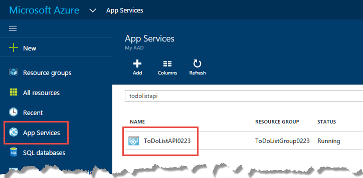

<properties
    pageTitle="CORS suporte no serviço de aplicativo | Microsoft Azure"
    description="Saiba como usar CORS suporte no serviço de aplicativo do Azure Azure."
    services="app-service\api"
    documentationCenter=".net"
    authors="tdykstra"
    manager="wpickett"
    editor=""/>

<tags
    ms.service="app-service-api"
    ms.workload="na"
    ms.tgt_pltfrm="dotnet"
    ms.devlang="na"
    ms.topic="get-started-article"
    ms.date="08/27/2016"
    ms.author="rachelap"/>

# Consumir um aplicativo de API do JavaScript usando CORS

Serviço de aplicativo oferece suporte interno para [Compartilhamento de recursos de origem cruzado (CORS)](https://en.wikipedia.org/wiki/Cross-origin_resource_sharing), que permite que clientes de JavaScript fazer chamadas de domínio cruzado para APIs hospedadas nos aplicativos de API. Serviço de aplicativo permite que você configure CORS acesso à sua API sem escrever qualquer código na sua API.

Este artigo contém duas seções:

* A seção de [como configurar CORS](#corsconfig) em geral explica como configurar CORS para qualquer aplicativo de API, aplicativo web ou aplicativo móvel. Ele aplica-se igualmente a todas as estruturas que são suportadas pelo serviço de aplicativo, incluindo .NET, node e Java. 

* Começando com a seção [continuar os tutoriais do guia de Introdução do .NET](#tutorialstart) , o artigo é um tutorial que demonstra que CORS suporte com base no que você fez na [primeira aplicativos API obtendo tutorial de Introdução](app-service-api-dotnet-get-started.md). 

## Como configurar CORS no serviço de aplicativo do Azure

Você pode configurar CORS no portal do Azure ou usando as ferramentas do [Gerenciador de recursos do Azure](../azure-resource-manager/resource-group-overview.md) .

#### Configurar CORS no portal do Azure

8. Em um navegador, vá para o [portal do Azure](https://portal.azure.com/).

2. Clique em **Serviços de aplicativo**e, em seguida, clique no nome do seu aplicativo de API.

    

10. Na lâmina **configurações** aberto à direita da lâmina **API aplicativo** , localize a seção de **API** e clique em **CORS**.

    

11. No texto caixa Insira a URL ou URLs que você deseja permitir chamadas de JavaScript para vêm.

    Por exemplo, se você distribuiu seu aplicativo de JavaScript para um aplicativo web chamado todolistangular, insira "https://todolistangular.azurewebsites.net". Como alternativa, você pode inserir um asterisco (*) para especificar que todos os domínios de origem são aceitas.

13. Clique em **Salvar**.

    

    Depois de clicar em **Salvar**, o aplicativo de API aceitará chamadas JavaScript nas URLs especificadas.

#### Configurar CORS usando ferramentas do Gerenciador de recursos do Azure

Você também pode configurar CORS para um aplicativo de API usando [modelos de Gerenciador de recursos do Azure](../resource-group-authoring-templates.md) em ferramentas de linha de comando como [PowerShell do Azure](../powershell-install-configure.md) e o [Azure CLI](../xplat-cli-install.md). 

Para obter um exemplo de um modelo do Gerenciador de recursos do Azure que define a propriedade CORS, abra o [arquivo azuredeploy.json no repositório aplicativo deste tutorial de exemplo](https://github.com/azure-samples/app-service-api-dotnet-todo-list/blob/master/azuredeploy.json). Localize a seção do modelo que se parece com o exemplo a seguir:

        "cors": {
            "allowedOrigins": [
                "todolistangular.azurewebsites.net"
            ]
        }

## Continuar o tutorial de Introdução .NET

Se você está seguindo a série Node ou Java Introdução, para os aplicativos de API, você concluiu a série de Introdução ao obter. Vá para a seção [próximas etapas](#next-steps) para encontrar sugestões para aprender mais sobre os aplicativos de API.

O resto deste artigo é uma continuação da série Introdução .NET e supõe que você concluído com êxito [o tutorial primeiro](app-service-api-dotnet-get-started.md).

## Implantar o projeto ToDoListAngular um novo aplicativo web

[O primeiro tutorial](app-service-api-dotnet-get-started.md), você criou um aplicativo de API intermediária e um aplicativo de API de nível de dados. Neste tutorial você cria um aplicativo da web de aplicativo de página única (SPA) desse aplicativo chamadas API intermediária. Para o SPA trabalhar você precisar habilitar CORS no aplicativo intermediária API. 

No [aplicativo de exemplo de lista de tarefas pendentes](https://github.com/Azure-Samples/app-service-api-dotnet-todo-list), o projeto de ToDoListAngular é um cliente AngularJS simples que chama o projeto de ToDoListAPI Web API intermediária. O código JavaScript no arquivo *app/scripts/todoListSvc.js* chamadas API usando o provedor de AngularJS HTTP. 

        angular.module('todoApp')
        .factory('todoListSvc', ['$http', function ($http) {

            $http.defaults.useXDomain = true;
            delete $http.defaults.headers.common['X-Requested-With']; 
        
            return {
                getItems : function(){
                    return $http.get(apiEndpoint + '/api/TodoList');
                },

                /* Get by ID, Put, and Delete methods not shown */

                postItem : function(item){
                    return $http.post(apiEndpoint + '/api/TodoList', item);
                }
            };
        }]);

### Criar um novo aplicativo web para o projeto de ToDoListAngular

O procedimento para criar um novo aplicativo web serviço de aplicativo e implantar um projeto a ele é semelhante ao que você viu para [criar e implantar um aplicativo de API no primeiro tutorial nesta série](app-service-api-dotnet-get-started.md#createapiapp). A única diferença é o tipo de aplicativo **Web App** em vez de **API do aplicativo**.  Para capturas de tela das caixas de diálogo, consulte 

1. No **Solution Explorer**, clique com botão direito no projeto ToDoListAngular e clique em **Publicar**.

3.  Na guia **perfil** do assistente **Publicar Web** , clique em **Serviço de aplicativo do Microsoft Azure**.

5. Na caixa de diálogo **Serviço de aplicativo** , clique em **novo**.

3. Na guia **hospedagem** da caixa de diálogo **Criar aplicativo de serviço** , insira um **Nome do aplicativo da Web** que seja exclusivo no domínio *azurewebsites.net* . 

5. Escolha o Azure **assinatura** que você deseja trabalhar.

6. Na lista suspensa do **Grupo de recursos** , escolha o mesmo grupo de recursos que você criou anteriormente.

4. Na lista suspensa de **Plano de serviço de aplicativo** , escolha o mesmo plano que você criou anteriormente. 

7. Clique em **criar**.

    O Visual Studio cria o web app, cria um perfil de publicação para ele e exibe a etapa de **Conexão** do assistente **Publicar Web** .

    Não clique em **Publicar** ainda. Na seção a seguir, você configurar o novo aplicativo web para chamar o aplicativo de API intermediária que está em execução no aplicativo de serviço. 

### Definir a URL de intermediária nas configurações de aplicativo web

1. Acesse o [portal do Azure](https://portal.azure.com/)e depois navegue até a lâmina **Web App** para o aplicativo da web que você criou para hospedar o projeto TodoListAngular (front-end).

2. Clique em **Configurações > configurações do aplicativo**.

3. Na seção **configurações do aplicativo** , adicione a seguinte chave e valor:

  	|Chave|Valor|Exemplo
  	|---|---|---|
  	|toDoListAPIURL|nome do aplicativo de camada intermediária API https://{Your} .azurewebsites .net|https://todolistapi0121.azurewebsites.NET|

4. Clique em **Salvar**.

    Quando o código é executado no Azure, esse valor substitui a URL do host local que está no arquivo *Web. config* . 

    O código que obtém o valor de configuração está em *cshtml*:

        
        

    O código *todoListSvc.js* usa a configuração:

        return {
            getItems : function(){
                return $http.get(apiEndpoint + '/api/TodoList');
            },
            getItem : function(id){
                return $http.get(apiEndpoint + '/api/TodoList/' + id);
            },
            postItem : function(item){
                return $http.post(apiEndpoint + '/api/TodoList', item);
            },
            putItem : function(item){
                return $http.put(apiEndpoint + '/api/TodoList/', item);
            },
            deleteItem : function(id){
                return $http({
                    method: 'DELETE',
                    url: apiEndpoint + '/api/TodoList/' + id
                });
            }
        };

### Implantar o projeto de web ToDoListAngular o novo aplicativo web

*  No Visual Studio, na **Conexão** etapa do assistente **Publicar Web** , clique em **Publicar**.

    Visual Studio implanta o projeto ToDoListAngular para o novo aplicativo web e abre um navegador para a URL do aplicativo web. 

### Testar o aplicativo sem CORS habilitado 

2. No seu navegador, ferramentas de desenvolvedor, abra a janela de Console.

3. Na janela do navegador que exibe a AngularJS UI, clique no link da **Lista de tarefas pendentes** .

    O código JavaScript tenta chamar o aplicativo de camada intermediária API, mas a chamada falhará porque o front-end é executado em um domínio diferente do back-end. A janela do navegador Console de ferramentas de desenvolvedor mostra uma mensagem de erro entre origens.

    

## Configurar CORS para o aplicativo de API intermediária

Nesta seção, você configurar o CORS no Azure para a aplicativo de ToDoListAPI API intermediária. Essa configuração permitirá que o aplicativo de API para receber chamadas JavaScript do aplicativo da web que você criou para o projeto ToDoListAngular intermediária.

8. Em um navegador, vá para o [portal do Azure](https://portal.azure.com/).

2. Clique em **Serviços de aplicativo**e, em seguida, clique em aplicativo de API do ToDoListAPI (camada intermediária).

    

10. Na lâmina **configurações** aberto à direita da lâmina **API aplicativo** , localize a seção de **API** e clique em **CORS**.

    

12. Na caixa de texto, digite a URL para o aplicativo da web de ToDoListAngular (front-end). Por exemplo, se você implantou o projeto ToDoListAngular para um aplicativo web chamado todolistangular0121, permitir chamadas da URL `https://todolistangular0121.azurewebsites.net`.

    Como alternativa, você pode inserir um asterisco (*) para especificar que todos os domínios de origem são aceitas.

13. Clique em **Salvar**.

    

    Depois de clicar em **Salvar**, o aplicativo de API aceitará chamadas de JavaScript da URL especificada. Nessa captura de tela, o aplicativo ToDoListAPI0223 API aceita chamadas de cliente JavaScript do aplicativo web ToDoListAngular.

### Testar o aplicativo com CORS habilitado

* Abra um navegador para a URL de HTTPS do aplicativo web. 

    Desta vez o aplicativo permite exibir, adicionar, editar e excluir itens pendentes. 

    

## Serviço de aplicativo CORS versus Web API CORS

Em um projeto de API da Web, você pode instalar o pacote de [Microsoft.AspNet.WebApi.Cors](https://www.nuget.org/packages/Microsoft.AspNet.WebApi.Cors/) NuGet para especificar em código telefona para JavaScript que domínios aceita a API do.
 
Suporte a API CORS Web é mais flexível que o suporte de CORS de serviço de aplicativo. Por exemplo, no código que você pode especificar origens aceitas diferentes métodos de ação diferente, enquanto para CORS de serviço de aplicativo que você especifica um conjunto de origens de aceitos para todos os métodos de um aplicativo API.

> [AZURE.NOTE] Não tente usar Web API CORS e CORS de serviço do aplicativo em um aplicativo de API. Serviço de aplicativo CORS terá precedência e Web API CORS não terá efeito. Por exemplo, se você ativar um domínio de origem no aplicativo de serviço e habilitar todos os domínios de origem no seu código de API da Web, seu aplicativo de API do Azure somente aceitará chamadas do domínio que você especificou no Azure.

### Como habilitar CORS no código de API da Web

As etapas a seguir resumem o processo de ativação do suporte de Web API CORS. Para obter mais informações, consulte [Habilitando solicitações de entre origens no ASP.NET Web API 2](http://www.asp.net/web-api/overview/security/enabling-cross-origin-requests-in-web-api).

1. Em um projeto de Web API, instale o pacote de NuGet [Microsoft.AspNet.WebApi.Cors](https://www.nuget.org/packages/Microsoft.AspNet.WebApi.Cors/) .

1. Incluir um `config.EnableCors()` linha de código no método **registrar** da classe **WebApiConfig** , como no exemplo a seguir. 

        public static class WebApiConfig
        {
            public static void Register(HttpConfiguration config)
            {
                // Web API configuration and services
                
                // The following line enables you to control CORS by using Web API code
                config.EnableCors();
    
                // Web API routes
                config.MapHttpAttributeRoutes();
    
                config.Routes.MapHttpRoute(
                    name: "DefaultApi",
                    routeTemplate: "api/{controller}/{id}",
                    defaults: new { id = RouteParameter.Optional }
                );
            }
        }

1. Em seu controlador de API da Web, adicione um `using` instrução para o `System.Web.Http.Cors` namespace e adicione o `EnableCors` atributo para a classe de controlador ou métodos de ação individual. No exemplo a seguir, CORS suporte aplica-se ao controlador de inteiro.

        namespace ToDoListAPI.Controllers 
        {
            [HttpOperationExceptionFilterAttribute]
            [EnableCors(origins:"https://todolistangular0121.azurewebsites.net", headers:"accept,content-type,origin,x-my-header", methods: "get,post")]
            public class ToDoListController : ApiController
 
## Usando o gerenciamento de API Azure com aplicativos de API

Se você usar o gerenciamento de API do Azure com um aplicativo de API, configure CORS gerenciamento de API, em vez de no aplicativo API. Para obter mais informações, consulte os seguintes recursos:

* [Visão geral de gerenciamento do Azure API (vídeo: CORS começa em 12:10)](https://azure.microsoft.com/documentation/videos/azure-api-management-overview/)
* [Gerenciamento de API entre diretivas de domínio](https://msdn.microsoft.com/library/azure/dn894084.aspx#CORS)
 
## Solução de problemas

Caso você enfrentar um problema ao passar por esse tutorial, aqui estão algumas ideias para solução de problemas.

* Certifique-se de que você está usando a versão mais recente do [SDK do Azure para .NET para Visual Studio 2015](http://go.microsoft.com/fwlink/?linkid=518003).

* Certifique-se de que você inseriu `https` na configuração CORS e certifique-se de que você está usando `https` para executar o aplicativo web front-end.

* Certifique-se de que você inseriu a configuração CORS no aplicativo API intermediária, não no aplicativo web front-end.

* Se você estiver configurando CORS no código do aplicativo e o serviço de aplicativo do Azure, observe que a configuração de aplicativo serviço CORS substituirá tudo o que você está fazendo no código do aplicativo. 

Para saber mais sobre os recursos do Visual Studio que simplificam a solução de problemas, consulte [aplicativos de serviço de aplicativo do Azure para solução de problemas no Visual Studio](../app-service-web/web-sites-dotnet-troubleshoot-visual-studio.md).

## Próximas etapas 

Neste artigo, você viu como habilitar o suporte de CORS de serviço de aplicativo para que o código JavaScript cliente possa chamar uma API em um domínio diferente. Para saber mais sobre os aplicativos de API, leia a [Introdução à autenticação no serviço de aplicativo](../app-service/app-service-authentication-overview.md)e vá para o tutorial de [autenticação de usuário para os aplicativos de API](app-service-api-dotnet-user-principal-auth.md) .
