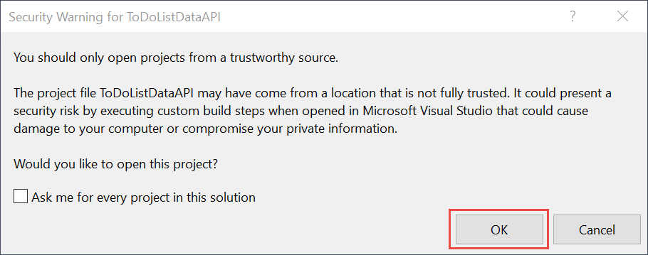
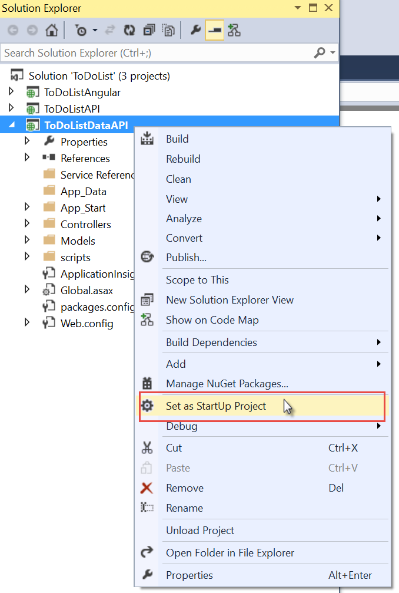
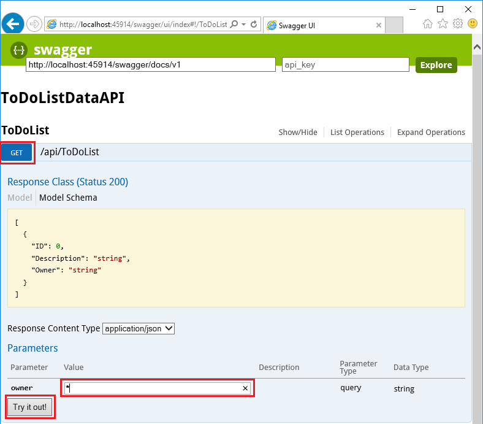
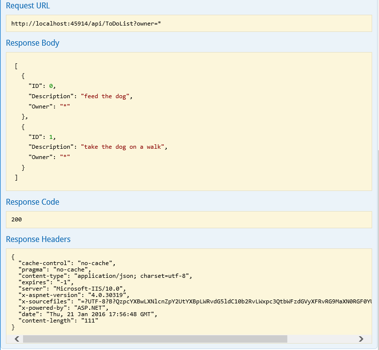
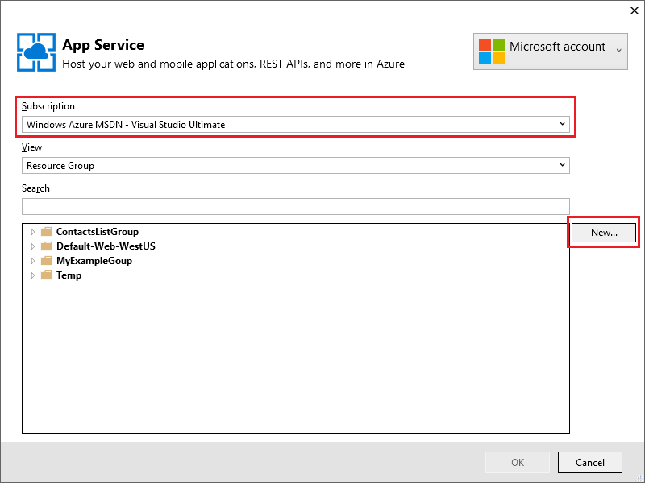
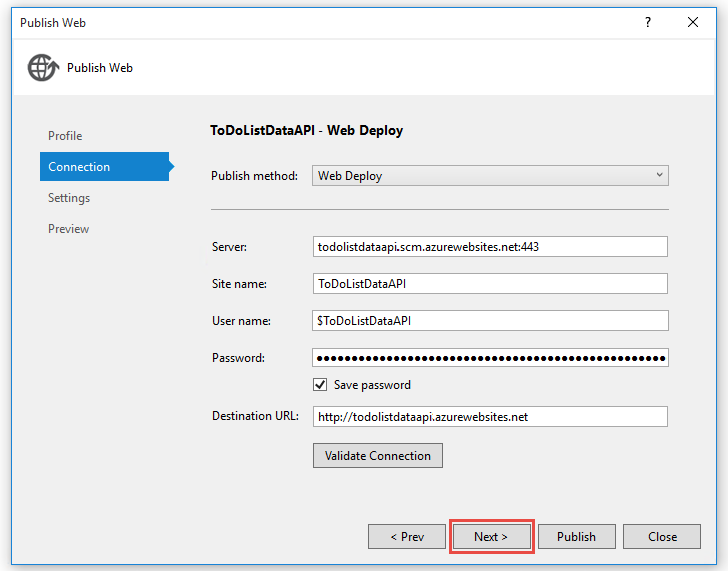
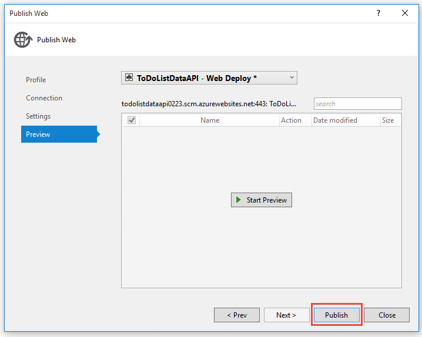
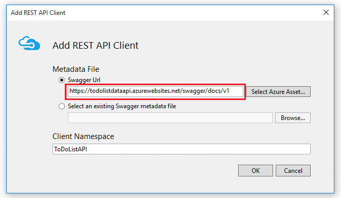

<properties
    pageTitle="Introdução aos aplicativos de API e ASP.NET no serviço de aplicativo | Microsoft Azure"
    description="Aprenda a criar, implantar e consumir um aplicativo de API do ASP.NET no serviço de aplicativo do Azure, usando o Visual Studio 2015."
    services="app-service\api"
    documentationCenter=".net"
    authors="tdykstra"
    manager="wpickett"
    editor=""/>

<tags
    ms.service="app-service-api"
    ms.workload="na"
    ms.tgt_pltfrm="dotnet"
    ms.devlang="na"
    ms.topic="hero-article"
    ms.date="09/20/2016"
    ms.author="rachelap"/>

# Introdução ao API aplicativos, ASP.NET e Swagger em um serviço de aplicativo do Azure

[AZURE.INCLUDE [selector](../../includes/app-service-api-get-started-selector.md)]

Este é o primeiro de uma série de tutoriais que mostram como usar os recursos do serviço de aplicativo do Azure que são úteis para desenvolver e hospedar APIs RESTful.  Este tutorial apresenta suporte para metadados de API no formato de Swagger.

Você aprenderá:

* Como criar e implantar [aplicativos de API](app-service-api-apps-why-best-platform.md) no serviço de aplicativo do Azure usando ferramentas integradas do Visual Studio de 2015.
* Como automatizar a detecção de API, usando o pacote de Swashbuckle NuGet para gerar dinamicamente API Swagger metadados.
* Como usar a API Swagger metadados para gerar automaticamente o código do cliente para um aplicativo de API.

## Visão geral do aplicativo de amostra

Neste tutorial, você trabalhar com um aplicativo de exemplo de lista de tarefas pendentes simples. O aplicativo tem um front-end do aplicativo de página única (SPA), uma camada intermediária API Web do ASP.NET e uma camada de dados de API Web do ASP.NET.

Aqui está uma captura de tela do front-end [AngularJS](https://angularjs.org/) .

A solução do Visual Studio inclui três projetos:

* **ToDoListAngular** - front-end: um SPA AngularJS que chama a camada intermediária.

* **ToDoListAPI** - camada intermediária: um projeto de API Web do ASP.NET que chama a camada de dados para executar operações de CRUD em itens pendentes.

* **ToDoListDataAPI** - a camada de dados: um projeto de API Web do ASP.NET que efetua operações CRUD em itens pendentes.

A arquitetura de três camadas é uma das muitas arquiteturas que você pode implementar usando aplicativos de API e é usado aqui somente para fins de demonstração. O código em cada camada é tão simple quanto possível demonstrar recursos de aplicativos de API; Por exemplo, a camada de dados usa memória do servidor em vez de um banco de dados como seu mecanismo de persistência.

Em Concluindo neste tutorial, você terá os dois projetos de API Web para cima e em execução na nuvem nos aplicativos da API do serviço de aplicativo.

O próximo tutorial na série implanta o front-end SPA na nuvem.

## Pré-requisitos

* API de Web do ASP.NET - as instruções tutoriais pressupõem que você tenha um conhecimento básico sobre como trabalhar com ASP.NET [Web API 2](http://www.asp.net/web-api/overview/getting-started-with-aspnet-web-api/tutorial-your-first-web-api) no Visual Studio.

* Conta do Microsoft Azure - você pode [Abrir uma conta do Azure gratuitamente](/pricing/free-trial/?WT.mc_id=A261C142F) ou [Ativar o Visual Studio benefícios do assinante](/pricing/member-offers/msdn-benefits-details/?WT.mc_id=A261C142F).

    Se você deseja começar a usar o serviço de aplicativo do Azure antes de se inscrever para uma conta do Azure, vá para [Experimentar o serviço de aplicativo](http://go.microsoft.com/fwlink/?LinkId=523751). Lá, você pode criar imediatamente um aplicativo de curta duração starter no serviço de aplicativo — **sem cartão de crédito necessários**e nenhum compromissos.

* Visual Studio de 2015 com o [SDK do Azure para .NET](https://azure.microsoft.com/downloads/archive-net-downloads/) - o SDK instala Visual Studio 2015 automaticamente se você ainda não tivê-lo.

    * No Visual Studio, clique em Ajuda -> sobre o Microsoft Visual Studio e certifique-se de que você tenha "Ferramentas de serviço de aplicativo Azure v2.9.1" ou posterior instalado.

    

    >[AZURE.NOTE] Dependendo de quantos das dependências SDK você já tiver em sua máquina, instalar o SDK pode levar muito tempo, de alguns minutos a meia hora ou mais.

## Baixe o aplicativo de amostra

1. Baixe o repositório [Azure-Samples/app-service-api-dotnet-to-do-list](https://github.com/Azure-Samples/app-service-api-dotnet-todo-list) .

    Você pode clicar no botão **Baixar ZIP** ou clonar repositório em sua máquina local.

2. Abra a solução de lista de tarefas pendentes no Visual Studio 2015 ou 2013.
   1. Você precisará confiar cada solução.
        

3. Crie a solução (CTRL + SHIFT + B) para restaurar os pacotes NuGet.

    Se você quiser ver o aplicativo em operação antes de implantá-lo, você pode executá-lo localmente. Verifique se ToDoListDataAPI é seu projeto de inicialização e executar a solução. Você deve esperar ver um erro de HTTP 403 no seu navegador.

## Usar a API Swagger metadados e interfaces do usuário

Suporte para [Swagger](http://swagger.io/) 2.0 API metadados interna do serviço de aplicativo do Azure. Cada aplicativo API pode especificar um ponto de extremidade de URL que retorna metadados para a API no formato JSON Swagger. Os metadados retornados de ponto de extremidade podem ser usados para gerar o código do cliente.

Um projeto de API Web do ASP.NET dinamicamente pode gerar Swagger metadados usando o pacote de NuGet [Swashbuckle](https://www.nuget.org/packages/Swashbuckle) . O pacote Swashbuckle NuGet já está instalado nos projetos ToDoListDataAPI e ToDoListAPI que você baixou.

Nesta seção do tutorial, você examinará os metadados Swagger 2.0 gerado e, depois, experimente um teste de interface do usuário com base em metadados Swagger.

1. Defina o projeto de ToDoListDataAPI (**não** no projeto ToDoListAPI) como o projeto de inicialização.

    

2. Pressione F5 ou clique **Depurar > Iniciar depuração** para executar o projeto no modo de depuração.

    O navegador é aberta e mostra a página de erro de HTTP 403.

3. Na barra de endereços do navegador, adicione `swagger/docs/v1` até o final da linha e pressione Return. (A URL é `http://localhost:45914/swagger/docs/v1`.)

    Esta é a URL de padrão usada pelo Swashbuckle para retornar Swagger 2.0 JSON metadados da API.

    Se você estiver usando o Internet Explorer, o navegador solicitará que você baixar um arquivo de *v1.json* .

    

    Se você estiver usando o Chrome, Firefox ou borda, o navegador exibirá o JSON na janela do navegador. Navegadores diferentes tratar JSON de forma diferente e a janela do navegador não pode parecer exatamente com o exemplo.

    

    O exemplo a seguir mostra a primeira seção dos metadados Swagger para a API, com a definição para o método Get. Esses metadados são que conduz Swagger interface do usuário que você usa nas etapas a seguir, e você pode usá-lo em uma seção posterior do tutorial para gerar automaticamente o código do cliente.

        {
          "swagger": "2.0",
          "info": {
            "version": "v1",
            "title": "ToDoListDataAPI"
          },
          "host": "localhost:45914",
          "schemes": [ "http" ],
          "paths": {
            "/api/ToDoList": {
              "get": {
                "tags": [ "ToDoList" ],
                "operationId": "ToDoList_GetByOwner",
                "consumes": [ ],
                "produces": [ "application/json", "text/json", "application/xml", "text/xml" ],
                "parameters": [
                  {
                    "name": "owner",
                    "in": "query",
                    "required": true,
                    "type": "string"
                  }
                ],
                "responses": {
                  "200": {
                    "description": "OK",
                    "schema": {
                      "type": "array",
                      "items": { "$ref": "#/definitions/ToDoItem" }
                    }
                  }
                },
                "deprecated": false
              },

4. Feche o navegador e parar depuração no Visual Studio.

5. No projeto ToDoListDataAPI no **Solution Explorer**, abra o arquivo *App_Start\SwaggerConfig.cs* , e em seguida, role para baixo até a linha 174 e ignore o seguinte código.

        /*
            })
        .EnableSwaggerUi(c =>
            {
        */

    O arquivo *SwaggerConfig.cs* é criado quando você instala o pacote de Swashbuckle em um projeto. O arquivo fornece várias maneiras para configurar Swashbuckle.

    O código que você já removidos habilita Swagger interface do usuário que você usa nas etapas a seguir. Quando você cria um projeto de API da Web usando o modelo de projeto de aplicativo de API, este código é comentado por padrão como uma medida de segurança.

6. Execute o projeto novamente.

7. Na barra de endereços do navegador, adicione `swagger` até o final da linha e pressione Return. (A URL é `http://localhost:45914/swagger`.)

8. Quando a página de interface do usuário Swagger aparecer, clique em **lista de tarefas** para ver os métodos disponíveis.

    

9. Clique no botão **obter** primeiro na lista.

10. Na seção **parâmetros** , digite um asterisco como o valor da `owner` parâmetro e clique em **Experimente**.

    Quando você adiciona autenticação tutoriais posterior, a camada intermediária fornecerá a ID de usuário real à camada de dados. Por agora, todas as tarefas terá asterisco como sua ID de proprietário enquanto o aplicativo é executado sem autenticação habilitada.

    

    A interface do usuário Swagger chamadas Get lista de tarefas do método e exibe o código de resposta e JSON resultados.

    

11. Clique em **postar**e, em seguida, clique na caixa em **Esquema de modelo**.

    Clicando no esquema de modelo prefills caixa de entrada, onde você pode especificar o valor do parâmetro para o método de postagem. (Se isso não funcionar no Internet Explorer, use um navegador diferente ou insira o valor do parâmetro manualmente na próxima etapa.)  

    

12. Alterar o JSON no `todo` parâmetro de entrada para que ele se parece com o exemplo a seguir, ou na caixa Substituir por seu próprio texto de descrição:

        {
          "ID": 2,
          "Description": "buy the dog a toy",
          "Owner": "*"
        }

13. Clique em **Experimente**.

    A API de lista de tarefas pendentes retorna um código de resposta de HTTP 204 que indica sucesso.

14. Clique no botão **obter** primeiro e clique em botão **Experimente** nessa seção da página.

    A resposta do método Get agora inclui a nova ao item.

15. Opcional: Também tente a colocação, excluir e obter por métodos de ID.

16. Feche o navegador e parar depuração no Visual Studio.

Swashbuckle funciona com qualquer projeto de API Web do ASP.NET. Se você quiser adicionar Swagger geração de metadados a um projeto existente, basta instale o pacote de Swashbuckle.

>[AZURE.NOTE] Metadados de swagger incluem uma identificação exclusiva para cada operação de API. Por padrão, Swashbuckle pode gerar operação duplicada Swagger IDs para seus métodos de controlador de API da Web. Isso acontece se seu controlador tem sobrecarregado métodos HTTP, tais como `Get()` e `Get(id)`. Para obter informações sobre como lidar com sobrecargas, consulte [as definições da API gerados pelo Swashbuckle personalizar](app-service-api-dotnet-swashbuckle-customize.md). Se você criar um projeto de API da Web no Visual Studio usando o modelo de aplicativo de API do Azure, código que gera IDs de operação único é adicionado automaticamente ao arquivo *SwaggerConfig.cs* .  

## Criar um aplicativo de API no Azure e implantar código a ele

Nesta seção, use o Azure ferramentas que estão integradas no Assistente do Visual Studio **Publicar Web** para criar um novo aplicativo de API no Azure. Em seguida, você implantar o projeto ToDoListDataAPI o novo aplicativo de API e chamar a API executando a interface do usuário Swagger.

1. No **Solution Explorer**, clique com botão direito no projeto ToDoListDataAPI e clique em **Publicar**.

    

2.  Na etapa do assistente **Publicar Web** **perfil** , clique em **Serviço de aplicativo do Microsoft Azure**.

    

3. Entre sua conta do Azure se você ainda não tiver feito isso, ou atualizar suas credenciais se ele estiverem expirados.

4. Na caixa de diálogo serviço de aplicativo, escolha o Azure **assinatura** que você deseja usar e clique em **novo**.

    

    A guia de **hospedagem** da caixa de diálogo **Criar serviço de aplicativo** aparece.

    Porque você está implantando um projeto de API da Web que tem Swashbuckle instalado, o Visual Studio supõe que você deseja criar um API App. Isso é indicado pelo título **Nome do aplicativo de API** e pelo fato de que a lista suspensa de **Alterar tipo** está definida como **API do aplicativo**.

    

5. Insira um **Nome de aplicativo da API** exclusivo no domínio *azurewebsites.net* . Você pode aceitar o nome padrão que Visual Studio propõe.

    Se você inserir um nome que alguém já tenha usado, você verá um ponto de exclamação vermelho para a direita.

    A URL do aplicativo API será `{API app name}.azurewebsites.net`.

6. No menu suspenso **Grupo de recursos** , clique em **novo**e digite "ToDoListGroup" ou outro nome se você preferir.

    Um grupo de recursos é uma coleção de recursos Azure como API aplicativos, bancos de dados, VMs e assim por diante. Para este tutorial, é melhor criar um novo grupo de recursos, porque o que facilita a excluir, em uma etapa, todos os recursos Azure que você cria para o tutorial.

    Essa caixa permite que você selecione um [grupo de recursos](../azure-resource-manager/resource-group-overview.md) de existente ou criar um novo digitando um nome diferente de qualquer grupo de recursos existentes em sua assinatura.

7. Clique no botão **novo** ao lado do **Plano de serviço de aplicativo** suspenso.

    A captura de tela mostra valores de exemplo do **Nome do aplicativo de API**, **assinatura**e **Grupo de recursos** , que os valores serão diferentes.

    

    Nas etapas a seguir, você cria um plano de serviço de aplicativo para o novo grupo de recursos. Um plano de serviço de aplicativo especifica os recursos de computação que seu aplicativo de API é executado em. Por exemplo, se você escolher a camada gratuita, seu aplicativo de API é executado no VMs compartilhadas, enquanto para alguns níveis pagos, ele é executado em VMs dedicadas. Para obter informações sobre planos de serviço de aplicativo, consulte [Visão geral de planos de serviço de aplicativo](../app-service/azure-web-sites-web-hosting-plans-in-depth-overview.md).

8. Na caixa de diálogo **Configurar o plano de serviço de aplicativo** , insira "ToDoListPlan" ou outro nome se você preferir.

9. Na lista suspensa **local** , escolha o local que for mais próximo a você.

    Esta configuração especifica quais Azure data center seu aplicativo será executado em. Escolha um local próximo a minimizar [latência](http://www.bing.com/search?q=web%20latency%20introduction&qs=n&form=QBRE&pq=web%20latency%20introduction&sc=1-24&sp=-1&sk=&cvid=eefff99dfc864d25a75a83740f1e0090).

10. Na lista suspensa **tamanho** , clique em **livre**.

    Para este tutorial, o nível de preços gratuito fornecerá suficientes de desempenho.

11. Na caixa de diálogo **Configurar o plano de serviço de aplicativo** , clique em **Okey**.

    

12. Na caixa de diálogo **Criar serviço de aplicativo** , clique em **criar**.

    

    Visual Studio cria o aplicativo de API e um perfil de publicação com todas as configurações necessárias para o aplicativo de API. Em seguida, ele abre o assistente **Publicar Web** , que você usará para implantar o projeto.

    O Assistente de **Publicar Web** abre na guia **Conexão** (mostrada abaixo).

    Na guia **Conexão** , as configurações de **servidor** e o **nome do Site** apontar para o seu aplicativo de API. O **nome de usuário** e a **senha** são credenciais de implantação que Azure cria para você. Após a implantação, o Visual Studio abre um navegador para a **URL de destino** (que é a única finalidade para a **URL de destino**).  

13. Clique em **Avançar**.

    

    A próxima guia é a guia de **configurações** (mostrada abaixo). Aqui você pode alterar a guia de configuração de compilação para implantar uma compilação de depuração para [depuração remota](../app-service-web/web-sites-dotnet-troubleshoot-visual-studio.md#remotedebug). Na guia também oferece várias **Opções de publicação do arquivo**:

    * Remover arquivos adicionais no destino
    * Pré-compilar durante a publicação
    * Excluir arquivos da pasta App_Data

    Para este tutorial, você não precisa qualquer um destes procedimentos. Para obter explicações detalhadas sobre o que fazer, consulte [como: implantar um Web Project usando um único clique publicar no Visual Studio](https://msdn.microsoft.com/library/dd465337.aspx).

14. Clique em **Avançar**.

    

    Próximo está na guia **Visualizar** (mostrada abaixo), que fornece a oportunidade de ver quais arquivos vocês sejam copiados do seu projeto para o aplicativo de API. Quando você estiver implantando um projeto em um aplicativo de API que você já implantado anteriormente, somente os arquivos alterados são copiados. Se você quiser ver uma lista das quais serão copiados, você pode clique no botão **Iniciar Visualizar** .

15. Clique em **Publicar**.

    

    Visual Studio implanta o projeto ToDoListDataAPI para o novo aplicativo de API. A janela de **saída** registra implantação bem-sucedida e uma página "criado com êxito" aparece em uma janela de navegador aberta para a URL do aplicativo API.

    

    

16. Adicionar "swagger" para a URL na barra de endereços do navegador e pressione Enter. (A URL é `http://{apiappname}.azurewebsites.net/swagger`.)

    O navegador exibe a mesma Swagger interface de usuário que você viu anteriormente, mas agora está em execução na nuvem. Experimentar o método Get, e você verá que você está volta para os itens de tarefas pendentes 2 padrão. As alterações feitas anteriormente foram salvas na memória no computador local.

17. Abra o [portal do Azure](https://portal.azure.com/).

    O portal Azure é uma interface de web para gerenciar recursos Azure como API aplicativos.

18. Clique em **mais serviços > Serviços de aplicativo**.

    

19. Na lâmina de **Serviços de aplicativo** , localize e clique em seu novo aplicativo de API. (No portal do Azure, janelas que são abertas à direita são chamadas *blades*.)

    

    Duas lâminas abrir. Um blade tem uma visão geral do aplicativo API e uma tem uma lista longa de configurações que você possa exibir e alterar.

20. Na lâmina **configurações** , localize a seção de **API** e clique em **Definição de API**.

    

    A lâmina de **Definição de API** permite especificar a URL que retorna metadados de Swagger 2.0 no formato JSON. Quando o Visual Studio cria o aplicativo de API, ele define a URL de definição de API para o valor padrão para Swashbuckle metadados gerados pelo que você viu anteriormente, que é o aplicativo de API base URL plus `/swagger/docs/v1`.

    

    Quando você selecionar um aplicativo de API para gerar o código do cliente para ele, o Visual Studio recupera os metadados desta URL.

## Gerar código do cliente para a camada de dados

Uma das vantagens de integrar Swagger aplicativos de API do Azure é geração automática de código. Cliente gerado classes facilitam escrever código que chama um aplicativo de API.

O projeto de ToDoListAPI já tem o código do cliente gerado, mas nas etapas a seguir, você deverá excluí-la e gerá-la novamente para ver como fazer a geração de código.

1. No Visual Studio **Solution Explorer**, no projeto ToDoListAPI, exclua a pasta *ToDoListDataAPI* . **Cuidado: Exclua apenas a pasta, não o projeto ToDoListDataAPI.**

    

    Esta pasta foi criada usando o processo de geração de código que você está prestes a dar uma olhada.

2. Clique com botão direito no projeto ToDoListAPI e clique **Adicionar > cliente da API REST**.

    

3. Na caixa de diálogo **Adicionar cliente da API REST** , clique **Swagger URL**e clique em **Selecionar Azure ativo**.

    

4. Na caixa de diálogo **Serviço de aplicativo** , expanda o grupo de recursos que você está usando para este tutorial e selecione seu aplicativo de API e clique em **Okey**.

    

    Observe que quando você retornar à caixa de diálogo **Adicionar cliente da API REST** , na caixa de texto tem sido preenchida com a definição de API valor da URL que você viu anteriormente no portal.

    

    >[AZURE.TIP] É uma maneira alternativa de obter metadados para geração de código inserir o URL diretamente, em vez de percorrer a caixa de diálogo Procurar. Ou, se você quiser gerar código de cliente antes de implantar no Azure, você pode executar o projeto de Web API localmente, vá para a URL que fornece o arquivo de Swagger JSON, salve o arquivo e, em seguida, use a opção de **Selecionar um arquivo de metadados de Swagger existente** .

5. Na caixa de diálogo **Adicionar cliente da API REST** , clique em **Okey**.

    Visual Studio cria uma pasta chamada após o aplicativo de API e gera classes de cliente.

    

6. No projeto ToDoListAPI, abra *Controllers\ToDoListController.cs* para ver o código na linha 40 que chama a API usando o cliente gerado.

    O trecho a seguir mostra como o código cria o objeto cliente e chama o método Get.

        private static ToDoListDataAPI NewDataAPIClient()
        {
            var client = new ToDoListDataAPI(new Uri(ConfigurationManager.AppSettings["toDoListDataAPIURL"]));
            return client;
        }

        public async Task<IEnumerable<ToDoItem>> Get()
        {
            using (var client = NewDataAPIClient())
            {
                var results = await client.ToDoList.GetByOwnerAsync(owner);
                return results.Select(m => new ToDoItem
                {
                    Description = m.Description,
                    ID = (int)m.ID,
                    Owner = m.Owner
                });
            }
        }

    O parâmetro de construtor obtém a URL de ponto de extremidade do `toDoListDataAPIURL` configuração do aplicativo. No arquivo Web. config, esse valor é definido como a URL de Express de IIS local do projeto API para que você possa executar o aplicativo localmente. Se você omitir o parâmetro de construtor, o ponto de extremidade padrão é a URL que você gerou o código.

7. Sua classe de cliente será gerado com um nome diferente, com base em seu nome de aplicativo de API; Altere o código de *Controllers\ToDoListController.cs* para que o nome do tipo corresponda o que foi gerado em seu projeto. Por exemplo, se você chamar sua API App ToDoListDataAPI071316, altere este código:

        private static ToDoListDataAPI NewDataAPIClient()
        {
            var client = new ToDoListDataAPI(new Uri(ConfigurationManager.AppSettings["toDoListDataAPIURL"]));

assim:

        private static ToDoListDataAPI071316 NewDataAPIClient()
        {
            var client = new ToDoListDataAPI071316(new Uri(ConfigurationManager.AppSettings["toDoListDataAPIURL"]));

## Criar um aplicativo de API para hospedar a camada intermediária

Anteriores que você [criou o aplicativo de API de nível de dados e implantado código a ele](#createapiapp).  Agora que você siga o mesmo procedimento para o aplicativo de API intermediária.

1. No **Solution Explorer**, clique com botão direito a camada intermediária ToDoListAPI projeto (não a camada de dados ToDoListDataAPI) e clique em **Publicar**.

    

2.  Na guia **perfil** do assistente **Publicar Web** , clique em **Serviço de aplicativo do Microsoft Azure**.

3. Na caixa de diálogo **Serviço de aplicativo** , clique em **novo**.

4. Na guia **hospedagem** da caixa de diálogo **Criar serviço de aplicativo** , aceite o **Nome do aplicativo de API** padrão ou insira um nome exclusivo no domínio *azurewebsites.net* .

5. Escolha o Azure **assinatura** você tem usado.

6. Na lista suspensa **Grupo de recursos** , escolha o mesmo grupo de recursos que você criou anteriormente.

7. Na lista suspensa **Plano de serviço de aplicativo** , escolha o mesmo plano que você criou anteriormente. O padrão será para esse valor.

8. Clique em **criar**.

    O Visual Studio cria o aplicativo de API, cria um perfil de publicação para ele e exibe a etapa de **Conexão** do assistente **Publicar Web** .

9.  Na etapa **Conexão** do assistente **Publicar Web** , clique em **Publicar**.

    Visual Studio implanta o projeto ToDoListAPI para o novo aplicativo de API e abre um navegador para a URL do aplicativo API. A página "criada com êxito" aparece.

## Configurar a camada intermediária para chamar a camada de dados

Se você chamou o aplicativo de camada intermediária API agora, seria, tente chamar a camada de dados usando a URL do host local que ainda está no arquivo Web. config. Nesta seção você insira a URL de aplicativo de API de nível de dados em uma configuração de ambiente no aplicativo API intermediária. Quando o código no aplicativo intermediária API recupera a configuração de URL de nível de dados, a configuração de ambiente substituirá o que é o arquivo Web. config.

1. Acesse o [portal do Azure](https://portal.azure.com/)e depois navegue até a lâmina de **API do aplicativo** para o aplicativo de API que você criou para hospedar o projeto TodoListAPI (camada intermediária).

2. Na lâmina de **configurações** do App a API, clique em **configurações do aplicativo**.

3. Em lâmina de **Configurações do aplicativo** do App a API, role para baixo até a seção **configurações de aplicativo** e adicione a seguinte chave e valor. O valor será a URL do primeiro App API você publicou neste tutorial.

  	| **Chave** | toDoListDataAPIURL |
  	|---|---|
  	| **Valor** | nome do aplicativo de nível API de dados de HTTPS://{Your} .azurewebsites .net |
  	| **Exemplo** | https://todolistdataapi.azurewebsites.NET |

4. Clique em **Salvar**.

    

    Quando o código é executado no Azure, esse valor agora substituirá a URL do host local que está no arquivo Web. config.

## Teste

1. Na janela do navegador, navegue até a URL do novo aplicativo de API intermediária que você acabou de criar para ToDoListAPI. Você pode fazê-lo clicando no URL em lâmina principal de API do aplicativo no portal.

2. Adicionar "swagger" para a URL na barra de endereços do navegador e pressione Enter. (A URL é `http://{apiappname}.azurewebsites.net/swagger`.)

    O navegador exibe a mesma Swagger interface de usuário que você viu anteriormente para ToDoListDataAPI, mas agora `owner` não é um campo obrigatório para a operação, porque o aplicativo de camada intermediária API está enviando esse valor para o aplicativo de API de nível de dados para você. (Quando você fizer os tutoriais de autenticação, a camada intermediária enviará IDs de usuário real o `owner` parâmetro; para agora ele é embutir um asterisco.)

3. Experimente o método Get e outros métodos para validar que o aplicativo de API intermediária é chamada com êxito o aplicativo de API de nível de dados.

    

## Solução de problemas

Caso você se deparar com um problema como passar por este tutorial aqui estão algumas ideias para solução de problemas:

* Certifique-se de que você está usando a versão mais recente do [SDK do Azure para .NET](http://go.microsoft.com/fwlink/?linkid=518003).

* Dois dos nomes de projeto são semelhante (ToDoListAPI, ToDoListDataAPI). Se não estiver tudo conforme descrito nas instruções quando você estiver trabalhando com um projeto, certifique-se de que você abriu o projeto correto.

* Se você estiver em uma rede corporativa e está tentando implantar o serviço de aplicativo do Azure através de um firewall, verifique se que portas 443 e 8172 estão abertas para implantação da Web. Se você não pode abrir as portas, você pode usar outros métodos de implantação.  Consulte [implantar seu aplicativo de serviço de aplicativo do Azure](../app-service-web/web-sites-deploy.md).

* Erros de "nomes de roteiro devem ser exclusivos" – você pode obter essas se você acidentalmente implantar o projeto errado um aplicativo de API e implanta uma correta-lo mais tarde. Para corrigir isso, reimplantação o projeto correto para o aplicativo de API e, na guia **configurações** do assistente **Publicar Web** selecione **Remover arquivos adicionais no destino**.

Depois que seu aplicativo de API do ASP.NET em execução no serviço de aplicativo do Azure, talvez você queira saber mais sobre os recursos do Visual Studio que simplificam a solução de problemas. Para obter informações sobre o log, depuração remota e muito mais, consulte [solução de problemas de serviço de aplicativo do Azure aplicativos no Visual Studio](../app-service-web/web-sites-dotnet-troubleshoot-visual-studio.md).

## Próximas etapas

Você viu como implantar projetos de API Web existentes em aplicativos de API, gerar código do cliente para aplicativos de API e consumir API aplicativos de clientes .NET. O próximo tutorial nesta série mostra como [usar CORS para consumir aplicativos da API do JavaScript clientes](app-service-api-cors-consume-javascript.md).

Para obter mais informações sobre geração de código do cliente, consulte o repositório do [Azure/AutoRest](https://github.com/azure/autorest) em GitHub.com. Para obter ajuda com problemas usando o cliente gerado, abra um [problema no repositório AutoRest](https://github.com/azure/autorest/issues).

Se você quiser criar novos projetos de aplicativo da API do zero, use o modelo de **Aplicativo de API do Azure** .

O modelo de projeto de **Aplicativo de API do Azure** é equivalente a escolher a **vazia** ASP.NET 4.5.2 modelo, clicando na caixa de seleção para adicionar o suporte de Web API e instalar o pacote de Swashbuckle NuGet. Além disso, o modelo adiciona alguns código de configuração de Swashbuckle projetado para impedir a criação de operação Swagger duplicada IDs. Depois que você tiver criado um projeto de API App, você pode implantá-lo para um aplicativo de API da mesma maneira que você viu neste tutorial.
