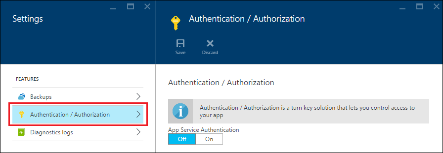

<properties
    pageTitle="Autenticação principal do serviço para os aplicativos da API do serviço de aplicativo do Azure | Microsoft Azure"
    description="Aprenda a proteger um aplicativo de API do serviço de aplicativo do Azure para cenários de serviço para."
    services="app-service\api"
    documentationCenter=".net"
    authors="tdykstra"
    manager="wpickett"
    editor=""/>

<tags
    ms.service="app-service-api"
    ms.workload="na"
    ms.tgt_pltfrm="dotnet"
    ms.devlang="na"
    ms.topic="article"
    ms.date="06/30/2016" 
    ms.author="rachelap"/>

# Autenticação principal do serviço para os aplicativos da API do serviço de aplicativo do Azure

## Visão geral

Este artigo explica como usar a autenticação do serviço de aplicativo *interno* acesso aos aplicativos de API. Um cenário interno é onde você tem um aplicativo de API que você deseja ser consumo somente pelo seu próprio código de aplicativo. A maneira recomendada para implementar este cenário no serviço de aplicativo é usar o Azure AD para proteger o aplicativo de API chamado. Você chamar o aplicativo de API protegido com um token de portador que você obtenha do Azure AD fornecendo a identidade do aplicativo credenciais (serviço principal). Para alternativas ao uso Azure AD, consulte a seção **autenticação de serviço para** a [Visão geral de autenticação do serviço de aplicativo do Azure](../app-service/app-service-authentication-overview.md#service-to-service-authentication).

Neste artigo, você aprenderá:

* Como usar o Azure Active Directory (AD Azure) para proteger um aplicativo de API de acesso não autenticado.
* Como consumir um aplicativo de API protegido de um aplicativo de API, aplicativo web ou aplicativo móvel usando credenciais de capital (identidade de aplicativo) de serviço do Azure AD. Para obter informações sobre como consumir a partir de um aplicativo de lógica, consulte [usando sua API personalizado hospedado no serviço de aplicativo com aplicativos de lógica](../app-service-logic/app-service-logic-custom-hosted-api.md).
* Como certificar-se de que o aplicativo de API protegido não pode ser chamado de um navegador pelos usuários conectados.
* Como para certificar-se de que o aplicativo de API protegido só pode ser chamado por um específico Azure AD de serviços de capital.

O artigo contém duas seções:

* A seção de [como configurar a autenticação principal do serviço no serviço de aplicativo do Azure](#authconfig) em geral explica como configurar a autenticação de qualquer aplicativo de API e como consumir o aplicativo de API protegido. Esta seção aplica-se igualmente a todas as estruturas suportadas pelo serviço de aplicativo, incluindo .NET, node e Java.

* Começando com a seção [continuar os tutoriais do guia de Introdução do .NET](#tutorialstart) , o tutorial orienta Configurando um cenário de "acesso interno" para um aplicativo de amostra do .NET em execução no aplicativo de serviço. 

## Como configurar a autenticação principal do serviço no serviço de aplicativo do Azure

Esta seção fornece instruções gerais que se aplicam a qualquer aplicativo de API. Para obter etapas específicas para o aplicativo de amostra para fazer .NET da lista, vá para [continuar a série de tutoriais do .NET API aplicativos](#tutorialstart).

1. No [portal do Azure](https://portal.azure.com/), navegue até a lâmina de **configurações** do aplicativo API que você deseja proteger, localize a seção de **recursos** e clique **autenticação / autorização**.

    

3. No **autenticação / autorização** lâmina, clique **em**.

4. Na lista suspensa **fazer quando solicitação não é autenticada** , selecione **fazer logon com o Active Directory do Azure** .

5. Em **Provedores de autenticação**, selecione **Active Directory do Azure**.

    

6. Configurar a lâmina de **Configurações do Azure Active Directory** para criar um novo aplicativo do Azure AD, ou usar um aplicativo do Azure AD existente se você já tiver um que você deseja usar.

    Cenários internos normalmente envolvem um aplicativo de API chamar um aplicativo de API. Você pode usar o Azure separado aplicativos AD para cada aplicativo API ou apenas um aplicativo do Azure AD.

    Para obter instruções detalhadas sobre esse blade, consulte [como configurar seu aplicativo de serviço de aplicativo para usar o logon do Active Directory do Azure](../app-service-mobile/app-service-mobile-how-to-configure-active-directory-authentication.md).

7. Quando terminar com a lâmina de configuração de provedor de serviços de autenticação, clique em **Okey**.

7. No **autenticação / autorização** lâmina, clique em **Salvar**.

    

Quando isso é feito, o serviço de aplicativo somente permite solicitações do chamadores em configurado locatário Azure AD. Nenhum código de autenticação ou autorização é necessária no aplicativo API protegido. O token de portador é passado para o aplicativo de API juntamente com comumente usadas declarações em cabeçalhos HTTP e você pode ler as informações no código para validar que solicitações são provenientes de um chamador específico, como uma entidade de segurança do serviço.

Esta funcionalidade de autenticação funciona da mesma maneira para todos os idiomas que suporta de serviço de aplicativo, incluindo .NET, node e Java. 

#### Como consumir o aplicativo de API protegido

O chamador deve fornecer um token de portador Azure AD com chamadas API. Para obter um token de portador usando credenciais principal do serviço, o chamador usa biblioteca de autenticação do Active Directory (ADAL para [.NET](https://www.nuget.org/packages/Microsoft.IdentityModel.Clients.ActiveDirectory), [Node](https://github.com/AzureAD/azure-activedirectory-library-for-nodejs)ou [Java](https://github.com/AzureAD/azure-activedirectory-library-for-java)). Para obter um token, o código que chama ADAL fornece a ADAL as seguintes informações:

* O nome do seu locatário do Azure AD.
* A ID do cliente e o segredo do cliente (tecla de aplicativo) do aplicativo Azure AD associado com o chamador.
* A ID do cliente do aplicativo Azure AD associado com o aplicativo de API protegido. (Se apenas um aplicativo do Azure AD for usado, essa é a mesma identificação de cliente que aquele para o chamador.)

Esses valores estão disponíveis nas páginas do Azure AD do [Azure portal clássico](https://manage.windowsazure.com/).

Depois que o token foi adquirido, o chamador inclui com solicitações HTTP no cabeçalho de autorização.  Serviço de aplicativo valida o token e permite que as solicitações acessar o aplicativo de API protegido.

#### Como proteger o aplicativo de API do acesso de usuários no mesmo locatário

Tokens de portador de usuários no mesmo locatário são considerados válidos para o aplicativo de API protegido.  Se você quiser garantir que apenas uma entidade de segurança do serviço pode chamar o aplicativo de API protegido, adicione o código no aplicativo API protegido para validar as seguintes declarações do token:

* `appid`deve ser a identificação de cliente do aplicativo Azure AD que está associado com o chamador. 
* `oid`(`objectidentifier`) deve ser o ID de principal de serviço do chamador. 

Serviço de aplicativo também fornece o `objectidentifier` reivindicar no cabeçalho X-MS-cliente-CAPITAL-ID.

### Como proteger o aplicativo de API acesso a navegador

Se você não validar declarações no código no aplicativo API protegido e se você usar um separado aplicativo do Azure AD para o aplicativo de API protegido, certifique-se de que URL de resposta do aplicativo Azure AD não é a mesma que base URL do aplicativo API. Se a URL de resposta aponta diretamente para o aplicativo de API protegido, um usuário no mesmo locatário Azure AD poderia navegue até o aplicativo de API, faça logon e chamar a API com êxito.

## Continuar a série de tutoriais do .NET API aplicativos

Se você está seguindo a série de tutoriais Node ou Java para aplicativos de API, pule para a seção [próximas etapas](#next-steps) . 

O resto deste artigo continua a série de tutoriais do .NET API aplicativos e pressupõe que você concluiu o [tutorial de autenticação do usuário](app-service-api-dotnet-user-principal-auth.md) e tiver o aplicativo de amostra em execução no Azure com autenticação do usuário habilitada.

## Configurar a autenticação no Azure

Nesta seção você configurar o serviço de aplicativo para que as solicitações HTTP somente ele permite alcançar o aplicativo de API de nível de dados são aquelas que têm Azure válido tokens de portador de AD. 

Na seção a seguir, você configurar o aplicativo de API intermediária para enviar as credenciais do aplicativo para Azure AD, voltar um token de portador e enviar o token de portador para o aplicativo de API de nível de dados. Esse processo é ilustrado no diagrama.

Se você enfrentar problemas enquanto segue as instruções tutoriais, consulte a seção de [solução de problemas](#troubleshooting) no final do tutorial. 

1. No [portal do Azure](https://portal.azure.com/), navegue até a lâmina de **configurações** do aplicativo API que você criou para o aplicativo de API do ToDoListDataAPI (camada de dados) e, em seguida, clique em **configurações**.

2. Na lâmina **configurações** , localize a seção de **recursos** e clique em **autenticação / autorização**.

    

3. No **autenticação / autorização** lâmina, clique **em**.

4. Na lista suspensa **fazer quando solicitação não é autenticada** , selecione **fazer logon com o Active Directory do Azure**.

    Esta é a configuração que faz com que o serviço de aplicativo garantir que apenas autenticados solicitações alcance o aplicativo de API. Para solicitações que têm tokens de portador válido, serviço de aplicativo passa os tokens ao longo de aplicativo API e preenche cabeçalhos HTTP com declarações comumente usados para disponibilizar essas informações com mais facilidade para seu código.

5. Em **Provedores de autenticação**, clique em **Active Directory do Azure**.

    

6. Na lâmina **Configurações do Azure Active Directory** , clique em **Express**.

    Com o **Express** opção Azure pode criar automaticamente um aplicativo AAD em seu [locatário](https://msdn.microsoft.com/en-us/library/azure/jj573650.aspx#BKMK_WhatIsAnAzureADTenant)do Azure AD. 

    Você não precisa criar um locatário, porque cada conta do Azure automaticamente tem uma.

7. Em **modo de gerenciamento**, clique em **Criar novo aplicativo de AD** se já não estiver selecionada.

    O portal conecta-se a caixa de entrada de **Criar aplicativo** com um valor padrão. Por padrão, o aplicativo do Azure AD é chamado a mesma que o aplicativo de API. Se preferir, você pode inserir um nome diferente.
    
    

    **Observação**: como alternativa, você poderia usar um único Azure AD aplicativos para o aplicativo de API chamado e o aplicativo de API protegido. Se você escolheu essa alternativa, você não precisará a opção de **Criar novo aplicativo de AD** aqui porque você já tenha criado um aplicativo do Azure AD anteriormente no tutorial de autenticação do usuário. Neste tutorial, você usará separar aplicativos do Azure AD para o aplicativo de API chamado e o aplicativo de API protegido.

8. Anote o valor que está na caixa de entrada **Criar aplicativo** ; Você vai pesquisar este aplicativo AAD no portal de clássico do Azure mais tarde.

7. Clique em **Okey**.

10. No **autenticação / autorização** lâmina, clique em **Salvar**.

    

    Serviço de aplicativo cria um aplicativo do Azure Active Directory com a **URL de logon** e **URL de resposta** configurar automaticamente para a URL de seu aplicativo de API. O último valor permite que os usuários em seu locatário AAD para efetuar login e acessar o aplicativo de API.

### Verificar se o aplicativo de API é protegido

1. Em um navegador, vá para a URL do aplicativo API: na lâmina **API aplicativo** no portal do Azure, clique no link em **URL**. 

    Você é redirecionado a uma tela de login porque solicitações não autenticadas não tem permissão para acessar o aplicativo de API. 

    Se seu navegador ir para a interface do usuário Swagger, seu navegador já pode estar conectado – nesse caso, abra uma janela InPrivate ou anônima e vá para a URL de interface do usuário Swagger.

18. Fazer logon com as credenciais de um usuário em seu locatário AAD.

    Quando você estiver conectado, a página "criada com êxito" aparece no navegador.

## Configurar o projeto ToDoListAPI para adquirir e enviar o token do Azure AD

Nesta seção você fazer as seguintes tarefas:

* Adicione código no aplicativo API intermediária que usa credenciais de aplicativos do Azure AD para adquirir um token e enviá-lo com solicitações HTTP para o aplicativo de API de nível de dados.
* Obtenha as credenciais que necessárias do Azure AD.
* Insira as credenciais de configurações de ambiente de tempo de execução do serviço de aplicativo do Azure na camada intermediária API aplicativo. 

### Configurar o projeto ToDoListAPI para adquirir e enviar o token do Azure AD

Faça as seguintes alterações no projeto ToDoListAPI no Visual Studio.

1. Tire comentários todo o código no arquivo *ServicePrincipal.cs* .

    Este é o código que usa ADAL para .NET adquirir o token de portador Azure AD.  Ele usa vários valores de configuração que você irá configurar no ambiente de tempo de execução Azure mais tarde. Aqui está o código: 

        public static class ServicePrincipal
        {
            static string authority = ConfigurationManager.AppSettings["ida:Authority"];
            static string clientId = ConfigurationManager.AppSettings["ida:ClientId"];
            static string clientSecret = ConfigurationManager.AppSettings["ida:ClientSecret"];
            static string resource = ConfigurationManager.AppSettings["ida:Resource"];
        
            public static AuthenticationResult GetS2SAccessTokenForProdMSA()
            {
                return GetS2SAccessToken(authority, resource, clientId, clientSecret);
            }
        
            static AuthenticationResult GetS2SAccessToken(string authority, string resource, string clientId, string clientSecret)
            {
                var clientCredential = new ClientCredential(clientId, clientSecret);
                AuthenticationContext context = new AuthenticationContext(authority, false);
                AuthenticationResult authenticationResult = context.AcquireToken(
                    resource,
                    clientCredential);
                return authenticationResult;
            }
        }

    **Observação:** Este código requer o ADAL para .NET NuGet pacote (Microsoft.IdentityModel.Clients.ActiveDirectory), que já está instalado no projeto. Se você estivesse criando esse projeto do zero, você precisa instalar este pacote. Este pacote não é instalado automaticamente pelo modelo de novo projeto de aplicativo da API.

2. Em *Controladores/ToDoListController*, sem comentar o código no `NewDataAPIClient` método que adiciona o token a HTTP solicita no cabeçalho de autorização.

        client.HttpClient.DefaultRequestHeaders.Authorization =
            new AuthenticationHeaderValue("Bearer", ServicePrincipal.GetS2SAccessTokenForProdMSA().AccessToken);

3. Implante o projeto ToDoListAPI. (Clique com botão direito no projeto, clique em **Publicar > Publicar**.)

    Visual Studio implanta o projeto e abre um navegador para URL base do aplicativo da web. Isso mostrará uma página de 403 erro, que é normal para uma tentativa ir para um URL básico de Web API de um navegador.

4. Feche o navegador.

### Obtenha os valores de configuração do Azure AD

11. No [portal de clássico Azure](https://manage.windowsazure.com/), vá ao **Azure Active Directory**.

12. Na guia **diretório** , clique em seu locatário AAD.

14. Clique em **aplicativos > aplicativos minha empresa possui**e clique na marca de seleção.

15. Na lista de aplicativos, clique no nome do que Azure criado para você quando você habilitou a autenticação para o aplicativo de API do ToDoListDataAPI (camada de dados).

16. Clique na guia **Configurar** .

5. Copie o valor de **ID do cliente** e salve-o em um local, que você pode obtê-lo mais tarde. 

8. No portal do clássico Azure voltar para a lista de **aplicativos minha empresa possui**e clique no aplicativo AAD que você criou para o aplicativo de ToDoListAPI API intermediária (aquele que você criou no tutorial anterior, não a um criado neste tutorial).

16. Clique na guia **Configurar** .

5. Copie o valor de **ID do cliente** e salve-o em um local, que você pode obtê-lo mais tarde.

6. Em **chaves**, selecione **1 ano** na lista suspensa **Selecionar duração** .

6. Clique em **Salvar**.

    

7. Copie o valor da chave e salve-o em um local, que você pode obtê-lo mais tarde.

    

### Configurar definições do Azure AD no ambiente de execução do aplicativo intermediária API

1. Acesse o [portal do Azure](https://portal.azure.com/)e depois navegue até a lâmina de **API do aplicativo** para o aplicativo de API que hospeda o projeto TodoListAPI (camada intermediária).

2. Clique em **Configurações > configurações do aplicativo**.

3. Na seção **configurações do aplicativo** , adicione as chaves e os valores a seguir:

  	| **Chave** | Autoridade de ida: |
  	|---|---|
  	| **Valor** | https://login.microsoftonline.com/ {seu nome do locatário do Azure AD} |
  	| **Exemplo** | https://login.microsoftonline.com/Contoso.onmicrosoft.com |

  	| **Chave** | ida: ClientId |
  	|---|---|
  	| **Valor** | ID do cliente do aplicativo de chamada (camada intermediária - ToDoListAPI) |
  	| **Exemplo** | 960adec2-b74a-484a-960adec2-b74a-484a |

  	| **Chave** | ida: ClientSecret |
  	|---|---|
  	| **Valor** | Tecla de aplicativo do aplicativo chamada (camada intermediária - ToDoListAPI) |
  	| **Exemplo** | e65e8fc9-5f6b-48e8-e65e8fc9-5f6b-48e8 |

  	| **Chave** | ida: recurso |
  	|---|---|
  	| **Valor** | ID do cliente do aplicativo chamado (camada de dados - ToDoListDataAPI) |
  	| **Exemplo** | e65e8fc9-5f6b-48e8-e65e8fc9-5f6b-48e8 |

    **Observação**: para `ida:Resource`, verifique se você usar do aplicativo chamado **ID do cliente** e não seu **URI de ID do aplicativo**.

    `ida:ClientId`e `ida:Resource` são diferentes valores para este tutorial, porque você está usando, separar applicaations Azure AD para a camada intermediária e a camada de dados. Se você estivesse usando um único aplicativo do Azure AD para o aplicativo de API chamado e o aplicativo de API protegido, você usaria o mesmo valor em ambos os `ida:ClientId` e `ida:Resource`.

    O código usa ConfigurationManager para obter esses valores, para que elas podem ser armazenadas no arquivo de Web. config do projeto ou no ambiente de tempo de execução Azure. Enquanto um aplicativo ASP.NET é executado no serviço de aplicativo do Azure, configurações de ambiente substituam automaticamente as configurações de Web. config. Configurações de ambiente geralmente são uma [maneira mais segura para armazenar informações confidenciais em comparação a um arquivo Web. config](http://www.asp.net/identity/overview/features-api/best-practices-for-deploying-passwords-and-other-sensitive-data-to-aspnet-and-azure).

6. Clique em **Salvar**.

    

### Testar o aplicativo

1. Em um navegador, vá para a URL de HTTPS do AngularJS front-end web app.

2. Clique na guia **Lista de tarefas pendentes** e log com credenciais para um usuário no seu locatário do Azure AD. 

4. Adicione itens de tarefas pendentes para verificar se o aplicativo está funcionando.

    

    Se o aplicativo não funciona como esperado, verifique todas as configurações que você inseriu no portal do Azure. Se todas as configurações parecem estar correta, consulte a seção de [solução de problemas](#troubleshooting) mais adiante neste tutorial.

## Proteger o aplicativo de API de acesso do navegador

Para este tutorial, você criou um separado aplicativo do Azure AD para o aplicativo de API de ToDoListDataAPI (camada de dados). Como você viu, quando o serviço de aplicativo cria um aplicativo de AAD, ele configura o aplicativo de AAD de uma forma que permite que um usuário vá para URL do aplicativo API em um navegador e faça logon. Isso significa que é possível para um usuário final no seu locatário Azure AD, não apenas um serviço principal, para acessar a API. 

Se você quiser impedir o acesso de navegador sem escrever qualquer código no aplicativo API protegido, você pode alterar a **URL de resposta** no aplicativo AAD para que fique diferente do URL base da API do aplicativo. 

### Desabilitar o acesso do navegador

1. Na guia de **Configurar** do portal clássico do aplicativo AAD que foi criado para o TodoListService, altere o valor no campo **URL de resposta** para que seja uma URL válida, mas não do aplicativo de API URL.
 
2. Clique em **Salvar**.

### Verificar o acesso a navegador não funciona mais

Anteriormente você verificou que você pode ir para a URL do aplicativo de API de um navegador fazendo logon com credenciais de um usuário individual. Nesta seção, você verificar que isso não é possível. 

1. Em uma nova janela do navegador, vá para a URL do aplicativo API novamente.

2. Faça login quando solicitado a fazer isso.

3. Login é bem sucedida, mas leva a uma página de erro.

    Você configurou o aplicativo AAD para que os usuários no locatário AAD não faça logon e acessar a API de um navegador. Você ainda pode acessar o aplicativo de API usando um token principal serviço, você pode verificar indo para a URL do aplicativo da web e adicionar mais itens de tarefas pendentes.

## Restringir o acesso a um objeto de serviço específico  

Agora, qualquer chamador que pode obter um símbolo para um usuário ou entidade de serviço em seu locatário do Azure AD pode ligar para o aplicativo de API de TodoListDataAPI (camada de dados). Talvez você queira garantir que o aplicativo de API de nível de dados só aceita chamadas do aplicativo TodoListAPI (camada intermediária) API e apenas a partir de um objeto de serviço específico. 

Você pode adicionar essas restrições adicionando código para validar o `appid` e `objectidentifier` declarações em chamadas de entrada.

Para este tutorial, você colocar o código que valida o ID de aplicativo e ID principal de serviço diretamente em suas ações de controlador.  Alternativas são usar um personalizado `Authorize` fazer essa validação na sua inicialização sequências (por exemplo, middleware OWIN) ou atributo. Para obter um exemplo do último, consulte [Este aplicativo de exemplo](https://github.com/mohitsriv/EasyAuthMultiTierSample/blob/master/MyDashDataAPI/Startup.cs). 

Fazer as seguintes alterações no projeto TodoListDataAPI.

2. Abra o arquivo *Controllers/TodoListController.cs* .

3. Não comentar as linhas que definir `trustedCallerClientId` e `trustedCallerServicePrincipalId`.

        private static string trustedCallerClientId = ConfigurationManager.AppSettings["todo:TrustedCallerClientId"];
        private static string trustedCallerServicePrincipalId = ConfigurationManager.AppSettings["todo:TrustedCallerServicePrincipalId"];

4. Tire comentários o código no método CheckCallerId. Este método é chamado no início de cada método de ação no controlador. 

        private static void CheckCallerId()
        {
            string currentCallerClientId = ClaimsPrincipal.Current.FindFirst("appid").Value;
            string currentCallerServicePrincipalId = ClaimsPrincipal.Current.FindFirst("http://schemas.microsoft.com/identity/claims/objectidentifier").Value;
            if (currentCallerClientId != trustedCallerClientId || currentCallerServicePrincipalId != trustedCallerServicePrincipalId)
            {
                throw new HttpResponseException(new HttpResponseMessage { StatusCode = HttpStatusCode.Unauthorized, ReasonPhrase = "The appID or service principal ID is not the expected value." });
            }
        }

5. Reimplante o projeto ToDoListDataAPI serviço de aplicativo do Azure.

6. No seu navegador, vá para a URL de HTTPS do web app AngularJS front-end e na home page, clique na guia **Lista de tarefas pendentes** .

    O aplicativo não funciona porque estão falhando chamadas para back-end. O novo código está verificando appid real e objectidentifier, mas ele ainda não tem os valores corretos para verificá-los em relação. O navegador que o servidor está retornando um erro HTTP 401 de relatórios do Console de ferramentas de desenvolvedor.

    

    Nas etapas a seguir, você configurar os valores esperados.

8. Usando o Azure AD PowerShell, obtenha o valor de capital o serviço para o aplicativo do Azure AD que você criou para o projeto TodoListWebApp.

    a. Para obter instruções sobre como instalar o PowerShell do Azure e se conectar à sua assinatura, consulte [Usando o PowerShell Azure com o Gerenciador de recursos do Azure](../powershell-azure-resource-manager.md).

    b. Para obter uma lista dos objetos de serviço, execute o `Login-AzureRmAccount` comando e o `Get-AzureRmADServicePrincipal` comando.

    c. Localize a ID do objeto de capital de serviço do aplicativo TodoListAPI e salvá-lo em um local em que você pode copiar de mais tarde.

7. No portal do Azure, navegue até a lâmina de aplicativo de API para o aplicativo de API implantado o projeto ToDoListDataAPI.

9. Clique em **Configurações > configurações do aplicativo**.

3. Na seção **configurações do aplicativo** , adicione as chaves e os valores a seguir:

  	| **Chave** | todo:TrustedCallerServicePrincipalId |
  	|---|---|
  	| **Valor** | Id principal do serviço de aplicativo de chamada |
  	| **Exemplo** | 4f4a94a4-6f0d-4072-4f4a94a4-6f0d-4072 |

  	| **Chave** | todo:TrustedCallerClientId |
  	|---|---|
  	| **Valor** | ID do cliente do chamar aplicativo - copiado do aplicativo TodoListAPI Azure AD |
  	| **Exemplo** | 960adec2-b74a-484a-960adec2-b74a-484a |

6. Clique em **Salvar**.

    

6. No seu navegador, retorne a URL do aplicativo da web e na home page, clique na guia **Lista de tarefas pendentes** .

    Desta vez o aplicativo funciona como esperado porque o aplicativo de chamador confiável ID e ID principal do serviço são os valores esperados.

    

## Construir os projetos do zero

Os dois projetos de API Web foram criados usando o modelo de projeto de **Aplicativo de API do Azure** e substituindo o controlador de valores padrão por um controlador de lista de tarefas pendentes. Para adquirir tokens de principal de serviço do Azure AD no projeto ToDoListAPI, foi instalado o pacote de NuGet do [Active Directory autenticação biblioteca (ADAL) para .NET](https://www.nuget.org/packages/Microsoft.IdentityModel.Clients.ActiveDirectory/) .
 
Para obter informações sobre como criar um aplicativo de página única AngularJS com um back-end Web API como ToDoListAngular, consulte [mãos em laboratório: criar um aplicativo de página única (SPA) com API Web do ASP.NET e Angular.js](http://www.asp.net/web-api/overview/getting-started-with-aspnet-web-api/build-a-single-page-application-spa-with-aspnet-web-api-and-angularjs). Para obter informações sobre como adicionar código de autenticação do Azure AD, consulte [Protegendo AngularJS única página aplicativos com o Azure AD](../active-directory/active-directory-devquickstarts-angular.md).

## Solução de problemas

[AZURE.INCLUDE [troubleshooting](../../includes/app-service-api-auth-troubleshooting.md)]

* Certifique-se de que você não confunda ToDoListAPI (camada intermediária) e ToDoListDataAPI (camada de dados). Por exemplo, neste tutorial você adicionar autenticação para o aplicativo de API de nível de dados, **mas a tecla de aplicativo deve ocorrer do aplicativo Azure AD que você criou para o aplicativo de camada intermediária API**.

## Próximas etapas

Este é o último tutorial da série de aplicativos de API. 

Para obter mais informações sobre o Azure Active Directory, consulte os seguintes recursos.

* [Guia dos desenvolvedores do Azure AD](http://aka.ms/aaddev)
* [Cenários do Azure AD](http://aka.ms/aadscenarios)
* [Exemplos do Azure AD](http://aka.ms/aadsamples)

    O exemplo de [Web App-WebAPI-OAuth2-AppIdentity-DotNet](http://github.com/AzureADSamples/WebApp-WebAPI-OAuth2-AppIdentity-DotNet) é semelhante à que é mostrado neste tutorial, mas sem usando autenticação do serviço de aplicativo.

Para obter informações sobre outras maneiras de implantar projetos do Visual Studio para aplicativos de API, usando o Visual Studio ou [automatizar a implantação](http://www.asp.net/aspnet/overview/developing-apps-with-windows-azure/building-real-world-cloud-apps-with-windows-azure/continuous-integration-and-continuous-delivery) de um [sistema de controle de origem](http://www.asp.net/aspnet/overview/developing-apps-with-windows-azure/building-real-world-cloud-apps-with-windows-azure/source-control), consulte [como implantar um aplicativo de serviço de aplicativo do Azure](../app-service-web/web-sites-deploy.md).
