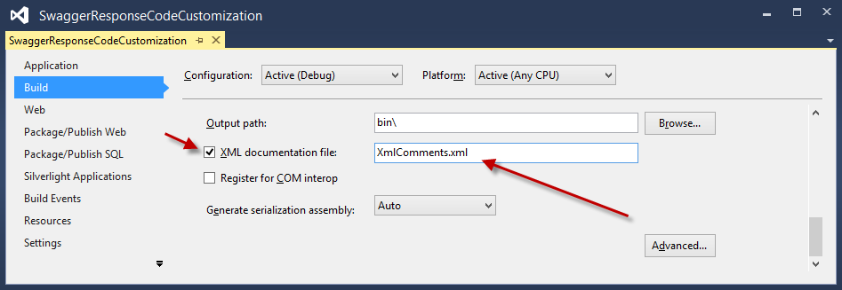
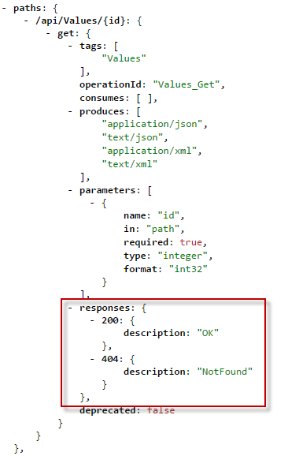

<properties 
    pageTitle="Personalizar as definições da API gerados pelo Swashbuckle" 
    description="Saiba como personalizar as definições da API Swagger que são geradas pelo Swashbuckle para um aplicativo de API do serviço de aplicativo do Azure." 
    services="app-service\api" 
    documentationCenter=".net" 
    authors="bradygaster" 
    manager="wpickett" 
    editor="jimbe"/>

<tags 
    ms.service="app-service-api" 
    ms.workload="web" 
    ms.tgt_pltfrm="dotnet" 
    ms.devlang="na" 
    ms.topic="article" 
    ms.date="08/29/2016" 
    ms.author="rachelap"/>

# Personalizar as definições da API gerado Swashbuckle 

## Visão geral

Este artigo explica como personalizar Swashbuckle para lidar com cenários comuns em que talvez você queira alterar o comportamento padrão:

* Swashbuckle gera identificadores de operação duplicada para sobrecargas dos métodos de controlador
* Swashbuckle pressupõe que a resposta válida somente de um método é 200 HTTP (Okey) 
 
## Personalizar a geração de identificador de operação

Swashbuckle gera identificadores de operação de Swagger concatenando o nome do controlador e o nome do método. Esse padrão cria um problema quando você tem várias sobrecargas de um método: Swashbuckle gera ids de operação duplicada, que é JSON Swagger inválido.

Por exemplo, o seguinte código de controlador causa Swashbuckle gerar três ids de operação de Contact_Get.

Você pode resolver o problema manualmente dando os métodos nomes exclusivos, como o seguinte para este exemplo:

* Obter
* GetById
* GetPage

A alternativa é estender Swashbuckle para torná-la a gerar automaticamente ids de operação único.

As etapas a seguir mostram como personalizar Swashbuckle usando o arquivo de *SwaggerConfig.cs* que está incluído no projeto pelo modelo de projeto do Visual Studio API aplicativos Preview.  Você também pode personalizar Swashbuckle em um projeto de API da Web que você configurar para implantação como um aplicativo de API.

1. Criar uma personalizada `IOperationFilter` implementação 

    O `IOperationFilter` interface fornece um ponto de extensibilidade para usuários de Swashbuckle que deseja personalizar vários aspectos do processo de metadados de Swagger. O código a seguir demonstra um método de alterar o comportamento de geração de id de operação. O código acrescenta nomes de parâmetro para o nome de id de operação.  

        using Swashbuckle.Swagger;
        using System.Web.Http.Description;
        
        namespace ContactsList
        {
            public class MultipleOperationsWithSameVerbFilter : IOperationFilter
            {
                public void Apply(
                    Operation operation,
                    SchemaRegistry schemaRegistry,
                    ApiDescription apiDescription)
                {
                    if (operation.parameters != null)
                    {
                        operation.operationId += "By";
                        foreach (var parm in operation.parameters)
                        {
                            operation.operationId += string.Format("{0}",parm.name);
                        }
                    }
                }
            }
        }

2. Arquivo de *App_Start\SwaggerConfig.cs* , ligue para o `OperationFilter` método para causar Swashbuckle usar o novo `IOperationFilter` implementação.

        c.OperationFilter<MultipleOperationsWithSameVerbFilter>();

    

    O arquivo de *SwaggerConfig.cs* que é enviado para o pacote de Swashbuckle NuGet contém vários exemplos comentados-out pontos de extensibilidade. Comentários adicionais não são mostrados aqui. 

    Após fazer essa alteração, seu `IOperationFilter` implementação é usada e causa ids de operação único a ser gerado.
 
    

    
## Permitir códigos de resposta diferente de 200

Por padrão, o Swashbuckle pressupõe que uma resposta HTTP 200 (Okey) é a resposta legítimos *apenas* de um método de API da Web. Em alguns casos, você talvez queira retornar outros códigos de resposta sem causando o cliente para gerar uma exceção.  Por exemplo, o seguinte código de Web API demonstra um cenário em que você desejaria o cliente para aceitar uma 200 ou um 404 como respostas válidas.

    [ResponseType(typeof(Contact))]
    public HttpResponseMessage Get(int id)
    {
        var contacts = GetContacts();

        var requestedContact = contacts.FirstOrDefault(x => x.Id == id);

        if (requestedContact == null)
        {
            return Request.CreateResponse(HttpStatusCode.NotFound);
        }
        else
        {
            return Request.CreateResponse<Contact>(HttpStatusCode.OK, requestedContact);
        }
    }

Neste cenário, o Swagger que Swashbuckle gera por padrão especifica apenas um código legítimo de status HTTP, HTTP 200.

Como o Visual Studio usa a definição de Swagger API para gerar o código do cliente, ele cria código do cliente que gera uma exceção para qualquer resposta diferente de um HTTP 200. O código a seguir é de um cliente c# gerado para este método de Web API de amostra.

    if (statusCode != HttpStatusCode.OK)
    {
        HttpOperationException<object> ex = new HttpOperationException<object>();
        ex.Request = httpRequest;
        ex.Response = httpResponse;
        ex.Body = null;
        if (shouldTrace)
        {
            ServiceClientTracing.Error(invocationId, ex);
        }
        throw ex;
    } 

Swashbuckle fornece duas maneiras de personalizar a lista de códigos de resposta HTTP esperados gerado usando comentários XML ou o `SwaggerResponse` atributo. O atributo é mais fácil, mas só está disponível no Swashbuckle 5.1.5 ou posterior. O modelo de novo projeto de visualização de aplicativos de API no Visual Studio 2013 inclui Swashbuckle versão 5.0.0, portanto, se você usou o modelo e não quer atualizar Swashbuckle, sua única opção é usar comentários XML. 

### Personalizar códigos de resposta esperada usando comentários XML

Use esse método para especificar códigos de resposta se sua versão de Swashbuckle for anterior a 5.1.5.

1. Primeiro, adicione comentários da documentação XML sobre os métodos que você deseja especificar códigos de resposta HTTP para. Tomar a amostra de Web API ação mostrada acima e aplicando a documentação XML a ela resultaria em código como o exemplo a seguir. 

        /// 

        /// Returns the specified contact.
        /// 

        /// <param name="id">The ID of the contact.</param>
        /// <returns>A contact record with an HTTP 200, or null with an HTTP 404.</returns>
        /// <response code="200">OK</response>
        /// <response code="404">Not Found</response>
        [ResponseType(typeof(Contact))]
        public HttpResponseMessage Get(int id)
        {
            var contacts = GetContacts();
        
            var requestedContact = contacts.FirstOrDefault(x => x.Id == id);
        
            if (requestedContact == null)
            {
                return Request.CreateResponse(HttpStatusCode.NotFound);
            }
            else
            {
                return Request.CreateResponse<Contact>(HttpStatusCode.OK, requestedContact);
            }
        }

1. Adicionar instruções no arquivo *SwaggerConfig.cs* para direcionar Swashbuckle fazer uso de XML arquivo de documentação.

    * Abra *SwaggerConfig.cs* e crie um método na classe *SwaggerConfig* para especificar o caminho para o arquivo XML de documentação. 

            private static string GetXmlCommentsPath()
            {
                return string.Format(@"{0}\XmlComments.xml", 
                    System.AppDomain.CurrentDomain.BaseDirectory);
            }

    * Role para baixo no arquivo *SwaggerConfig.cs* até ver a linha comentados-out do código semelhante a captura de tela abaixo. 

        
    
    * Tire comentários na linha para habilitar os processamento durante a geração de Swagger os comentários XML. 
    
        
    
1. Para poder gerar o arquivo de documentação XML, vá para as propriedades do projeto e habilitar o arquivo de documentação XML, conforme mostrado na captura de tela abaixo. 

     

Depois de executar essas etapas, o JSON Swagger gerados pelo Swashbuckle refletirão os códigos de resposta HTTP que você especificou nos comentários XML. Captura de tela abaixo demonstra essa nova carga JSON. 

Quando você usa o Visual Studio para gerar o código do cliente para sua API REST, o código c# aceita os códigos de status HTTP Okey tanto o não encontrado sem gerar uma exceção, permitindo a seu código consumindo decisões sobre como lidar com a devolução de um registro de contato nulo. 

        if (statusCode != HttpStatusCode.OK && statusCode != HttpStatusCode.NotFound)
        {
            HttpOperationException<object> ex = new HttpOperationException<object>();
            ex.Request = httpRequest;
            ex.Response = httpResponse;
            ex.Body = null;
            if (shouldTrace)
            {
                ServiceClientTracing.Error(invocationId, ex);
            }
                throw ex;
        }

O código para esta demonstração pode ser encontrado [neste](https://github.com/Azure-Samples/app-service-api-dotnet-swashbuckle-swaggerresponse)repositório GitHub. Juntamente com a API Web projeto marcado com comentários da documentação XML é um projeto de aplicativo de Console que contém um cliente gerado para esta API. 

### Personalizar códigos de resposta esperada usando o atributo SwaggerResponse

O atributo [SwaggerResponse](https://github.com/domaindrivendev/Swashbuckle/blob/master/Swashbuckle.Core/Swagger/Annotations/SwaggerResponseAttribute.cs) está disponível em Swashbuckle 5.1.5 e posterior. Caso você tenha uma versão anterior do seu projeto, esta seção inicia explicando como atualizar o pacote Swashbuckle NuGet para que você pode usar esse atributo.

1. No **Solution Explorer**, clique com botão direito seu projeto de API da Web e clique em **Gerenciar pacotes do NuGet**. 

    

1. Clique no botão de *atualização* ao lado do pacote de NuGet *Swashbuckle* . 

    

1. Adicione os atributos de *SwaggerResponse* para os métodos de ação de API da Web para o qual você deseja especificar códigos de resposta HTTP válidos. 

        [SwaggerResponse(HttpStatusCode.OK)]
        [SwaggerResponse(HttpStatusCode.NotFound)]
        [ResponseType(typeof(Contact))]
        public HttpResponseMessage Get(int id)
        {
            var contacts = GetContacts();

            var requestedContact = contacts.FirstOrDefault(x => x.Id == id);
            if (requestedContact == null)
            {
                return Request.CreateResponse(HttpStatusCode.NotFound);
            }
            else
            {
                return Request.CreateResponse<Contact>(HttpStatusCode.OK, requestedContact);
            }
        }

2. Adicionar uma `using` declaração do namespace do atributo:

        using Swashbuckle.Swagger.Annotations;
        
1. Navegue até a URL de */swagger/docs/v1* do seu projeto e os diversos códigos de resposta HTTP ficará visíveis no JSON Swagger. 

    

O código para esta demonstração pode ser encontrado [neste](https://github.com/Azure-Samples/API-Apps-DotNet-Swashbuckle-Customization-MultipleResponseCodes-With-Attributes)repositório GitHub. Juntamente com a API Web projeto decorado com o atributo *SwaggerResponse* é um projeto de aplicativo de Console que contém um cliente gerado para esta API. 

## Próximas etapas

Este artigo mostra como personalizar a maneira que swashbuckle gera ids de operação e códigos de resposta válida. Para obter mais informações, consulte [Swashbuckle no GitHub](https://github.com/domaindrivendev/Swashbuckle).
 
