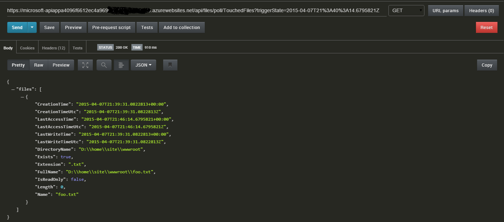
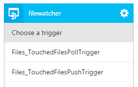
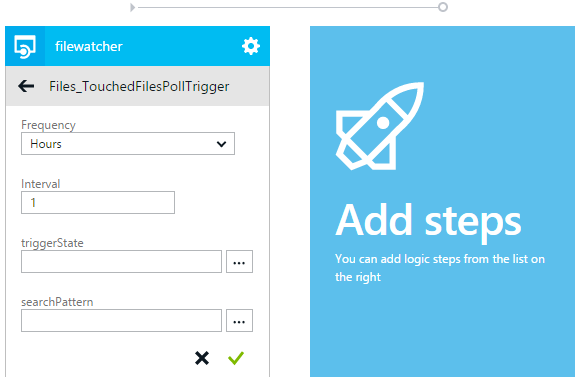

<properties 
    pageTitle="Gatilhos de aplicativo de serviço de aplicativo API | Microsoft Azure" 
    description="Como implementar disparadores em um App API do serviço de aplicativo do Azure" 
    services="logic-apps" 
    documentationCenter=".net" 
    authors="guangyang"
    manager="wpickett" 
    editor="jimbe"/>

<tags 
    ms.service="logic-apps" 
    ms.workload="na" 
    ms.tgt_pltfrm="dotnet" 
    ms.devlang="na" 
    ms.topic="article" 
    ms.date="08/25/2016" 
    ms.author="rachelap"/>

# Gatilhos de aplicativo do Azure API do serviço de aplicativo

>[AZURE.NOTE] Esta versão do artigo se aplica à versão do esquema de 2014-12-01-visualização de aplicativos de API.

## Visão geral

Este artigo explica como implementar gatilhos de aplicativo de API e usá-los a partir de um aplicativo de lógica.

Todos os trechos de código neste tópico são copiados do [exemplo de código FileWatcher API do aplicativo](http://go.microsoft.com/fwlink/?LinkId=534802). 

Observe que você precisará baixar o pacote de nuget seguintes para o código neste artigo para criar e executar: [http://www.nuget.org/packages/Microsoft.Azure.AppService.ApiApps.Service/](http://www.nuget.org/packages/Microsoft.Azure.AppService.ApiApps.Service/).

## O que são disparadores de aplicativo de API?

É um cenário comum de um aplicativo de API acionar um evento para que clientes do aplicativo API podem executar a ação apropriada em resposta ao evento. O mecanismo de API REST com base que ofereça suporte a esse cenário é chamado um gatilho de aplicativo de API. 

Por exemplo, digamos que seu código de cliente está usando o [aplicativo do Twitter API de conector](../app-service-logic/app-service-logic-connector-twitter.md) e seu código precisa executar uma ação com base na novas tweets que contêm palavras específicas. Nesse caso, você pode configurar um gatilho de votação ou push para facilitar a essa necessidade.

## Gatilho de votação versus disparador de envio

Atualmente, os dois tipos de disparadores são suportados:

- Gatilho de votação - cliente se comunica com o aplicativo de API para notificação de um evento ter sido acionado 
- Disparador de envio - cliente é notificado pelo aplicativo do API quando um evento é acionado 

### Gatilho de votação

Um gatilho de sondagem é implementado como uma API REST regulares e espera que seus clientes (como um aplicativo de lógica) para pesquisá-lo para obter notificações. Enquanto o cliente pode manter o estado, o disparador de votação em si é independente. 

As seguintes informações sobre os pacotes de solicitação e resposta ilustram alguns aspectos importantes do contrato de gatilho de votação:

- Solicitação
    - Método HTTP: obter
    - Parâmetros
        - triggerState - esse parâmetro opcional permite que clientes especificar seu estado para que o disparador de votação corretamente pode decidir se deseja retornar notificação ou não com base no estado especificado.
        - Parâmetros específicos de API
- Resposta
    - Código de status **200** - solicitação é válida e não há uma notificação de disparador. O conteúdo da notificação será o corpo da resposta. Um cabeçalho de "Repetir depois" na resposta indica que os dados de notificação adicionais devem ser recuperados com uma chamada de solicitação subsequentes.
    - Código de status **202** - solicitação é válida, mas não há nenhuma nova notificação de disparador.
    - Código de status **4xx** - solicitação não é válida. O cliente não deve tentar novamente a solicitação.
    - Código de status **5xx** - solicitação resultou em um erro interno do servidor e/ou um problema temporário. O cliente deve repetir a solicitação.

O trecho de código a seguir é um exemplo de como implementar um gatilho de votação.

    // Implement a poll trigger.
    [HttpGet]
    [Route("api/files/poll/TouchedFiles")]
    public HttpResponseMessage TouchedFilesPollTrigger(
        // triggerState is a UTC timestamp
        string triggerState,
        // Additional parameters
        string searchPattern = "*")
    {
        // Check to see whether there is any file touched after the timestamp.
        var lastTriggerTimeUtc = DateTime.Parse(triggerState).ToUniversalTime();
        var touchedFiles = Directory.EnumerateFiles(rootPath, searchPattern, SearchOption.AllDirectories)
            .Select(f => FileInfoWrapper.FromFileInfo(new FileInfo(f)))
            .Where(fi => fi.LastAccessTimeUtc > lastTriggerTimeUtc);

        // If there are files touched after the timestamp, return their information.
        if (touchedFiles != null && touchedFiles.Count() != 0)
        {
            // Extension method provided by the AppService service SDK.
            return this.Request.EventTriggered(new { files = touchedFiles });
        }
        // If there are no files touched after the timestamp, tell the caller to poll again after 1 mintue.
        else
        {
            // Extension method provided by the AppService service SDK.
            return this.Request.EventWaitPoll(new TimeSpan(0, 1, 0));
        }
    }

Para testar esse disparador de votação, siga estas etapas:

1. Implante o App API com uma configuração de autenticação de **público anônimo**.
2. Ligue para a operação **de toque** para tocar um arquivo. A imagem a seguir mostra uma solicitação de exemplo via carteiro.
   
3. Ligue o disparador de votação com o parâmetro **triggerState** definido como um carimbo de hora antes da etapa 2. A imagem a seguir mostra a solicitação de amostra via carteiro.
   

### Disparador de envio

Um disparador de envio é implementado como uma API REST regulares que envia notificações para os clientes que se inscreveram para ser notificado quando fire de eventos específicos.

As seguintes informações sobre os pacotes de solicitação e resposta ilustram alguns aspectos importantes do contrato de disparador de envio.

- Solicitação
    - Método HTTP: colocar
    - Parâmetros
        - triggerId: necessário - opaca string (como um GUID) que representa o registro de um disparador de envio.
        - callbackUrl: necessário - URL do retorno de chamada chamar quando o evento for acionado. A chamada é uma chamada de POSTAGEM HTTP simples.
        - Parâmetros específicos de API
- Resposta
    - Status código **200** - solicitação para registrar o cliente bem-sucedido.
    - Código de status **4xx** - solicitação não é válida. O cliente não deve tentar novamente a solicitação.
    - Código de status **5xx** - solicitação resultou em um erro interno do servidor e/ou um problema temporário. O cliente deve repetir a solicitação.
- Retorno de chamada
    - Método HTTP: POSTAGEM
    - Solicitar corpo: conteúdo de notificação.

O trecho de código a seguir é um exemplo de como implementar um disparador de envio:

    // Implement a push trigger.
    [HttpPut]
    [Route("api/files/push/TouchedFiles/{triggerId}")]
    public HttpResponseMessage TouchedFilesPushTrigger(
        // triggerId is an opaque string.
        string triggerId,
        // A helper class provided by the AppService service SDK.
        // Here it defines the input of the push trigger is a string and the output to the callback is a FileInfoWrapper object.
        [FromBody]TriggerInput<string, FileInfoWrapper> triggerInput)
    {
        // Register the trigger to some trigger store.
        triggerStore.RegisterTrigger(triggerId, rootPath, triggerInput);

        // Extension method provided by the AppService service SDK indicating the registration is completed.
        return this.Request.PushTriggerRegistered(triggerInput.GetCallback());
    }

    // A simple in-memory trigger store.
    public class InMemoryTriggerStore
    {
        private static InMemoryTriggerStore instance;

        private IDictionary<string, FileSystemWatcher> _store;

        private InMemoryTriggerStore()
        {
            _store = new Dictionary<string, FileSystemWatcher>();
        }

        public static InMemoryTriggerStore Instance
        {
            get
            {
                if (instance == null)
                {
                    instance = new InMemoryTriggerStore();
                }
                return instance;
            }
        }

        // Register a push trigger.
        public void RegisterTrigger(string triggerId, string rootPath,
            TriggerInput<string, FileInfoWrapper> triggerInput)
        {
            // Use FileSystemWatcher to listen to file change event.
            var filter = string.IsNullOrEmpty(triggerInput.inputs) ? "*" : triggerInput.inputs;
            var watcher = new FileSystemWatcher(rootPath, filter);
            watcher.IncludeSubdirectories = true;
            watcher.EnableRaisingEvents = true;
            watcher.NotifyFilter = NotifyFilters.LastAccess;

            // When some file is changed, fire the push trigger.
            watcher.Changed +=
                (sender, e) => watcher_Changed(sender, e,
                    Runtime.FromAppSettings(),
                    triggerInput.GetCallback());

            // Assoicate the FileSystemWatcher object with the triggerId.
            _store[triggerId] = watcher;

        }

        // Fire the assoicated push trigger when some file is changed.
        void watcher_Changed(object sender, FileSystemEventArgs e,
            // AppService runtime object needed to invoke the callback.
            Runtime runtime,
            // The callback to invoke.
            ClientTriggerCallback<FileInfoWrapper> callback)
        {
            // Helper method provided by AppService service SDK to invoke a push trigger callback.
            callback.InvokeAsync(runtime, FileInfoWrapper.FromFileInfo(new FileInfo(e.FullPath)));
        }
    }

Para testar esse disparador de votação, siga estas etapas:

1. Implante o App API com uma configuração de autenticação de **público anônimo**.
2. Navegue até [http://requestb.in/](http://requestb.in/) para criar um RequestBin que servirá como a URL de retorno de chamada.
3. Ligue o disparador de envio com um GUID como **triggerId** e a URL de RequestBin como **callbackUrl**.
   
4. Ligue para a operação **de toque** para tocar um arquivo. A imagem a seguir mostra uma solicitação de exemplo via carteiro.
   
5. Verifique o RequestBin para confirmar que o retorno de chamada do disparador de envio é invocado com saída de propriedade.
   

### Descrever disparadores na definição de API

Após Implementando os gatilhos e implantar seu aplicativo de API no Azure, navegue até a lâmina de **Definição de API** no portal do Azure preview e você verá que disparadores são automaticamente reconhecidos na interface de usuário, que é orientada pela definição de Swagger 2.0 API do aplicativo API.

Se você clicar no botão **Baixar Swagger** e abra o arquivo JSON, você verá os resultados similares ao seguinte:

    "/api/files/poll/TouchedFiles": {
      "get": {
        "operationId": "Files_TouchedFilesPollTrigger",
        ...
        "x-ms-scheduler-trigger": "poll"
      }
    },
    "/api/files/push/TouchedFiles/{triggerId}": {
      "put": {
        "operationId": "Files_TouchedFilesPushTrigger",
        ...
        "x-ms-scheduler-trigger": "push"
      }
    }

Extensão propriedade **x ms-da programação disparador** é como disparadores são descritos na definição de API e é automaticamente adicionado pelo gateway de aplicativo de API quando você solicitar a definição de API por meio do gateway se a solicitação para um dos seguintes critérios. (Você também pode adicionar essa propriedade manualmente.)

- Gatilho de votação
    - Se o método HTTP **obter**.
    - Se a propriedade **operationId** contém a cadeia de caracteres **disparador**.
    - Se a propriedade de **parâmetros** inclui um parâmetro com uma propriedade de **nome** definida para **triggerState**.
- Disparador de envio
    - Se o método HTTP é **colocar**.
    - Se a propriedade **operationId** contém a cadeia de caracteres **disparadores**.
    - Se a propriedade de **parâmetros** inclui um parâmetro com uma propriedade de **nome** definida para **triggerId**.

## Usar disparadores de aplicativo de API em aplicativos de lógica

### Listar e configurar disparadores de aplicativo de API no designer de aplicativos de lógica

Se você criar um aplicativo de lógica no mesmo grupo de recursos como o aplicativo de API, você poderá adicioná-lo a tela de designer simplesmente clicando nela. As imagens a seguir ilustram isto:

## Otimizar gatilhos de aplicativo de API para aplicativos de lógica

Depois de adicionar disparadores para um aplicativo de API, há algumas coisas que você pode fazer para melhorar a experiência ao usar o aplicativo de API em um aplicativo de lógica.

Por exemplo, o parâmetro de **triggerState** para disparadores de votação deve ser definido com a seguinte expressão no aplicativo lógica. Essa expressão deve avaliar a última invocação do disparador do aplicativo lógica e retornará o valor.  

    @coalesce(triggers()?.outputs?.body?['triggerState'], '')

Observação: Para obter uma explicação das funções usado na expressão acima, consulte a documentação sobre a [Linguagem de definição de fluxo de trabalho de aplicativo de lógica](https://msdn.microsoft.com/library/azure/dn948512.aspx).

Usuários do aplicativo de lógica precisaria fornecer a expressão acima para o parâmetro **triggerState** enquanto estiver usando o disparador. É possível ter esse valor predefinido pelo designer de aplicativo de lógica através a propriedade de extensão **x-ms-Agendador-recomendação**.  A propriedade de extensão **x-ms-visibilidade** pode ser definida para um valor de *interna* para que o parâmetro em si não é mostrado no designer.  O trecho a seguir ilustra que.

    "/api/Messages/poll": {
      "get": {
        "operationId": "Messages_NewMessageTrigger",
        "parameters": [
          {
            "name": "triggerState",
            "in": "query",
            "required": true,
            "x-ms-visibility": "internal",
            "x-ms-scheduler-recommendation": "@coalesce(triggers()?.outputs?.body?['triggerState'], '')",
            "type": "string"
          }
        ]
        ...
        "x-ms-scheduler-trigger": "poll"
      }
    }

Para disparadores de envio, o parâmetro **triggerId** deve identificar exclusivamente o aplicativo de lógica. Uma prática recomendada é definir esta propriedade para o nome do fluxo de trabalho usando a seguinte expressão:

    @workflow().name

O aplicativo de API usando as propriedades de extensão **x-ms-Agendador-recomendação** e **x-ms-visibilidade** em sua definição de API, pode transmitir para o designer de aplicativo lógica para configurar automaticamente essa expressão para o usuário.

        "parameters":[  
          {  
            "name":"triggerId",
            "in":"path",
            "required":true,
            "x-ms-visibility":"internal",
            "x-ms-scheduler-recommendation":"@workflow().name",
            "type":"string"
          },

### Adicionar propriedades de extensão na definição de API

Informações de metadados adicionais - como a extensão propriedades **x-ms-Agendador-recomendação** e **x-ms-visibilidade** - podem ser adicionadas a definição de API de duas maneiras: estática ou dinâmica.

Para metadados estático, você pode diretamente editar o arquivo */metadata/apiDefinition.swagger.json* em seu projeto e adicione as propriedades manualmente.

Para aplicativos de API usando metadados dinâmico, você pode editar o arquivo de SwaggerConfig.cs para adicionar um filtro de operação que pode adicionar essas extensões.

    GlobalConfiguration.Configuration 
        .EnableSwagger(c =>
            {
                ...
                c.OperationFilter<TriggerStateFilter>();
                ...
            }

A seguir é um exemplo de como essa classe pode ser implementada para facilitar o cenário de metadados dinâmico.

    // Add extension properties on the triggerState parameter
    public class TriggerStateFilter : IOperationFilter
    {

        public void Apply(Operation operation, SchemaRegistry schemaRegistry, System.Web.Http.Description.ApiDescription apiDescription)
        {
            if (operation.operationId.IndexOf("Trigger", StringComparison.InvariantCultureIgnoreCase) >= 0)
            {
                // this is a possible trigger
                var triggerStateParam = operation.parameters.FirstOrDefault(x => x.name.Equals("triggerState"));
                if (triggerStateParam != null)
                {
                    if (triggerStateParam.vendorExtensions == null)
                    {
                        triggerStateParam.vendorExtensions = new Dictionary<string, object>();
                    }

                    // add 2 vendor extensions
                    // x-ms-visibility: set to 'internal' to signify this is an internal field
                    // x-ms-scheduler-recommendation: set to a value that logic app can use
                    triggerStateParam.vendorExtensions.Add("x-ms-visibility", "internal");
                    triggerStateParam.vendorExtensions.Add("x-ms-scheduler-recommendation",
                                                           "@coalesce(triggers()?.outputs?.body?['triggerState'], '')");
                }
            }
        }
    }
 
