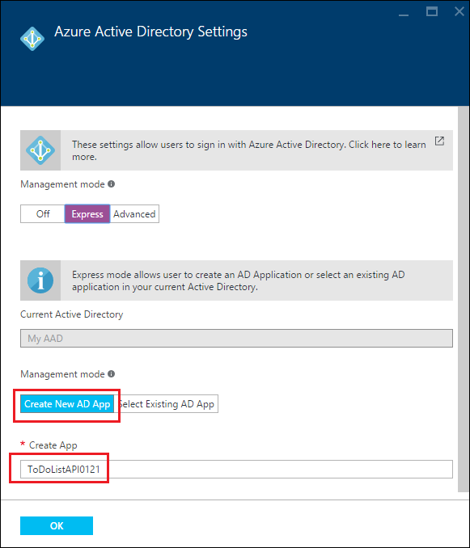
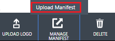

<properties
    pageTitle="Autenticação de usuário para os aplicativos da API do serviço de aplicativo do Azure | Microsoft Azure"
    description="Aprenda a proteger um aplicativo de API do serviço de aplicativo do Azure, permitindo que o acesso somente aos usuários autenticados."
    services="app-service\api"
    documentationCenter=".net"
    authors="tdykstra"
    manager="wpickett"
    editor=""/>

<tags
    ms.service="app-service-api"
    ms.workload="na"
    ms.tgt_pltfrm="dotnet"
    ms.devlang="na"
    ms.topic="article"
    ms.date="06/30/2016"
    ms.author="rachelap"/>

# Autenticação de usuário para os aplicativos da API do serviço de aplicativo do Azure

## Visão geral

Este artigo mostra como proteger um aplicativo de API do Azure para que somente os usuários autenticados podem chamá-lo. O artigo pressupõe que você leu a [Visão geral de autenticação do serviço de aplicativo do Azure](../app-service/app-service-authentication-overview.md).

Você aprenderá:

* Como configurar um provedor de autenticação, com detalhes para Azure Active Directory (AD Azure).
* Como consumir um aplicativo de API protegido usando o [Active Directory autenticação biblioteca (ADAL) para JavaScript](https://github.com/AzureAD/azure-activedirectory-library-for-js).

O artigo contém duas seções:

* A seção [como configurar a autenticação de usuário no serviço de aplicativo do Azure](#authconfig) em geral explica como configurar a autenticação de usuário para qualquer aplicativo de API e aplica igualmente todas as estruturas suportadas pelo serviço de aplicativo, incluindo .NET, node e Java.

* Começando com a seção [continuar os tutoriais de aplicativos de API do .NET](#tutorialstart) , as guias de artigo você por meio de configuração de um aplicativo de exemplo com um .NET back-end e um frente AngularJS terminados para que ele usa o Azure Active Directory para autenticação de usuário. 

## Como configurar a autenticação do usuário no serviço de aplicativo do Azure

Esta seção fornece instruções gerais que se aplicam a qualquer aplicativo de API. Para obter etapas específicas para o aplicativo de amostra para fazer .NET da lista, vá para [continuar os tutoriais do guia de Introdução do .NET](#tutorialstart).

1. No [portal do Azure](https://portal.azure.com/), navegue até a lâmina de **configurações** do aplicativo API que você deseja proteger, localize a seção de **recursos** e clique em **autenticação / autorização**.

    

3. No **autenticação / autorização** lâmina, clique **em**.

4. Selecione uma das opções da lista suspensa **fazer quando solicitação não é autenticada** .

    * Se você quiser apenas chamadas autenticadas alcançar seu aplicativo de API, escolha uma das opções de **fazer login...** . Essa opção permite que você proteja o aplicativo de API sem escrever qualquer código que executa nele.

    * Se desejar que todas as chamadas para atingir seu aplicativo de API, escolha **Permitir solicitação (nenhuma ação)**. Você pode usar esta opção para direcionar os chamadores não autenticados com uma variedade de provedores de autenticação. Com essa opção, você precisa escrever código para lidar com autorização.

    Para obter mais informações, consulte [autenticação e a autorização para os aplicativos da API do serviço de aplicativo do Azure](app-service-api-authentication.md#multiple-protection-options).

5. Selecione um ou mais dos **Provedores de autenticação**.

    A imagem mostra opções que exigem todos os chamadores sejam autenticados por Azure AD.
 
    

    Quando você escolhe um provedor de autenticação, o portal exibe um blade de configuração para aquele provedor. 

    Para obter instruções detalhadas que explicam como configurar as lâminas de configuração de provedor de serviços de autenticação, consulte [como configurar seu aplicativo de serviço de aplicativo para usar o logon do Active Directory do Azure](../app-service-mobile/app-service-mobile-how-to-configure-active-directory-authentication.md). (O link vai para um artigo sobre Azure AD, mas o artigo próprio contém guias que criam links para artigos para os outros provedores de autenticação).

7. Quando terminar com a lâmina de configuração de provedor de serviços de autenticação, clique em **Okey**.

7. No **autenticação / autorização** lâmina, clique em **Salvar**.

Quando isso é feito, o serviço de aplicativo autentica todas as chamadas de API antes de atingirem o aplicativo de API. Os serviços de autenticação funcionam da mesma para todos os idiomas que suporta de serviço de aplicativo, incluindo .NET, node e Java. 

Para fazer chamadas de API autenticadas, o chamador inclui token de portador OAuth 2.0 do provedor de autenticação no cabeçalho da autorização de solicitações HTTP. O token pode ser adquirido usando SDK do provedor de autenticação.

## Continuar os tutoriais de aplicativos de API do .NET

Se você está seguindo os tutoriais Node ou Java para aplicativos de API, vá para o próximo artigo, [autenticação principal para os aplicativos da API do serviço](app-service-api-dotnet-service-principal-auth.md). 

Se você está seguindo a série de tutoriais do .NET para aplicativos de API e já implantou o aplicativo de amostra como indicado nos tutoriais [primeiro](app-service-api-dotnet-get-started.md) e o [segundo](app-service-api-cors-consume-javascript.md) , pule para a seção [Configurar a autenticação no serviço de aplicativo e Azure AD](#azureauth) .

Se você desejar acompanhar este tutorial sem percorrer os tutoriais primeiro e o segundo, siga estas etapas que explicam como começar usando um processo automatizado para implantar o aplicativo de amostra.

>[AZURE.NOTE] As etapas a seguir o levará para o mesmo ponto de partida como se você fez os dois primeiros tutoriais, com uma exceção: Visual Studio já não saberão qual aplicativo web ou aplicativo de API que cada projeto obtém implantado. Isso significa que você não possui instruções exatas neste tutorial que explicam como implantar os destinos à direita. Se você não estiver familiarizado com descobrindo como executar as etapas de implantação por conta própria, é melhor acompanhar a série de tutoriais do [primeiro tutorial](app-service-api-dotnet-get-started.md) de que ao iniciar com esse processo de implantação automatizada.

1. Certifique-se de que você tem todos os pré-requisitos listados no [tutorial primeiro](app-service-api-dotnet-get-started.md). Além dos pré-requisitos listados, estes tutoriais de autenticação presumem que você trabalhou com o serviço de aplicativo web apps e aplicativos de API no Visual Studio e o portal do Azure.

2. Clique no botão de **implantar no Azure** no [arquivo de Leiame de repositório de exemplo de lista de tarefas pendentes](https://github.com/azure-samples/app-service-api-dotnet-todo-list/blob/master/readme.md) para implantar os aplicativos de API e o aplicativo web. Tome nota do grupo de recursos Azure que obtém criado, como você pode usar esta posterior para procurar web app e nomes de aplicativo de API.
 
3. Baixe ou clonar o [repositório de exemplo de lista de tarefas pendentes](https://github.com/Azure-Samples/app-service-api-dotnet-todo-list) para obter o código que você trabalhará com localmente no Visual Studio.

## Configurar a autenticação no serviço de aplicativo e Azure AD

Agora você tem o aplicativo em execução em um serviço de aplicativo do Azure sem exigir que os usuários autenticados. Nesta seção você adicionar autenticação seguindo as seguintes tarefas:

* Configure o serviço de aplicativo para exigir autenticação do Azure Active Directory (AD Azure) para chamar o aplicativo de camada intermediária API.
* Crie um aplicativo do Azure AD.
* Configure o aplicativo do Azure AD para enviar o token de portador após o logon para o front-end AngularJS. 

Se você enfrentar problemas enquanto segue as instruções tutoriais, consulte a seção de [solução de problemas](#troubleshooting) no final do tutorial. 
 
### Configurar a autenticação para o aplicativo de API intermediária

1. No [portal do Azure](https://portal.azure.com/), navegue até a lâmina de **configurações** do aplicativo API que você criou para o projeto ToDoListAPI, localize a seção de **recursos** e clique em **autenticação / autorização**.

    

3. No **autenticação / autorização** lâmina, clique **em**.

4. Na lista suspensa **fazer quando solicitação não é autenticada** , selecione **fazer logon com o Active Directory do Azure**.

    Essa opção garante que nenhuma solicitação unauathenticated atingirá o aplicativo de API. 

5. Em **Provedores de autenticação**, clique em **Active Directory do Azure**.

    

6. Na lâmina **Configurações do Azure Active Directory** , clique em **Express**

    

    Com a opção **Express** , o serviço de aplicativo pode criar um aplicativo do Azure AD automaticamente em seu [locatário](https://msdn.microsoft.com/en-us/library/azure/jj573650.aspx#BKMK_WhatIsAnAzureADTenant)do Azure AD. 

    Você não precisa criar um locatário, porque cada conta do Azure automaticamente tem uma.

7. Em **modo de gerenciamento**, clique em **Criar novo aplicativo de AD** se já não estiver selecionada e observe o valor que está na caixa de texto **Criar aplicativo** ; Você vai pesquisar este aplicativo AAD no portal de clássico do Azure mais tarde.

    

    Azure criará automaticamente um aplicativo do Azure AD com o nome indicado no seu locatário do Azure AD. Por padrão, o aplicativo do Azure AD é chamado a mesma que o aplicativo de API. Se preferir, você pode inserir um nome diferente.
 
7. Clique em **Okey**.

7. No **autenticação / autorização** lâmina, clique em **Salvar**.

    

Agora, somente os usuários em seu locatário do Azure AD podem chamar o aplicativo de API.

### Opcional: Testar o aplicativo de API

1. Em um navegador, vá para a URL do aplicativo API: na lâmina **API aplicativo** no portal do Azure, clique no link em **URL**.  

    Você é redirecionado a uma tela de login porque solicitações não autenticadas não tem permissão para acessar o aplicativo de API.

    Se seu navegador vai para a página "criada com êxito", o navegador já pode estar conectado – nesse caso, abra uma janela InPrivate ou anônima e vá para a URL do aplicativo API.

2. Faça logon usando as credenciais de um usuário em seu locatário do Azure AD.

    Quando você estiver conectado, a página "criada com êxito" aparece no navegador.

9. Feche o navegador.

### Configurar o aplicativo do Azure AD

Quando você configurou a autenticação do Azure AD, o serviço de aplicativo criado um aplicativo do Azure AD para você. Por padrão o Azure AD novo aplicativo foi configurado para fornecer o token de portador a URL do aplicativo API. Nesta seção você configura o aplicativo do Azure AD para fornecer o token de portador para AngularJS front-end, em vez de diretamente para o aplicativo de camada intermediária API. O front-end AngularJS envia o token ao aplicativo API quando ele chama o aplicativo de API.

>[AZURE.NOTE] Para manter o processo como simples possível, neste tutorial usa um único Azure AD o aplicativo para o front-end e meio nível API aplicativo. Outra opção é usar dois aplicativos do Azure AD. Nesse caso, você teria dar permissão de aplicativo do front-end Azure AD para chamar Azure AD aplicativo do nível intermediário. Essa abordagem vários aplicativo resultará em um controle mais granular sobre permissões para cada nível.

11. No [portal de clássico Azure](https://manage.windowsazure.com/), vá ao **Azure Active Directory**.

    Você precisa usar o portal clássico porque certas configurações de Active Directory do Azure que precisam acessar ainda não estão disponíveis no portal do Azure atual.

12. Na guia **diretório** , clique em seu locatário AAD.

    

14. Clique em **aplicativos > aplicativos minha empresa possui**e clique na marca de seleção.

    Talvez você também precise atualizar a página para ver o novo aplicativo.

15. Na lista de aplicativos, clique no nome do que Azure criado para você quando você habilitou a autenticação de seu aplicativo de API.

    

16. Clique em **Configurar**.

    

17. Definir a **URL de logon** para a URL para o aplicativo da web de AngularJS, nenhuma barra invertida.

    Por exemplo: https://todolistangular.azurewebsites.net

    

17. Definir a **URL de resposta** para a URL de seu aplicativo web, nenhuma barra invertida.

    Por exemplo: https://todolistsangular.azurewebsites.net

16. Clique em **Salvar**.

    

15. Na parte inferior da página, clique em **Gerenciar manifesto > Download manifesto**.

    

17. Baixe o arquivo para um local onde você pode editá-lo.

16. No arquivo de manifesto baixado, procure o `oauth2AllowImplicitFlow` propriedade. Altere o valor desta propriedade de `false` para `true`e, em seguida, salve o arquivo.

    Esta configuração é necessária para acesso a partir de um aplicativo de página única JavaScript. Ele permite que o token de portador Oauth 2.0 a ser retornado no fragmento de URL.

16. Clique em **Gerenciar manifesto > carregar manifesto**e carregue o arquivo que você atualizou na etapa anterior.

    

17. Copie o valor de **ID do cliente** e salvá-lo em outro, que você pode obtê-lo mais tarde.

## Configurar o projeto ToDoListAngular para usar a autenticação

Nesta seção você altere o front-end AngularJS para que ele usa o Active Directory autenticação biblioteca (ADAL) para JS adquirir um token de portador para o usuário de logon do Azure AD. O código incluirá o token em solicitações HTTP enviadas para a camada intermediária, conforme mostrado no diagrama a seguir. 

Faça as seguintes alterações em arquivos de projeto ToDoListAngular.

1. Abra o arquivo *index* .

2. Tire comentários as linhas que fazem referência a Active Directory autenticação biblioteca (ADAL) para scripts JS.

        
        

1. Abra o arquivo *app/scripts/app.js* .

2. Comentar o bloco de código marcado para "sem autenticação" e Tire comentários do bloco de código marcado para "com autenticação".

    Essa alteração referencia o provedor de autenticação JS ADAL e fornece valores de configuração para ele. Nas etapas a seguir, você definir os valores de configuração para seu aplicativo de API e o aplicativo do Azure AD.

8. No código que define o `endpoints` variável, defina a URL de API para a URL do aplicativo API que você criou para o projeto ToDoListAPI e defina a ID de aplicativo do Azure AD para a identificação de cliente que você copiou do portal clássico do Azure.

    O código agora é semelhante ao seguinte exemplo.

        var endpoints = {
            "https://todolistapi0121.azurewebsites.net/": "1cf55bc9-9ed8-4df31cf55bc9-9ed8-4df3"
        };

9. Na chamada para `adalProvider.init`, defina `tenant` para seu nome de locatário e `clientId` para o mesmo valor que você usou na etapa anterior.

    O código agora é semelhante ao seguinte exemplo.

        adalProvider.init(
            {
                instance: 'https://login.microsoftonline.com/', 
                tenant: 'contoso.onmicrosoft.com',
                clientId: '1cf55bc9-9ed8-4df31cf55bc9-9ed8-4df3',
                extraQueryParameter: 'nux=1',
                endpoints: endpoints
            },
            $httpProvider
            );

    Essas alterações para `app.js` especificar que o código de chamada e a API chamada no mesmo aplicativo Azure AD.

1. Abra o arquivo *app/scripts/homeCtrl.js* .

2. Comentar o bloco de código marcado para "sem autenticação" e Tire comentários do bloco de código marcado para "com autenticação".

1. Abra o arquivo *app/scripts/indexCtrl.js* .

2. Comentar o bloco de código marcado para "sem autenticação" e Tire comentários do bloco de código marcado para "com autenticação".

### Implantar o projeto ToDoListAngular do Azure

8. No **Solution Explorer**, clique com botão direito no projeto ToDoListAngular e clique em **Publicar**.

9. Clique em **Publicar**.

    Visual Studio implanta o projeto e abre um navegador para URL base do aplicativo da web. Isso mostrará uma página de 403 erro, que é normal para uma tentativa ir para um URL básico de Web API de um navegador.

    Você ainda precisa fazer uma alteração para o aplicativo de API intermediária antes de você pode testar o aplicativo.

10. Feche o navegador.

## Configurar o projeto ToDoListAPI para usar a autenticação

Atualmente o projeto ToDoListAPI envia "*" como o `owner` valor a ser ToDoListDataAPI. Nesta seção você alterar o código para enviar a ID do usuário conectado.

Faça as seguintes alterações no projeto ToDoListAPI.

1. Abra o arquivo *Controllers/ToDoListController.cs* e Tire comentários a linha em cada método de ação que define `owner` ao Azure AD `NameIdentifier` reivindicar valor. Por exemplo:

        owner = ((ClaimsIdentity)User.Identity).FindFirst(ClaimTypes.NameIdentifier).Value;

    **Importante**: não Tire comentários código no `ToDoListDataAPI` método; Você vai fazer isso posteriormente para o tutorial de autenticação principal do serviço.

### Implantar o projeto ToDoListAPI do Azure

8. No **Solution Explorer**, clique com botão direito no projeto ToDoListAPI e clique em **Publicar**.

9. Clique em **Publicar**.

    Visual Studio implanta o projeto e abre um navegador para base URL do aplicativo API.

10. Feche o navegador.

### Testar o aplicativo

9. Vá para a URL do aplicativo web, **usando HTTPS, não HTTP**.

8. Clique na guia **Lista de tarefas pendentes** .

    Você será solicitado a fazer logon no.

9. Faça logon com as credenciais de um usuário no seu locatário AAD.

10. A página de **Lista de tarefas pendentes** aparece.

    

    Sem itens de tarefas pendentes são exibidos porque até agora todos foram proprietário "*". Agora a camada intermediária está solicitando itens para o usuário conectado e nenhum foi criado.

11. Adicione novos itens de tarefas pendentes para verificar se o aplicativo está funcionando.

12. Em outra janela do navegador, vá para a URL de interface do usuário Swagger para o aplicativo ToDoListDataAPI API e clique em **lista de tarefas pendentes > obter**. Digite um asterisco para a `owner` parâmetro e clique em **Experimente**.

    A resposta mostra que os novos itens de tarefas pendentes têm reais ID de usuário do Azure AD na propriedade proprietário.

    

## Construir os projetos do zero

Os dois projetos de API Web foram criados usando o modelo de projeto de **Aplicativo de API do Azure** e substituindo o controlador de valores padrão por um controlador de lista de tarefas pendentes. 

Para obter informações sobre como criar um aplicativo de página única AngularJS com um back-end Web API 2, consulte [mãos em laboratório: criar um aplicativo de página única (SPA) com API Web do ASP.NET e Angular.js](http://www.asp.net/web-api/overview/getting-started-with-aspnet-web-api/build-a-single-page-application-spa-with-aspnet-web-api-and-angularjs). Para obter informações sobre como adicionar código de autenticação do Azure AD, consulte os seguintes recursos:

* [Protegendo AngularJS única página aplicativos com o Azure AD](../active-directory/active-directory-devquickstarts-angular.md).
* [Apresentando o JS ADAL v1](http://www.cloudidentity.com/blog/2015/02/19/introducing-adal-js-v1/)

## Solução de problemas

[AZURE.INCLUDE [troubleshooting](../../includes/app-service-api-auth-troubleshooting.md)]

* Certifique-se de que você não confunda ToDoListAPI (camada intermediária) e ToDoListDataAPI (camada de dados). Por exemplo, verifique se que você adicionou autenticação aplicativo intermediária API, não a camada de dados. 
* Certifique-se de que o código-fonte AngularJS faz referência a URL do aplicativo de camada intermediária API (ToDoListAPI, não ToDoListDataAPI) e o Azure correto ID de cliente do AD. 

## Próximas etapas

Neste tutorial, você aprendeu como usar a autenticação do serviço de aplicativo de um aplicativo de API e como chamar o aplicativo de API usando a biblioteca de ADAL JS. O próximo tutorial, você aprenderá como [acesso seguro ao seu aplicativo de API para cenários ao serviço](app-service-api-dotnet-service-principal-auth.md).

