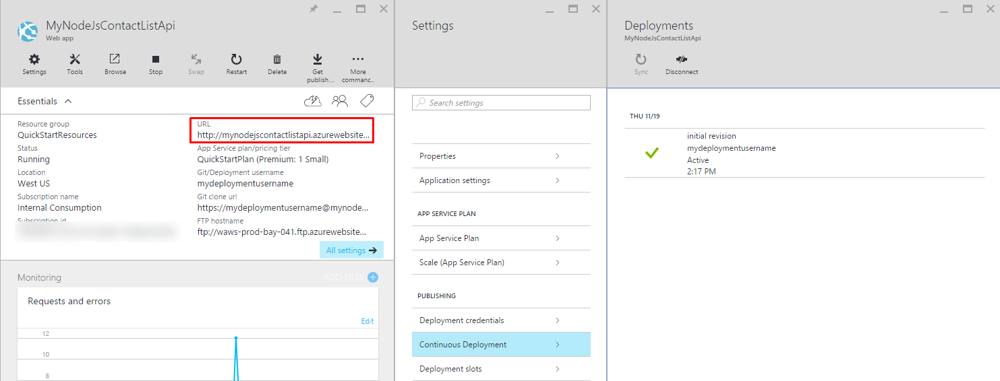

<properties
    pageTitle="Aplicativo de Node API no serviço de aplicativo do Azure | Microsoft Azure"
    description="Saiba como criar uma API RESTful node e implantá-lo em um aplicativo de API do serviço de aplicativo do Azure."
    services="app-service\api"
    documentationCenter="node"
    authors="bradygaster"
    manager="wpickett"
    editor=""/>

<tags
    ms.service="app-service-api"
    ms.workload="web"
    ms.tgt_pltfrm="na"
    ms.devlang="node"
    ms.topic="get-started-article"
    ms.date="05/26/2016"
    ms.author="rachelap"/>

# Construir uma API RESTful node e implantá-lo em um aplicativo de API no Azure

[AZURE.INCLUDE [app-service-api-get-started-selector](../../includes/app-service-api-get-started-selector.md)]

Este tutorial mostra como criar um simples [Node](http://nodejs.org) API e implantá-lo em um [aplicativo de API](app-service-api-apps-why-best-platform.md) do [Serviço de aplicativo do Azure](../app-service/app-service-value-prop-what-is.md) usando [gito](http://git-scm.com). Você pode usar qualquer sistema operacional que podem ser executados Node, e você vai fazer todo o seu trabalho, usando ferramentas de linha de comando como cmd.exe ou bash.

## Pré-requisitos

1. Conta do Microsoft Azure ([Abrir uma conta gratuita aqui](https://azure.microsoft.com/pricing/free-trial/))
1. [Node](http://nodejs.org) instalado (neste exemplo pressupõe que você tenha Node versão 4.2.2)
2. [Gito](https://git-scm.com/) instalado
1. Conta de [GitHub](https://github.com/)

Enquanto o serviço de aplicativo oferece suporte a várias maneiras para implantar seu código em um aplicativo de API, este tutorial mostra o método gito e pressupõe que você tenha conhecimento básico sobre como trabalhar com gito. Para obter informações sobre outros métodos de implantação, consulte [implantar seu aplicativo do serviço de aplicativo do Azure](../app-service-web/web-sites-deploy.md).

## Obter o código de amostra

1. Abra uma interface de linha de comando que pode executar comandos node e gito.

1. Navegue até uma pasta que você pode usar para um local gito repositório e clonar [repositório GitHub contendo o código de amostra](https://github.com/Azure-Samples/app-service-api-node-contact-list).

        git clone https://github.com/Azure-Samples/app-service-api-node-contact-list.git

    A API de amostra fornece dois pontos de extremidade: uma solicitação Get para `/contacts` retorna uma lista de nomes e endereços de email no formato JSON, enquanto `/contacts/{id}` retorna apenas o contato selecionado.

## Scaffold (gerar automaticamente) Node código baseadas em metadados de Swagger

[Swagger](http://swagger.io/) é um formato de arquivo para metadados que descreve uma API RESTful. Serviço de aplicativo do Azure possui [suporte interno para Swagger metadados](app-service-api-metadata.md). Esta seção do tutorial modela um fluxo de trabalho de desenvolvimento de API você primeiro cria Swagger metadados e usá-lo para scaffold (gerar automaticamente) código do servidor para a API. 

>[AZURE.NOTE] Você pode pular esta seção se você não quiser saber como scaffold Node código de um arquivo de metadados de Swagger. Se você quiser apenas implante o código de amostra para um novo aplicativo de API, vá diretamente para a seção [criar um aplicativo de API no Azure](#createapiapp) .

### Instalar e executar Swaggerize

1. Execute os seguintes comandos para instalar os **yo** **swaggerize gerador** NPM módulos e globalmente.

        npm install -g yo
        npm install -g generator-swaggerize

    Swaggerize é uma ferramenta que gera o código do servidor para uma API descrita por um arquivo de metadados de Swagger. O arquivo de Swagger que você usará é chamado *api.json* e está localizado na pasta *Iniciar* do repositório que você duplicado.

2. Navegue até a pasta *Iniciar* e, em seguida, execute o `yo swaggerize` comando. Swaggerize será peça uma série de perguntas.  Para **o que esse projeto de chamadas**, insira "ContactList", o caminho **para swagger o documento**, insira "api.json" e para **Express, satisfeito, ou Restify**, insira "express".

        yo swaggerize

    
    
    **Observação**: se você encontrar um erro nesta etapa, a próxima etapa explica como corrigi-lo.

    Swaggerize cria uma pasta de aplicativo, scaffolds manipuladores e arquivos de configuração e gera um arquivo de **package.json** . O mecanismo de exibição express é usado para gerar a página de ajuda Swagger.  

3. Se o `swaggerize` comando falhar com um erro de "sequência de escape inválido" ou "token inesperado", corrija a causa do erro editando o arquivo gerado *package.json* . No `regenerate` linha em `scripts`, altere a barra invertida que precede *api.json* para uma barra invertida, para que a linha se parece com o exemplo a seguir:

        "regenerate": "yo swaggerize --only=handlers,models,tests --framework express --apiPath config/api.json"

1. Navegue até a pasta que contém o código scaffolded (nesse caso, a subpasta */start/ContactList* ).

1. Executar `npm install`.
    
        npm install
        
2. Instale o módulo NPM **jsonpath** . 

        npm install --save jsonpath
        
    

1. Instale o módulo NPM **swaggerize-interface do usuário** . 

        npm install --save swaggerize-ui
        
    

### Personalizar o código scaffolded

1. Copie a pasta **biblioteca** da pasta **Iniciar** para a pasta de **ContactList** criada pela scaffolder. 

1. Substitua o código no arquivo **handlers/contacts.js** com o seguinte código. 

    Este código usa os dados JSON armazenados no arquivo **lib/contacts.json** que é atendido por **lib/contactRepository.js**. O novo código de contacts.js responde a solicitações HTTP para obter todos os contatos e retorná-los como uma carga JSON. 

        'use strict';
        
        var repository = require('../lib/contactRepository');
        
        module.exports = {
            get: function contacts_get(req, res) {
                res.json(repository.all())
            }
        };

1. Substitua o código no arquivo **handlers/contacts/{id}.js** com o código de fofllowing. 

        'use strict';

        var repository = require('../../lib/contactRepository');
        
        module.exports = {
            get: function contacts_get(req, res) {
                res.json(repository.get(req.params['id']));
            }    
        };

1. Substitua o código em **Server. js** com o código a seguir. 

    As alterações feitas no arquivo Server. js sejam chamadas usando comentários para que você possa ver as alterações feitas. 

        'use strict';

        var port = process.env.PORT || 8000; // first change

        var http = require('http');
        var express = require('express');
        var bodyParser = require('body-parser');
        var swaggerize = require('swaggerize-express');
        var swaggerUi = require('swaggerize-ui'); // second change
        var path = require('path');

        var app = express();

        var server = http.createServer(app);

        app.use(bodyParser.json());

        app.use(swaggerize({
            api: path.resolve('./config/api.json'), // third change
            handlers: path.resolve('./handlers'),
            docspath: '/swagger' // fourth change
        }));

        // change four
        app.use('/docs', swaggerUi({
          docs: '/swagger'  
        }));

        server.listen(port, function () { // fifth and final change
        });

### Teste com a API executando localmente

1. Ative o servidor usando o executável de linha de comando do Node. 

        node server.js

1. Quando você navega para **http://localhost:8000/contatos**, você vê o resultado JSON da lista de contatos (ou que você deve baixá-lo, dependendo do seu navegador). 

    

1. Quando você navega para **Contatos/http://localhost:8000/2**, você verá o contato representado por esse valor de id.

    

1. Os dados Swagger JSON são atendidos via o ponto de **extremidade/swagger** :

    

1. A interface do usuário Swagger é atendido via o ponto de extremidade de **/docs** . A IU Swagger, você pode usar os recursos avançados de cliente HTML para testar sua API.

    

## Criar um novo App API

Nesta seção você pode usar o portal do Azure para criar um novo App API no Azure. Este aplicativo API representa os recursos de computação que Azure fornecerá para executar seu código. Nas seções posteriores, você vai implantar seu código para o novo aplicativo de API.

1. Navegue até o [Portal do Azure](https://portal.azure.com/). 

1. Clique em **Novo > Web + Mobile > aplicativo API**. 

    

4. Digite um **nome do aplicativo** que é exclusivo no domínio *azurewebsites.net* , como NodejsAPIApp além de um número para torná-lo exclusivo. 

    Por exemplo, se o nome é `NodejsAPIApp`, a URL será `nodejsapiapp.azurewebsites.net`.

    Se você inserir um nome que alguém já tenha usado, você verá um ponto de exclamação vermelho para a direita.

6. No menu suspenso **Grupo de recursos** , clique em **novo**e em **nome de grupo do novo recurso** insira "NodejsAPIAppGroup" ou outro nome se você preferir. 

    Um [grupo de recursos](../azure-resource-manager/resource-group-overview.md) é uma coleção de recursos Azure como aplicativos, bancos de dados e VMs API. Para este tutorial, é melhor criar um novo grupo de recursos, porque o que facilita a excluir, em uma etapa, todos os recursos Azure que você cria para o tutorial.

4. Clique **Local da plano de serviço de aplicativo**e, em seguida, clique em **Criar novo**.

    

    Nas etapas a seguir, você cria um plano de serviço de aplicativo para o novo grupo de recursos. Um plano de serviço de aplicativo especifica os recursos de computação que seu aplicativo de API é executado em. Por exemplo, se você escolher a camada gratuita, seu aplicativo de API é executado no VMs compartilhadas, enquanto para alguns níveis pagos, ele é executado em VMs dedicadas. Para obter informações sobre planos de serviço de aplicativo, consulte [Visão geral de planos de serviço de aplicativo](../app-service/azure-web-sites-web-hosting-plans-in-depth-overview.md).

5. Na lâmina **Plano de serviço do aplicativo** , insira "NodejsAPIAppPlan" ou outro nome se você preferir.

5. Na lista suspensa **local** , escolha o local que for mais próximo a você.

    Esta configuração especifica quais Azure data center seu aplicativo será executado em. Para este tutorial, você pode selecionar qualquer região e ele não fazer uma diferença notável. Mas, para um aplicativo de produção, você deseja que o seu servidor seja mais próximo possível para os clientes que estão acessando-o para minimizar a [latência](http://www.bing.com/search?q=web%20latency%20introduction&qs=n&form=QBRE&pq=web%20latency%20introduction&sc=1-24&sp=-1&sk=&cvid=eefff99dfc864d25a75a83740f1e0090).

5. Clique em **nível de preços > Exibir tudo > F1 livre**.

    Para este tutorial, o nível de preços gratuito fornecerá suficientes de desempenho.

    

6. Na lâmina **Plano de serviço de aplicativo** , clique em **Okey**.

7. Na lâmina **API do aplicativo** , clique em **criar**.

## Configurar o seu novo aplicativo de API para implantação gito

Você vai implantar o código do seu aplicativo API enviando confirmações para um repositório gito no serviço de aplicativo do Azure. Nesta seção do tutorial, você pode criar as credenciais e o repositório de gito no Azure que você usará para implantação.  

1. Depois de seu aplicativo de API tiver sido criado, clique em **os serviços de aplicativo > {seu aplicativo API}** da home page do portal. 

    O portal exibe as lâminas **App API** e **configurações** .

    

1. Na lâmina **configurações** , role até a seção de **publicação** e, em seguida, clique em **credenciais de implantação**.
 
3. Na lâmina **definir credenciais de implantação** , digite um nome de usuário e senha e clique em **Salvar**.

    Você usará essas credenciais para publicar seu código Node em seu aplicativo de API. 

    

1. Na lâmina **configurações** , clique em **fonte de implantação > Escolher fonte > repositório gito Local**, clique em **Okey**.

    

1. Depois que seu repositório gito criou as alterações de blade para mostrar as implantações ativas. Como o repositório for novato, você não tem nenhuma implantação ativa na lista. 

    

1. Copie a URL do repositório gito. Para fazer isso, navegue até a lâmina para seu novo App API e examine a seção **Essentials** da lâmina. Observe que a **URL de clonar gito** na seção **Essentials** . Quando você focaliza esta URL, você verá um ícone à direita que irá copiar a URL para a área de transferência. Clique neste ícone para copiar a URL.

    

    **Observação**: você precisará a clonar gito URL na próxima seção então certifique-se de salvá-la em outro para o momento.

Agora que você tem um App API com um repositório de gito fazendo backup, você pode enviar o código no repositório para implantar o código para o aplicativo de API. 

## Implantar seu código de API do Azure

Nesta seção, você cria um repositório gito local que contém o código do servidor para a API e, em seguida, você enviar seu código esse repositório para o repositório no Azure que você criou anteriormente.

1. Copiar o `ContactList` pasta para um local que você pode usar para um novo repositório gito local. Se você fez a primeira parte do tutorial, copie `ContactList` do `start` pasta; Caso contrário, copie `ContactList` do `end` pasta.

1. Em sua ferramenta de linha de comando, navegue para a nova pasta e execute o seguinte comando para criar um novo repositório gito local. 

        git init

     

1. Execute o seguinte comando para adicionar um gito remoto para repositório do seu aplicativo de API. 

        git remote add azure YOUR_GIT_CLONE_URL_HERE

    **Observação**: Substitua a cadeia de caracteres "YOUR_GIT_CLONE_URL_HERE" a sua própria URL de clonar gito que você copiou anteriormente. 

1. Execute os seguintes comandos para criar uma confirmação que contém todos os códigos. 

        git add .
        git commit -m "initial revision"

    

1. Execute o comando enviar seu código ao Azure. Quando solicitado para uma senha, insira aquele que você criou anteriormente no portal do Azure.

        git push azure master

    Isso dispara uma implantação para seu aplicativo de API.  

1. No seu navegador, navegue de volta para a lâmina de **implantações** para o aplicativo de API e você verá que a implantação está ocorrendo. 

    

    Simultaneamente, a interface de linha de comando reflete o status da sua implantação enquanto ele está acontecendo. 

    

    Após a implantação ter sido concluído, a lâmina **implantações** reflete a implantação bem-sucedida de suas alterações de código para sua API App. 

## Teste com a API em execução no Azure
 
3. Copie a **URL** na seção **Essentials** do seu blade API App. 

    

1. Usar um cliente API REST como carteiro ou Fiddler (ou seu navegador da web), fornecer a URL de seus contatos chamada de API, que é o `/contacts` ponto de extremidade de seu aplicativo de API. A URL será`https://{your API app name}.azurewebsites.net/contacts`

    Quando você emitir uma solicitação GET para esse ponto de extremidade, você recebe a saída JSON de seu aplicativo de API.

    

2. Em um navegador, vá para o `/docs` ponto de extremidade para experimentar a interface do usuário Swagger como ele é executado no Azure.

Agora que você tem o fornecimento contínuo ligado, você pode fazer alterações de código e implantá-los no Azure simplesmente pressionando confirmações ao seu repositório gito do Azure.

## Próximas etapas

Neste ponto você com êxito criou um App API e implantou código Node API-lo. Mostra o tutorial próxima como [consumir aplicativos da API do JavaScript clientes, usando CORS](app-service-api-cors-consume-javascript.md).
