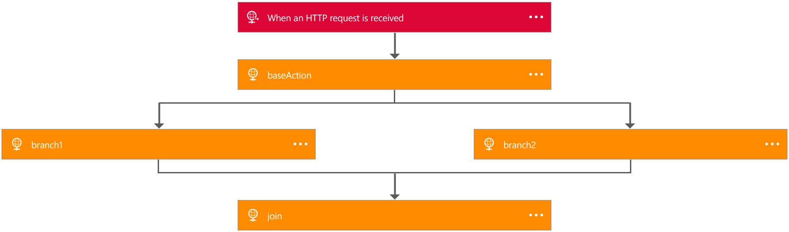

<properties 
    pageTitle="Criar definições de aplicativo de lógica | Microsoft Azure" 
    description="Aprenda como escrever a definição de JSON para aplicativos de lógica" 
    authors="jeffhollan" 
    manager="erikre" 
    editor="" 
    services="logic-apps" 
    documentationCenter=""/>

<tags
    ms.service="logic-apps"
    ms.workload="integration"
    ms.tgt_pltfrm="na"
    ms.devlang="na"
    ms.topic="article"
    ms.date="07/25/2016"
    ms.author="jehollan"/>
    
# <a name="author-logic-app-definitions"></a>Definições de aplicativo de lógica de autor
Este tópico demonstra como usar definições de [Aplicativos de lógica do Azure](app-service-logic-what-are-logic-apps.md) , que é uma linguagem JSON simple e declarativa. Se você ainda não tiver feito isso ainda, confira [como criar um novo aplicativo de lógica](app-service-logic-create-a-logic-app.md) primeiro. Você também pode ler o [material de referência completo da linguagem de definição no MSDN](http://aka.ms/logicappsdocs).

## <a name="several-steps-that-repeat-over-a-list"></a>Várias etapas que se repetem sobre uma lista

Você pode aproveitar o [tipo de foreach](app-service-logic-loops-and-scopes.md) para repetir em uma matriz de até 10 mil itens e executar uma ação para cada um.

## <a name="a-failure-handling-step-if-something-goes-wrong"></a>Uma etapa de manipulação de falha se algo der errado

Você deseja ser capaz de gravar uma *etapa de correção* comumente — alguma lógica que executa, se **e somente se**, uma ou mais das suas chamadas falharam. Neste exemplo, estamos obtendo dados de uma variedade de locais, mas se a chamada falhar, quiser postar uma mensagem para outro, para que eu pode rastrear essa falha posteriormente:  

```
{
    "$schema": "https://schema.management.azure.com/providers/Microsoft.Logic/schemas/2016-06-01/workflowdefinition.json#",
    "contentVersion": "1.0.0.0",
    "parameters": {
    },
    "triggers": {
        "manual": {
            "type": "manual"
        }
    },
    "actions": {
        "readData": {
            "type": "Http",
            "inputs": {
                "method": "GET",
                "uri": "http://myurl"
            }
        },
        "postToErrorMessageQueue": {
            "type": "ApiConnection",
            "inputs": "...",
            "runAfter": {
                "readData": ["Failed"]
            }
        }
    },
    "outputs": {}
}
```

Você pode fazer uso da `runAfter` propriedade para especificar o `postToErrorMessageQueue` deve executar somente após `readData` é **Falha**.  Isso também pode ser uma lista de valores possíveis, portanto `runAfter` poderia ser `["Succeeded", "Failed"]`.

Finalmente, porque você utilizaram o erro agora, podemos já não marcar executar como **falhou**. Como você pode ver aqui, nesta execução é **bem-sucedido** Embora uma etapa falhou, porque eu gravou a etapa para lidar com essa falha.

## <a name="two-or-more-steps-that-execute-in-parallel"></a>Dois (ou mais) etapas executadas em paralelo

Ter vários execução de ações em paralelo, o `runAfter` propriedade deve ser equivalente no tempo de execução. 

```
{
    "$schema": "https://schema.management.azure.com/providers/Microsoft.Logic/schemas/2016-06-01/workflowdefinition.json#",
    "contentVersion": "1.0.0.0",
    "parameters": {},
    "triggers": {
        "manual": {
            "type": "manual"
        }
    },
    "actions": {
        "readData": {
            "type": "Http",
            "inputs": {
                "method": "GET",
                "uri": "http://myurl"
            }
        },
        "branch1": {
            "type": "Http",
            "inputs": "...",
            "runAfter": {
                "readData": ["Succeeded"]
            }
        },
        "branch2": {
            "type": "Http",
            "inputs": "...",
            "runAfter": {
                "readData": ["Succeeded"]
            }
        }
    },
    "outputs": {}
}
```

Como você pode ver no exemplo acima, ambos `branch1` e `branch2` está definido para ser executado `readData`. Como resultado, ambas essas ramificações serão executado em paralelo:


Você pode ver que o carimbo de hora para ambas as ramificações é idêntico. 

## <a name="join-two-parallel-branches"></a>Ingressar em duas ramificações paralelas

Você pode associar duas ações que foram definidas para executar em paralelo, adicionando itens para o `runAfter` propriedade semelhante ao acima.

```
{
    "$schema": "https://schema.management.azure.com/providers/Microsoft.Logic/schemas/2016-04-01-preview/workflowdefinition.json#",
    "actions": {
        "readData": {
            "inputs": {
                "method": "GET",
                "uri": "http://myurl"
            },
            "runAfter": {},
            "type": "Http"
        },
        "branch1": {
            "inputs": {
                "method": "GET",
                "uri": "http://myurl"
            },
            "runAfter": {
                "readData": [
                    "Succeeded"
                ]
            },
            "type": "Http"
        },
        "branch2": {
            "inputs": {
                "method": "GET",
                "uri": "http://myurl"
            },
            "runAfter": {
                "readData": [
                    "Succeeded"
                ]
            },
            "type": "Http"
        },
        "join": {
            "inputs": {
                "method": "GET",
                "uri": "http://myurl"
            },
            "runAfter": {
                "branch1": [
                    "Succeeded"
                ],
                "branch2": [
                    "Succeeded"
                ]
            },
            "type": "Http"
        }
    },
    "contentVersion": "1.0.0.0",
    "outputs": {},
    "parameters": {},
    "triggers": {
        "manual": {
            "inputs": {
                "schema": {}
            },
            "kind": "Http",
            "type": "Request"
        }
    }
}
```



## <a name="mapping-items-in-a-list-to-some-different-configuration"></a>Mapeamento de itens em uma lista para algumas configurações diferentes

Próximo, digamos que queremos obter conteúdo completamente diferente dependendo de um valor de uma propriedade. Podemos criar um mapa de valores para destinos como um parâmetro:  

```
{
    "$schema": "https://schema.management.azure.com/providers/Microsoft.Logic/schemas/2016-06-01/workflowdefinition.json#",
    "contentVersion": "1.0.0.0",
    "parameters": {
        "specialCategories": {
            "defaultValue": ["science", "google", "microsoft", "robots", "NSA"],
            "type": "Array"
        },
        "destinationMap": {
            "defaultValue": {
                "science": "http://www.nasa.gov",
                "microsoft": "https://www.microsoft.com/en-us/default.aspx",
                "google": "https://www.google.com",
                "robots": "https://en.wikipedia.org/wiki/Robot",
                "NSA": "https://www.nsa.gov/"
            },
            "type": "Object"
        }
    },
    "triggers": {
        "manual": {
            "type": "manual"
        }
    },
    "actions": {
        "getArticles": {
            "type": "Http",
            "inputs": {
                "method": "GET",
                "uri": "https://ajax.googleapis.com/ajax/services/feed/load?v=1.0&q=http://feeds.wired.com/wired/index"
            },
            "conditions": []
        },
        "getSpecialPage": {
            "type": "Http",
            "inputs": {
                "method": "GET",
                "uri": "@parameters('destinationMap')[first(intersection(item().categories, parameters('specialCategories')))]"
            },
            "conditions": [{
                "expression": "@greater(length(intersection(item().categories, parameters('specialCategories'))), 0)"
            }],
            "forEach": "@body('getArticles').responseData.feed.entries"
        }
    }
}
```

Nesse caso, estamos primeiro obter uma lista de artigos e, em seguida, a segunda etapa procura em um mapa, com base na categoria que foi definida como um parâmetro, qual URL para acessar o conteúdo do. 

Dois itens prestar atenção aqui: o [`intersection()`](https://msdn.microsoft.com/library/azure/mt643789.aspx#intersection) função é usada para verificar se a categoria corresponde a uma das categorias conhecidas definidas. Segundo, depois de entrar na categoria, podemos podem retirar o item do mapa de uso de colchetes: `parameters[...]`. 

## <a name="working-with-strings"></a>Trabalhando com cadeias de caracteres

Há várias funções que podem ser usados para manipular a cadeia de caracteres. Vamos dar um exemplo onde temos uma cadeia de caracteres que queremos passar para um sistema, mas não estamos certeza de que codificação de caracteres será manipulada corretamente. Outra alternativa é na Base 64 codificar essa cadeia de caracteres. No entanto, para evitar a saída em uma URL, vamos substituir alguns caracteres. 

Também queremos uma subcadeia da a ordem nomear porque os primeiros 5 caracteres não são usados.

```
{
    "$schema": "https://schema.management.azure.com/providers/Microsoft.Logic/schemas/2016-06-01/workflowdefinition.json#",
    "contentVersion": "1.0.0.0",
    "parameters": {
        "order": {
            "defaultValue": {
                "quantity": 10,
                "id": "myorder1",
                "orderer": "NAME=Stèphén__Šīçiłianö"
            },
            "type": "Object"
        }
    },
    "triggers": {
        "manual": {
            "type": "manual"
        }
    },
    "actions": {
        "order": {
            "type": "Http",
            "inputs": {
                "method": "GET",
                "uri": "http://www.example.com/?id=@{replace(replace(base64(substring(parameters('order').orderer,5,sub(length(parameters('order').orderer), 5) )),'+','-') ,'/' ,'_' )}"
            }
        }
    },
    "outputs": {}
}
```

Trabalho de dentro para fora:

1. Obtenha o [`length()`](https://msdn.microsoft.com/library/azure/mt643789.aspx#length) do nome do autor da ordem, isso retorna o número total de caracteres

2. Subtrair 5 (porque vai queremos uma cadeia de caracteres mais curta)

3. Realmente levar a [`substring()`](https://msdn.microsoft.com/library/azure/mt643789.aspx#substring) . Vamos começar no índice `5` e vá o resto da cadeia de caracteres.

4. Converter este subcadeia de caracteres para um [`base64()`](https://msdn.microsoft.com/library/azure/mt643789.aspx#base64) cadeia de caracteres

5. [`replace()`](https://msdn.microsoft.com/library/azure/mt643789.aspx#replace)todos os `+` caracteres com`-`

6. [`replace()`](https://msdn.microsoft.com/library/azure/mt643789.aspx#replace)todos os `/` caracteres com`_`

## <a name="working-with-date-times"></a>Trabalhar com datas

Datas podem ser úteis, especialmente quando você estiver tentando extrair dados de uma fonte de dados que naturalmente não dá suporte a **disparadores**.  Você também pode usar datas para calcular quanto tempo várias etapas estão demorando. 

```
{
    "$schema": "https://schema.management.azure.com/providers/Microsoft.Logic/schemas/2016-06-01/workflowdefinition.json#",
    "contentVersion": "1.0.0.0",
    "parameters": {
        "order": {
            "defaultValue": {
                "quantity": 10,
                "id": "myorder1"
            },
            "type": "Object"
        }
    },
    "triggers": {
        "manual": {
            "type": "manual"
        }
    },
    "actions": {
        "order": {
            "type": "Http",
            "inputs": {
                "method": "GET",
                "uri": "http://www.example.com/?id=@{parameters('order').id}"
            }
        },
        "timingWarning": {
            "actions" {
                "type": "Http",
                "inputs": {
                    "method": "GET",
                    "uri": "http://www.example.com/?recordLongOrderTime=@{parameters('order').id}&currentTime=@{utcNow('r')}"
                },
                "runAfter": {}
            }
            "expression": "@less(actions('order').startTime,addseconds(utcNow(),-1))"
        }
    },
    "outputs": {}
}
```

Neste exemplo, podemos está extraindo a `startTime` da etapa anterior. Em seguida, estamos obtendo a hora atual e subtraindo um segundo:[`addseconds(..., -1)`](https://msdn.microsoft.com/library/azure/mt643789.aspx#addseconds) (você pode usar outras unidades de tempo como `minutes` ou `hours`). Por fim, podemos pode comparar esses dois valores. Se a primeira é menor do que o segundo, em seguida, isso significa que mais de um segundo decorrido desde que a ordem foi colocada. 

Observe também que podemos usar formatadores de cadeia de caracteres para formatar datas: na sequência de consulta usar [`utcnow('r')`](https://msdn.microsoft.com/library/azure/mt643789.aspx#utcnow) para obter o RFC1123. Todos data formatação [é documentadas no MSDN](https://msdn.microsoft.com/library/azure/mt643789.aspx#utcnow). 

## <a name="using-deployment-time-parameters-for-different-environments"></a>Usando parâmetros de tempo de implantação para ambientes diferentes

É comum ter um ciclo de vida de implantação onde você tem um ambiente de desenvolvimento, um ambiente de teste e, em seguida, um ambiente de produção. Em todos esses você pode ser a mesma definição, mas usar bancos de dados diferentes, por exemplo. Da mesma forma, talvez você queira usar a mesma definição em diversas regiões diferentes para alta disponibilidade, mas quiser cada instância do aplicativo de lógica para se comunicar com o banco de dados da região. 

Observe que isso é diferente do levando parâmetros diferentes em *tempo de execução*, que você deve usar o `trigger()` funcionar como destacados acima. 

Você pode começar com uma definição muito simples como esta:

```
{
    "$schema": "https://schema.management.azure.com/providers/Microsoft.Logic/schemas/2016-06-01/workflowdefinition.json#",
    "contentVersion": "1.0.0.0",
    "parameters": {
        "uri": {
            "type": "string"
        }
    },
    "triggers": {
        "manual": {
            "type": "manual"
        }
    },
    "actions": {
        "readData": {
            "type": "Http",
            "inputs": {
                "method": "GET",
                "uri": "@parameters('uri')"
            }
        }
    },
    "outputs": {}
}
```

Em seguida, no reais `PUT` solicitação para o aplicativo de lógica, você pode fornecer o parâmetro `uri`. Observe, como não existe mais um valor padrão este parâmetro é necessário a carga de aplicativo lógica:

```
{
    "properties": {},
        "definition": {
          // Use the definition from above here
        },
        "parameters": {
            "connection": {
                "value": "https://my.connection.that.is.per.enviornment"
            }
        }
    },
    "location": "westus"
}
``` 

Em cada ambiente, em seguida, você pode fornecer um valor diferente para o `connection` parâmetro. 

Consulte a [documentação da API REST](https://msdn.microsoft.com/library/azure/mt643787.aspx) para todas as opções que disponíveis para criar e gerenciar aplicativos de lógica. 
