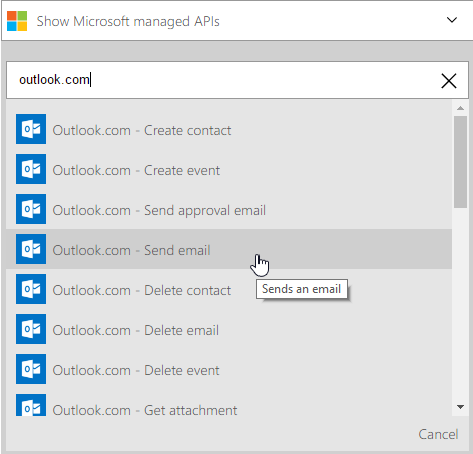

<properties
    pageTitle="Criar um aplicativo de lógica | Microsoft Azure"
    description="Saiba como criar um aplicativo de lógica conectando serviços SaaS"
    authors="jeffhollan"
    manager="dwrede"
    editor=""
    services="logic-apps"
    documentationCenter=""/>

<tags
    ms.service="logic-apps"
    ms.workload="na"
    ms.tgt_pltfrm="na"
    ms.devlang="na"
    ms.topic="get-started-article"
    ms.date="10/18/2016"
    ms.author="jehollan"/>

# Criar um novo aplicativo de lógica conectando serviços SaaS

Este tópico demonstra como, em apenas alguns minutos, você pode começar a usar [Azure lógica de aplicativos](app-service-logic-what-are-logic-apps.md). Examinaremos um fluxo de trabalho simple que permite enviar tweets interessantes ao seu email.

Para usar esse cenário, você precisa:

- Uma assinatura do Azure
- Uma conta do Twitter
- Uma conta do Outlook.com ou hospedada caixa de correio do Office 365

## Criar um novo aplicativo de lógica para enviar e-mail tweets

1. No [Painel de portal Azure](https://portal.azure.com), selecione **novo**. 
2. Na barra de pesquisa, pesquise 'lógica aplicativos' e, em seguida, selecione o **Aplicativo de lógica**. Você também pode selecionar **novo** **Web + Mobile**e selecione **Lógica de aplicativo**. 
3. Insira um nome para seu aplicativo de lógica, selecione um local, grupo de recursos e selecione **criar**.  Se você selecionar **Pin para Dashboard** o aplicativo de lógica serão abertas automaticamente uma vez implantada.  
4. Depois de abrir o aplicativo de lógica pela primeira vez, você pode selecionar de um modelo para iniciar.  Agora clique em **Aplicativo lógica em branco** para criar isso partir do zero. 
1. O primeiro item que você precisa criar é o disparador.  Este é o evento que iniciará seu aplicativo de lógica.  Procurar **twitter** na caixa de pesquisa disparador e selecioná-lo.
7. Agora você vai digitar um termo de pesquisa para acionar em.  A **frequência** e o **intervalo** determinará a frequência seu aplicativo de lógica verificará tweets novo (e retornar todos os tweets durante que o período de tempo).
    

5. Selecione o botão **nova etapa** e escolha **Adicionar uma ação** ou **Adicionar uma condição**
6. Quando você selecionar **Adicionar uma ação**, você pode pesquisar dos [conectores disponíveis](../connectors/apis-list.md) para escolher uma ação. Por exemplo, você pode selecionar **Outlook.com - Enviar Email** para enviar emails a partir de um endereço de outlook.com:  
    

7. Agora você tem que preencher os parâmetros para o email que você deseja:  

8. Por fim, você pode selecionar **Salvar** para tornar seu aplicativo de lógica live.

## Gerenciar seu aplicativo de lógica após a criação

Agora seu aplicativo de lógica está em execução. Ele verificará periodicamente tweets com o termo de pesquisa digitado. Quando ele encontra uma tweet correspondente, ele enviará um email. Finalmente, você vai ver como desabilitar o aplicativo ou ver como ele está fazendo.

1. Acesse o [Portal do Azure](https://portal.azure.com)

1. Clique em **Procurar** no lado esquerdo da tela e selecione **Aplicativos de lógica**.

2. Clique no novo aplicativo de lógica que você acabou de criar para ver o status atual e informações gerais.

3. Para editar seu novo aplicativo de lógica, clique em **Editar**.

5. Para desativar o aplicativo, clique em **Desativar** na barra de comando.

1. Exibir históricos de executar e o acionador para monitorar quando seu aplicativo de lógica está em execução.  Você pode clicar em **Atualizar** para ver os dados mais recentes.

Em menos de 5 minutos você conseguiu configurar um aplicativo de lógica simples em execução na nuvem. Para saber mais sobre como usar os recursos de aplicativos de lógica, consulte [usar os recursos de aplicativo lógica]. Para saber mais sobre as definições de aplicativo de lógica próprios, consulte [criar definições de aplicativo de lógica](app-service-logic-author-definitions.md).

<!-- Shared links -->
[Azure portal]: https://portal.azure.com
[Usar os recursos de aplicativo de lógica]: app-service-logic-create-a-logic-app.md
