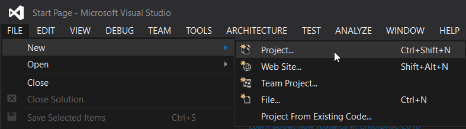
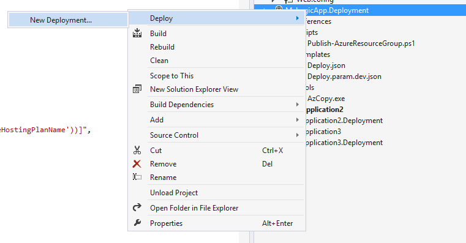
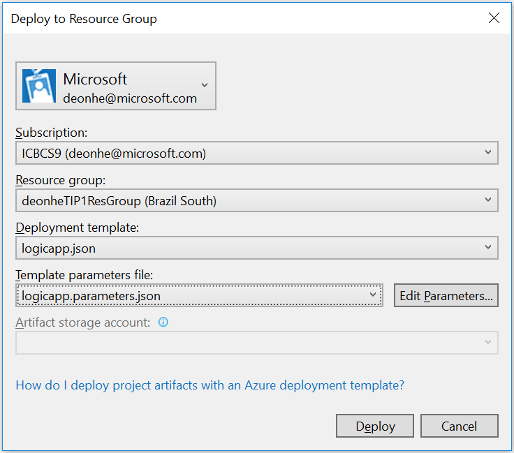
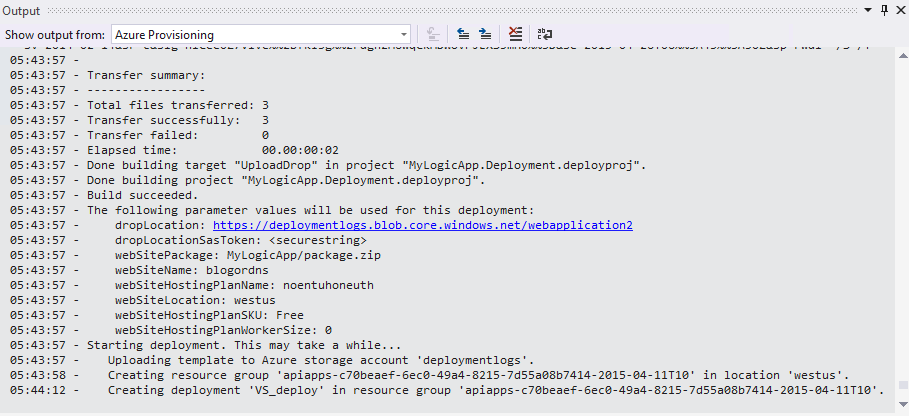

<properties 
    pageTitle="Criar aplicativos de lógica no Visual Studio | Microsoft Azure" 
    description="Crie um projeto no Visual Studio para criar e implantar o seu aplicativo de lógica." 
    authors="jeffhollan" 
    manager="erikre" 
    editor="" 
    services="logic-apps" 
    documentationCenter=""/>

<tags
    ms.service="logic-apps"
    ms.workload="integration"
    ms.tgt_pltfrm="na"
    ms.devlang="na"
    ms.topic="article"
    ms.date="10/18/2016"
    ms.author="jehollan"/> 
    
# Criar e implantar aplicativos de lógica no Visual Studio

Embora o [Portal Azure](https://portal.azure.com/) oferece a você uma ótima maneira de criar e gerenciar seus aplicativos de lógica, também convém criar e implantar o seu aplicativo de lógica do Visual Studio em vez disso.  Lógica de aplicativos vem com um conjunto de ferramentas Visual Studio avançado que permite que você criar um aplicativo de lógica usando o designer, configure os modelos de implantação e automação e implantar em qualquer ambiente.  

## Etapas de instalação

Abaixo estão as etapas para instalar e configurar as ferramentas do Visual Studio para aplicativos de lógica.

### Pré-requisitos

- [Visual Studio de 2015](https://www.visualstudio.com/downloads/download-visual-studio-vs.aspx)
- [SDK mais recente do Azure](https://azure.microsoft.com/downloads/) (2.9.1 ou superior)
- [Azure PowerShell] (https://github.com/Azure/azure-powershell#installation)
- Acesso à web usando o designer incorporado

### Instalar o Visual Studio tools para aplicativos de lógica

Uma vez que você tenha os pré-requisitos instalados, 

1. Abra o Visual Studio 2015 no menu **Ferramentas** e selecione **extensões e atualizações**
1. Selecione a categoria de **Online** para pesquisar online
1. Procurar por **Aplicativos de lógica** exibir as **Ferramentas de aplicativos do Azure lógica para Visual Studio**
1. Clique no botão de **Download** para baixar e instalar a extensão
1. Reinicie o Visual Studio após a instalação

> [AZURE.NOTE] Você também pode baixar a extensão diretamente desse [link](https://visualstudiogallery.msdn.microsoft.com/e25ad307-46cf-412e-8ba5-5b555d53d2d9)

Depois de instalado, você poderá usar o projeto de grupo de recursos do Azure com o Designer de aplicativo de lógica.

## Criar um projeto

1. Vá para o menu **arquivo** e selecione **novo** >  **projeto** (ou você pode ir para **Adicionar** e, em seguida, selecione **novo projeto** para adicioná-la a uma solução existente):  

1. Na caixa de diálogo Localizar **nuvem**e, em seguida, selecione o **Grupo de recursos do Azure**. Digite um **nome** e clique em **Okey**.
    

1. Selecione o modelo de **aplicativo de lógica** . Isso criará um modelo de implantação do aplicativo em branco lógica começar.
    

1. Depois que você tiver selecionado seu **modelo**, pressione **Okey**.

    Agora seu projeto de aplicativo de lógica é adicionado à sua solução. Você deve ver o arquivo de implantação no Solution Explorer:  

    

## Usando o Designer de aplicativo de lógica

Quando você tiver um projeto de grupo de recursos do Azure que contém um aplicativo de lógica, você pode abrir o designer de dentro do Visual Studio para ajudá-lo na criação de fluxo de trabalho.  O designer requer uma conexão de internet para os conectores de propriedades disponíveis e os dados da consulta (por exemplo, se usando o conector Dynamics CRM Online, o designer irá consultar sua instância CRM para listar propriedades padrão e personalizados disponíveis).

1. Clique com botão direito no `<template>.json` de arquivo e selecione **Abrir com o Designer de aplicativo de lógica** (ou `Ctrl+L`)
1. Escolha a assinatura, grupo de recursos e local para o modelo de implantação
    - É importante observar que a criação de um aplicativo de lógica irá criar recursos de **Conexão de API** para consultar propriedades durante o design.  O grupo de recursos selecionado será o grupo de recursos usado para criar as conexões durante o tempo de design.  Você pode exibir ou modificar as conexões de API indo para o Portal do Azure e navegando para **Conexões de API**.
    
1. O designer deve processar baseado na definição de no `<template>.json` arquivo.
1. Agora você pode criar e projetar seu aplicativo de lógica e alterações serão atualizadas no modelo de implantação.
    

Você também verá `Microsoft.Web/connections` recursos sendo adicionados ao seu arquivo de recurso para todas as conexões necessárias para o aplicativo de lógica à função.  Essas propriedades de conexão podem ser definidas quando você implanta e pode ser gerenciadas após implantar em **Conexões de API** no Portal do Azure.

### Alternar para a exibição de código JSON

Você pode selecionar a guia **Modo de exibição de código** na parte inferior do designer para alternar para a representação JSON do aplicativo lógica.  Para alternar para o recurso completo JSON, clique com botão direito do `<template>.json` de arquivo e selecione **Abrir**.

### Salvar o aplicativo de lógica

Você pode salvar o aplicativo de lógica em qualquer momento através do botão **Salvar** ou `Ctrl+S`.  Se houver quaisquer erros com seu aplicativo de lógica no momento em que você salva, eles serão exibida na janela de **saídas** do Visual Studio.

## Implantando seu aplicativo de lógica

Por fim, depois que você tiver configurado seu aplicativo, você pode implantar diretamente do Visual Studio em apenas algumas etapas. 

1. Clique com botão direito no projeto no Solution Explorer e vá para **implantar** > **Nova implantação …** 
     

2. Você será solicitado a entrar no seu inscrições Azure. 

3. Agora você precisa escolher os detalhes do grupo de recursos que você deseja implantar o aplicativo lógica. 
    

     > [AZURE.NOTE]    Certifique-se de selecionar os arquivos de modelo e parâmetros certos para o grupo de recursos (por exemplo se você estiver implantando em um ambiente de produção que você desejará escolha o arquivo de parâmetros de produção). 
4. Selecione o botão de implantar
 
    
6. O status da implantação é exibido na janela de **saída** (você talvez precise escolher **Provisionamento do Azure**. 
    

No futuro, você pode revisar seu aplicativo de lógica no controle de origem e use o Visual Studio para implantar novas versões. 

> [AZURE.NOTE] Se você modificar a definição no Portal do Azure diretamente, em seguida, na próxima vez que você implantar do Visual Studio essas alterações será substituída.

## Próximas etapas

- Para começar com aplicativos de lógica, siga o tutorial de [criar um aplicativo de lógica](app-service-logic-create-a-logic-app.md) .  
- [Exibir exemplos e cenários comuns](app-service-logic-examples-and-scenarios.md)
- [Você pode automatizar processos de negócios com aplicativos de lógica](http://channel9.msdn.com/Events/Build/2016/T694) 
- [Aprenda a integrar seus sistemas com aplicativos de lógica](http://channel9.msdn.com/Events/Build/2016/P462)