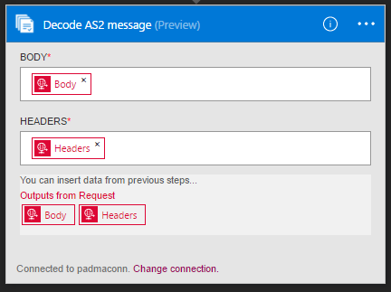

<properties 
    pageTitle="Saiba mais sobre Enterprise Pack integração decodificar AS2 mensagem Connctor | Serviço de aplicativo do Microsoft Azure | Microsoft Azure" 
    description="Saiba como usar parceiros com aplicativos do pacote de integração de empresa e lógica" 
    services="logic-apps" 
    documentationCenter=".net,nodejs,java"
    authors="padmavc" 
    manager="erikre" 
    editor=""/>

<tags 
    ms.service="logic-apps" 
    ms.workload="integration" 
    ms.tgt_pltfrm="na" 
    ms.devlang="na" 
    ms.topic="article" 
    ms.date="08/15/2016" 
    ms.author="padmavc"/>

# Introdução ao decodificar AS2 mensagem

Conectar-se a mensagem de AS2 decodificar estabelecer segurança e confiabilidade ao transmitir mensagens. Ele fornece a assinatura digital, descriptografia e confirmações por meio de notificações de disposição da mensagem (MDN).

## Criar a conexão

### Pré-requisitos

* Uma conta do Azure; Você pode criar uma [conta gratuita](https://azure.microsoft.com/free)

* Uma conta de integração é necessário para usar o conector de mensagem AS2 decodificar. Ver detalhes sobre como criar uma [Conta de integração](./app-service-logic-enterprise-integration-create-integration-account.md), [parceiros](./app-service-logic-enterprise-integration-partners.md) e um [contrato AS2](./app-service-logic-enterprise-integration-as2.md)

### Conectar-se a mensagem de AS2 decodificar usando as seguintes etapas:

1. [Criar um aplicativo de lógica](./app-service-logic-create-a-logic-app.md) fornece um exemplo.

2. Esse conector não ter disparadores. Use outros disparadores para iniciar o aplicativo de lógica, como um gatilho de solicitação.  No criador de aplicativo de lógica, adicione um disparador e adicione uma ação.  Selecione Microsoft Mostrar listam de APIs gerenciadas no menu suspenso e insira "AS2" na caixa de pesquisa.  Selecione AS2 – decodificar AS2 mensagem

    

3. Se você ainda não criou anteriormente quaisquer conexões a integração de conta, você será solicitado para os detalhes de conexão

    

4. Insira os detalhes da conta de integração.  Propriedades com um asterisco são necessárias

  	| Propriedade   | Detalhes |
  	| --------   | ------- |
  	| Nome de Conexão *    | Insira um nome para sua conexão |
  	| Conta de integração * | Insira o nome da conta de integração. Certifique-se de que sua conta de integração e o aplicativo de lógica estão no mesmo local Azure |

    Após a conclusão, os detalhes da conexão aparência semelhantes à seguinte

    

5. Selecione **criar**
    
6. Observe que a conexão tiver sido criado.  Agora, continue com as outras etapas em seu aplicativo de lógica

     

7. Selecione cabeçalhos e o corpo da solicitação de saídas

     

## O AS2 decodificar faz o seguinte

* Processa cabeçalhos AS2/HTTP
* Verifica a assinatura (se configurado)
* Descriptografa as mensagens (se configurado)
* Descompacta a mensagem (se configurado)
* Reconcilia um MDN recebido com a mensagem de saída original
* Atualizações e correlaciona registros do banco de dados não-recusa
* Grava registros para o relatório de status de AS2
* O conteúdo de carga de saída está codificação base64
* Determina se uma MDN for necessária e se o MDN deve ser síncrono ou assíncrono baseado na configuração do contrato AS2
* Gera uma MDN síncrono ou assíncrono (com base nas configurações de contrato)
* Define as propriedades e tokens de correlação na MDN

##Experimente para si mesmo

Por que não Experimente. Clique [aqui](https://azure.microsoft.com/documentation/templates/201-logic-app-as2-send-receive/) para implantar um aplicativo de lógica totalmente operacional da sua própria usando os recursos de lógica aplicativos AS2 

## Próximas etapas

[Saiba mais sobre o pacote de integração do Enterprise] (./app-service-logic-enterprise-integration-overview.md "Saiba mais sobre o pacote de integração de empresa") 