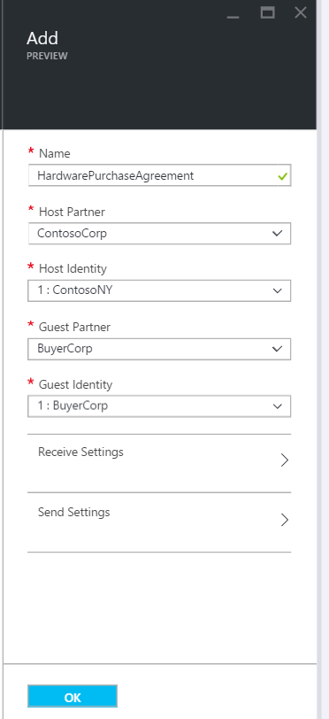

<properties 
    pageTitle="Saiba como criar um contrato AS2 para o pacote de integração do Enterprise" 
    description="Saiba como criar um contrato AS2 para o pacote de integração do Enterprise | Serviço de aplicativo do Microsoft Azure" 
    services="logic-apps" 
    documentationCenter=".net,nodejs,java"
    authors="msftman" 
    manager="erikre" 
    editor="cgronlun"/>

<tags 
    ms.service="logic-apps" 
    ms.workload="integration" 
    ms.tgt_pltfrm="na" 
    ms.devlang="na" 
    ms.topic="article" 
    ms.date="06/29/2016" 
    ms.author="deonhe"/>

# Integração do Enterprise com AS2

## Criar um contrato AS2
Para poder usar os recursos da empresa nos aplicativos de lógica, você deve primeiro criar contratos. 

### Veja aqui o que é necessário antes de começar
- Uma [conta de integração](./app-service-logic-enterprise-integration-accounts.md) definido na sua assinatura do Azure  
- Pelo menos dois [parceiros](./app-service-logic-enterprise-integration-partners.md) já definido em sua conta de integração  

>[AZURE.NOTE]Ao criar um contrato, o conteúdo do arquivo de contrato deve corresponder ao tipo de contrato.    

Depois de ter [criado uma conta de integração](./app-service-logic-enterprise-integration-accounts.md) e [adicionado parceiros](./app-service-logic-enterprise-integration-partners.md), você pode criar um contrato seguindo estas etapas:  

### Do Azure home page do portal

Depois de fazer logon no [portal do Azure](http://portal.azure.com "Azure portal"):  
1. Selecione **Procurar** no menu à esquerda.  

>[AZURE.TIP]Se você não vir o link **Procurar** , talvez você precise expandir o menu primeiro. Faça isto selecionando o link **Mostrar menu** localizada na parte superior esquerda do menu recolhido.  

    
2. Digite *integração* na caixa de pesquisa de filtro e selecione **Contas de integração** da lista de resultados.       
   
3. Na lâmina **Contas de integração** que será aberta, selecione a conta de integração no qual você criará o contrato. Se você não vir qualquer integração contas listas, [criar uma primeira](./app-service-logic-enterprise-integration-accounts.md "All about integration accounts").  
  
4.  Selecione o bloco de **contratos** . Se você não vir o bloco de contratos, adicioná-lo primeiro.   
   
5. Selecione o botão **Adicionar** na lâmina contratos que se abre.  
  
6. Digite um **nome** para seu contrato e selecione o **Parceiro de Host**, a **Identidade do Host**, o **Parceiro de convidado**, a **Identidade de convidado**, na lâmina contratos que se abre.  
  

Aqui estão alguns detalhes que podem ser úteis ao configurar as configurações de seu contrato: 
  
|Propriedade|Descrição|
|----|----|
|Parceiro de host|Um contrato necessidades parceiro de um host e o convidado. O parceiro de host representa a organização que está configurando o contrato.|
|Identidade do host|Um identificador para o parceiro de host. |
|Parceiro de convidado|Um contrato necessidades parceiro de um host e o convidado. O parceiro de convidado representa a organização que está fazendo negócios com o parceiro de host.|
|Identidade de convidado|Um identificador para o parceiro de convidado.|
|Configurações de recebimento|Essas propriedades se aplicam a todas as mensagens recebidas por um contrato|
|As configurações de envio|Essas propriedades se aplicam a todas as mensagens enviadas por um contrato|  
Vamos continuar:  
7. Selecione **Configurações de receber** para configurar como mensagens recebidas via este contrato devem ser tratadas.  
 
 - Opcionalmente, você pode substituir as propriedades na mensagem de entrada. Para fazer isso, marque a caixa de seleção **Substituir propriedades de mensagem** .
  - Marque a caixa de seleção **mensagem deve ser assinada** se você gostaria de exigir todas as mensagens recebidas sejam assinados. Se você selecionar essa opção, você também precisa selecionar o **certificado** que será usado para validar a assinatura nas mensagens.
  - Opcionalmente, você pode exigir mensagens sejam criptografados também. Para fazer isso, marque a caixa de **mensagem deve ser criptografada** . Você precisaria, em seguida, selecione o **certificado** que será usada para decodificar as mensagens de entrada.
  - Você também pode exigir mensagens a ser compactado. Para fazer isso, marque a caixa de **mensagem deve ser compactada** .  
  

Consulte a tabela a seguir se você gostaria de saber mais sobre o qual o recebimento configurações Habilitar.  

|Propriedade|Descrição|
|----|----|
|Substituir propriedades de mensagem|Selecione esta opção para indicar que podem ser substituídas propriedades em mensagens recebidas |
|Mensagem deve ser assinada|Habilitar essa opção para exigir que as mensagens a ser assinado digitalmente|
|Mensagem deve ser criptografada|Habilite essa opção para exigir que as mensagens sejam criptografados. Mensagens criptografadas não serão rejeitadas.|
|Mensagem deve ser compactada|Habilite essa opção para exigir que as mensagens a ser compactado. Mensagens compactado não serão rejeitadas.|
|MDN texto|Este é um padrão MDN sejam enviadas para o remetente da mensagem|
|Enviar MDN|Habilite essa opção para permitir que MDNs sejam enviadas.|
|Enviar MDN assinado|Habilite essa opção para exigir MDNs ser assinados.|
|Algoritmo de Microfone||
|Enviar MDN assíncrona|Habilite essa opção para exigir que as mensagens sejam enviadas assíncrona.|
|URL|Esta é a URL para o qual mensagens serão enviadas.|
Agora, vamos continuar:  
8. Selecione **Configurações de envio** para configurar como as mensagens enviadas por meio deste Contrato devem ser tratadas.  
  

Consulte a tabela a seguir se você gostaria de saber mais sobre quais enviar configurações Habilitar.  

|Propriedade|Descrição|
|----|----|
|Habilitar a assinatura da mensagem|Marque esta caixa de seleção para habilitar todas as mensagens enviadas do contrato de ser assinados.|
|Algoritmo de Microfone|Selecione o algoritmo para usar em assinatura de mensagens|
|Certificado|Selecione o certificado para usar em assinatura de mensagens|
|Habilitar a criptografia de mensagem|Marque esta caixa de seleção para criptografar todas as mensagens enviadas este contrato.|
|Algoritmo de criptografia|Selecione o algoritmo de criptografia para usar em criptografia de mensagem|
|Desdobrar cabeçalhos HTTP|Marque esta caixa de seleção abrir o cabeçalho de tipo de conteúdo HTTP em uma única linha.|
|Solicitação MDN|Habilitar esta caixa de seleção Solicitar um MDN para todas as mensagens enviadas deste contrato|
|Solicitação assinada MDN|Habilitar para solicitar que todos os MDNs enviada este contrato estiver conectado|
|Solicitar MDN assíncrona|Habilitar solicitar MDN assíncrona sejam enviadas para este contrato|
|URL|A URL para o qual MDNs serão enviados|
|Habilitar NRR|Marque esta caixa de seleção Habilitar não repúdio de recebimento|
Estamos quase tudo pronto!  
9. Selecione o bloco de **contratos** na lâmina conta de integração e você verá o contrato recém-adicionado listado.  

