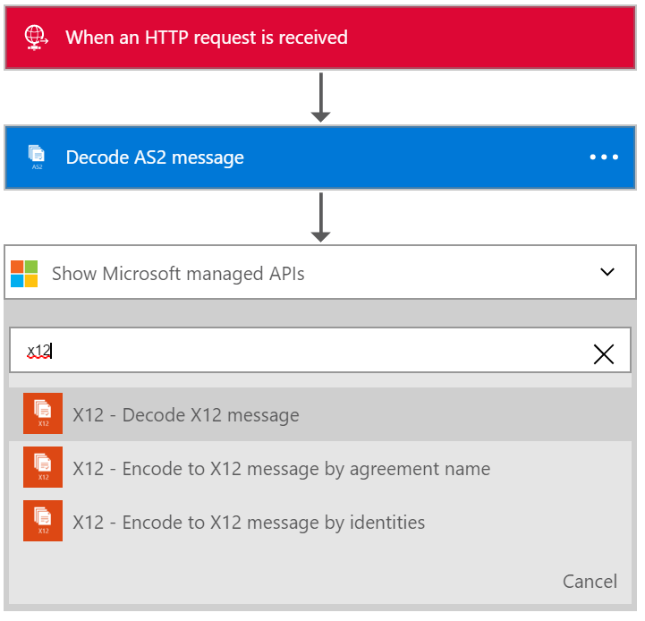
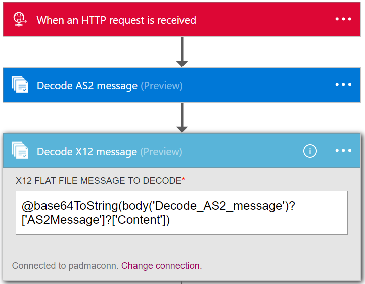
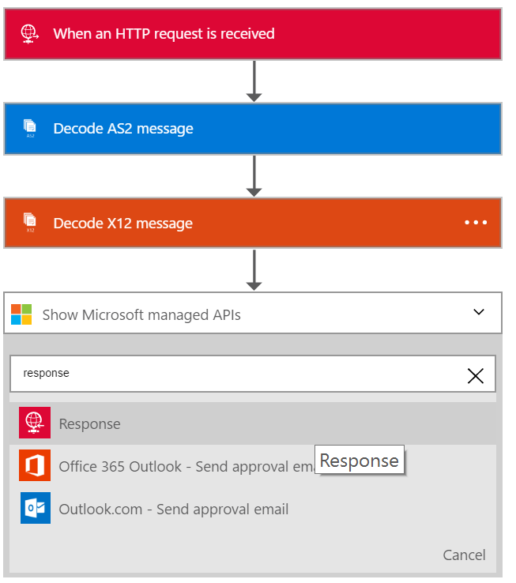

<properties 
    pageTitle="Criando soluções de B2B com pacote de integração de Enterprise | Serviço de aplicativo do Microsoft Azure | Microsoft Azure" 
    description="Saiba mais sobre recebendo dados usando os recursos de B2B do pacote de integração do Enterprise" 
    services="logic-apps" 
    documentationCenter=".net,nodejs,java"
    authors="msftman" 
    manager="erikre" 
    editor="cgronlun"/>

<tags 
    ms.service="logic-apps" 
    ms.workload="integration" 
    ms.tgt_pltfrm="na" 
    ms.devlang="na" 
    ms.topic="article" 
    ms.date="07/08/2016" 
    ms.author="deonhe"/>

# Saiba mais sobre recebendo dados usando os recursos de B2B do pacote de integração do Enterprise#

## Visão geral ##

Este documento é parte do pacote de integração do Enterprise lógica de aplicativos. Confira a visão geral para saber mais sobre os [recursos do pacote de integração do Enterprise](./app-service-logic-enterprise-integration-overview.md).

## Pré-requisitos ##

Usar o AS2 e X12 ações que você precisará de uma conta de integração de empresa

[Como criar uma conta de integração de empresa](./app-service-logic-enterprise-integration-accounts.md)

## Como usar os conectores de lógica aplicativos B2B ##

Depois que você criou uma conta de integração e adicionado parceiros e contratos-lo, você está pronto para criar um aplicativo de lógica que implementa um fluxo de trabalho do business para business (B2B).

Este walkthru, você verá como usar o AS2 e X12 ações para criar um aplicativo de lógica de negócios para empresas que recebe dados de um parceiro comercial.

1. Crie um aplicativo de lógica de novo e [vinculá-lo à sua conta de integração](./app-service-logic-enterprise-integration-accounts.md).  
2. Adicionar um disparador **solicitação - solicitação HTTP um quando for recebida** para o seu aplicativo de lógica  
  
3. Adicionar a ação **Decodificar AS2** pelo primeiro selecionando **Adicionar uma ação**  
  
4. Digite a palavra **as2** na caixa de pesquisa para filtrar todas as ações ao que você deseja usar  
  
6. Selecione a ação **AS2 - decodificar AS2 mensagem**  
  
7. Como mostrado, adicione o **corpo** que você vai demorar como entrada. Neste exemplo, selecione o corpo da solicitação HTTP que disparou o aplicativo de lógica. Como alternativa, você pode inserir uma expressão para os cabeçalhos no campo**CABEÇALHOS** de entrada:

    @triggerOutputs()['headers']

8. Adicione os **cabeçalhos** necessários para AS2. Esses serão nos cabeçalhos da solicitação HTTP. Neste exemplo, selecione os cabeçalhos da solicitação HTTP que disparou o aplicativo de lógica.
9. Agora adicione a ação de mensagem decodificar X12 selecionando novamente **Adicionar uma ação**  
   
10. Digite a palavra **x12** na caixa de pesquisa para filtrar todas as ações ao que você deseja usar  
  
11. Selecione o **X12-decodificar X12 mensagem** ação para adicioná-lo para o aplicativo de lógica  
  
12. Agora, você precisa especificar a entrada para esta ação que será a saída da ação AS2 acima. O conteúdo da mensagem real está em um objeto JSON e é codificado na Base 64. Portanto, você precisa especificar uma expressão, como a entrada insira a expressão a seguir no campo de entrada **X12 PLANA arquivo mensagem para decodificar**  

    @base64ToString(body('Decode_AS2_message')?['AS2Message']?['Content'])  

13. Esta etapa será decodificar a X12 dados recebidos do parceiro de negociação e serão um número de itens em um objeto JSON de saída. Para informar o parceiro do recebimento de dados você pode enviar novamente uma resposta contendo o AS2 mensagem disposição notificação mensagens (MDN) em uma ação de resposta de HTTP  
14. Adicionar a ação de **resposta** selecionando **Adicionar uma ação**   
  
15. Digite a palavra **resposta** na caixa de pesquisa para filtrar todas as ações ao que você deseja usar  
  
16. Selecione a ação de **resposta** para adicioná-lo  
  
17. Defina o campo de **corpo** de resposta usando a expressão a seguir para acessar o MDN da saída da ação **decodificar X12 mensagem**  

    @base64ToString(body('Decode_AS2_message')?['OutgoingMdn']?['Content'])  

  
18. Salvar seu trabalho  
  

Neste ponto, você tiver terminado de configuração de seu aplicativo B2B lógica. Em um aplicativo do mundo real, talvez você queira armazenar os X12 decodificada dados em uma loja de aplicativos ou dados LOB. Você pode adicionar facilmente ações adicionais para fazer isso ou escrever APIs personalizado para se conectar aos seus próprios aplicativos LOB e usar essas APIs em seu aplicativo de lógica.

## Recursos e casos de uso ##

- O AS2 e X12 decodificar e codificar ações permitem que você receba dados do e enviar dados para parceiros usando protocolos padrão do setor usando lógica aplicativos comerciais  
- Você pode usar AS2 e X12 com ou sem os outros a troca de dados com parceiros comerciais conforme necessário
- As ações de B2B tornam mais fácil criar parceiros e contratos na conta integração e usá-los em um aplicativo de lógica  
- Estendendo seu aplicativo de lógica com outras ações que você pode enviar e receber dados de e de outros aplicativos e serviços, como SalesForce  

## Saiba Mais ##

[Saiba mais sobre o pacote de integração do Enterprise](./app-service-logic-enterprise-integration-overview.md)  