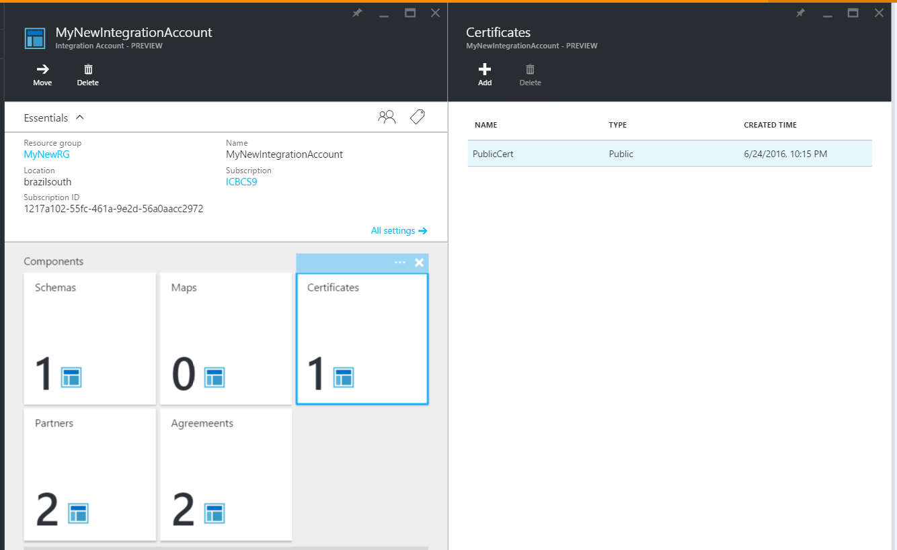

<properties
    pageTitle="Usando certificados com pacote de integração de Enterprise | Microsoft Azure"
    description="Saiba como usar certificados com o pacote de integração de empresa e aplicativos de lógica"
    services="logic-apps"
    documentationCenter=".net,nodejs,java"
    authors="msftman"
    manager="erikre"
    editor="cgronlun"/>

<tags
    ms.service="logic-apps"
    ms.workload="integration"
    ms.tgt_pltfrm="na"
    ms.devlang="na"
    ms.topic="article"
    ms.date="09/06/2016"
    ms.author="deonhe"/>

# Saiba mais sobre certificados e Enterprise integração Pack

## Visão geral
Integração corporativa usa certificados para proteger a comunicação de B2B. Você pode usar dois tipos de certificados em seus aplicativos de integração do enterprise:

- Públicos certificados que devem ser adquiridos de uma autoridade de certificação (CA).
- Particulares certificados que você pode emitir por conta própria. Esses certificados são algumas vezes denominados certificados autoassinados.

## O que são certificados?
Os certificados são documentos digitais que verificar a identidade dos participantes em comunicações eletrônicas e que também proteger comunicações eletrônicas.

## Por que usar certificados?
Às vezes B2B comunicações devem ser mantidas confidenciais. Integração corporativa usa certificados para proteger essas comunicações de duas maneiras:

- Criptografando o conteúdo das mensagens
- Assinando digitalmente mensagens  

## Como você carregar certificados?

### Certificados pública
Para usar um *certificado pública* em seus aplicativos de lógica com recursos de B2B, primeiro é necessário carregar o certificado para sua conta de integração. Para usar um *certificado autoassinado*, por outro lado, você deve primeiro carregá-lo [Azure chave cofre](../key-vault/key-vault-get-started.md "Saiba mais sobre a chave do cofre").

Depois de carregar um certificado, ele ficará disponível para ajudá-lo a proteger suas mensagens de B2B quando você define as propriedades em [contratos](./app-service-logic-enterprise-integration-agreements.md) que você criar.  

Aqui estão as etapas detalhadas para carregar seu públicos certificados para sua conta de integração depois de entrar no portal do Azure:

1. Selecione **Procurar**.  
      

2. Insira **integração** na caixa de pesquisa do filtro e, em seguida, selecione **Contas de integração** da lista de resultados.     
    

3. Selecione a conta de integração ao qual você deseja adicionar o certificado.  
      

4.  Selecione o bloco de **certificados** .  
    

5. Na lâmina **certificados** que é aberta, selecione o botão **Adicionar** .
    

6. Digite um **nome** para seu certificado e selecione o tipo de certificado. (Neste exemplo, usamos o tipo de certificado público.) Selecione o ícone de pasta no lado direito da caixa de texto de **certificado** .

7. Quando abre o seletor de arquivo, localize e selecione o arquivo de certificado que você deseja carregar sua conta de integração.

8. Selecione o certificado e, em seguida, selecione **Okey** no seletor de arquivo. Isso valida e carrega o certificado para sua conta de integração.

8. Por fim, volte na lâmina **Adicionar certificado** , selecione o botão de **Okey** .  
      

9. Cerca de um minuto, você verá uma notificação que indica que o upload de certificado é concluído.

10. Selecione o bloco de **certificados** . Você deve ver o certificado recém-adicionado.  
      

### Certificados particulares
Você pode carregar certificados particulares para sua conta de integração fazendo as seguintes etapas:  

1. [Carregar sua chave privada para compartimento de chave] (../key-vault/key-vault-get-started.md "Saiba mais sobre chave cofre").  

    > [AZURE.TIP] Você deve autorizar o recurso de lógica aplicativos do serviço de aplicativo do Azure para executar operações em Cofre de chave. Você pode conceder acesso a de capital de serviço de aplicativos de lógica usando o seguinte comando do PowerShell:`Set-AzureRmKeyVaultAccessPolicy -VaultName 'TestcertKeyVault' -ServicePrincipalName '7cd684f4-8a78-49b0-91ec-6a35d38739ba' -PermissionsToKeys decrypt, sign, get, list`  

2. Crie um certificado particular.  

3. Carregue o certificado particular para sua conta de integração.

Depois que você tirou as etapas anteriores, você pode usar o certificado particular para criar contratos.

A seguir estão as etapas detalhadas para carregar seus certificados particulares para sua conta de integração depois de entrar no portal do Azure:  

1. Selecione **Procurar**.  
        

2. Insira **integração** na caixa de pesquisa do filtro e, em seguida, selecione **Contas de integração** da lista de resultados.     
      

3. Selecione a conta de integração ao qual você deseja adicionar o certificado.  
      

4. Selecione o bloco de **certificados** .  
      

5. Na lâmina **certificados** que é aberta, selecione o botão **Adicionar** .
    

6. Digite um **nome** para seu certificado e selecione o tipo de certificado. (Neste exemplo, usamos o tipo de certificado público.) Selecione o ícone de pasta no lado direito da caixa de texto de **certificado** .

7. Quando abre o seletor de arquivo, localize e selecione o arquivo de certificado que você deseja carregar sua conta de integração.

8. Depois de selecionar o certificado, selecione **Okey** no seletor de arquivo. Esta ação valida o certificado e carrega à sua conta de integração.

9. Por fim, volte na lâmina **Adicionar certificado** , selecione o botão de **Okey** .  
      

10. Cerca de um minuto, você verá uma notificação que indica que o upload de certificado é concluído.

11. Selecione o bloco de **certificados** . Você deve ver o certificado recém-adicionado.
      

Depois de carregar um certificado, ele ficará disponível para ajudá-lo a proteger suas mensagens de B2B quando você define as propriedades em [contratos](./app-service-logic-enterprise-integration-agreements.md).  

## Próximas etapas
- [Criar um aplicativo de lógica que usa recursos de B2B](./app-service-logic-enterprise-integration-b2b.md)  
- [Criar um contrato de B2B](./app-service-logic-enterprise-integration-agreements.md)  
- [Saiba mais sobre a chave do cofre] (../key-vault/key-vault-get-started.md "Saiba mais sobre cofre chave")  
