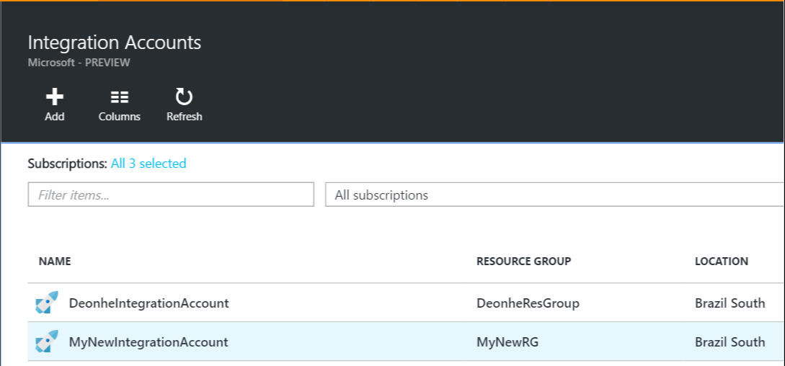

<properties 
    pageTitle="Visão geral das contas de integração e o pacote de integração do Enterprise | Serviço de aplicativo do Microsoft Azure | Microsoft Azure" 
    description="Saiba tudo sobre contas de integração, o pacote de integração de empresa e aplicativos de lógica" 
    services="logic-apps" 
    documentationCenter=".net,nodejs,java"
    authors="msftman" 
    manager="erikre" 
    editor="cgronlun"/>

<tags 
    ms.service="logic-apps" 
    ms.workload="integration" 
    ms.tgt_pltfrm="na" 
    ms.devlang="na" 
    ms.topic="article" 
    ms.date="07/08/2016" 
    ms.author="deonhe"/>

# Visão geral das contas de integração

## O que é uma conta de integração?
Uma conta de integração é uma conta do Azure que permite que aplicativos de integração corporativa gerenciar artefatos incluindo esquemas, mapas, certificados, parceiros e contratos. Qualquer aplicativo de integração que você criar será necessário usar uma conta de integração para acessar um esquema, o mapa ou o certificado, por exemplo.

## Criar uma conta de integração 
1. Selecione **Procurar**   
  
2. Insira **integração** na caixa de pesquisa do filtro e selecione **Contas de integração** da lista de resultados     
   
3. Selecione o botão *Adicionar* no menu na parte superior da página      
  
4. Insira o **nome**, selecione a **assinatura** que você deseja usar, crie um novo **grupo de recursos** ou selecione um grupo de recursos existente, selecione um **local** onde sua conta de integração será hospedado, selecione um **nível de preços**e selecione o botão **criar** .   

  Neste ponto a conta de integração será configurada no local selecionado. Isso deve ser concluída dentro de um minuto.    
  
5. Atualize a página. Você verá sua nova conta de integração listada. Parabéns!  
 

## Como vincular uma conta de integração a um aplicativo de lógica
Ordem de seus aplicativos de lógica acessar a mapas, esquemas, contratos e outros artefatos que estão localizados na sua conta de integração, primeiro é preciso vincular a conta de integração para o seu aplicativo de lógica.

### Aqui estão as etapas para vincular uma conta de integração a um aplicativo de lógica 

#### Pré-requisitos
- Uma conta de integração
- Um aplicativo de lógica

>[AZURE.NOTE]Certifique-se de que sua conta de integração e lógica de aplicativo estão no **mesmo local Azure** antes de começar

1. Selecione o link de **configurações** no menu do seu aplicativo de lógica  
   
2. Selecione o item de **Conta de integração** da lâmina configurações  
   
3. Selecione a conta de integração que você deseja vincular a sua lógica de aplicativo a partir do **Selecione uma conta de integração** suspensa de caixa de listagem  
   
4. Salvar seu trabalho  
   
5. Você verá uma notificação que indica que a sua conta de integração tenha sido vinculada ao seu aplicativo de lógica e que todos os artefatos em sua conta de integração agora estão disponíveis para o seu aplicativo de lógica.  
   

Agora que sua conta de integração está vinculada ao seu aplicativo de lógica, você pode ir para o seu aplicativo de lógica e use conectores B2B como a validação de XML, arquivo simples Codificar/decodificar ou transformação para criar aplicativos com recursos de B2B.  
    
## Como excluir uma conta de integração?
1. Selecione **Procurar**  
    
2. Insira **integração** na caixa de pesquisa do filtro e selecione **Contas de integração** da lista de resultados     
   
3. Selecione a **conta de integração** que você deseja excluir  
  
4. Selecione o link **Excluir** que está localizado no menu   
  
5. Confirmar sua escolha    

## Como mover uma conta de integração?
Você pode mover facilmente uma conta de integração para uma nova assinatura e um novo grupo de recursos. Se você precisar mover sua conta de integração, siga estas etapas:

>[AZURE.IMPORTANT] Você precisará atualizar todos os scripts para usar o novo recurso IDs após mover uma conta de integração.

1. Selecione **Procurar**  
    
2. Insira **integração** na caixa de pesquisa do filtro e selecione **Contas de integração** da lista de resultados     
   
3. Selecione a **conta de integração** que você deseja excluir  
  
4. Selecione o link **Mover** que está localizado no menu   
  
5. Confirmar sua escolha    

## Próximas etapas
- [Saiba mais sobre contratos] (./app-service-logic-enterprise-integration-agreements.md "Saiba mais sobre os contratos de integração do enterprise")  

 