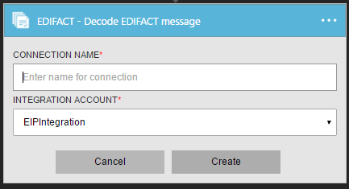

<properties 
    pageTitle="Saiba mais sobre Enterprise Pack integração decodificar EDIFACT mensagem conector | Serviço de aplicativo do Microsoft Azure | Microsoft Azure" 
    description="Saiba como usar parceiros com aplicativos do pacote de integração de empresa e lógica" 
    services="logic-apps" 
    documentationCenter=".net,nodejs,java"
    authors="padmavc" 
    manager="erikre" 
    editor=""/>

<tags 
    ms.service="logic-apps" 
    ms.workload="integration" 
    ms.tgt_pltfrm="na" 
    ms.devlang="na" 
    ms.topic="article" 
    ms.date="08/15/2016" 
    ms.author="padmavc"/>

# Introdução ao decodificar EDIFACT mensagem

Valida EDI e propriedades específicas do parceiro, gera documento XML para cada conjunto de transação e confirmação de transação processada.

## Criar a conexão

### Pré-requisitos

* Uma conta do Azure; Você pode criar uma [conta gratuita](https://azure.microsoft.com/free)

* Uma conta de integração é necessário para usar o conector de mensagem EDIFACT decodificar. Ver detalhes sobre como criar uma [Conta de integração](./app-service-logic-enterprise-integration-create-integration-account.md), [parceiros](./app-service-logic-enterprise-integration-partners.md) e [contrato EDIFACT](./app-service-logic-enterprise-integration-edifact.md)

### Conectar-se a mensagem de EDIFACT decodificar usando as seguintes etapas:

1. [Criar um aplicativo de lógica](./app-service-logic-create-a-logic-app.md) fornece um exemplo.

2. Esse conector não ter disparadores. Use outros disparadores para iniciar o aplicativo de lógica, como um gatilho de solicitação.  No criador de aplicativo de lógica, adicione um disparador e adicione uma ação.  Selecione Microsoft Mostrar listam de APIs gerenciadas no menu suspenso e insira "EDIFACT" na caixa de pesquisa.  Selecione decodificar EDIFACT mensagem

    
    
3. Se você ainda não criou anteriormente quaisquer conexões a integração de conta, você será solicitado para os detalhes de conexão

      

4. Insira os detalhes da conta de integração.  Propriedades com um asterisco são necessárias

  	| Propriedade | Detalhes |
  	| -------- | ------- |
  	| Nome de Conexão * | Insira um nome para sua conexão |
  	| Conta de integração * | Insira o nome da conta de integração. Certifique-se de que sua conta de integração e o aplicativo de lógica estão no mesmo local Azure |

    Após a conclusão, os detalhes da conexão aparência semelhantes à seguinte

      

5. Selecione **criar**

6. Observe que a conexão tiver sido criado

      

7. Selecione EDIFACT arquivo simples mensagem decodificar

      

## EDIFACT decodificar faz acompanhando

* Resolver o contrato combinando o qualificador de remetente identificador e qualificador de receptor & identificador
* Divide cruzamentos várias em uma única mensagem em separado.
* Valida o envelope contra negociação contrato de parceiro
* Desmonta a troca.
* Valida EDI e propriedades específicas do parceiro inclui
    * Validação da estrutura do envelope troca.
    * Validação de esquema do envelope em relação ao esquema de controle.
    * Validação de esquema dos elementos de dados do conjunto de transação em relação ao esquema de mensagem.
    * Validação de EDI realizada em elementos de dados do conjunto de transação
* Verifica se os números de controle de conjunto de troca, de grupo e transação não estão duplicatas (se configurado) 
    * Verifica o número de controle de troca contra cruzamentos recebidos anteriormente. 
    * Verifica o número de controle de grupo contra outros números de controle de grupo na troca. 
    * Verifica que a transação definir o número de controle em relação a outros números de controle de conjunto de transação nesse grupo.
* Gera um documento XML para cada conjunto de transação.
* Converte a troca inteira em XML 
    * Troca de divisão como conjuntos de transação - suspender conjuntos de transação no erro: analisa cada transação conjunto em um intercâmbio em um documento XML separado. Se um ou mais conjuntos de transação na troca falham na validação, e em seguida, EDIFACT decodificar suspende apenas os conjuntos de transação. 
    * Troca de divisão como conjuntos de transação - suspender troca no erro: analisa cada transação conjunto em um intercâmbio em um documento XML separado.  Se um ou mais conjuntos de transação na troca falham na validação, e em seguida, EDIFACT decodificar suspende a troca inteira.
    * Preservar troca - suspender conjuntos de transação no erro: cria um documento XML para a troca de lote inteiro. EDIFACT decodificar suspende apenas os conjuntos de transação que falham na validação, enquanto mantém a todos os outros conjuntos de transação de processo
    * Preservar troca - suspender troca no erro: cria um documento XML para a troca de lote inteiro. Se um ou mais conjuntos de transação na troca falham na validação, e em seguida, EDIFACT decodificar suspende a troca inteira, 
* Gera uma técnica (controle) e/ou confirmação funcional (se configurado).
    * Uma confirmação técnico ou o ACK CONTRL relata os resultados da verificação de sintático do intercâmbio recebido concluída.
    * Uma confirmação funcional reconhece aceitar ou rejeitar uma recebido troca ou um grupo

## Próximas etapas

[Saiba mais sobre o pacote de integração do Enterprise] (./app-service-logic-enterprise-integration-overview.md "Saiba mais sobre o pacote de integração de empresa") 