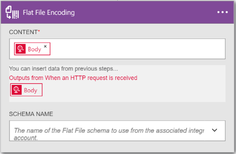
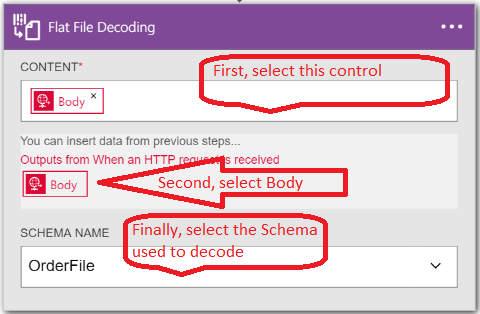

<properties
    pageTitle="Saiba como codificar ou decodificar arquivos simples usando aplicativos do pacote de integração de empresa e lógica | Serviço de aplicativo do Microsoft Azure | Microsoft Azure"
    description="Use os recursos dos aplicativos do pacote de integração de empresa e lógica para codificar ou decodificar arquivos simples"
    services="app-service\logic"
    documentationCenter=".net,nodejs,java"
    authors="msftman"
    manager="erikre"
    editor="cgronlun"/>

<tags 
    ms.service="logic-apps" 
    ms.workload="integration" 
    ms.tgt_pltfrm="na" 
    ms.devlang="na" 
    ms.topic="article" 
    ms.date="07/08/2016" 
    ms.author="deonhe"/>

# Integração do Enterprise com arquivos simples

## Visão geral

Talvez você queira codificar conteúdo XML antes de enviá-la para um parceiro de negócios em um cenário de business-to-business (B2B). Em um aplicativo de lógica feito pelo recurso lógica aplicativos do serviço de aplicativo do Azure, você pode usar o arquivo simples codificação conector para fazer isso. O aplicativo de lógica que você cria pode acessar seu XML conteúdo de uma variedade de fontes, incluindo de um gatilho de solicitação HTTP, de outro aplicativo ou até mesmo de um dos muitos [conectores](../connectors/apis-list.md). Para obter mais informações sobre os aplicativos de lógica, consulte a [documentação de aplicativos de lógica](./app-service-logic-what-are-logic-apps.md "Saiba mais sobre os aplicativos de lógica").  

## Como criar o arquivo simples codificação de conector

Siga estas etapas para adicionar um arquivo simples codificação conector para seu aplicativo de lógica.

1. Crie um aplicativo de lógica e [vinculá-lo à sua conta de integração](./app-service-logic-enterprise-integration-accounts.md "Aprenda como vincular uma conta de integração para um aplicativo de lógica"). Esta conta contém o esquema que você usará para codificar os dados XML.  
2. Adicione um disparador **solicitação - solicitação HTTP um quando for recebida** para o seu aplicativo de lógica.  
    
3. Adicione o arquivo simples codificação ação, da seguinte maneira:

    a. Selecione o sinal de **mais** .

    b. Selecione o link de **Adicionar uma ação** (aparece depois que você selecionou no sinal de adição).

    c. Na caixa de pesquisa, digite *simples* para filtrar todas as ações ao que você deseja usar.

    d. Selecione a opção de **Codificação simples de arquivo** na lista.   
   
4. Na caixa de diálogo **Codificação simples de arquivo** , marque a caixa de texto de **conteúdo** .  
  
5. Selecione a marca de corpo como o conteúdo que você deseja codificar. A marca de corpo preencherá o campo do conteúdo.     
  
6. Marque a caixa de lista **Nome do esquema** e escolha o esquema que você deseja usar para codificar o conteúdo de entrada.    
  
7. Salve seu trabalho.   
  

Neste ponto, você tiver terminado de configurar o conector de codificação de arquivo simples. Em um aplicativo do mundo real, você talvez queira armazenar os dados codificados em um aplicativo de linha de negócios, como Salesforce. Ou você pode enviar que dados codificados para uma negociação do parceiro. Você pode adicionar facilmente uma ação para enviar a saída da ação codificação Salesforce ou seu parceiro comercial, usando qualquer um dos outros conectores fornecido.

Agora você pode testar o conector fazendo uma solicitação para o ponto de extremidade HTTP e, em seguida, incluindo o conteúdo XML no corpo da solicitação.  

## Como criar o arquivo simples decodificar conector

>[AZURE.NOTE] Para concluir essas etapas, você precisa ter um arquivo de esquema que já carregou na conta de integração com você.

1. Adicione um disparador **solicitação - solicitação HTTP um quando for recebida** para o seu aplicativo de lógica.  
    
2. Adicione o arquivo simples decodificar ação, da seguinte maneira:

    a. Selecione o sinal de **mais** .

    b. Selecione o link de **Adicionar uma ação** (aparece depois que você selecionou no sinal de adição).

    c. Na caixa de pesquisa, digite *simples* para filtrar todas as ações ao que você deseja usar.

    d. Selecione a opção **Decodificar simples de arquivo** na lista.   
   
- Selecione o controle de **conteúdo** . Isso produz uma lista do conteúdo das etapas anteriores que você pode usar como o conteúdo para decodificar. Observe que o *corpo* da solicitação HTTP de entrada está disponível para ser usado como o conteúdo para decodificar. Você também pode inserir o conteúdo para decodificar diretamente para o controle de **conteúdo** .     
- Selecione a marca de *corpo* . Observe que a marca de corpo agora está no controle de **conteúdo** .
- Selecione o nome do esquema que você deseja usar para decodificar o conteúdo. A captura de tela a seguir mostra que *OrderFile* é o nome de esquema selecionado. Esse nome de esquema tivesse sido carregado para a conta de integração anteriormente.

     
- Salve seu trabalho.  
    

Neste ponto, você tiver terminado de configuração de seu arquivo simples decodificar conector. Em um aplicativo do mundo real, talvez você queira armazenar os dados decodificados em um aplicativo de linha de negócios como Salesforce. Você pode adicionar facilmente uma ação para enviar a saída da ação decodificação a equipe de vendas.

Agora você pode testar o conector fazendo uma solicitação para o ponto de extremidade HTTP e incluindo o conteúdo XML que você deseja decodificar no corpo da solicitação.  

## Próximas etapas
- [Saiba mais sobre o pacote de integração do Enterprise] (./app-service-logic-enterprise-integration-overview.md "Saiba mais sobre o pacote de integração de empresa").  
