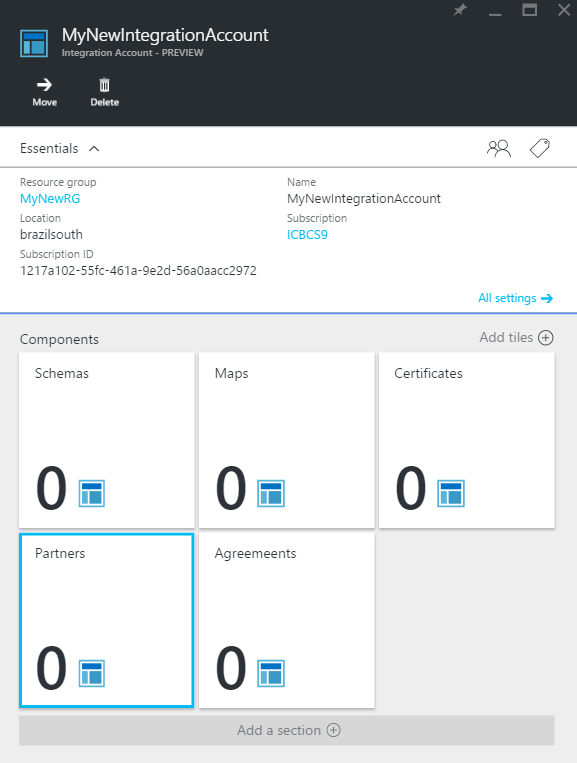
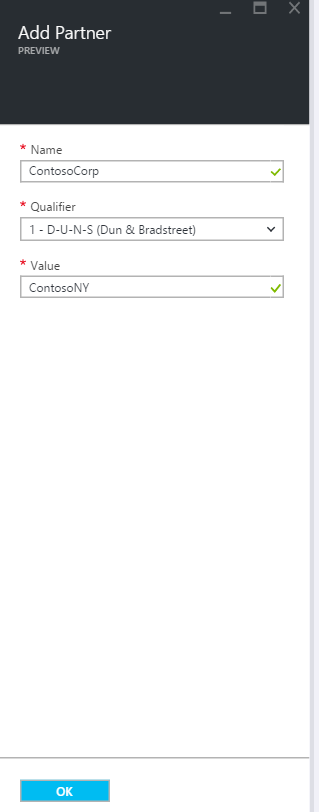
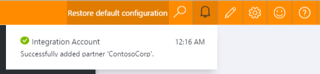

<properties 
    pageTitle="Saiba mais sobre parceiros e pacote de integração de Enterprise | Serviço de aplicativo do Microsoft Azure | Microsoft Azure" 
    description="Saiba como usar parceiros com aplicativos do pacote de integração de empresa e lógica" 
    services="logic-apps" 
    documentationCenter=".net,nodejs,java"
    authors="msftman" 
    manager="erikre" 
    editor="cgronlun"/>

<tags 
    ms.service="logic-apps" 
    ms.workload="integration" 
    ms.tgt_pltfrm="na" 
    ms.devlang="na" 
    ms.topic="article" 
    ms.date="07/08/2016" 
    ms.author="deonhe"/>

# Saiba mais sobre parceiros e Enterprise integração Pack

## Visão geral
Antes de criar um parceiro, você e a organização que você pretende fazer negócios com devem compartilhar informações que ajudarão a identificar e validar a mensagens enviadas por si. Depois que você tem estes discussão e você está pronto para começar a relação de negócios, você pode para criar um *parceiro* na sua conta de integração.

## O que é um parceiro?
Parceiros são as entidades que participam da Business-To-Business (B2B) mensagens e transações. 

## Como os parceiros são usados?
Parceiros são usados para criar contratos. Um contrato define os detalhes sobre as mensagens que serão trocados entre parceiros. 

Antes de criar um contrato, você precisa ter adicionado pelo menos dois parceiros à sua conta de integração. Um dos parceiros um contrato deve ser sua organização. O parceiro que representa a sua organização é conhecido como o **parceiro de host**. O segundo parceiro representa a outra organização com a qual sua organização troca de mensagens. O segundo parceiro é conhecido como o **parceiro de convidado**. O parceiro de convidado pode ser outra empresa, ou até mesmo um departamento dentro da sua organização.  

Depois de ter adicionado os parceiros, você usaria os parceiros para criar um contrato. 

Receber e enviar as configurações estão familiarizadas do ponto de vista do parceiro hospedado. Por exemplo, as configurações de receber um contrato determinam como o parceiro hospedado recebe mensagens enviadas de um parceiro de convidado. Da mesma forma, as configurações de envio no contrato de indicarem como o parceiro hospedado envia mensagens para o parceiro de convidado.

## Como criar um parceiro?
A partir do portal Azure:  
1. Selecione **Procurar**  
    
2. Insira **integração** na caixa de pesquisa do filtro e selecione **Contas de integração** da lista de resultados     
   
3. Selecione a **conta de integração** à qual você adicionará os parceiros  
  
4.  Selecione o bloco de **parceiros**  
  
5. Selecione o botão **Adicionar** na lâmina parceiros que é aberta  
  
6. Insira um **nome** para seu parceiro, e em seguida, selecione o **qualificador **, por fim, insira um **valor**. O valor é usado para ajudar a identificar documentos que entram em seus aplicativos.  
  
7. Selecione o ícone de notificação de *sino* para ver o progresso do processo de criação do parceiro.  
  
8. Selecione o bloco de **parceiros** . Isso atualiza o bloco e você verá o número de aumento de parceiros, que refletem o novo parceiro foi adicionada com êxito.    
  
10. Após selecionar o bloco de parceiros, você também verá o parceiro recém-adicionado exibido na lâmina parceiros.    
  

## Como editar um parceiro

Siga estas etapas para editar um parceiro que já existe em sua conta de integração:  
1. Selecione o bloco de **parceiros**  
2. Selecione o parceiro que você deseja editar quando abre o blade de parceiros  
3. No bloco **Parceiro de atualização** , faça as alterações que necessárias  
4. Se você estiver satisfeito com suas alterações, selecione o link **Salvar** , pessoa, selecione o link **Descartar** para descartar as alterações.  
  

## Como excluir um parceiro
1. Selecione o bloco de **parceiros**  
2. Selecione o parceiro que você deseja editar quando abre o blade de parceiros  
3. Selecione o link **Excluir**    
   

## Próximas etapas
- [Saiba mais sobre contratos] (./app-service-logic-enterprise-integration-agreements.md "Saiba mais sobre os contratos de integração do enterprise")  

