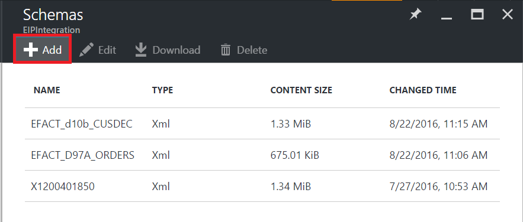
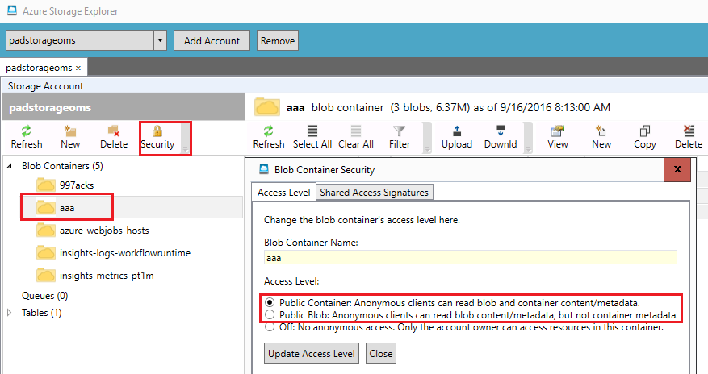
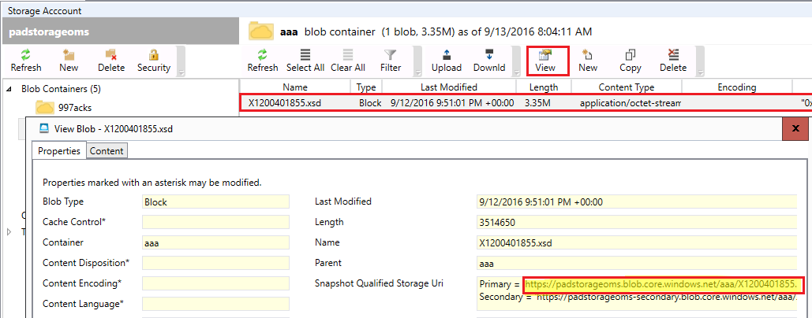
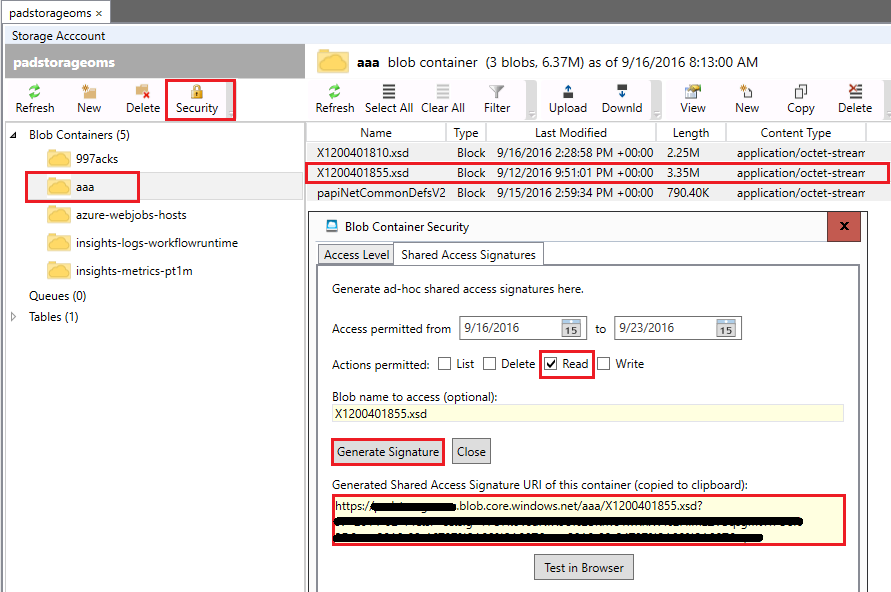

<properties
    pageTitle="Visão geral de esquemas e o pacote de integração do Enterprise | Microsoft Azure"
    description="Saiba como usar esquemas com aplicativos do pacote de integração de empresa e lógica"
    services="logic-apps"
    documentationCenter=".net,nodejs,java"
    authors="msftman"
    manager="erikre"
    editor="cgronlun"/>

<tags
    ms.service="logic-apps"
    ms.workload="integration"
    ms.tgt_pltfrm="na"
    ms.devlang="na"
    ms.topic="article"
    ms.date="07/29/2016"
    ms.author="deonhe"/>

# Saiba mais sobre os esquemas e o pacote de integração do Enterprise  

## Por que usar um esquema?
Use esquemas para confirmar que os documentos XML que receber são válidos, com os dados esperados em um formato predefinido. Os esquemas são usados para validar a mensagens trocadas em um cenário B2B.

## Adicionar um esquema
A partir do portal Azure:  

1. Selecione **mais serviços**.  
    

2. Na caixa de pesquisa de filtro, insira **integração**e selecione **Contas de integração** da lista de resultados.     
  
3. Selecione a **conta de integração** ao qual você adiciona o esquema.    
  

4. Selecione o bloco de **esquemas** .  
  

### Adicionar um arquivo de esquema menor que 2 MB  

1. Na lâmina **esquemas** que abre (a partir das etapas anteriores), selecione **Adicionar**.  
  

2. Insira um nome para o esquema. Em seguida, para carregar o arquivo de esquema, selecione o ícone de pasta ao lado da caixa de texto de **esquema** . Após o processo de carregamento, selecione **Okey**.    
  

### Adicionar um arquivo de esquema maior que 2 MB (até no máximo 8 MB)  

O processo para isso depende do nível de acesso de contêiner de blob: **público** ou **não o acesso anônimo**. Para determinar a esse nível de acesso, no **Gerenciador de armazenamento do Azure**, em **Contêineres de Blob**, selecione contêiner de blob desejado. Selecione **segurança**e selecione a guia de **Nível de acesso** .

1. Se o nível de acesso de segurança do blob for **público**, siga estas etapas.  
    

    a. Carregar o esquema de armazenamento e, em seguida, copie o URI.  
      

    b. **Adicionar esquema**, selecione **arquivo grande**e fornecer o URI na caixa de texto **URI do conteúdo** .  
      

2. Se o nível de acesso de segurança do blob for **sem acesso anônimo**, siga estas etapas.  
    

    a. Carregue o esquema de armazenamento.  
    

    b. Gere uma assinatura de acesso compartilhado para o esquema.  
    

    c. **Adicionar esquema**, selecione **arquivo grande**e forneça a assinatura de acesso compartilhado URI na caixa de texto **URI do conteúdo** .  
      

3. Na lâmina **esquemas** da conta de integração de EIP, agora você deve ver o esquema recém-adicionado.  

  

## Editar esquemas
1. Selecione o bloco de **esquemas** .  
2. Selecione o esquema que você deseja editar da lâmina **esquemas** que se abre.
3. Na lâmina **esquemas** , selecione **Editar**.  
    
4. Selecione o arquivo de esquema que você deseja editar, usando a caixa de diálogo de seletor de arquivo aberto.
5. Selecione **Abrir** no seletor de arquivo.  
  
6. Você recebe uma notificação que indica que o carregamento foi bem-sucedido.  

## Excluir esquemas
1. Selecione o bloco de **esquemas** .  
2. Selecione o esquema que você deseja excluir da lâmina **esquemas** que se abre.  
3. Na lâmina **esquemas** , selecione **Excluir**.
  

4. Para confirmar sua escolha, selecione **Sim**.  
  
5. Finalmente, observe que a lista de esquemas na lâmina **esquemas** atualiza e o esquema excluídos não está mais listado.  
    

## Próximas etapas

- [Saiba mais sobre o pacote de integração do Enterprise] (./app-service-logic-enterprise-integration-overview.md "Saiba mais sobre o pacote de integração de empresa").  
