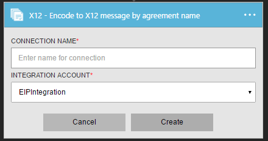
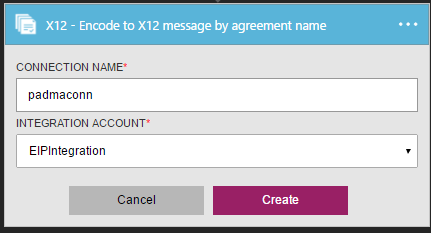

<properties 
    pageTitle="Saiba mais sobre Enterprise Pack integração codificar X12 mensagem Connctor | Serviço de aplicativo do Microsoft Azure | Microsoft Azure" 
    description="Saiba como usar parceiros com aplicativos do pacote de integração de empresa e lógica" 
    services="logic-apps" 
    documentationCenter=".net,nodejs,java"
    authors="padmavc" 
    manager="erikre" 
    editor=""/>

<tags 
    ms.service="logic-apps" 
    ms.workload="integration" 
    ms.tgt_pltfrm="na" 
    ms.devlang="na" 
    ms.topic="article" 
    ms.date="08/15/2016" 
    ms.author="padmavc"/>

# Introdução ao codificar X12 mensagem

Valida EDI e propriedades específicas do parceiro, converte mensagens codificadas XML em conjuntos de transação EDI na troca e solicitar uma confirmação de técnicos e/ou funcionais

## Criar a conexão

### Pré-requisitos

* Uma conta do Azure; Você pode criar uma [conta gratuita](https://azure.microsoft.com/free)

* Uma conta de integração é necessário para usar o conector de mensagem codificar x12. Ver detalhes sobre como criar uma [Conta de integração](./app-service-logic-enterprise-integration-create-integration-account.md), [parceiros](./app-service-logic-enterprise-integration-partners.md) e [X12 contrato](./app-service-logic-enterprise-integration-x12.md)

### Conectar-se a mensagem de codificar X12 usando as seguintes etapas:

1. [Criar um aplicativo de lógica](./app-service-logic-create-a-logic-app.md) fornece um exemplo

2. Esse conector não ter disparadores. Use outros disparadores para iniciar o aplicativo de lógica, como um gatilho de solicitação.  No criador de aplicativo de lógica, adicione um disparador e adicione uma ação.  Selecione Microsoft Mostrar listam de APIs gerenciadas no menu suspenso e insira "x12" na caixa de pesquisa.  Selecione um dos X12-codificar X12 mensagem por nome de contrato ou X12-codificar a mensagem de X 12 por identidades.  

     

3. Se você ainda não criou anteriormente quaisquer conexões a integração de conta, você será solicitado para os detalhes de conexão

     

4. Insira os detalhes da conta de integração.  Propriedades com um asterisco são necessárias

  	| Propriedade | Detalhes |
  	| -------- | ------- |
  	| Nome de Conexão * | Insira um nome para sua conexão |
  	| Conta de integração * | Insira o nome da conta de integração. Certifique-se de que sua conta de integração e o aplicativo de lógica estão no mesmo local Azure |

    Após a conclusão, os detalhes da conexão aparência semelhantes à seguinte

     

5. Selecione **criar**

6. Observe que a conexão tiver sido criado.

     

#### X12-codificar X12 mensagem por nome de contrato

7. Selecione X12 contrato da mensagem de lista suspensa e xml para codificar.

     

#### X12-codificar X12 mensagem por identidades

7.  Fornecer identificador do remetente, qualificador de remetente, identificador de receptor e qualificador de receptor conforme configurado na X12 contrato.  Selecione a mensagem de xml para codificar

     

## X12 codificar faz a seguir:

* Resolução de contrato por propriedades de contexto de remetentes e receptores de correspondência.
* Serializa a troca EDI, converter mensagens codificadas XML em conjuntos de transação EDI na troca.
* Aplica-se segmentos de cabeçalho e rodapé do conjunto de transação
* Gera um número de controle de troca, um número de controle de grupo e um número de controle transação definido para cada troca de saída
* Substitui separadores nos dados de carga
* Valida EDI e propriedades específicas do parceiro
    * Validação de esquema dos elementos de dados do conjunto de transação contra o esquema de mensagem
    * Validação de EDI executada em elementos de dados do conjunto de transação.
    * Validação estendida realizada em elementos de dados do conjunto de transação
* Solicitar uma confirmação de técnicos e/ou funcionais (se configurado).
    * Uma confirmação técnico gera como resultado de validação de cabeçalho. A confirmação técnica reporta o status do processamento de um cabeçalho de troca e marcador pelo destinatário endereço
    * Uma confirmação funcional gera como resultado de validação de corpo. Cada erro encontrado durante o processamento do documento recebido de relatórios a confirmação funcional

## Próximas etapas

[Saiba mais sobre o pacote de integração do Enterprise] (./app-service-logic-enterprise-integration-overview.md "Saiba mais sobre o pacote de integração de empresa") 

