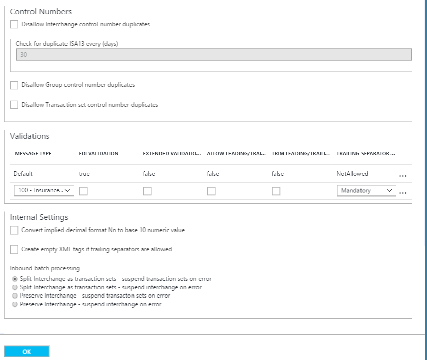

<properties 
    pageTitle="Visão geral de X12 e o pacote de integração do Enterprise | Serviço de aplicativo do Microsoft Azure | Microsoft Azure" 
    description="Saiba como usar X12 contratos para criar aplicativos de lógica" 
    services="logic-apps" 
    documentationCenter=".net,nodejs,java"
    authors="msftman" 
    manager="erikre" 
    editor="cgronlun"/>

<tags 
    ms.service="app-service-logic" 
    ms.workload="integration" 
    ms.tgt_pltfrm="na" 
    ms.devlang="na" 
    ms.topic="article" 
    ms.date="07/08/2016" 
    ms.author="deonhe"/>

# Integração do Enterprise com X12 

>[AZURE.NOTE]Recursos de capas a X12 esta página dos aplicativos de lógica. Para obter informações sobre EDIFACT clique [aqui](app-service-logic-enterprise-integration-edifact.md).

## Criar um X12 contrato 
Para poder trocar X12 mensagens, você precisa criar um X12 contrato e armazená-lo em sua conta de integração. As etapas a seguir o orientará durante o processo de criação de um X12 contrato.

### Veja aqui o que é necessário antes de começar
- Uma [conta de integração](./app-service-logic-enterprise-integration-accounts.md) definido na sua assinatura do Azure  
- Pelo menos dois [parceiros](./app-service-logic-enterprise-integration-partners.md) já definido em sua conta de integração  

>[AZURE.NOTE]Ao criar um contrato, o conteúdo do arquivo de contrato deve corresponder ao tipo de contrato.    

Depois que você [criou uma conta de integração](./app-service-logic-enterprise-integration-accounts.md) e [adicionadas parceiros](./app-service-logic-enterprise-integration-partners.md), você pode criar um X12 contrato seguindo estas etapas:  

### Do Azure home page do portal

Depois de fazer logon no [portal do Azure](http://portal.azure.com "Azure portal"):  
1. Selecione **Procurar** no menu à esquerda.  

>[AZURE.TIP]Se você não vir o link **Procurar** , talvez você precise expandir o menu primeiro. Faça isto selecionando o link **Mostrar menu** localizada na parte superior esquerda do menu recolhido.  

    
2. Digite *integração* na caixa de pesquisa de filtro e selecione **Contas de integração** da lista de resultados.       
    
3. Na lâmina **Contas de integração** que será aberta, selecione a conta de integração no qual você criará o contrato. Se você não vir qualquer integração contas listas, [criar uma primeira](./app-service-logic-enterprise-integration-accounts.md "All about integration accounts").  
  
4.  Selecione o bloco de **contratos** . Se você não vir o bloco de contratos, adicioná-lo primeiro.   
     
5. Selecione o botão **Adicionar** na lâmina contratos que se abre.  
  
6. Digite um **nome** para seu contrato e selecione o **tipo de contrato**, **Host parceiro**, **Identidade do Host**, **Parceiro de convidado**, **Identidade de convidado**, na lâmina contratos que se abre.  
  
7. Depois que você definir a receber propriedades de configurações, selecione o botão de **Okey**  
Vamos continuar:  
8. Selecione **Configurações de receber** para configurar como mensagens recebidas via este contrato devem ser tratadas.  
9. O controle de configurações de recebimento é dividido em seções a seguir, incluindo identificadores, confirmação, esquemas, Envelopes, números de controle, validações e configurações internas. Configure essas propriedades com base em seu contrato com o parceiro que você vai ser trocando mensagens com. Aqui está um modo de exibição desses controles, configurá-los com base em como você deseja que este contrato para identificar e manipular as mensagens de entrada:  
  

  
10. Selecione o botão de **Okey** para salvar suas configurações.  

### Identificadores

|Propriedade|Descrição |
|---|---|
|ISA1 (qualificador de autorização)|Selecione o valor de qualificador de autorização na lista suspensa.|
|ISA2|Opcional. Insira o valor de autorização de informações. Se o valor que você inseriu para ISA1 é diferente de 00, insira um mínimo de um caractere alfanumérico e um máximo de 10.|
|ISA3 (qualificador de segurança)|Selecione o valor de qualificador de segurança na lista suspensa.|
|ISA4|Opcional. Insira o valor de informações de segurança. Se o valor inserido para ISA3 é diferente de 00, insira um mínimo de um caractere alfanumérico e um máximo de 10.|

### Confirmações 

|Propriedade|Descrição |
|----|----|
|TA1 esperado|Marque esta caixa de seleção para retornar uma confirmação (TA1) técnica ao remetente troca. Essas confirmações são enviadas ao remetente troca baseado nas configurações de enviar para o contrato.|
|FA esperado|Marque esta caixa de seleção para retornar uma confirmação (FA) funcional para o remetente de troca. Selecione se deseja que as confirmações 997 ou 999, com base nas versões de esquema que você está trabalhando com. Essas confirmações são enviadas ao remetente troca baseado nas configurações de enviar para o contrato.|
|Incluir Loop AK2/IK2|Marque esta caixa de seleção para habilitar a geração de AK2 loops em confirmações funcionais para conjuntos de transação aceito. Observação: Esta caixa de seleção é ativada somente se você selecionou a caixa de seleção FA esperado.|

### Esquemas

Escolha um esquema para cada tipo de transação (ST1) e o aplicativo de remetente (GS2). O pipeline de recebimento desmonta a mensagem de entrada combinando os valores para ST1 e GS2 na mensagem de entrada com os valores que você definir aqui e o esquema de mensagem de entrada com o esquema definido aqui.

|Propriedade|Descrição |
|----|----|
|Versão|Selecione o X12 versão|
|Tipo de transação (ST01)|Selecione o tipo de transação|
|Aplicativo de remetente (GS02)|Selecione o aplicativo de remetente|
|Esquema|Selecione o arquivo de esquema que você deseja conosco. Arquivos de esquema estão localizados na sua conta de integração.|

### Envelopes

|Propriedade|Descrição |
|----|----|
|Uso de ISA11|Use este campo para especificar o separador em um conjunto de transação:  Selecione o identificador padrão para usar a notação decimal do "." em vez da notação decimal do documento entrada na EDI receba pipeline.  Selecione o separador de repetição para especificar o separador repetidos ocorrências de um elemento de dados simples ou uma estrutura de dados repetidos. Por exemplo, (^) geralmente é usada como separador de repetição. Para esquemas HIPAA, você pode usar apenas (^).|

### Números de controle

|Propriedade|Descrição |
|----|----|
|Proibir o número de controle de troca de duplicatas|Marque esta opção para bloquear cruzamentos duplicados. Se selecionado, o Portal de serviços do BizTalk verifica que o número de controle de troca (ISA13) para a troca recebido não coincidir com o número de controle de troca. Se uma correspondência for detectada, o pipeline de recebimento não processa a troca. Se você optou por não permitir números de controle de troca duplicados, você pode especificar o número de dias em que a verificação é executada, fornecendo o valor apropriado para verificar se há ISA13 duplicados cada x dias.|
|Proibir duplicatas de número de controle de grupo|Marque esta opção para bloquear cruzamentos com números de controle de grupo duplicado.|
|Proibir transação conjunto controle números duplicatas|Marque esta opção para bloquear cruzamentos com números de controle de conjunto de transação duplicada.|

### Validações

|Propriedade|Descrição |
|----|----|
|Tipo de mensagem|Tipo de mensagem de EDI, como ordem de compra 850 ou confirmação de implementação de 999.|
|Validação de EDI|Executa a validação de EDI em tipos de dados, conforme definido pelas propriedades EDI do esquema, restrições de comprimento, elementos de dados vazio e separadores à direita.|
|Validação estendida|Se o tipo de dados não for EDI, validação é a necessidade de elemento de dados e permitidos recorrência, enumerações e validação de comprimento de elemento de dados (min/máx).|
|Permitir zeros iniciais/finais|Qualquer espaço adicional e zeros à esquerda ou à direita são mantidos. Eles não são removidos.|
|Política à direita do separador|Gera separadores à direita na troca recebida. Opções incluem obrigatória, opcional e NotAllowed.|

### Configurações internas

|Propriedade|Descrição |
|----|----|
|Converter formato decimal implícito Nn a base 10 de valor numérico|Converte um número EDI especificado com o formato Nn em um valor numérico de base 10 no XML intermediário no Portal de Serviços BizTalk.|
|Criar marcas XML vazias se separadores à direita são permitidos|Marque esta caixa de seleção para que o remetente de troca incluir marcas XML vazias para separadores à direita.|
|Processamento de lote de entrada|Troca de divisão como conjuntos de transação - suspender conjuntos de transação no erro: analisa cada transação definir em uma troca em um documento XML separado aplicando o envelope apropriado para o conjunto de transação. Com essa opção, se um ou mais transação define na troca falham na validação, então os Serviços BizTalk suspende apenas os conjuntos de transação.   Troca de divisão como conjuntos de transação - suspender troca no erro: analisa cada transação definir em uma troca em um documento XML separado aplicando o envelope apropriado. Com essa opção, se uma ou mais transação define na troca falham na validação, e em seguida, Serviços BizTalk suspende a troca inteira.  Preservar troca - suspender conjuntos de transação no erro: deixa a troca intactos, criando um documento XML para a troca de lote inteiro. Com essa opção, se onAe ou transação mais define na troca falham na validação, então os Serviços BizTalk suspende apenas os conjuntos de transação, enquanto continua a processar todos os outros conjuntos de transação.  Preservar troca - suspender troca no erro: deixa a troca intactos, criando um documento XML para a troca de lote inteiro. Com essa opção, se uma ou mais transação define na troca falham na validação, e em seguida, Serviços BizTalk suspende a troca inteira.  |

Seu contrato está pronto para lidar com as mensagens de entrada em conformidade com o esquema selecionado.

Para configurar as configurações de lidar com as mensagens enviadas para os parceiros:  
11. Selecione **Configurações de envio** para configurar como as mensagens enviadas por meio deste Contrato devem ser tratadas.  

O controle de configurações de envio é dividido em seções a seguir, incluindo identificadores, confirmação, esquemas, Envelopes, números de controle, conjuntos de caracteres e separadores e validação. 

Aqui está um modo de exibição desses controles. Faça as seleções com base em como você deseja lidar com as mensagens enviadas para os parceiros via este contrato:   
  

  

  
12. Selecione o botão de **Okey** para salvar suas configurações.  

### Identificadores
|Propriedade|Descrição |
|----|----|
|Qualificador de autorização (ISA1)|Selecione o valor de qualificador de autorização na lista suspensa.|
|ISA2|Insira o valor de autorização de informações. Se esse valor for diferente de 00, insira um mínimo de um caractere alfanumérico e um máximo de 10.|
|Qualificador de segurança (ISA3)|Selecione o valor de qualificador de segurança na lista suspensa.|
|ISA4|Insira o valor de informações de segurança. Se esse valor for diferente de 00, para a caixa de texto valor (ISA4), insira um mínimo de um valor alfanumérico e um máximo de 10.|

### Confirmação
|Propriedade|Descrição |
|----|----|
|TA1 esperado|Marque esta caixa de seleção para retornar uma confirmação (TA1) técnica ao remetente troca. Esta configuração especifica que o parceiro de host que está enviando a mensagem solicita uma confirmação do parceiro convidado no contrato. Essas confirmações são esperadas pelo parceiro host com base nas configurações de receber o contrato.|
|FA esperado|Marque esta caixa de seleção para retornar uma confirmação (FA) funcional para o remetente de troca e, em seguida, selecione se deseja que as confirmações 997 ou 999, com base nas versões de esquema que você está trabalhando com. Essas confirmações são esperadas pelo parceiro host com base nas configurações de receber o contrato.|
|Versão de FA|Selecione a versão de FA|

### Esquemas
|Propriedade|Descrição |
|----|----|
|Versão|Selecione o X12 versão|
|Tipo de transação (ST01)|Selecione o tipo de transação|
|ESQUEMA|Selecione o esquema para usar. Esquemas estão localizados na sua conta de integração. Para acessar seus esquemas, primeiro vincule a sua conta de integração para o seu aplicativo de lógica.|

### Envelopes
|Propriedade|Descrição |
|----|----|
|Uso de ISA11|Use este campo para especificar o separador em um conjunto de transação:  Selecione o identificador padrão para usar a notação decimal do "." em vez da notação decimal do documento entrada na EDI receba pipeline.  Selecione o separador de repetição para especificar o separador repetidos ocorrências de um elemento de dados simples ou uma estrutura de dados repetidos. Por exemplo, (^) geralmente é usada como separador de repetição. Para esquemas HIPAA, você pode usar apenas (^). |
|Separador de repetição|Insira o separador de repetição|
|Número de versão de controle (ISA12)|Selecione a versão da X12 padrão que é usada pelo Portal de serviços do BizTalk para gerar uma saída troca.|
|Indicador de uso (ISA15)|Insira seja o contexto de uma troca informações (I), dados de produção (P), ou testar os dados (T). Receber a EDI pipeline promove a essa propriedade ao contexto.|
|Esquema|Você pode inserir como o Portal de serviços do BizTalk gera os segmentos GS e ST para uma troca codificada como X12 que envia para o Pipeline de enviar.  Você pode associar valores da GS1, GS2, GS3, GS4, GS5, GS7 e GS8 elementos de dados com valores do tipo de transação e elementos de dados de versão /. Quando o Portal de Serviços BizTalk determina que uma mensagem XML tem os valores definidos para o tipo de transação e elementos de versão/em uma linha da grade, em seguida, ele preenche os elementos de dados GS1, GS2, GS3, GS4, GS5, GS7 e GS8 no envelope da troca de saída com os valores da mesma linha da grade. Os valores do tipo de transação e elementos de versão/devem ser exclusivos.  Opcional. Para GS1, selecione um valor para o código funcional na lista suspensa.  Necessário. Para GS2, insira um valor alfanumérico para o remetente de aplicativo com um mínimo de dois caracteres e no máximo 15 caracteres.  Necessário. Para GS3, insira um valor alfanumérico para o receptor de aplicativo com um mínimo de dois caracteres e no máximo 15 caracteres.  Opcional. Para GS4, selecione SSAAMMDD ou aammdd.  Opcional. Para GS5, selecione hh: mm, HHMMSS ou HHMMSSdd.  Opcional. Para GS7, selecione um valor para a agência responsável na lista suspensa.  Opcional. Para GS8, insira um valor alfanumérico para o documento identificado com no mínimo de um caractere e um máximo de 12 caracteres.  **Observação**: Estes são os valores que o Portal de Serviços BizTalk insere nos campos GS do intercâmbio for criado se digitar a transação e elementos de versão/na mesma linha são uma correspondência para aqueles associados a troca.|

### Números de controle
|Propriedade|Descrição |
|----|----|
|Troca de número de controle (ISA13)|Necessário. Insira um intervalo de valores para o número de controle de intercâmbio usado pelo Portal de serviços do BizTalk para gerar uma saída troca. Insira um valor numérico com um mínimo de 1 e um máximo de 999999999.|
|Número de controle de grupo (GS06)|Necessário. Insira o intervalo de números que o Portal de Serviços BizTalk deve usar para o número de controle de grupo. Insira um valor numérico com no mínimo de um caractere e um máximo de nove caracteres.|
|Número de controle de conjunto de transação (ST02)|Para o número de controle de conjunto de transação (ST02), insira um intervalo de valores numéricos para os campos obrigatórios de intermediário e valores alfanuméricos para o prefixo opcional e o sufixo. O comprimento máximo de todos os quatro campos é nove caracteres.|
|Prefixo|Para designar o intervalo de números de controle de conjunto de transação usados em uma confirmação, insira valores nos campos de número (ST02) de controle de ACK. Insira um valor numérico para os dois campos intermediário e um valor alfanumérico (se desejar) para os campos de prefixo e sufixo. Os campos intermediário são necessários e contêm os valores mínimos e máximos para o número de controle; o prefixo e sufixo são opcionais. O comprimento máximo de todos os três campos é nove caracteres.|
|Sufixo|Para designar o intervalo de números de controle de conjunto de transação usados em uma confirmação, insira valores nos campos de número (ST02) de controle de ACK. Insira um valor numérico para os dois campos intermediário e um valor alfanumérico (se desejar) para os campos de prefixo e sufixo. Os campos intermediário são necessários e contêm os valores mínimos e máximos para o número de controle; o prefixo e sufixo são opcionais. O comprimento máximo de todos os três campos é nove caracteres.|

### Conjuntos de caracteres e separadores
Diferente do conjunto de caracteres, você pode inserir um conjunto diferente de delimitadores a ser usado para cada tipo de mensagem. Se um conjunto de caracteres não for especificado para um esquema de determinada mensagem, então o conjunto de caracteres padrão é usado.

|Propriedade|Descrição |
|----|----|
|Conjunto de caracteres para ser usado|Selecione o X12 conjunto de caracteres para validar as propriedades que você insere para o contrato.  **Observação**: O Portal de serviços do BizTalk somente usa esta configuração para validar os valores inseridos para as propriedades de contrato relacionado. O pipeline de receber ou enviar pipeline ignora essa propriedade de conjunto de caracteres quando executar processamento de tempo de execução.|
|Esquema|Símbolo de selecionar (+) e selecione um esquema da lista suspensa. Para o esquema selecionado, selecione os separadores conjunto a ser usado:  Separador de elemento do componente – Insira um único caractere para separar os elementos de dados compostos.  Separador de elemento de dados – Insira um único caractere para separar os elementos de dados simples em elementos de dados compostos.    Caractere de substituição – Marque esta caixa de seleção se a carga de dados contêm caracteres que também são usados como dados, segmento ou separadores de componente. Você pode inserir um caractere de substituição. Ao gerar a saída de X12 mensagem, todas as instâncias de caracteres separadores na carga dados são substituídos por caractere especificado.  Segmento terminador – Insira um único caractere para indicar o final de um segmento EDI.  Sufixo – selecione o caractere que é usado com o identificador de segmento. Se você designar um sufixo, o elemento de dados de terminador segmento pode estar em branco. Se o terminador segmento estiver vazio, você deve designar um sufixo.|

### Validação
|Propriedade|Descrição |
|----|----|
|Tipo de mensagem|Esta opção habilita a validação no receptor troca. Essa validação executa a validação de EDI em elementos de dados do conjunto de transação, validando tipos de dados, restrições de comprimento e elementos de dados vazio e à direita separadores.|
|Validação de EDI||
|Validação estendida|Selecionar essa opção permite validação estendida da cruzamentos recebido do remetente troca. Isso inclui validação de comprimento do campo, opcionalidade e contagem de repetição além de validação de tipo de dados XSD. Você pode habilitar a validação de extensão sem habilitar validação de EDI, ou vice-versa.|
|Permitir que os zeros à esquerda ou à direita|Selecionar essa opção especifica que uma troca EDI recebida do participante não falham na validação se um elemento de dados em uma troca EDI não de acordo com seu requisito de comprimento devido ou espaços à direita, mas está de acordo com suas necessidades de comprimento quando eles são removidos.|
|À direita do separador|Selecionar essa opção especifica uma troca EDI recebida do participante não falham na validação se um elemento de dados em uma troca EDI não de acordo com suas necessidades de comprimento devido zeros à esquerda (ou à direita) ou espaços à direita, mas está de acordo com suas necessidades de comprimento quando eles são removidos.  Selecione não permitido se não quiser permitir que delimitadores e separadores à direita de uma troca recebida do remetente troca. Se a troca contiver delimitadores e separadores à direita, ele é declarado inválidos.  Selecione opcional para aceitar cruzamentos com ou sem separadores e delimitadores à direita.  Selecione obrigatório se a troca recebida deve conter à direita delimitadores e separadores.|

Após selecionar **Okey** nos blades abertos:  
13. Selecione o bloco de **contratos** na lâmina conta de integração e você verá o contrato recém-adicionado listado.  
   

## Saiba Mais
- [Saiba mais sobre o pacote de integração do Enterprise] (./app-service-logic-enterprise-integration-overview.md "Saiba mais sobre o pacote de integração de empresa")  
