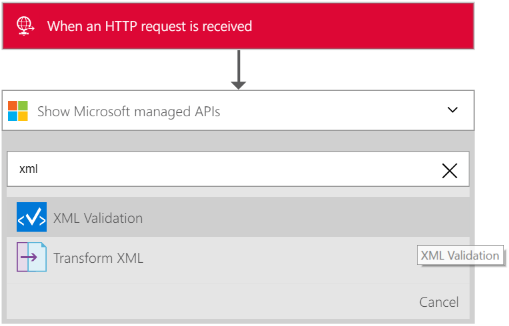

<properties 
    pageTitle="Visão geral da validação de XML no pacote de integração do Enterprise | Serviço de aplicativo do Microsoft Azure | Microsoft Azure" 
    description="Saiba como validação funciona nos aplicativos do pacote de integração de empresa e lógica" 
    services="logic-apps" 
    documentationCenter=".net,nodejs,java"
    authors="msftman" 
    manager="erikre" 
    editor="cgronlun"/>

<tags 
    ms.service="logic-apps" 
    ms.workload="integration" 
    ms.tgt_pltfrm="na" 
    ms.devlang="na" 
    ms.topic="article" 
    ms.date="07/08/2016" 
    ms.author="deonhe"/>

# Integração de empresa com a validação de XML

## Visão geral
Geralmente, em cenários de B2B, os parceiros para um contrato precisam validar mensagens que eles trocam entre si são válidas antes de começar processamento dos dados. No pacote de integração de empresa, você pode usar o conector de validação de XML para validar documentos com um esquema predefinido.  

## Como validar um documento com o conector de validação de XML
1. Crie um aplicativo de lógica e [vinculá-lo à sua conta de integração](./app-service-logic-enterprise-integration-accounts.md "Aprenda como vincular uma conta de integração para um aplicativo de lógica") que contém o esquema que você usará para validar os dados XML.
2. Adicionar um disparador **solicitação - solicitação HTTP um quando for recebida** para o seu aplicativo de lógica  
    
3. Adicionar a ação de **Validação de XML** pelo primeiro selecionando **Adicionar uma ação**  
4. Digite *xml* na caixa de pesquisa para filtrar todas as ações ao que você deseja usar 
5. Selecione a **validação de XML**     
   
6. Marque a caixa de texto de **conteúdo**  

7. Selecione a marca de corpo como o conteúdo que será validado.   
  
8. Marque a caixa de listagem de **Nome de esquema** e escolher o esquema que você deseja usar para validar a entrada *conteúdo* acima     
 
9. Salvar seu trabalho  
 

Neste ponto, você tiver terminado de configurar o conector de validação. Em um aplicativo do mundo real, talvez você queira armazenar os dados validados em um aplicativo de LOB como SalesForce. Você pode adicionar facilmente uma ação para enviar a saída da validação para a equipe de vendas. 

Agora você pode testar sua ação de validação fazendo uma solicitação para o ponto de extremidade HTTP.  

## Próximas etapas

[Saiba mais sobre o pacote de integração do Enterprise] (./app-service-logic-enterprise-integration-overview.md "Saiba mais sobre o pacote de integração de empresa")   