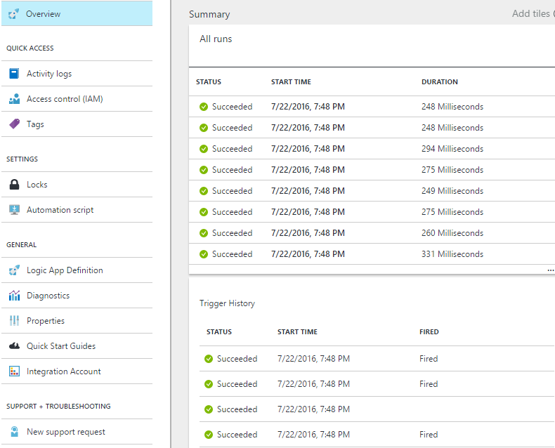

<properties 
    pageTitle="Monitore seus aplicativos de lógica no serviço de aplicativo do Azure | Microsoft Azure" 
    description="Como ver o que seus aplicativos de lógica tem feito" 
    authors="jeffhollan" 
    manager="erikre" 
    editor="" 
    services="logic-apps" 
    documentationCenter=""/>

<tags
    ms.service="logic-apps"
    ms.workload="integration"
    ms.tgt_pltfrm="na"
    ms.devlang="na"
    ms.topic="article"
    ms.date="10/18/2016"
    ms.author="jehollan"/>

# <a name="monitor-your-logic-apps"></a>Monitore seus aplicativos de lógica

Depois de [criar um aplicativo de lógica](app-service-logic-create-a-logic-app.md), você pode ver o histórico completo de sua execução no portal do Azure.  Você também pode configurar serviços como o diagnóstico do Azure e alertas do Azure para monitorar eventos em tempo real, e alerta de eventos que "quando é executado mais de 5 falha dentro de uma hora."

## <a name="monitor-in-the-azure-portal"></a>Monitor no Portal do Azure

Para exibir o histórico, selecione **Procurar**e selecione **Aplicativos de lógica**. Uma lista de todos os aplicativos de lógica em sua assinatura é exibida.  Selecione o aplicativo de lógica que você deseja monitorar.  Você verá uma lista de todas as ações e disparadores ocorridos para este aplicativo de lógica.



Há algumas seções neste blade que são úteis:

- **Resumo** lista **Todos é executado** e o **Histórico de disparadores**
    - Lista de **Todos é executado** o aplicativo mais recente de lógica é executado.  Você pode clicar qualquer linha para obter detalhes sobre a execução, ou clique no bloco para listar mais execuções.
    - **Histórico de disparador** lista todas as atividades de gatilho para este aplicativo de lógica.  Atividade de gatilho poderia ser uma seleção de "Ignorado" para novos dados (por exemplo, procurando para ver se um novo arquivo foi adicionado ao FTP), "Êxito" significando dados foi retornados para acionar um aplicativo de lógica ou "Falhou" correspondente a um erro na configuração.
- **Diagnósticos** permite exibir eventos e detalhes de tempo de execução e assinar [Alertas do Azure](#adding-azure-alerts)

>[AZURE.NOTE] Todos os detalhes de tempo de execução e eventos são criptografados no restante dentro do serviço de aplicativo de lógica. Eles são descriptografar somente durante uma solicitação de modo de exibição de um usuário. Acesso a esses eventos também pode ser controlado pelo controle de acesso de Azure Role-Based (RBAC).

### <a name="view-the-run-details"></a>Exibir os detalhes de execução

Esta lista de execuções mostra o **Status**, a **Hora de início**e a **duração** de determinado execução. Selecione qualquer linha para ver detalhes sobre o que são executadas.

O modo de exibição de monitoramento mostra cada etapa de execução, as entradas e saídas e quaisquer mensagens de erro que podem ter occurre.


Se precisar de todos os detalhes adicionais como a de execução **ID de correlação** (que pode ser usado para a API REST), você pode clicar no botão **Executar detalhes** .  Isso inclui todas as etapas, status e entradas/saídas para executar.

## <a name="azure-diagnostics-and-alerts"></a>Diagnóstico do Azure e alertas

Além os detalhes fornecidos pelo Portal do Azure e API REST acima, você pode configurar seu aplicativo de lógica para usar o diagnóstico do Azure para mais detalhes rich e depuração.

1. Clique na seção de **Diagnóstico** da lâmina aplicativo lógica
1. Clique para definir as **Configurações de diagnóstico**
1. Configurar um Hub de evento ou uma conta de armazenamento para emitir dados

    

### <a name="adding-azure-alerts"></a>Adicionando alertas Azure

Quando diagnóstico está configurado, você pode adicionar alertas do Azure quando certos limites são cruzados.  Na lâmina **diagnósticos** , selecione o bloco de **alertas** e **Adicionar alerta**.  Isso apresentará Configurando um alerta com base em um número de limites e métricas.


Você pode configurar a **condição**, **limite**e **período** conforme desejado.  Por fim, você pode configurar um endereço de email para enviar uma notificação para ou configurar um webhook.  Você pode usar o [gatilho de solicitação](../connectors/connectors-native-reqres.md) em um aplicativo de lógica para executar em um alerta também (para executar ações como [postar margem de atraso](https://github.com/Azure/azure-quickstart-templates/tree/master/201-alert-to-slack-with-logic-app), [Enviar um texto](https://github.com/Azure/azure-quickstart-templates/tree/master/201-alert-to-text-message-with-logic-app)ou [Adicionar uma mensagem para uma fila](https://github.com/Azure/azure-quickstart-templates/tree/master/201-alert-to-queue-with-logic-app)).

### <a name="azure-diagnostics-settings"></a>Configurações do diagnóstico do Azure

Cada um desses eventos contém detalhes sobre o aplicativo de lógica e evento como status.  Aqui está um exemplo de um evento de *ActionCompleted* :

```javascript
{
            "time": "2016-07-09T17:09:54.4773148Z",
            "workflowId": "/SUBSCRIPTIONS/80D4FE69-ABCD-EFGH-A938-9250F1C8AB03/RESOURCEGROUPS/MYRESOURCEGROUP/PROVIDERS/MICROSOFT.LOGIC/WORKFLOWS/MYLOGICAPP",
            "resourceId": "/SUBSCRIPTIONS/80D4FE69-ABCD-EFGH-A938-9250F1C8AB03/RESOURCEGROUPS/MYRESOURCEGROUP/PROVIDERS/MICROSOFT.LOGIC/WORKFLOWS/MYLOGICAPP/RUNS/08587361146922712057/ACTIONS/HTTP",
            "category": "WorkflowRuntime",
            "level": "Information",
            "operationName": "Microsoft.Logic/workflows/workflowActionCompleted",
            "properties": {
                "$schema": "2016-06-01",
                "startTime": "2016-07-09T17:09:53.4336305Z",
                "endTime": "2016-07-09T17:09:53.5430281Z",
                "status": "Succeeded",
                "code": "OK",
                "resource": {
                    "subscriptionId": "80d4fe69-ABCD-EFGH-a938-9250f1c8ab03",
                    "resourceGroupName": "MyResourceGroup",
                    "workflowId": "cff00d5458f944d5a766f2f9ad142553",
                    "workflowName": "MyLogicApp",
                    "runId": "08587361146922712057",
                    "location": "eastus",
                    "actionName": "Http"
                },
                "correlation": {
                    "actionTrackingId": "e1931543-906d-4d1d-baed-dee72ddf1047",
                    "clientTrackingId": "my-custom-tracking-id"
                },
                "trackedProperties": {
                    "myProperty": "<value>"
                }
            }
        }
```

As duas propriedades que são particularmente úteis para controlar e monitorar são *clientTrackingId* e *trackedProperties*.  

#### <a name="client-tracking-id"></a>ID de controle de cliente

O cliente ID de rastreamento é um valor que será correlação eventos em um aplicativo de lógica executar, incluindo qualquer fluxo de trabalho aninhados chamado como parte de um aplicativo de lógica.  Essa identificação será se geradas automaticamente se não for fornecida, mas você pode especificar manualmente o cliente ID de rastreamento de um disparador passando um `x-ms-client-tracking-id` cabeçalho com o valor de ID na solicitação de disparadores (disparadores de solicitação, gatilho HTTP ou disparador webhook).

#### <a name="tracked-properties"></a>Propriedades controladas

Propriedades controladas podem ser adicionadas em ações na definição do fluxo de trabalho para controlar entradas ou saídas nos dados de diagnóstico.  Isso pode ser útil se você desejar controlar dados como um "ID do pedido" no seu telemetria.  Para adicionar uma propriedade controlada, inclua o `trackedProperties` propriedade em uma ação.  Propriedades controladas podem apenas recurso controlar entradas um único ações e saídas, mas você pode usar o `correlation` propriedades dos eventos para correlação entre ações em uma execução.

```javascript
{
    "myAction": {
        "type": "http",
        "inputs": {
            "uri": "http://uri",
            "headers": {
                "Content-Type": "application/json"
            },
            "body": "@triggerBody()"
        },
        "trackedProperties":{
            "myActionHTTPStatusCode": "@action()['outputs']['statusCode']",
            "myActionHTTPValue": "@action()['outputs']['body']['foo']",
            "transactionId": "@action()['inputs']['body']['bar']"
        }
    }
}
```

### <a name="extending-your-solutions"></a>Estendendo suas soluções

Você pode aproveitar essa telemetria do Hub de evento ou armazenamento em outros serviços como o [Pacote de gerenciamento de operações](https://www.microsoft.com/cloud-platform/operations-management-suite), [A análise de fluxo Azure](https://azure.microsoft.com/services/stream-analytics/)e [Power BI](https://powerbi.com) ter tempo real monitoramento dos seus fluxos de trabalho de integração.

## <a name="next-steps"></a>Próximas etapas
- [Exemplos comuns e cenários para aplicativos de lógica](app-service-logic-examples-and-scenarios.md)
- [Criando um modelo de implantação do aplicativo de lógica](app-service-logic-create-deploy-template.md)
- [Recursos de integração do Enterprise](app-service-logic-enterprise-integration-overview.md)
