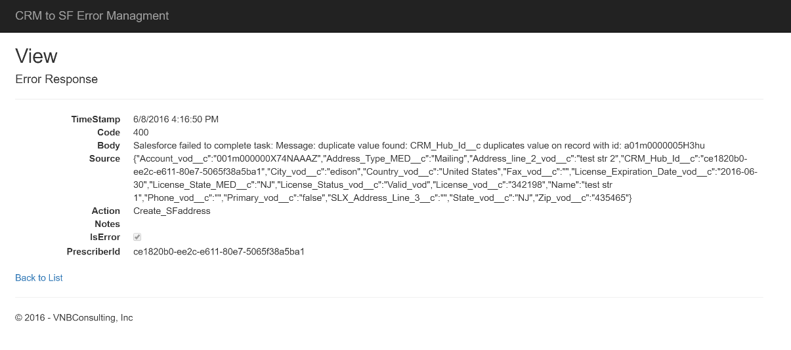

<properties
    pageTitle="Registro em log e manipulação de erro em aplicativos de lógica | Microsoft Azure"
    description="Exibir um caso de uso de realísticos de log com aplicativos de lógica e tratamento de erro avançadas"
    keywords=""
    services="logic-apps"
    authors="hedidin"
    manager="anneta"
    editor=""
    documentationCenter=""/>

<tags
    ms.service="logic-apps"
    ms.workload="na"
    ms.tgt_pltfrm="na"
    ms.devlang="na"
    ms.topic="article"
    ms.date="07/29/2016"
    ms.author="b-hoedid"/>

# <a name="logging-and-error-handling-in-logic-apps"></a>Registro em log e manipulação de erro em aplicativos de lógica

Este artigo descreve como você pode estender um aplicativo de lógica para melhor oferecer suporte a manipulação de exceção. É um caso de uso de vida real e nossa resposta à pergunta de "Aplicativos de lógica suporta exceção e manipulação de erro?"

>[AZURE.NOTE]A versão atual do recurso lógica aplicativos de serviço de aplicativo do Microsoft Azure fornece um modelo padrão para respostas de ação.
>Isso inclui validação interno e respostas de erro retornadas a partir de um aplicativo de API.

## <a name="overview-of-the-use-case-and-scenario"></a>Visão geral do caso de uso e cenário

A história a seguir é o caso de uso para este artigo.
Uma organização de saúde conhecida contratou conosco para desenvolver uma solução Azure que cria um portal de pacientes usando o Microsoft Dynamics CRM Online. Eles necessários para enviar registros de compromisso entre o portal de pacientes Dynamics CRM Online e a equipe de vendas.  Foram pedimos para usar o padrão de [HL7 FHIR](http://www.hl7.org/implement/standards/fhir/) para todos os registros de pacientes.

O projeto tinha dois requisitos principais:  

 -  Um método para efetuar registros enviados a partir do portal do Dynamics CRM Online
 -  Uma maneira de exibir quaisquer erros ocorridos no fluxo de trabalho


## <a name="how-we-solved-the-problem"></a>Como podemos resolvido o problema

>[AZURE.TIP] Você pode exibir um vídeo de alto nível do projeto do [Grupo de usuários de integração do](http://www.integrationusergroup.com/do-logic-apps-support-error-handling/ "Grupo de usuários de integração").

Escolhemos [Azure DocumentDB](https://azure.microsoft.com/services/documentdb/ "DocumentDB do Azure") como um repositório para os registros de log e de erros (DocumentDB refere-se aos registros como documentos). Como aplicativos de lógica tem um modelo padrão para todas as respostas, podemos não teria que criar um esquema personalizado. Podemos podia criar um aplicativo de API para **Inserir** e **consulta** para os registros de log e de erro. Nós também poderia definir um esquema para cada dentro do aplicativo de API.  

Outro requisito era Limpar registros após uma determinada data. DocumentDB tem uma propriedade chamada [tempo de vida]de(https://azure.microsoft.com/blog/documentdb-now-supports-time-to-live-ttl/ "tempo de vida") (TTL), que permitiu definir um valor de **tempo de vida** para cada registro ou o conjunto. Isso eliminada a necessidade de excluir registros em DocumentDB manualmente.

### <a name="creation-of-the-logic-app"></a>Criação do aplicativo lógica

A primeira etapa é criar o aplicativo de lógica e carregá-lo no designer. Neste exemplo, estamos usando aplicativos de lógica pai-filho. Vamos supor que já criou o pai e estiverem indo para criar um aplicativo de lógica de filho.

Vamos começar porque vamos ser log o registro aí sair do Dynamics CRM Online, na parte superior. Precisamos use um gatilho de solicitação porque o aplicativo de lógica pai aciona este filho.

> [AZURE.IMPORTANT] Para concluir este tutorial, você precisará criar um banco de dados DocumentDB e duas coleções (registro em log e erros).

### <a name="logic-app-trigger"></a>Gatilho de aplicativo de lógica

Estamos usando um gatilho de solicitação conforme mostrado no exemplo a seguir.

```` json
"triggers": {
        "request": {
          "type": "request",
          "kind": "http",
          "inputs": {
            "schema": {
              "properties": {
                "CRMid": {
                  "type": "string"
                },
                "recordType": {
                  "type": "string"
                },
                "salesforceID": {
                  "type": "string"
                },
                "update": {
                  "type": "boolean"
                }
              },
              "required": [
                "CRMid",
                "recordType",
                "salesforceID",
                "update"
              ],
              "type": "object"
            }
          }
        }
      },

````


### <a name="steps"></a>Etapas

Precisamos fazer logon a fonte (solicitação) do registro do portal do Dynamics CRM Online.

1. Precisamos obter um novo registro de compromisso do Dynamics CRM Online.
    O disparador que vêm do CRM nos fornece a **PatentId CRM**, **tipo de registro**, **novo ou atualizado registro** (nova ou atualizar valor booliano) e **SalesforceId**. O **SalesforceId** pode ser nulo porque ele é usado somente para obter uma atualização.
    Chegaremos registro do CRM usando o CRM **PatientID** e o **Tipo de registro**.
1. Em seguida, precisamos adicionar nosso aplicativo API DocumentDB **InsertLogEntry** operação conforme mostrado nas figuras a seguir.


#### <a name="insert-log-entry-designer-view"></a>Inserir o modo de exibição designer de entrada de log


#### <a name="insert-error-entry-designer-view"></a>Inserir o modo de exibição designer de entrada de erro


#### <a name="check-for-create-record-failure"></a>Verificar se há criar falha de registro


## <a name="logic-app-source-code"></a>Código de origem do aplicativo de lógica

>[AZURE.NOTE]  A seguir estão amostras apenas. Porque este tutorial é baseado em uma implementação em produção no momento, o valor de um **Nó de origem** não pode exibir propriedades relacionados ao agendar um compromisso.

### <a name="logging"></a>Registro em log
O seguinte exemplo de código do aplicativo de lógica mostra como lidar com registro em log.

#### <a name="log-entry"></a>Entrada de log
Este é o código-fonte aplicativo lógica para inserir uma entrada de log.

``` json
"InsertLogEntry": {
        "metadata": {
        "apiDefinitionUrl": "https://.../swagger/docs/v1",
        "swaggerSource": "website"
        },
        "type": "Http",
        "inputs": {
        "body": {
            "date": "@{outputs('Gets_NewPatientRecord')['headers']['Date']}",
            "operation": "New Patient",
            "patientId": "@{triggerBody()['CRMid']}",
            "providerId": "@{triggerBody()['providerID']}",
            "source": "@{outputs('Gets_NewPatientRecord')['headers']}"
        },
        "method": "post",
        "uri": "https://.../api/Log"
        },
        "runAfter":    {
            "Gets_NewPatientecord": ["Succeeded"]
        }
}
```

#### <a name="log-request"></a>Solicitação de log

Esta é a mensagem de solicitação de log postada para o aplicativo de API.

``` json
    {
    "uri": "https://.../api/Log",
    "method": "post",
    "body": {
        "date": "Fri, 10 Jun 2016 22:31:56 GMT",
        "operation": "New Patient",
        "patientId": "6b115f6d-a7ee-e511-80f5-3863bb2eb2d0",
        "providerId": "",
        "source": "{\"Pragma\":\"no-cache\",\"x-ms-request-id\":\"e750c9a9-bd48-44c4-bbba-1688b6f8a132\",\"OData-Version\":\"4.0\",\"Cache-Control\":\"no-cache\",\"Date\":\"Fri, 10 Jun 2016 22:31:56 GMT\",\"Set-Cookie\":\"ARRAffinity=785f4334b5e64d2db0b84edcc1b84f1bf37319679aefce206b51510e56fd9770;Path=/;Domain=127.0.0.1\",\"Server\":\"Microsoft-IIS/8.0,Microsoft-HTTPAPI/2.0\",\"X-AspNet-Version\":\"4.0.30319\",\"X-Powered-By\":\"ASP.NET\",\"Content-Length\":\"1935\",\"Content-Type\":\"application/json; odata.metadata=minimal; odata.streaming=true\",\"Expires\":\"-1\"}"
        }
    }

```


#### <a name="log-response"></a>Resposta do log

Esta é a mensagem de resposta de log do aplicativo API.

``` json
{
    "statusCode": 200,
    "headers": {
        "Pragma": "no-cache",
        "Cache-Control": "no-cache",
        "Date": "Fri, 10 Jun 2016 22:32:17 GMT",
        "Server": "Microsoft-IIS/8.0",
        "X-AspNet-Version": "4.0.30319",
        "X-Powered-By": "ASP.NET",
        "Content-Length": "964",
        "Content-Type": "application/json; charset=utf-8",
        "Expires": "-1"
    },
    "body": {
        "ttl": 2592000,
        "id": "6b115f6d-a7ee-e511-80f5-3863bb2eb2d0_1465597937",
        "_rid": "XngRAOT6IQEHAAAAAAAAAA==",
        "_self": "dbs/XngRAA==/colls/XngRAOT6IQE=/docs/XngRAOT6IQEHAAAAAAAAAA==/",
        "_ts": 1465597936,
        "_etag": "\"0400fc2f-0000-0000-0000-575b3ff00000\"",
        "patientID": "6b115f6d-a7ee-e511-80f5-3863bb2eb2d0",
        "timestamp": "2016-06-10T22:31:56Z",
        "source": "{\"Pragma\":\"no-cache\",\"x-ms-request-id\":\"e750c9a9-bd48-44c4-bbba-1688b6f8a132\",\"OData-Version\":\"4.0\",\"Cache-Control\":\"no-cache\",\"Date\":\"Fri, 10 Jun 2016 22:31:56 GMT\",\"Set-Cookie\":\"ARRAffinity=785f4334b5e64d2db0b84edcc1b84f1bf37319679aefce206b51510e56fd9770;Path=/;Domain=127.0.0.1\",\"Server\":\"Microsoft-IIS/8.0,Microsoft-HTTPAPI/2.0\",\"X-AspNet-Version\":\"4.0.30319\",\"X-Powered-By\":\"ASP.NET\",\"Content-Length\":\"1935\",\"Content-Type\":\"application/json; odata.metadata=minimal; odata.streaming=true\",\"Expires\":\"-1\"}",
        "operation": "New Patient",
        "salesforceId": "",
        "expired": false
    }
}

```

Agora vamos examinar os etapas de tratamento de erros.


### <a name="error-handling"></a>Manipulação de erro

O seguinte exemplo de código de lógica aplicativos mostra como você pode implementar manipulação de erro.

#### <a name="create-error-record"></a>Criar registro de erro

Este é o código-fonte lógica aplicativos para a criação de um registro de erro.

``` json
"actions": {
    "CreateErrorRecord": {
        "metadata": {
        "apiDefinitionUrl": "https://.../swagger/docs/v1",
        "swaggerSource": "website"
        },
        "type": "Http",
        "inputs": {
        "body": {
            "action": "New_Patient",
            "isError": true,
            "crmId": "@{triggerBody()['CRMid']}",
            "patientID": "@{triggerBody()['CRMid']}",
            "message": "@{body('Create_NewPatientRecord')['message']}",
            "providerId": "@{triggerBody()['providerId']}",
            "severity": 4,
            "source": "@{actions('Create_NewPatientRecord')['inputs']['body']}",
            "statusCode": "@{int(outputs('Create_NewPatientRecord')['statusCode'])}",
            "salesforceId": "",
            "update": false
        },
        "method": "post",
        "uri": "https://.../api/CrMtoSfError"
        },
        "runAfter":
        {
            "Create_NewPatientRecord": ["Failed" ]
        }
    }
}          
```

#### <a name="insert-error-into-documentdb--request"></a>Erro ao inserir em DocumentDB - solicitação

``` json

{
    "uri": "https://.../api/CrMtoSfError",
    "method": "post",
    "body": {
        "action": "New_Patient",
        "isError": true,
        "crmId": "6b115f6d-a7ee-e511-80f5-3863bb2eb2d0",
        "patientId": "6b115f6d-a7ee-e511-80f5-3863bb2eb2d0",
        "message": "Salesforce failed to complete task: Message: duplicate value found: Account_ID_MED__c duplicates value on record with id: 001U000001c83gK",
        "providerId": "",
        "severity": 4,
        "salesforceId": "",
        "update": false,
        "source": "{\"Account_Class_vod__c\":\"PRAC\",\"Account_Status_MED__c\":\"I\",\"CRM_HUB_ID__c\":\"6b115f6d-a7ee-e511-80f5-3863bb2eb2d0\",\"Credentials_vod__c\",\"DTC_ID_MED__c\":\"\",\"Fax\":\"\",\"FirstName\":\"A\",\"Gender_vod__c\":\"\",\"IMS_ID__c\":\"\",\"LastName\":\"BAILEY\",\"MasterID_mp__c\":\"\",\"C_ID_MED__c\":\"851588\",\"Middle_vod__c\":\"\",\"NPI_vod__c\":\"\",\"PDRP_MED__c\":false,\"PersonDoNotCall\":false,\"PersonEmail\":\"\",\"PersonHasOptedOutOfEmail\":false,\"PersonHasOptedOutOfFax\":false,\"PersonMobilePhone\":\"\",\"Phone\":\"\",\"Practicing_Specialty__c\":\"FM - FAMILY MEDICINE\",\"Primary_City__c\":\"\",\"Primary_State__c\":\"\",\"Primary_Street_Line2__c\":\"\",\"Primary_Street__c\":\"\",\"Primary_Zip__c\":\"\",\"RecordTypeId\":\"012U0000000JaPWIA0\",\"Request_Date__c\":\"2016-06-10T22:31:55.9647467Z\",\"ONY_ID__c\":\"\",\"Specialty_1_vod__c\":\"\",\"Suffix_vod__c\":\"\",\"Website\":\"\"}",
        "statusCode": "400"
    }
}
```

#### <a name="insert-error-into-documentdb--response"></a>Erro ao inserir em DocumentDB - resposta


``` json
{
    "statusCode": 200,
    "headers": {
        "Pragma": "no-cache",
        "Cache-Control": "no-cache",
        "Date": "Fri, 10 Jun 2016 22:31:57 GMT",
        "Server": "Microsoft-IIS/8.0",
        "X-AspNet-Version": "4.0.30319",
        "X-Powered-By": "ASP.NET",
        "Content-Length": "1561",
        "Content-Type": "application/json; charset=utf-8",
        "Expires": "-1"
    },
    "body": {
        "id": "6b115f6d-a7ee-e511-80f5-3863bb2eb2d0-1465597917",
        "_rid": "sQx2APhVzAA8AAAAAAAAAA==",
        "_self": "dbs/sQx2AA==/colls/sQx2APhVzAA=/docs/sQx2APhVzAA8AAAAAAAAAA==/",
        "_ts": 1465597912,
        "_etag": "\"0c00eaac-0000-0000-0000-575b3fdc0000\"",
        "prescriberId": "6b115f6d-a7ee-e511-80f5-3863bb2eb2d0",
        "timestamp": "2016-06-10T22:31:57.3651027Z",
        "action": "New_Patient",
        "salesforceId": "",
        "update": false,
        "body": "CRM failed to complete task: Message: duplicate value found: CRM_HUB_ID__c duplicates value on record with id: 001U000001c83gK",
        "source": "{\"Account_Class_vod__c\":\"PRAC\",\"Account_Status_MED__c\":\"I\",\"CRM_HUB_ID__c\":\"6b115f6d-a7ee-e511-80f5-3863bb2eb2d0\",\"Credentials_vod__c\":\"DO - Degree level is DO\",\"DTC_ID_MED__c\":\"\",\"Fax\":\"\",\"FirstName\":\"A\",\"Gender_vod__c\":\"\",\"IMS_ID__c\":\"\",\"LastName\":\"BAILEY\",\"MterID_mp__c\":\"\",\"Medicis_ID_MED__c\":\"851588\",\"Middle_vod__c\":\"\",\"NPI_vod__c\":\"\",\"PDRP_MED__c\":false,\"PersonDoNotCall\":false,\"PersonEmail\":\"\",\"PersonHasOptedOutOfEmail\":false,\"PersonHasOptedOutOfFax\":false,\"PersonMobilePhone\":\"\",\"Phone\":\"\",\"Practicing_Specialty__c\":\"FM - FAMILY MEDICINE\",\"Primary_City__c\":\"\",\"Primary_State__c\":\"\",\"Primary_Street_Line2__c\":\"\",\"Primary_Street__c\":\"\",\"Primary_Zip__c\":\"\",\"RecordTypeId\":\"012U0000000JaPWIA0\",\"Request_Date__c\":\"2016-06-10T22:31:55.9647467Z\",\"XXXXXXX\":\"\",\"Specialty_1_vod__c\":\"\",\"Suffix_vod__c\":\"\",\"Website\":\"\"}",
        "code": 400,
        "errors": null,
        "isError": true,
        "severity": 4,
        "notes": null,
        "resolved": 0
        }
}
```

#### <a name="salesforce-error-response"></a>Resposta de erro de SalesForce

``` json
{
    "statusCode": 400,
    "headers": {
        "Pragma": "no-cache",
        "x-ms-request-id": "3e8e4884-288e-4633-972c-8271b2cc912c",
        "X-Content-Type-Options": "nosniff",
        "Cache-Control": "no-cache",
        "Date": "Fri, 10 Jun 2016 22:31:56 GMT",
        "Set-Cookie": "ARRAffinity=785f4334b5e64d2db0b84edcc1b84f1bf37319679aefce206b51510e56fd9770;Path=/;Domain=127.0.0.1",
        "Server": "Microsoft-IIS/8.0,Microsoft-HTTPAPI/2.0",
        "X-AspNet-Version": "4.0.30319",
        "X-Powered-By": "ASP.NET",
        "Content-Length": "205",
        "Content-Type": "application/json; charset=utf-8",
        "Expires": "-1"
    },
    "body": {
        "status": 400,
        "message": "Salesforce failed to complete task: Message: duplicate value found: Account_ID_MED__c duplicates value on record with id: 001U000001c83gK",
        "source": "Salesforce.Common",
        "errors": []
    }
}

```

### <a name="returning-the-response-back-to-the-parent-logic-app"></a>Retornando a resposta de volta para o aplicativo de lógica pai

Depois que a resposta, você pode passar voltar para o aplicativo de lógica pai.

#### <a name="return-success-response-to-the-parent-logic-app"></a>Retornar resposta de sucesso para o aplicativo de lógica pai

``` json
"SuccessResponse": {
    "runAfter":
        {
            "UpdateNew_CRMPatientResponse": ["Succeeded"]
        },
    "inputs": {
        "body": {
            "status": "Success"
    },
    "headers": {
    "   Content-type": "application/json",
        "x-ms-date": "@utcnow()"
    },
    "statusCode": 200
    },
    "type": "Response"
}
```

#### <a name="return-error-response-to-the-parent-logic-app"></a>Retornar resposta de erro para o aplicativo de lógica pai

``` json
"ErrorResponse": {
    "runAfter":
        {
            "Create_NewPatientRecord": ["Failed"]
        },
    "inputs": {
        "body": {
            "status": "BadRequest"
        },
        "headers": {
            "Content-type": "application/json",
            "x-ms-date": "@utcnow()"
        },
        "statusCode": 400
    },
    "type": "Response"
}

```


## <a name="documentdb-repository-and-portal"></a>Portal e DocumentDB repositório

Nossa solução adicionados recursos adicionais com [DocumentDB](https://azure.microsoft.com/services/documentdb).

### <a name="error-management-portal"></a>Portal de gerenciamento de erro

Para exibir os erros, você pode criar um aplicativo web do MVC para exibir os registros de erro de DocumentDB. Operações de **lista**, **detalhes**, **Editar**e **Excluir** serão incluídas na versão atual.

> [AZURE.NOTE]Editar operação: DocumentDB faz uma substituição de todo o documento.
> Os registros mostrados na **lista** e modos de exibição de **detalhes** são somente exemplos. Eles não são registros de compromisso pacientes real.

A seguir é exemplos de nossos detalhes do aplicativo MVC criadas com a abordagem descrita anteriormente.

#### <a name="error-management-list"></a>Lista de gerenciamento de erro


#### <a name="error-management-detail-view"></a>Exibição de detalhes de gerenciamento de erro



### <a name="log-management-portal"></a>Portal de gerenciamento de log

Para exibir os logs, também criamos um MVC web app.  A seguir é exemplos de nossos detalhes do aplicativo MVC criadas com a abordagem descrita anteriormente.

#### <a name="sample-log-detail-view"></a>Exibição de detalhes de log de amostra


### <a name="api-app-details"></a>Detalhes do aplicativo de API

#### <a name="logic-apps-exception-management-api"></a>API de gerenciamento de exceção de aplicativos do lógica

Nosso aplicativo de API de gerenciamento do código-fonte aberto lógica aplicativos exceção fornece a seguinte funcionalidade.

Há dois controladores:

- **ErrorController** insere um registro de erro (documento) em um conjunto de DocumentDB.
- **LogController** Insere um registro de log (documento) em um conjunto de DocumentDB.

> [AZURE.TIP] Usam ambos os controladores `async Task<dynamic>` operações. Isso permite operações ser resolvida em tempo de execução, portanto, podemos criar o esquema de DocumentDB no corpo da operação.

Cada documento no DocumentDB deve ter uma ID exclusiva. Estamos usando `PatientId` e adicionando um carimbo de hora que é convertido em um valor de carimbo de hora do Unix (duplo). Podemos truncar para remover o valor fracionário.

Você pode exibir o código-fonte do nosso controlador de erro API [do GitHub](https://github.com/HEDIDIN/LogicAppsExceptionManagementApi/blob/master/Logic App Exception Management API/Controllers/ErrorController.cs).

Chamamos a API de um aplicativo de lógica usando a seguinte sintaxe.

``` json
 "actions": {
        "CreateErrorRecord": {
          "metadata": {
            "apiDefinitionUrl": "https://.../swagger/docs/v1",
            "swaggerSource": "website"
          },
          "type": "Http",
          "inputs": {
            "body": {
              "action": "New_Patient",
              "isError": true,
              "crmId": "@{triggerBody()['CRMid']}",
              "prescriberId": "@{triggerBody()['CRMid']}",
              "message": "@{body('Create_NewPatientRecord')['message']}",
              "salesforceId": "@{triggerBody()['salesforceID']}",
              "severity": 4,
              "source": "@{actions('Create_NewPatientRecord')['inputs']['body']}",
              "statusCode": "@{int(outputs('Create_NewPatientRecord')['statusCode'])}",
              "update": false
            },
            "method": "post",
            "uri": "https://.../api/CrMtoSfError"
          },
          "runAfter": {
              "Create_NewPatientRecord": ["Failed"]
            }
        }
 }
```

A expressão no código de exemplo anterior está verificando o status de *Create_NewPatientRecord* de **Falha**.

## <a name="summary"></a>Resumo

- Você pode implementar facilmente log e manipulação de erro em um aplicativo de lógica.
- Você pode usar DocumentDB como o repositório de registros de log e de erros (documentos).
- Você pode usar MVC para criar um portal para exibir registros de log e de erros.

### <a name="source-code"></a>Código-fonte
O código-fonte para o gerenciamento de exceção de aplicativos de lógica aplicativo API está disponível nesta [GitHub repositório](https://github.com/HEDIDIN/LogicAppsExceptionManagementApi "API de gerenciamento de exceção de aplicativo de lógica").


## <a name="next-steps"></a>Próximas etapas
- [Exibir mais exemplos de aplicativos de lógica e cenários](app-service-logic-examples-and-scenarios.md)
- [Saiba mais sobre ferramentas de monitoramento de aplicativos de lógica](app-service-logic-monitor-your-logic-apps.md)
- [Criar um modelo de implantação automatizada de aplicativo de lógica](app-service-logic-create-deploy-template.md)
